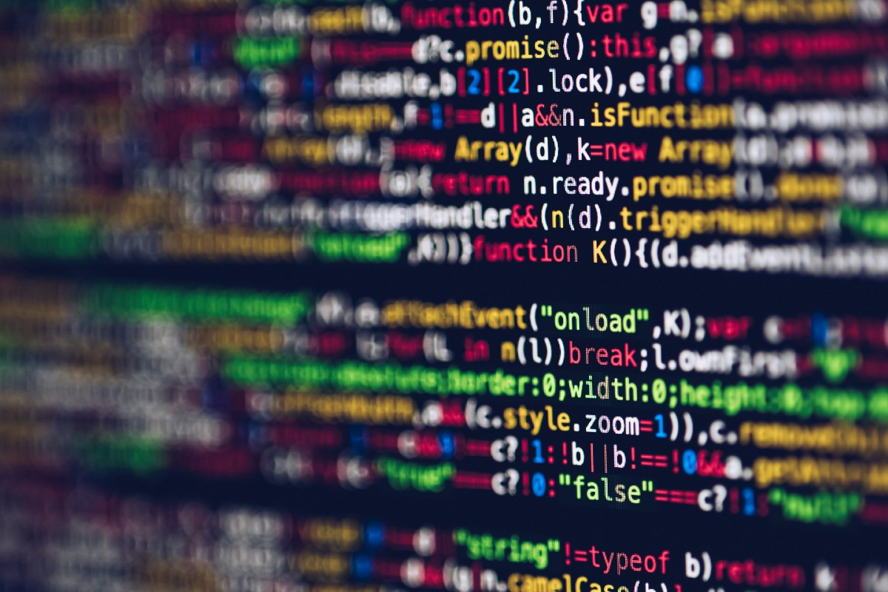
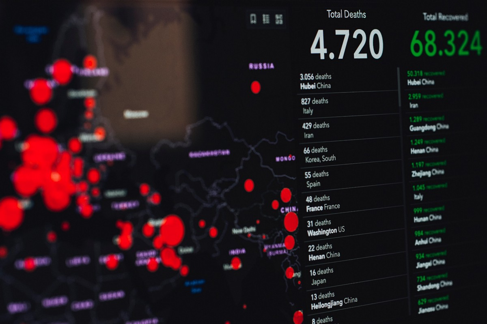

# 如果您因冠状病毒而被锁在家中，则有11种最好的数据科学课程
## 不花一分钱就可以开始事业

> If you have too much time at home, why not invest it in your skills? Photo by Grzegorz Walczak on Unsplash


莎士比亚在隔离区写了《李尔王》。 牛顿在检疫时为其运动定律奠定了基础。 人们在隔离时正在制作有趣的模因。

你能做什么？ 永远改变剧院的世界或改变物理学的世界—我希望这个标准太高了。 但是，您可以提高自己在数据科学领域的技能，并在大流行结束后开始您的职业生涯。
## 我六个月内如何从零编码技能变成了数据科学家
### 我不用花一美元就能自学数据科学的4种工具

这不是那里所有课程的完整指南。 如果您进行简单的Google搜索，就会发现一生中有比您更多的东西……

相反，这是我和其他人发现特别有用的课程纲要。 哪种课程适合您，取决于您目前在编程和统计方面的技能水平。 即使在实践中程序设计和统计之间的界线模糊不清，本指南还是在这两个学科之间进行划分，以使其易于浏览。

在编程方面，三种语言必不可少：Python，R和Shell脚本。 初学者经常低估后者。 但是，如果您是一名数据科学家，那是您的面包和黄油。 您还需要了解有关Git和GitHub的一两件事。

> It’s time to code. Photo by Markus Spiske on Unsplash


关于Python和R，您可能只了解其中一个而已。 这取决于您以后要在哪里工作。

您还需要一些有关数据库的知识。 （您想成为一名数据科学家，对吗？）最新的技术是SQL，所以我建议您在开始申请工作之前先加以了解。

在统计方面，任何数据科学普通课程都可以。 他们中的许多人还介绍了最重要的语言和技术环境。 但我仍然建议您也参加专门的语言课程。 因为。 编程。 是的。 重要！

由于我们很多人在这段时间都面临着工作和预算方面的不安全感，因此我决定只列出免费资源。 毕竟，纪律对于您的进步比投资的金钱重要一千倍。
# 编程类

根据您当前的技能，您可能需要此处列出的部分或全部课程。 我特意只列出了每种语言的一门课程，最多两门课，以避免混淆哪种语言最适合您。

如果您是绝对的初学者，我建议您在继续下面列出的数据科学课程之前，遵循所有这些步骤。
## 1. Python

Learnpython.org上的材料是一个很好的起点。 全部都是交互式的，不需要安装任何东西-您可以直接在浏览器中键入代码。

几个小时后，您可能会发现可以使用它了。 投资几天，您就可以编写自己的基本程序。

迟早，您将需要能够安装Python和相关软件包。 如果您愿意，可以尝试使用Python的官方资源。 但是，如果您以前没有编码经验，我会劝阻您不要这样做，因为这可能会令人生畏。

如果您有花钱，可以访问DataCamp的Python类。 您可以每月25美元的价格访问大多数课程，它们也是浏览器中的代码课程。 但是，对于大多数目的而言，来自Python和Learnpython.org的免费资源将完全足够。
## 2. R

哈佛大学的edX课程将为您提供R入门所需的一切。课程为时8周，但您每周只需投入1-2小时。 因此，即使您的日程安排很忙，此操作也应该有效。

如果您想付出更多的努力并获得更多的知识，约翰霍普金斯大学还开设了课程班。 这是四周的时间，第一周需要25个小时的努力，此后每周10到12个小时。 本课程还介绍了安装过程，并为您提供了一些背景知识。
## R编程入门
### 使用R（数据科学中需求第二大的编程语言）进行端到端数据分析。
## 3. SQL

尽管在Python中数据集非常易于管理，但是SQL是处理大量数据的方法。 w3schools.com的教程涵盖了几乎所有的基础知识。

本教程提供了许多浏览器内代码示例，非常适合初学者。 大约需要10到15个小时才能完成。

如果您更喜欢视频课程，也可以尝试可汗学院的课程。 这里有更多具有挑战性的“浏览器中文本”示例，但总的课程时间将缩短-完成该课程所需的时间为5-10小时。
## 4. Shell脚本

学习代码The Hard Way Book是一个很好的入门方法。 它非常系统化，没有任何精美的用户界面。 但这正是使它变得如此出色的原因-稍后，您还将坐在命令行中，而没有通常的图形琐事。

参加本课程需要纪律处分。 但这是值得的。 完成此过程需要5到10个小时，具体取决于您的潜水深度。
## 5. GitHub

如果您以前从未使用过GitHub，建议阅读并遵循Anne Bonner的指南。 它在这里：
## Git和GitHub入门：完整的初学者指南
### 好奇和完全困惑的Git和GitHub基础（以及为首次公开募捐做出贡献的最简单方法…

这是一本长达18分钟的阅读书，但是我建议您至少花几个小时才能入门。 在阅读指南时，最好使所有功能都正常运行，因为您将一遍又一遍地需要这些东西。

如果您已经知道一两件事，那么GitHub的指南可以帮助您填补空白。

> Those statistics don’t master themselves. Photo by Markus Spiske on Unsplash

# 数据科学与统计课

如果您掌握了一些编程技能，则可以使用这些课程来加深对统计的了解。 上一两个课就足够了-最适合您的时间取决于您的时间预算和您喜欢的语言。
## 6.约翰霍普金斯大学/课程：数据科学专业

时间：〜200小时（或每周6小时，共8个月），自定步调语言：R，但是Python是先决条件

该课程是有抱负的数据科学家推荐的最高水平之一。 它由10个子课程组成，您可以随意混合和匹配。 但是，如果您想获得证书来向未来的雇主展示，则必须做全部。
## 7.哈佛工程学院：CS109课程材料

时间：〜100小时（或每周8小时，共13周），自定进度语言：Python

这是哈佛约翰·保尔森工程与应用科学学院教授的实际课程。 尽管它不是Coursera，edX之类的在线课程，但丰富的材料仍然是一种浏览的乐趣。
## 8.哈佛大学/ edX：统计与研究

时间：8-16小时（或每周2–4小时，共4周），自定进度语言：R，必须具备基本编程知识

由于时间范围较小，因此该课程涵盖了数据科学的基础知识。 它更侧重于数据分析和可视化。 如果您时间短但仍想学习一些东西，则可以使用此选项。
## 9. udacity：数据科学导论

时间：〜100小时（或每周10小时，为期2个月），自定进度语言：Python

该课程涵盖了从数据采集，分析和可视化的所有内容。 小时数和交互式格式对于那些现在呆在家里的人来说可能是理想的选择。 如果您以更高的强度进行工作，则可以在几周内完成！
## 10.德克萨斯大学/ edX：数据分析基础

时间：18-36小时（或每周3-6小时，共6周），自定进度语言：R，基本编程是前提条件

本课程将自己作为典型的本科统计学课程，并附加了建模方面的内容。 但是，由于时间投入非常少，因此我认为它更多地是对统计和建模的介绍。
## 11.密歇根大学/ Coursera：应用数据科学

时间：〜120小时（或每周8小时，共4个月），自定进度语言：Python

这门课程的妆容与第六名相似，但实际操作要多得多。 它由5个子课程组成，您可以根据需要混合和匹配。 如果您已经知道要从事的行业，这可能特别有用。例如，本课程的两个令人兴奋的部分是机器学习和社交网络分析。

> Time to learn something new. Photo by Annie Spratt on Unsplash

# 最后说明：使用您的领域知识。 和你的网络

所有具有互联网连接的人都可以使用这些课程。 因此，尽管它们可以为您提供良好的基础，但它们不会成为将您与其他候选人分开的优势。

考虑一下什么使您成为数据科学家的独特之处？ 您之前从事过哪些领域的研究-健康，数学，生物学，化学，物理学或完全不同的领域？
## 您永远不会成为数据科学家的9个理由
### 你需要改变心态

您网络中的谁可以给您很好的介绍？ 谁认识一个认识数据科学的人？ 让您的联系开始。

最后，征求意见。 不要从我那儿拿走它，而是从那些已经过渡到数据科学家的人那里拿走它。 阅读《走向数据科学》中的故事是一个很好的起点。

但是，您的目标还应该是与您所仰望的人建立直接联系并进行非正式访谈。 这样，您可以直接从他们的经验中学习。

对于那些正在隔离中的人，我希望本指南有助于您保持理智和了解情况。 是否隔离，我希望我们所有人都可以利用这些时间来建立更美好的未来。 学习新事物仅仅是开始。
## 数据科学入门终极指南
### 我是如何在不到6个月的时间内开始获得数据科学工作机会的
```
(本文翻译自Rhea Moutafis的文章《11 best Data Science classes if you’re locked home because of coronavirus》，参考：https://towardsdatascience.com/11-best-data-science-classes-if-youre-locked-home-because-of-coronavirus-ca7d2d74a454)
```
