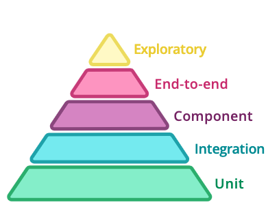

# 使用微服务失败的11个原因


在过去的几年中，我已经完成了对处于数字化转型过程中的多个产品团队的架构审查。 大多数团队都在按照微服务架构构建产品。 他们有使用基于微服务的体系结构的所有正确意图-更快的开发，更好的可伸缩性，更小的独立团队，独立的部署，使用正确的技术来完成工作，等等。但是，我经常发现团队在微服务方面苦苦挣扎。 他们未能充分利用微服务的优势。 在这篇文章中，我将分享我认为团队在微服务方面苦苦挣扎的原因。

对于微服务新手，我建议阅读Martin Fowler的微服务文章。 我喜欢本文中提到的微服务架构定义。

微服务架构风格是一种将单个应用程序开发为一组小型服务的方法，每个小型服务都在自己的进程中运行并与轻量级机制（通常是HTTP资源API）进行通信。 这些服务围绕业务功能构建，并且可以由全自动部署机制独立部署。 这些服务的集中管理几乎没有，可以用不同的编程语言编写并使用不同的数据存储技术。
# 原因1：管理层低估了开发微服务的复杂性

我曾与多个对微服务非常看好的客户一起工作。 对他们来说，微服务是解决所有问题的灵丹妙药。 在讨论中，我发现大多数团队及其管理层低估了微服务开发的复杂性。

要开发微服务，开发人员需要高效的本地环境设置。

随着系统中服务的增加，变得越来越难在一台计算机上运行应用程序的子集。 当您使用消耗相对较多内存的语言（例如Java）构建应用程序时，尤其会发生这种情况。

以下是与本地开发设置有关的要点。
+ 本地开发的第一个重要方面是好的开发机器。 我发现大多数组织都很难使用所有最新和最先进的技术，但是他们不想替换性能低下的Windows开发机器。 开发人员受其开发机器的限制。 我已经看到开发人员使用VDI映像或配置较差的机器来构建基于微服务的系统。 这降低了他们的生产力，他们无法完全应用自己。 使用劣质的开发机器的副作用是，开发人员无法获得快速反馈。 如果您知道必须等待几分钟才能运行集成测试套件，那么您宁愿不用编写更多内容也不会增加工作量。 不良的开发机器会导致不良的开发实践。
+ 一旦有了您的开发人员，合理的机器就可以工作。 接下来的事情是确保所有服务都使用构建工具。 您应该能够在无需太多配置的情况下在一台新计算机上构建整个应用程序。 以我在微服务方面的经验，即使使用根构建脚本也可以构建整个应用程序，这很有帮助。
+ 下一个重点是使开发人员能够轻松地在系统上运行应用程序的某些部分。 您应该使用多个docker-compose文件来启动配置了所有端口和卷的不同服务。
+ 接下来，如果您使用的是Kubernetes之类的容器编排工具，则应该投资于Telepresence之类的工具，该工具可以轻松调试Kubernetes集群中的应用程序。

如果组织不了解微服务的开发复杂性，那么团队速度会随着时间的推移而下降。
# 原因2：没有将库和工具更新到最新版本的过程

在我的评论中，我发现新平台已经成为历史。 团队无法确保依赖关系保持最新状态，或者数据库等工具是否为最新版本。 因此，两年前开始的现代化工作如今已经有数月的技术债务。

几年前，许多团队开始将Spring Cloud Netflix OSS项目用于微服务。 他们使用的是Kubernetes之类的容器编排工具，但由于它们是从Netflix OSS开始的，因此并未使用Kubernetes提供的所有功能。 当Kubernetes内置服务发现时，他们仍将Eureka用作服务发现。 此外，借助Istio这样的服务网格，您可以摆脱Netflix OSS提供的大多数功能。 这有助于降低复杂性，并将很多交叉问题转移到平台上。

要记住的另一点是，要使所有服务的依赖项版本保持同步。 我最近在帮助一个使用Spring Boot构建微服务的客户。 在过去的两年中，他们已经构建了20多个Spring Boot服务。 在他们的环境中，他们使用的Spring Boot版本范围从1.5到2.1。 这意味着当有人设置他们的机器时，他们必须下载多个版本的Spring Boot。 此外，他们缺少自1.5以来在Spring Boot中所做的许多改进。

我们的建议是组织应在积压的订单中为这些升级创建技术债务项目。 这些技术债务项目应在架构委员会会议上进行讨论并定期解决。 在我的上一个项目中，我们每三个月设置一个星期的冲刺，以将所有依赖项更新到最新版本。

此外，团队应该花时间在升级工具上，例如数据库，消息队列和缓存，以升级到最新版本。
# 原因3：将共享服务用于本地发展

由于本地发展不佳，大多数团队开始依靠共享环境提供关键服务。 开发人员机器中的第一件事就是数据库。 大多数年轻的开发人员都没有意识到基于共享数据库的开发是邪恶的。 以下是我在共享数据库中遇到的主要问题：
+ 团队成员必须建立工作的社会契约，以避免最后的作家胜出问题。 开发人员可以清除另一位开发人员为其工作编写的数据。 这种工作方式既痛苦又容易失败。 迟早这会咬伤团队。
+ 开发人员担心实验会影响他们的其他团队成员。 我们都知道，更好的学习方法是实验和快速反馈。 有了共享数据库，就可以进行实验了。 我们需要进行实验以提出数据库架构并执行性能调整之类的任务。
+ 另一个副作用是很难单独测试更改。 您的集成测试变得不稳定。 从而进一步降低了显影速度。
+ 共享数据库必须像宠物一样对待，因为您不希望共享数据库的状态不一致且不可预测。 您可能有一个开发人员想要在表为空但其他人需要表具有记录的情况下测试边缘情况。
+ 仅共享数据库具有系统正常工作所需的所有数据。 随着时间的流逝，团队成员失去了更改的可追溯性，因此没人知道他们如何复制他们计算机上相同的设置。 唯一的方法是获取完整的数据库转储并使用它。
+ 未连接到网络时很难工作。 通勤时间长或乘飞机时，通常会发生这种情况。

数据库只是共享服务的一个示例，但它也可以是消息传递队列，像Redis这样的集中式缓存或服务可以改变的任何其他服务。

解决此问题的最佳方法是使开发人员可以轻松地在其计算机上运行数据库（作为docker容器），并投资创建SQL脚本来设置架构和初始主数据。 这些SQL脚本应保留在版本控制中，并像其他任何代码一样进行维护。
# 原因4：版本控制托管平台缺乏可见性

我正在与一个在其版本控制系统中具有1000多个存储库的客户端一起工作。 他们正在使用Gitlab版本控制平台。 他们有5个产品，每个产品都由多个微服务组成。 我问他们的第一个问题是帮助我们了解哪些服务及其各自的代码存储库是产品A的一部分。他们的首席架构师不得不花一天的时间弄清楚构成产品A的所有存储库。 不知道她是否涵盖了所有服务。

解决此问题的最佳方法是从一开始就以某种方式对微服务进行分组，以使您始终对产品生态系统具有可见性。 Gitlab提供了一种创建组，然后在其中创建项目存储库的方法。 Github没有组功能，因此您可以使用主题或命名约定来实现它。

我个人更喜欢mono repos，因为我发现它们真的很方便。 我遇到的大多数开发人员都将其视为反模式。 我同意Dan Lua的帖子，他在文章中提到了mono repo的以下好处

*简化的组织

*简化的依赖关系

*工具

*跨项目变更
# 原因5：没有明确的服务定义

大多数团队都不知道应该将什么视为服务。 关于实际上构成单个微服务的东西有很多困惑和困惑。 让我们举一个例子，您的应用程序具有类似插件的架构，您将在其中与多个第三方服务集成。 每个集成都应该是微服务吗？ 我已经看到多个团队正在为每个集成创建一个微服务。 随着集成数量的增加，这很快变得难以管理。 这些服务通常太小，以至于它们作为单独的进程运行会增加更多的开销。

我认为拥有少量大型服务总比拥有太多小型服务好。我将首先创建一个对业务组织中整个部门建模的服务。这也符合DDD。我将一个域分为子域和有界上下文。有界上下文表示公司内部的部门，例如财务和市场营销。您可能认为这可能会导致大型微服务，这是正确的。但是，以我的经验来看，将单片重构为微服务总是比反之容易。随着您获得更多的知识，您可以转向代表较小关注点的细粒度微服务。您可以应用“单一责任原则”来了解您的微服务是否变得太大而做太多的事情。然后，您可以将其分解为较小的独立服务。任何服务都不应直接与另一个服务的数据库对话。他们只能通过已发布的合同进行沟通。您可以阅读Microservices.io网站上提到的有关按子域模式分解的更多信息。

我也遵循后端文档中提到的建议。 该建议可以帮助限制服务之间的通信，这是基于微服务的系统性能低下的首要原因。

如果两条信息相互依赖，则它们应属于一台服务器。 换句话说，服务的自然边界应该是其数据的自然边界。
# 原因6：没有明确的代码重用策略

我正在与一个客户一起工作，该客户已在其所有基于Java的微服务中复制了四个与特定问题相关的Java文件。 因此，如果在该代码中发现错误，则需要将其应用到所有地方。 我们都知道，在时间压力下，我们会错过将更改应用于一项或多项服务的机会。 这将浪费更多时间并增加挫败感。

开发团队并不了解正确的事情。 但是，组织的结构化方式人们总是默认使用简单且容易出错的做事方式。

正确的方法是使用工件管理器（如Bintray或Nexus）并在其中发布依赖项。 然后，每个微服务都应依赖该库。 您需要构建工具，以便在发布新版本的库时，应更新并重新部署所有微服务。

使用微服务并不意味着您不应使用迄今为止对我们有用的最佳实践。 您需要在工具上进行投资，以使其易于升级微服务，从而使人类不必这样做。

在没有适当工具和自动化的情况下使用微服务是灾难的根源。
# 原因7：多种语言编程

我找到了使用多种编程语言，多个数据库，多个缓存的团队，这是工作的最佳工具。 所有这些都在项目的初始阶段起作用，但是当您的产品投入生产时，这些选择就开始显示出它们的真实色彩。 诸如我们在构建Java Spring Boot应用程序之类的原因，但我们意识到Java占用了更多内存，并且性能很差，因此我们决定切换到Node.js。 在上一个任务中，我向团队解释说他们的推理能力很弱。
+ Node.js的性能优于Java。 如果您有基于IO的工作负载，则Node.js通常会表现更好。 Java在任何计算密集型工作负载上均胜过node.js。 通过使用响应式范例，Java for IO工作负载可以具有更好的性能。 Spring Boot Reactor在IO工作负载方面的性能与Node.js相当。
+ Node.js消耗的内存少于Java。 这部分是正确的，因为Node.js应用程序通常使用的内存少于Java。 Java Spring Boot应用程序并不像大多数人想象的那样糟糕。 我在其中一个Spring Boot Java Microservice上进行了负载测试，并且内存消耗仍然少于1 GB。 您可以通过OpenJ9 JVM，限制对类路径的依赖性以及通过调整默认JVM参数来优化Java内存利用率。 另外，Java中的Spring Boot替代品还有Micronaut和Quarkus等，它们消耗的内存等于Node.js。
+ Node.js比Java更高效。 这取决于开发人员编写代码。 带有静态类型和静态分析工具的Java可以帮助在开发生命周期的早期发现问题。

大多数时候，这全都取决于上下文。 如果您的开发人员不成熟，则无论使用哪种编程语言，您都将开发出不良的产品。

我建议组织发布团队可以使用的语言列表。 我认为2–3是个好数字。 另外，列出为什么应使用一种语言代替另一种语言的原因。

选择语言之前，应考虑以下多种原因：
+ 轻松找到成熟的企业软件开发人员有多容易？
+ 重新培训开发人员使用新技术有多容易？ 我们发现Java开发人员可以相对轻松地学习Golang。
+ 最初团队之外的开发人员可以多么容易地贡献，传输和维护他人编写的代码？
+ 就工具和库而言，生态系统的成熟程度如何？

这不仅限于编程语言。 这也适用于数据库。 如果您的系统中已经有MongoDB，那么为什么要在生态系统中使用ArangoDB？ 它们都主要是文档数据库。

始终考虑使用多种技术的维护和操作方面。
# 原因8：人们依赖性

这并非特定于微服务，但在微服务生态系统中变得更加普遍。 原因是大多数团队专注于他们的特定服务，因此他们不了解完整的生态系统。 在与不同客户的合作中，我发现只有一小部分了解整体情况的建筑师。 但是，这些架构师的问题在于他们在日常活动中不活跃，因此对开发的影响有限。

我认为最好的办法是确保所有团队在架构小组中只有一个代表性的部分，以便他们可以使团队与整体架构团队的路线图和目标保持一致。 要成为一个成熟的组织，您需要投资建立轻量级的治理。
# 原因9：缺少文档

过去几年中与我们互动的大多数组织都在文档方面苦苦挣扎。 大多数开发人员和架构师要么不编写文档，要么他们编写的文档没有用。 即使他们想写，他们也不知道应该如何记录其体系结构。

至少我们应该记录以下内容：
+ 设计文件
+ C4模型中的上下文和容器图
+ 以架构决策记录的形式跟踪关键架构决策
+ 开发人员入门指南

我建议所有文档都保留在版本控制系统中。
# 原因10：功能超过平台成熟度

我在其他方面简要地谈到了这个原因，但是我认为值得一提的是它的首要原因。 微服务比传统的单片应用程序更为复杂，因为您正在构建具有许多活动部件的分布式系统。 大多数开发人员尚未理解系统的不同故障模式。 大多数微服务在构建时都考虑了一条愉快的路。 因此，如果您的管理层只想早于专注于功能，那么您将失败。 在弱平台上构建的功能无法带来价值。

组织需要进入平台心态。 平台心态不仅意味着使用容器和Kubernetes。 它们是解决方案的一部分，但本身并不是完整的解决方案。 您需要考虑分布式跟踪，可观察性，混乱测试，函数调用与网络调用，服务到服务通信的安全服务，可调试性等。这需要大量的精力和投资来建立合适的平台和工具团队。

如果您是一家资源有限的初创公司，我的建议是重新考虑您的微服务策略。 请了解您正在进入什么。
# 原因11：缺乏自动化测试

大多数团队都知道自动化测试对产品的整体质量有多重要，但他们仍然没有做到。 微服务架构为在何处以及如何进行测试提供了更多选择。 如果您不进行全面的自动化测试，那么您将严重失败。

关于这一点，我不会写太多，因为网络上许多其他人已经讨论过这一点。 我从Martin Fowler网站上发布的Microservices测试文章中获取的下图讨论了基于Microservices的系统的测试金字塔。

> Microservices Test Pyramid

```
(本文翻译自Shekhar Gulati的文章《11 Reasons Why You Are Going To Fail With Microservices》，参考：https://medium.com/xebia-engineering/11-reasons-why-you-are-going-to-fail-with-microservices-29b93876268b)
```
