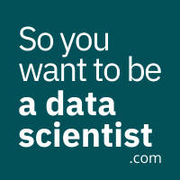

嗨，我是数据科学家Mısra，她通过一条非传统的道路到达了她所在的位置。 现在，我的任务是帮助那些在同一旅程中并需要指导的其他人。 我为有抱负的数据科学家而写，他们的时间很宝贵。 访问该网站以下载我的免费数据科学指南针，以帮助您完成自己的旅程。

如果您对现实生活中的数据科学家的故事感兴趣，那么数据专家会听“那么您想成为数据科学家吗？” 在您最喜欢的播客播放器上。
# 令初学者惊讶的12种数据科学现实
## 做白日梦的数据科学工作时应注意的事项

> Photo by You X Ventures on Unsplash


您想成为一名数据科学家吗？ 闭上你的眼睛，告诉我你在做什么。

我真的听不到您的声音，但我会假设听起来或多或少是这样的：“我坐在电脑前，使用最新最酷的算法进行建模。 我根据最先进模型的结果制作了一张惊人的图表，以帮助决定我所服务的公司的下一步行动。 我介绍了我的发现，每个人都印象深刻，它改变了我们开展业务的方式。” 这是我有抱负的数据科学家时所想到的。 我从未真正停止过思考可能会出现的微小烦人的细节。

从到目前为止的经验来看，作为一名数据科学家，有相当一部分……副作用称为“副作用”。 在本文中，我将告诉您数据科学家正在处理的一些日常问题/现实，以期说明这项工作的现实。

＃1：您可能会收到脏乱的数据，杂乱无章，无法解释，需要以不兼容的方式跟踪5个不同的人向您解释数据的5个不同部分。

＃2：在实施有用的东西之前，您将处理许多将被丢弃的东西。

＃3：您将在数据清理和功能设计上花费比您想象的更多的时间。 毕竟，这是魔术发生的许多次。

＃4：根据问题，您实际上可能需要使用excel或构建极其简单的产品。 从小处着手，逐步建立更复杂的解决方案，这不是偷懒，而是明智的。

＃5：当人们来找您，要求他们提供仪表盘或精美的可视化显示时，您将必须学会避开人们。 从好的方面来说，即使在这种类型的任务中不充分利用自己的潜力很烦人，但有时进行一个简单的副项目还是很有趣的。

＃6：您不仅需要了解数据科学，还需要知道如何处理数据。 您必须确保遵守法规和GDPR规则。

＃7：客户会来询问他们所听到的最新消息（他们在Wired杂志或新的可解释性工具上读到的闪亮的新算法），即使这与您正在从事的项目无关。 在大多数情况下，解释情况将是您的责任。

＃8：您实际上不会开发算法。 这些已经为您制作，打包和交付。 它肯定有助于了解一切工作原理，但是您与算法本身的关系可能仅包括调整其参数。

＃9：您将不得不解释在项目之前，期间和之后，机器学习/数据科学/人工智能可以实现或不能实现的目标。

＃10：收到一条数据后，您将无法隐藏在计算机中。 了解问题的领域是数据科学项目中最重要的部分之一。 您将必须学习很多有关“收集数据的东西”如何工作的知识。

＃11：您必须使业务利益相关者相信您的解决方案的价值。 即使我们生活在一个无法解释数据和AI的世界中，仍然需要努力使所有人参与进来。 尤其是当您更改公司的工作方式时。

＃12：您还必须让您的业务利益相关者了解您解决方案的不确定性状态。 机器学习解决方案并不基于物理规则得出结果。 结果基于数据中的模式。 有时很难向习惯于听“猫”，“狗”或“兔子”而不是“狗的概率为0.879”的利益相关者传达这一事实。

如果您上网阅读有关“成为数据科学家的现实”的Quora问题的答案，则很可能会看到其他人听起来相似甚至更糟的轶事。 但是，这些事实不应妨碍您从事数据科学职业。

如果您问我，这些小“副作用”就是让我保持警惕并使其变得更有趣的事情。 我喜欢数据并非每次都非常干净。 清除过程可以帮助我更好地理解数据，还可以帮助我了解有关数据的知识，否则我将无法意识到。 我也喜欢研究不同的领域。 我的工作性质要求我学习不同的行业，无论我认为自己对某个行业有多感兴趣，我总会学到一些令我着迷的东西。

我要做的就是了解数据科学家的职位。 从工作的第一天开始，您可能就不会梦想成真。 但是，只要您喜欢自己做的足以应付麻烦的事情，就可以了。
```
(本文翻译自Mısra Turp的文章《12 data science realities that surprise beginners》，参考：https://towardsdatascience.com/12-data-science-realities-that-surprise-beginners-b06cb6346c9c)
```
