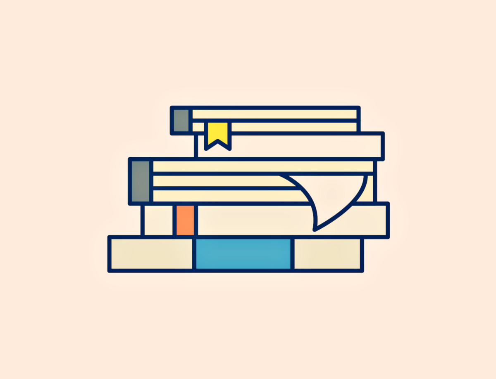

# 6个超级学习者的习惯
## 快速而深入地学习任何技能

> Image from rawpixel.com


成为一名超级学习者是您在21世纪取得成功所需的最重要技能之一。 在技术变革的时代，要保持领先地位，就要依靠不断的自我教育，这是对新模式，新技能和新思想的终生掌握。

在瞬息万变的世界中，尽可能快地学习新技能的能力正迅速成为必需。 好消息是，即使您有全职工作，也不需要天赋的才能更好地学习新知识。

许多多元数学家（在各种研究中都表现出色的人），包括查尔斯·达尔文，莱昂纳多·达·芬奇和诺贝尔物理学奖获得者理查德·费曼，都声称没有卓越的自然智力。

我们所有人都有足够的智力去掌握一门新学科-我们使用正确的工具，方法或运用我们正确学习的知识。 几乎每个人都可以通过正确的技术学习任何东西。

更好的学习方法可以使过程愉快。 快速掌握技能的关键并不复杂。 如果您打算今年学习一种新技能来改善自己的职业，那么其中一些习惯可能对您有用。
## 1.超级学习者读了很多书

阅读是头脑的锻炼，是对身体的锻炼。 它使我们可以自由地漫游广阔的空间，时间，历史，并提供更深入的观点，概念，情感和知识体系。

您在书本上的大脑很活跃-不断增长，变化并建立新的联系和不同的模式，具体取决于您正在阅读的材料的类型。 高度成功的学习者读了很多书。

实际上，许多最成功的人都喜欢阅读，他们并不认为阅读是琐事，而是改善生活，职业和业务的机会。

埃隆·马斯克（Elon Musk）的哥哥说，他每天长大阅读两本书。 比尔·盖茨每年读50本书。 马克·扎克伯格（Mark Zuckerberg）每两周读至少一本书。 沃伦·巴菲特（Warren Buffett）每天花五到六个小时阅读五份报纸和500页公司报告。

在信息是新货币的世界中，阅读是不断学习，知识和获取更多这种货币的最佳来源。
## 2.超级学习者将学习视为一个过程

学习是一段旅程，是对新知识的发现，而不是目标。

这是一个令人愉悦的终生过程-自我导向和自我安排的发现之旅。 理解任何主题，想法或新思维不仅需要敏锐的观察力，而且从根本上需要持续的好奇心。

IBM的Sonia Malik写道：“学习之旅是正式和非正式学习资源的精选集合，可用于获取特定角色和/或技术领域的技能。”

学习是一项通常可以增加收入的投资。 如果您想在不断变化的工作世界中保持相关性，不可或缺和蓬勃发展，学习将比以往更重要。

超级学习者重视这一过程。 他们没有最终目标，他们寻求持续改进。 他们不断掌握新的原理，过程，世界观，思维模式等。对知识的“持续，自愿和自我激励”的追求对其成熟至关重要。
## 3.他们采用成长心态

培养成长心态是正确的，这是卡罗尔·德威克博士（Carol Dweck）提出的一种学习理论，它围绕着可以提高智力，能力和绩效的信念展开。

“ 21世纪的文盲不会是那些不会读写的人，而是那些不会学习，学习和重新学习的人，”作家，未来主义者和商人阿尔文·托夫勒（Alvin Toffler）认为，他的作品讨论现代技术而闻名。

培养成长或适应能力强的心态可以帮助您更加专注于人生中最理想的目标。 它可能会影响您的动力，并使您更容易看到学习和发展能力的机会。

保持胸襟开阔，掌握更多知识并在必要时运用知识的能力可以极大地改善您的生活和职业。
## 4.超级学习者会教别人他们所知道的

根据研究，学习者在向他人解释/教授该概念或立即使用该概念时，将保留所学内容的90％。

向他人传授您所知道的知识是学习，记住和回忆新信息的最有效方法之一。 心理学家将其称为“检索实践”。 这是构建更强大的内存跟踪的最可靠方法之一。

通过简单地教别人一个话题来学习，这样您就可以快速查明知识上的漏洞。 这是著名物理学家理查德·费曼（Richard Feynman）创造的一种心理模型。

费曼被誉为“伟大的解释者”，因为他能够为几乎任何人清晰地说明诸如量子物理学之类的密集话题。 费曼技术在詹姆斯·格里克（James Gleick）的传记《天才：理查德·费曼的生命与科学》中有明确的阐述。

对您的知识的最终考验是您将知识转移到另一个领域的能力。 学习，处理，保留和记住信息的更好方法是一半时间学习，一半时间共享。 例如，不要读完书，而是要阅读50％的内容，然后尝试回忆，分享或写下您学到的关键思想，然后再继续。
## 5.有效的学习者会照顾自己的大脑

保持大脑健康可以使其保持锋利。 您为大脑做什么或不做什么都会大大改变您的记录，处理和检索信息的方式。 每个人都希望尽可能长寿。 这个目标取决于健壮的大脑健康。

这意味着要吃很多与减缓认知能力下降有关的食物-蓝莓，蔬菜（多叶蔬菜-羽衣甘蓝，菠菜，西兰花），全谷类，从鱼类和豆类中获取蛋白质并选择健康的不饱和脂肪（橄榄油）而不是饱和脂肪（黄油） 。

水果和蔬菜可以抵抗与年龄有关的氧化应激，这种氧化应激会导致脑细胞的磨损。”精神病学和衰老教授加里·斯莫尔（Gary Small）博士说。

如果我们不采取任何保护措施，我们的大脑自然会衰落。 但是，如果您尽早进行干预，则可以减缓衰落过程-保护健康的大脑比尝试修复受损的大脑要容易得多。
## 6.他们很早和经常短暂休息

停机对于保留您选择学习的所有内容至关重要。 根据最近的研究，及早和经常短暂休息可以帮助您更好地学习，甚至提高保留率。

“每个人都认为学习新事物时需要'练习，练习，练习'。 取而代之的是，我们发现休息对于早期学习和实践而言同样至关重要，”美国国立卫生研究院国家神经疾病与中风研究所的高级研究员莱昂纳多·科恩（Leonardo G. Cohen）博士说。

更好的休息时间可以帮助大脑在休息期间巩固记忆。 无论您选择随时间学习什么，重要的是要优化休息间隔的时间以获得更好的结果。

路易斯安那州立大学学术成功中心的专家建议进行30至50分钟的课程。 学习策略研究生助理艾伦·邓恩（Ellen Dunn）表示：“少于30的信息还不够，但是超过50的信息太多了，您的大脑无法一次吸收。”

我们大脑的神经网络需要对处理信息进行计时，因此，将学习间隔开来有助于您更有效地记住新信息-给大脑足够的时间来休息和恢复。
```
(本文翻译自Thomas Oppong的文章《6 Habits of Super Learners》，参考：https://medium.com/personal-growth/6-habits-of-super-learners-63d466a254fd)
```
