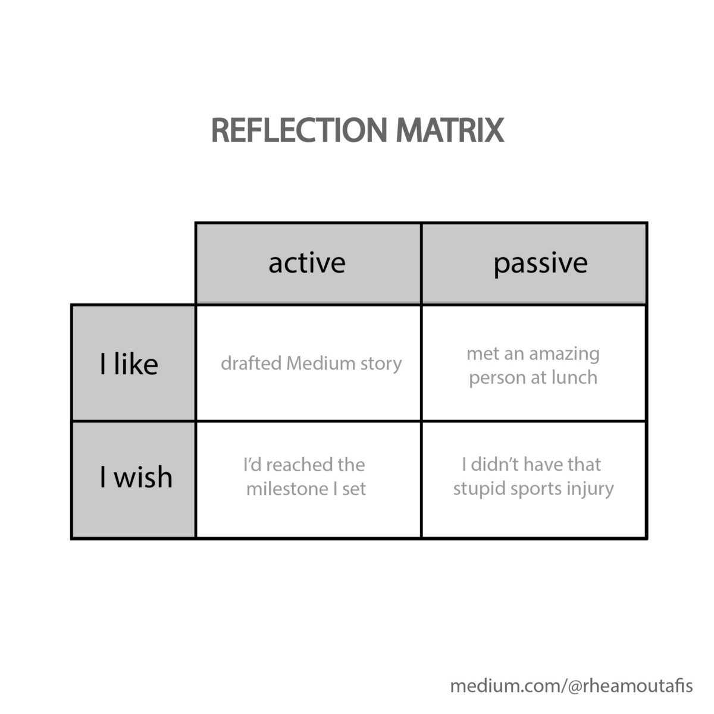

# 程序员倦怠的7个原因
## 以及7种修复方法

> Burnout is extremely common among programmers. Photo by Jacqueline Day on Unsplash


当杰里（Jerry）开始担任初级开发人员时，他们迫不及待地希望每天早晨上班。 而且，即使在每天工作10个小时之后，每个晚上，他们仍然会充满活力。 两年后的现在，杰瑞看上去就像是过去的影子。 这些天起床很难，而工作也变得更加艰辛。 到最后，他们感到筋疲力尽。 他们已经不敢想明天再回去，浪费自己的另一天。

听起来很熟悉？ 就我个人而言，我还没有遇到一个至少经历过一轮倦怠的程序员。

这听起来很矛盾：同一个人在十几岁或二十多岁时就爱上了代码，在过去的三年中至少参加了五次黑客马拉松，并且在周末为开源项目做出了贡献-这个人怎么可能 抱怨倦怠？

是的他们可以。
## 原因1：单调的工作

编程整天坐在屏幕前，除了午休时间和在这里和那里的一些会议。 当然，在其他许多工作中也是如此。 但是，在编程中，坐在一个非常不健康的位置时凝视屏幕的强度是最高的。

即使您发现自己的工作在精神上令人振奋，但这种单调的情绪也会很快导致身体呆滞。 这意味着您无法以最快的速度完成工作，因此您开始精神消沉，因此工作量减少了……

摆脱这种恶性循环意味着采取健康的生活方式。 从理论上讲，这听起来很容易。 但是，预期寿命的下降表明了预期的艰辛程度。
## Fitness如何将我转变为更好的Web开发人员
### 运行以获得更好的运行时间
## 原因2：赶时间

如果您曾经使用过Scrum和类似的方法，或者如果您有雄心勃勃的经理，那么您就会知道我在说什么。
## Scrum方法论简介
### 或我如何学会拥抱变化

您正在逐个期限地追求期限。 您可能会错过一些截止日期。 预计您会在昨天之前交付所有东西，而且没人会在乎人类没有能力做到这一点。

因此，在考虑工作时，不会感到喜悦或成就感。 您感到压力。

这就使您对编码的所有热情都荡然无存。 您应该是一个始终会产生一流输出并提前交付的机器人。 但是你是人类，所以你会出现倦怠的症状。
## 原因3：吸吮的同事

考虑以下情况：您的项目令人兴奋，并且您感到自己正在取得进展。 尽管如此，每天您都害怕上班。 简单的想法就是让您感到焦虑和不快乐。 怎么了？

当然，您的工作幸福感受您的工作影响。 但更重要的是，工作中或工作之外，人际关系影响着你的幸福。

因此，如果您对自己的工作感到满意，但仍然感到恐惧，那可能是您的同事。 无论他们只是不分享您的价值观，还是公司文化是否使他们以愚蠢的方式行事-您都不应该受到侮辱。

如果您遇到讨厌的同事引起的倦怠症状，请注意这不是您的错。 您可能想尝试本文中进一步列出的一些修复程序。 或者，您可能想更加激进一些，更换部门或完全在另一家公司工作。

由你决定。 只知道你应该得到更好。

> Your job will suck if your coworkers don’t share your values. Photo by Ali Yahya on Unsplash

## 原因4：无法识别

这一部分与您的工作关系有关，但在另一个层面上。 您的项目可能很棒，令人兴奋，而您的同事可能很棒。

但是，只要您觉得自己有所成就，经理就可以完成完全不同的任务。 而且每次他们这样做时，旧任务就变得完全无关紧要。

听起来很熟悉？ 我知道对我有用。

您可以对自己的领域感到兴奋或热情。 如果您的工作不断失效，您就会失去动力。

您将开始害怕去那里，因为您知道您将不会创建任何有用的东西。 一天结束了，您会很高兴-因为已经过去了-但由于不是星期五，所以您会很不高兴，明天您将不得不再次上班。 在某个时候，您会开始认为，即使您通过完成任务所获得的技能也无关紧要。

随着时间的流逝，这可能导致更严重的症状。 都是因为您的经理不知道您应该做什么。
## 原因5：获得报酬

报酬太少-或太多！ -会使您的倦怠症状恶化。

薪水太少毫无倦怠之情。 （是的，存在破产的程序员！）如果您对编码的热情还不足以让您一饱眼福，那么您可能会觉得自己的工作不那么有价值。 这使我们回到了原因4。

但是，当您获得过多报酬时，倦怠也可能恶化。 从理论上讲，大检查听起来不错，但它可能导致现实生活中的灾难。 让我用我的亲身经历来说明这一点。

作为一名本科生，我非常参与编程。 我出于科学目的在研究实验室编码软件上昼夜不休，有时甚至忽略了我的课程。 我非常喜欢它，以至于我从未期望对此有任何补偿。 多年来我一直免费工作。 即使那意味着我什至无法在超市买得起西红柿。

当我进入研究生院时，情况发生了根本变化。 突然我得到了报酬。 突然我的所有账单都被支付了。 突然，我可以不用考虑几分钱就能买到西红柿了。 我以谋生为生。 代码！

然后我想到一个愚蠢的主意：如果我被要求支付代码，那么每个月我应该交付一段至少值那笔钱的代码。

突然，从狂放的激情开始的事情变成了压力的来源。 交付压力。 执行压力。 要求退还我所获得的金钱价值的压力。

但是，您对自己施加的压力越大，您要做的事情就越少。 特别是在考虑金钱时。

> Drowning in your tasks is a recipe for disaster. Photo by nikko macaspac on Unsplash

## 原因6：毫无意义的任务

原因3到5解决了尽管拥有一个出色的项目您可能会遇到的问题。 但是有时候您的项目很糟糕。

也许您的项目只是企业B.S. 对程序员来说没有太多的实质。 您只需要编写代码，而不要处理所有管理职责，客户关系等。
## 每位数据科学家需要向企业领导者学习什么
### 因为软技能很重要。

也许您没有在项目中看到含义，因为您无法从项目中学到任何东西。 程序员属于这个星球上最好奇的生物-如果您不能从中学到东西，就不会喜欢它。

也许该项目似乎超出了您的技能范围。 您觉得自己无法掌握它，而经理却完全高估了自己的技能。

或者，也许您在过去的几个月中一直在从事一个项目，但是您仍然无法理解应该做的事情。 这项任务是一个谜，似乎没人能向您解释。 这通常是由于管理不善造成的。 不幸的是，这种情况比您想像的更多。

无论如何，从公司的角度来看，您的项目是您工作的主要原因。 因此，如果糟透了，也难怪您会精疲力尽。
## 原因7：走向死亡

这与原因6密切相关。简而言之，死亡行军是指您要注定要失败的项目。

这可能有许多原因：截止日期太紧，您没有足够的资源或团队太小而无法执行。 特别是当这是一个您要工作数月的大型项目，并且风险很高时，这可能会给您带来巨大的压力。

您对此的反应可能有两种：要么完全陷入冷漠，要么迟到早退，因为您知道自己的工作不会改变任何事情。 或者您开始投入14小时的工作日，以为您可以扭转局面。

你的冷漠是由动机引起的，并导致更多的动机。 基本上，您正在清除使火势持续的燃料。

或者，如果您是沉迷于他们的工作中的那种类型，那么您在投资上的所有时间实际上就会窒息您的激情。

这些都是自然的反应。 和以前一样，只要知道项目进展顺利，那不是你的错。 您是一位出色的程序员，并且可能已经在其他项目中证明了这一点。 如果出问题了，那是因为情况，而不是因为您！
## 程序员倦怠的故事； 如何识别和避免它 CoderHood
### 我将告诉您一个名为Bolbo的软件工程师的故事，他在职业生涯中的某个时刻陷入了死亡大游行。
## 程序员不是机器人

关于倦怠的棘手部分是，从工作问题开始就蔓延到生活的各个领域。 您开始忽视家人，朋友，爱好和自我照顾。 突然之间，您没有陷入工作危机，而是生活危机。

了解这一点非常重要-我不能对此施加太大压力-这不是您的错。 当然，认识到自己的错误对于个人成长至关重要。 但是，责怪自己没有犯的错误会毁了你。

大多数时候，程序员倦怠问题的根源在于公司文化或某种形式的管理不善。

这并不意味着您需要立即更换部门或辞职。 尽管这对于真正困难的情况可能是一个很好的解决方案，但是使用一些更小的修补程序已经可以提供巨大的帮助。

> Compassion is key. Photo by Jude Beck on Unsplash

## 修复1：同情自己

我知道这听起来很la脚。 但是，请听我说。

倦怠不是你的错。 这不是软弱的征兆。 您所经历的痛苦不是白痴。 是真的。 是有效的。

我这么强调是因为我是这种谬论的罪魁祸首。 我倾向于怪我自己没有引起的问题，当我应该对自己好时就把自己殴打。

对自己有同情心是我仍在学习的东西。 但我发现的一件事是，这样做有帮助：

成为自己最好的朋友。

这并不意味着您不应该经常与同伴保持联系。 但是，请尽量把自己当作最好的朋友。

当您因明显的无知，无能或其他原因而殴打自己时，请考虑一下：如果最好的朋友遇到您，您将如何告诉他们？ 您将如何与他们交谈？

我发现自我同情是获得更多自我爱的不可思议的技巧。 这使您猜对了，从而带来了更多的幸福感和生产力。
## 幸福的秘诀是同情心
### 有同情心，要快乐
## 修正2：想想曾经让您兴奋的原因

我曾经对编程感到非常兴奋，但是当我进入研究生院时，我失去了火花。 对我来说，原因是我得到了报酬（原因5）； 但对您而言，可能是上述任何原因。

诺贝尔奖获得者物理学家理查德·费曼（Richard Feynman）的回忆录有所帮助，当他从著名的高等研究院获得工作机会时，正经历一段疲倦：

进修学院！ 特别例外！ 甚至比爱因斯坦还好！ 这是理想的； 它是完美的; 太荒谬了！

太荒谬了。 在其他方面，其他提议使我感到更糟。 他们期望我有所成就。 但是这个提议太荒谬了，以至于我无法辜负，太离谱了。 […]我剃须时嘲笑它，想着它。

然后我对自己心想：“你知道，他们对你的想法真是太棒了，不可能实现。 您没有辜负它的责任！”

这是一个绝妙的主意：您没有责任实现别人认为您应该实现的目标。 我没有责任像他们期望的那样。 这是他们的错误，不是我的失败。

对我来说，高等研究院希望我表现得这么好并不是失败。 这是不可能的。 显然这是一个错误-，当我意识到它们可能出错的那一刻，我意识到在包括我自己的大学在内的所有其他地方也是如此。 我就是我，如果他们希望我表现出色，并且为此提供了一些钱，那将是他们的不幸。

—摘自Richard Feynman的“您肯定是在开玩笑，Feynman先生”，版权所有1985，第16页。 100

Feynman并没有完全编码。 尽管如此，正是这段文字使我在博士开始之初就脱离了兔子洞。 由此得出的结论是，如果我的博士学位学校超额支付我–那是他们的错。 我会像费曼先生那样不负责任，不管我喜欢做什么。 而我做到了。

> Do the small tasks first, then reach for higher goals. Photo by Brad Barmore on Unsplash

## 修复3：合并例行任务

当您知道自己一无所获时，必须去上班是艰巨的。 根据定义。

无论项目是太艰巨，管理不当还是完全没有意义，您都必须避免多巴胺激增，这会让您感到高兴。

可以帮助您重新设置动机的一件事是纳入常规任务。 我喜欢从简单，几乎琐碎的事情开始我的工作。 该任务应该很有用，但主要目的是勾勒我的待办事项清单。

这使我的猴子脑子想完成下一个任务-因为那样我会再获得成就。 然后，我慢慢地从最简单的部分转到最困难的部分。

听起来像是拖延了困难的事情。 但这有效！ 我经常会感到惊讶，首先要做些简单的事情实际上能完成多少工作。
## 修复4：反映

每天留出一些时间练习反思。 每个人都有自己的技术，您可以自由发展自己的技术。 我使用每天晚上填充的反射矩阵：


我将主动事件与被动事件分开。 活动是我所做的直接结果。 被动事件是没有我做任何事情而发生的事情。 这可以帮助我意识到，并非所有事情都在我的掌控之中。

在“我喜欢”类别中，我写了我为那天感激的东西。 这增强了我的成就感和精神韧性。 这样，我就可以积极主动地抵制挫败感。

“我希望”类别包含的东西本来可以更好。 这是我汲取教训并寻求解决方案的地方-例如，我可能会设定不同的里程碑或寻找新方法来应对伤害。
## 极简主义日记：一种巨大习惯的有趣有效工具
### 如何创建自己的习惯仪表板，激发您坚持任何习惯

您可以使用日记，与朋友交谈或向自己发送电子邮件进行反思。 我建议您不要只在脑子里这样做，因为您会忘记它，而且养成习惯会更困难。 另外，无论您是否相信，积压的内容都会在以后浏览时很有趣。

undefined

通过反思，您正在回顾过去的成功。 而且您意识到，每时每刻，您都无法控制事情。 这对我解决倦怠症状很有帮助。
## 修复5：业余爱好

您是一名程序员。 你是个极客。 我知道了。

当您不上班时，您正在睡觉或编码以娱乐。 这太神奇了。

但是，当您面临严重的倦怠时，您可能根本不想触摸计算机。 现在，您一生面临巨大的空虚。

undefined

帮助我的一件事是拥有一种实用的爱好。 例如，我每周至少要烹饪一次美味的东西。 我很容易坚持下去，因为我仍然需要吃饭。 另外，通过这种方式，我可以确保自己得到一些健康的东西，这对我的工作有积极的影响。

无论您选择做什么，任何业余爱好或附带项目都会给您带来工作上缺乏的成就感。 爱好可以帮助您稳定生活，使工作危机不会变成生活危机。

> Get a hobby that inspires you. Photo by freestocks on Unsplash

## 修复6：设置不可协商的边界

这是针对那些精疲力尽时过度补偿的人的。 听起来很矛盾，获得空闲时间也可能需要纪律。

undefined

它不仅可以帮助我放松，反射并获得良好的睡眠。 这也给了我一天期待的东西。 无论生活有多紧张，我都知道我总是可以在晚上9点之间改变主意。 我上床的那一刻
## 为什么您的大脑需要空闲时间
### 一些重要的大脑功能需要停机

undefined

您可能会担心自己会变得懒惰。 有趣的是，事实并非如此。 界限清晰的人给人的印象是，他们可以控制自己的生活。
## 修正7：为自己辩护

这直接链接到上面。 清楚地传达您的需求-您的界限，以及实现项目目标所需的任何其他资源，人力和金钱。

您所需要的应该合理，否则，您的经理可能会认为您要求过高。 但是，最好不要苛刻地离开，而不要害羞地表达自己想要的东西。 其他人看不懂你的鼻子。

一旦开始养成表达需求的习惯，您会惊讶于人们会为您提供帮助的事情！
## 最后一句话：您并不孤单

正如我之前提到的，我还没有遇到一个程序员，他在职业生涯的某个阶段还没有经历过长时间的倦怠。 因此，如果本文告诉您一件事，那就应该是您不是一个孤立的案例。

细心对待自己和他人，并知道当下令您失望的并不是您的错。
```
(本文翻译自Rhea Moutafis的文章《7 Reasons why programmers burn out》，参考：https://towardsdatascience.com/7-reasons-why-programmers-burn-out-44a40bf8948d)
```
