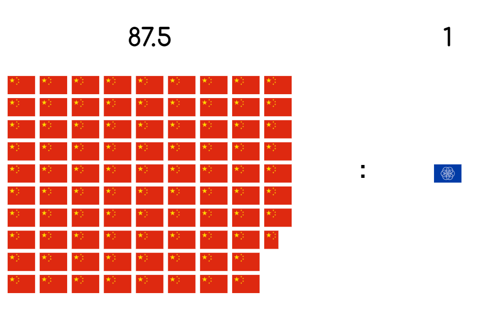
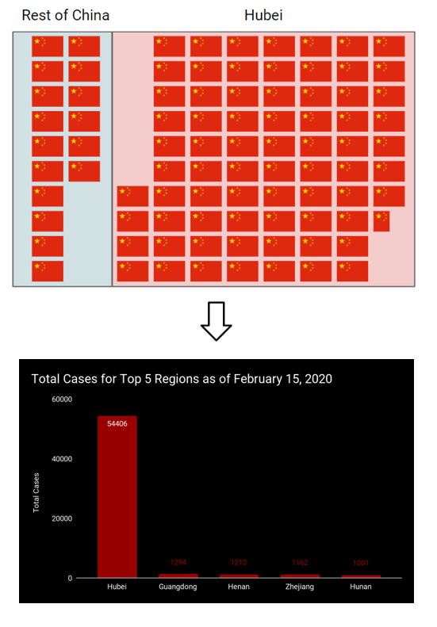
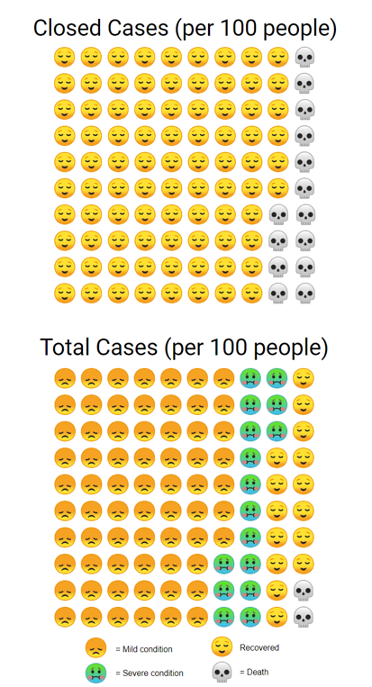
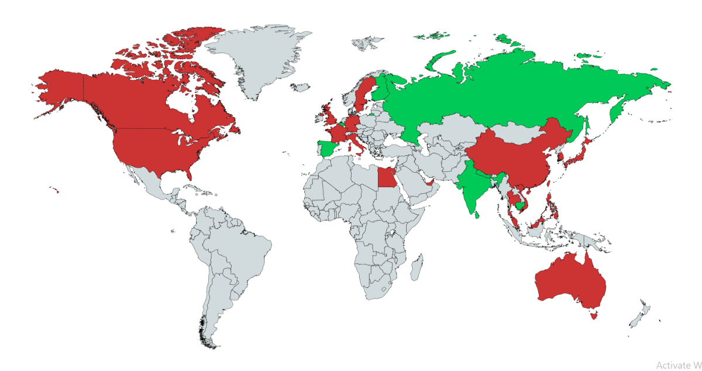
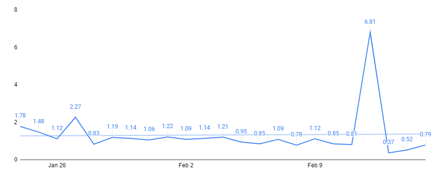

# 9令人着迷的新型冠状病毒统计数据和数据可视化
## 截至今天，您应该了解的冠状病毒

> Photo by Macau Photo Agency on Unsplash


这些数字截至2020年2月15日，摘自WHO的情况报告，中华人民共和国国家卫生委员会（NHC）和中国湖北省卫生委员会。 底部提供了链接。

注意：关于这些数字的不准确性及其解释，我收到了很多评论。 以下信息是从其他来源获取的信息，不受我的主观性的影响。 另外，请记住，随着时间的流逝，数字仍会与以下数字有所不同。 但是，从中获取您想要的东西并享受吧！
# 1）98.87％的冠状病毒病例来自中国

更具体地说，在69289例病例中，有68509例来自中国。 同样，这意味着中国每87.5例病例中就有1例在中国境外。

> The ratio of cases between China and the rest of the world

# 2）此外，中国约有81.7％的病例来自湖北。

如上所述，这占87.5个案例的约71.5。 广东的病例数第二多（1294），其次是河南（1212），浙江（1162）和湖南（1001）。

> Number of cases in Hubei

# 3）9,883名测试阳性的人已经康复

占11,554宗结案的86％，占总数的14％。

> Emoji’s from Google

# 4）在受影响的29个国家中，有八个国家的所有病例均已从感染中恢复

国家列表包括印度（3），俄罗斯（2），西班牙（2），比利时（1），斯里兰卡（1），芬兰（1），柬埔寨（1）和尼泊尔（1）。

绿色代表已从所有案件中恢复过来的国家。 红色代表案件活跃的国家。

> Created with mapchart.net

# 5）估计死亡率为2％

死亡率定义为在给定区域或时期内或特定原因下的死亡人数。

2020年2月4日，中国国家卫生委员会（NHC）宣布，目前的死亡率（也称为病死率或CFR）为2.1％。 这是通过将当前累计死亡总数除以当前确诊病例数得出的。 [1]

相比之下，SARS的CFR为10％，MERS的CFR为34％。
# 6）增长因子一直呈下降趋势，并且在过去三天内一直低于1.00。

> Growth Rates since January 24, 2020


增长因子是用今天的新病例数除以昨天的新病例数来计算的。 例如，如果今天有107例，昨天有100例，那么从昨天到今天的增长因子将是1.07。

低于1的增长因子或高于1的增长因子但呈下降趋势是表明病毒传播处于稳定状态的好兆头。 另一方面，高于1的增长因子表示指数增长。

下一点解释了2月12日上升的原因，第二天跌至0.37的部分原因是由于“重复的统计数据”对报告的病例数进行了校正。
# 8）截至2020年2月12日，湖北省共有14840例新病例。

这主要是由于采用了新的诊断分类，最终在当天的14840新病例中贡献了13332。 截至2月12日，湖北和所有其他省份将除确诊病例数之外还包括临床诊断病例数。
# 9）大约80％的死者年龄在60岁以上，而75％的人曾患有心血管疾病和糖尿病等健康状况。 [2]

因此，从统计学上来说，如果您既年轻又健康，那么如果您赶上了冠状病毒，就不可能致命。

如果您想了解最新的冠状病毒，请在此处查看Worldometer，或在此处查看WHO的每日情况报告。
# 谢谢阅读！

如果您喜欢我的工作并想支持我，请在此处注册我的电子邮件列表！
# 参考资料/资源

[1] NHS新闻发布会，2020年2月4日-中华人民共和国国家卫生委员会（NHC）

[2]冠状病毒，行动的机会之窗，世界卫生组织说，英国广播公司新闻

冠状病毒盒，Worldometer

世卫组织冠状病毒疾病（COVID-2019）情况报告
```
(本文翻译自Terence Shin的文章《9 fascinating Novel Coronavirus statistics and data visualizations》，参考：https://towardsdatascience.com/9-fascinating-novel-coronavirus-statistics-and-data-visualizations-710cfa039dfd)
```
