## 参考书目

[1] Krizhevsky，Alex，Ilya Sutskever和Geoffrey E. Hinton。 “具有深度卷积神经网络的Imagenet分类。” 神经信息处理系统的进步。 2012。

[2] Jozefowicz，Rafal等。 “探索语言建模的局限性。” arXiv预印本arXiv：1602.02410（2016）。

[3] Sutskever，Ilya，Oriol Vinyals和Quoc V. Le。 “使用神经网络进行序列学习的序列。” 神经信息处理系统的进步。 2014。

undefined

undefined
# 问题
## 偏项b有什么需要？

如果我们可以直观地看到偏见，那么最容易理解它。 首先，让我们使用S型函数作为非线性激活函数。 我们还考虑一个简化的网络，其中只有一个权重w₁和来自上一层x₁的一个输入。
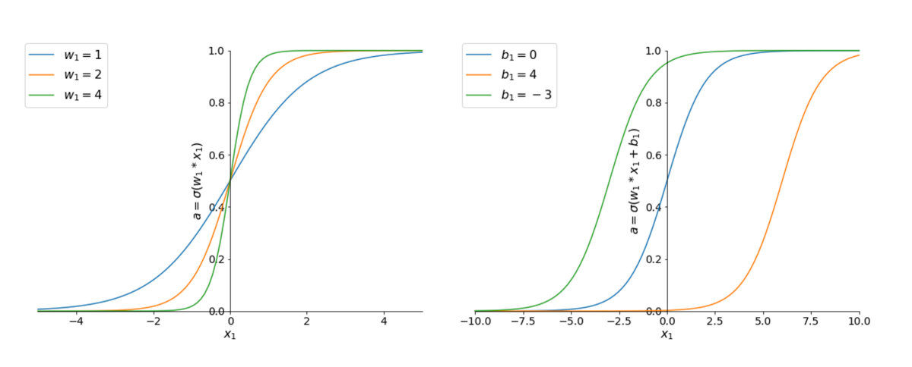
> Figure 9: Activation of the first neuron in the second layer for various values of the bias term


在图的左边。 图9是针对单个权重w 1的3个不同值的S形函数。 您可以看到，如果NN改变了权重，这只会改变图表的陡度。

undefined

undefined

undefined
## undefined

简短的答案：没有非线性函数，许多权重和激活的乘积就是输入的线性函数。 因此，您只能解决线性可分离的问题。

答案很长：线性可分离是什么意思？ 这意味着可以使用超平面解决您的问题。 二维的超平面也就是一条线，三维的超平面也就是一个平面（就像一张纸），通常我们称之为超平面。

例如，考虑图5的左侧。 10包含两个分别用绿色和橙色上色的组。 蓝线显示了解决此分类任务的可能超平面。 这是线性可分问题的一个例子
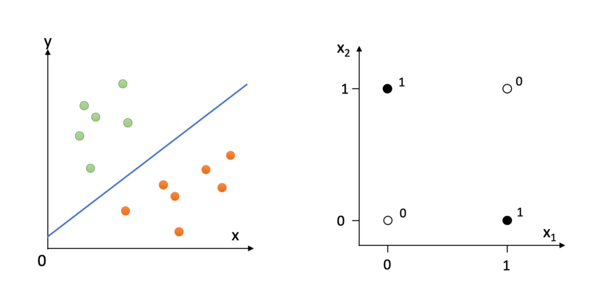
> Figure 10: (left) linear classification problem and (right) non-linear classification problem


现在考虑一个不可线性分离的问题。 此类问题最简单的示例是XOR门。 它有两个输入，我们称它们为x₁和x²，还有一个输出。 XOR问题显示在图的右侧。 10.在这种情况下，没有超平面完美地将这两个类别分开。

这与NN的非线性函数有何关系？ 没有非线性函数，权重和激活乘法的多层可以由一个大矩阵M表示，该矩阵将输入向量X映射到输出向量Y（即M.X = Y）。 该矩阵将是线性的，因此将无法解决XOR问题。 手写数字识别是非线性问题的另一个示例。 因此，非线性函数破坏了NN的线性，因此它们能够解决更复杂的问题。
## 摘要

因此，要训练我们的神经网络，我们需要对所有训练图像进行正向传播。 计算平均成本C（w）。 然后使用反向传播来计算C（w）关于NN中所有权重的导数。 最后，使用更新方程式使用梯度下降法将权重逐渐移至C（w）的最小值。 简单！

undefined

我希望您喜欢学习NN的内部知识。 下篇文章见。

保持好奇心。
## 反向传播

undefined
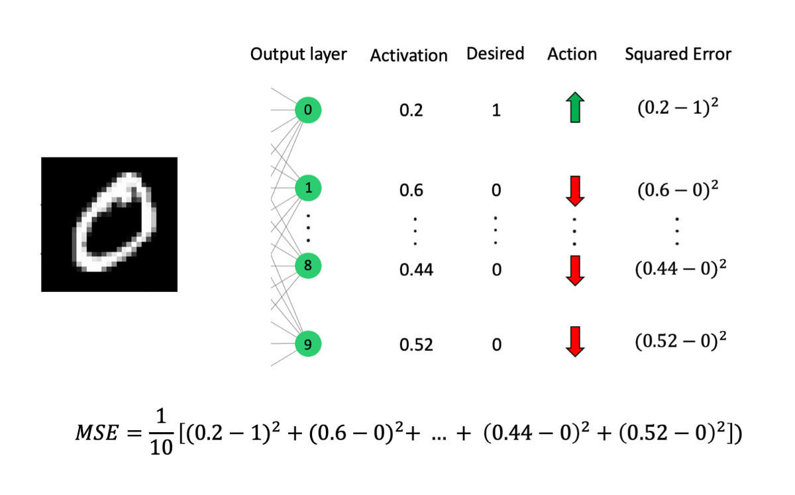
> Figure 6: Image shows the calculation of the cost for a single training example


undefined

现在我们要更改所有权重和偏差，以使此成本尽可能小。

为了更好地理解这一点，可以想象整个系统的特征是单一的权重，而不是我们目前拥有的数千。 那么我们的成本函数可能类似于图7。
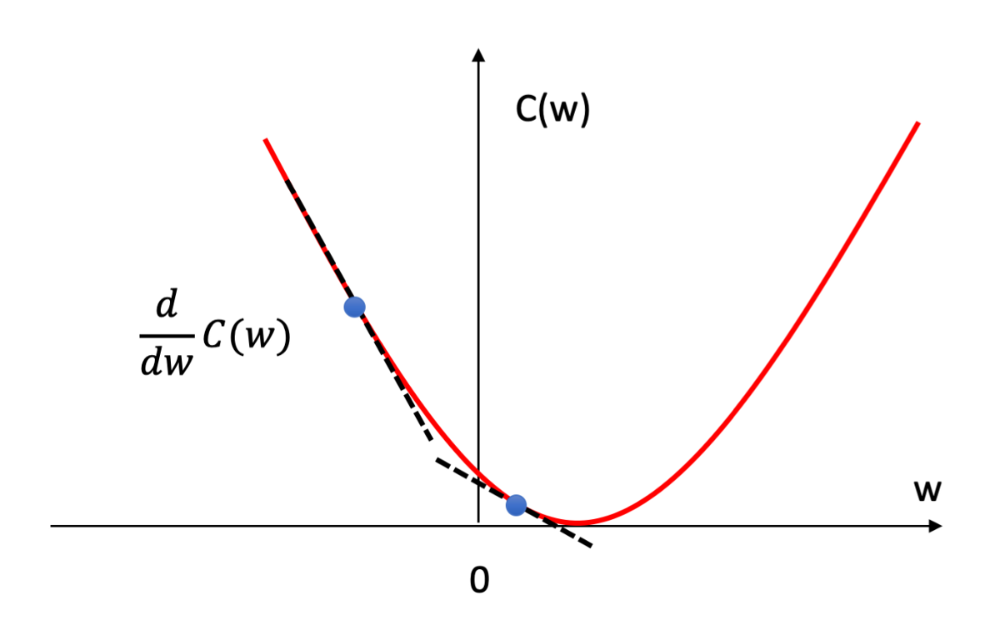
> Figure 7: Graph showing the cost function C(w) (red) and two possible values of w (blue circles) along with their gradients (black dashed)


用红色绘制的是不同w值的平均成本C（w）。 如前所述，我们要最小化C（w）。 换句话说，我们想要改变w，以便我们达到红色曲线的最小值。

图7中还显示了w作为蓝色圆圈的两个可能值，其关联的渐变为黑色虚线。 从图7可以得出的结论是，如果当前点的坡度为负，则应将w向右移动；如果坡度为正，则应将w向左移动。

此外，我们应移动与梯度成比例的量。 如果渐变较大，则移动的幅度应大于渐变较小的幅度，因为这表明我们接近红色曲线的最小值。 该逻辑可以通过权重更新方程式进行总结。
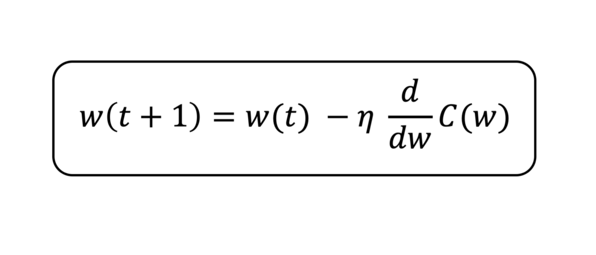
> Figure 8: Weight update equation


注意：请记住，我们不知道C（w）的确切表面，如图7所示，否则我们可以简单地将权重更改为最佳值以最小化C（w）。 相反，我们必须使用梯度的局部度量来告诉我们要朝哪个方向移动，以使我们更接近最小值。

undefined

undefined

undefined
## 正向传播

为了给NN一些上下文，我们将考虑将其应用于原始问题之一-手写数字识别[4]。 这个问题通常是深度学习的学生首先遇到的一个问题，因为它代表着传统机器学习方法难以解决的问题。

想象一下，我们要编写一个可以识别手写数字的计算机程序。 我们收到的每个图像将为28 x 28像素，我们还将可以访问该图像的正确标签。 我们要做的第一件事是建立我们的神经网络，如下图所示。
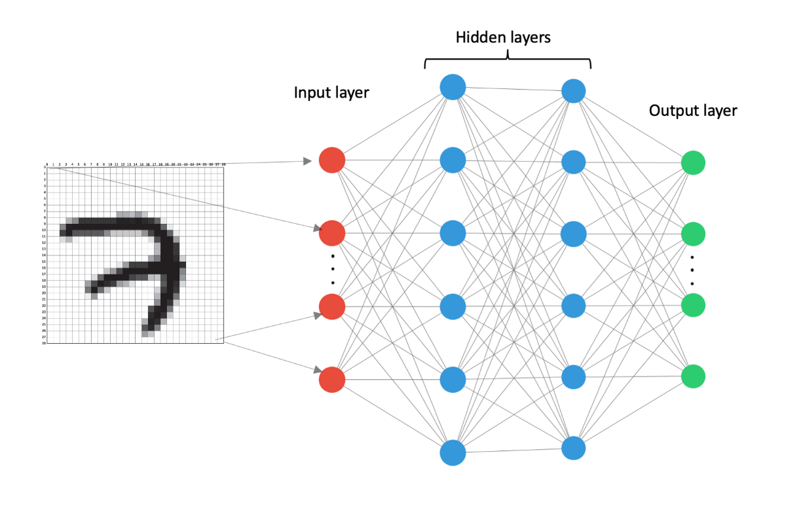
> Figure 1: Generic NN


图1中的每个圆圈代表一个“神经元”。 神经元简单地持有标量值，即数字。 红色神经元定义输入层。 这是我们输入图像的地方。 蓝色神经元代表隐藏的层。 它们被称为隐藏层，因为用户永远不会直接与这些神经元交互。 绿色的神经元代表输出层。 在这里，NN将输出其对图像中数字的预测。

我们总共有784个像素（28 x 28），因此我们的输入层包含784个神经元。 我们将图1中的顶部红色神经元称为神经元1，将底部红色神经元称为784。每个神经元的值取其所连接像素的值。 例如，如果我们的图像的像素深度为8位，则单个像素的取值范围为0到256（2⁸）。 0将代表一个完全白色的像素，而256将代表一个完全黑色的像素，在这些值之间有一个缩放比例。 神经元的价值被称为激活。 我们将用符号a表示神经元的激活。

接下来要做的是将输入层中的每个神经元附加到下一层中的每个神经元。 这在图1中显示为灰色线。我们还为每个连接添加了权重。 权重就像神经元的值一样，只是一个标量值。 图2显示了为我们的NN标记的三个权重。 在这里，下标只是帮助我们跟踪重量对应的两个神经元。 因此，例如，权重w31是输入层中的神经元1和第一隐藏层中的神经元3之间的连接权重。 神经元之间的权重越大，它们之间的联系越牢固。
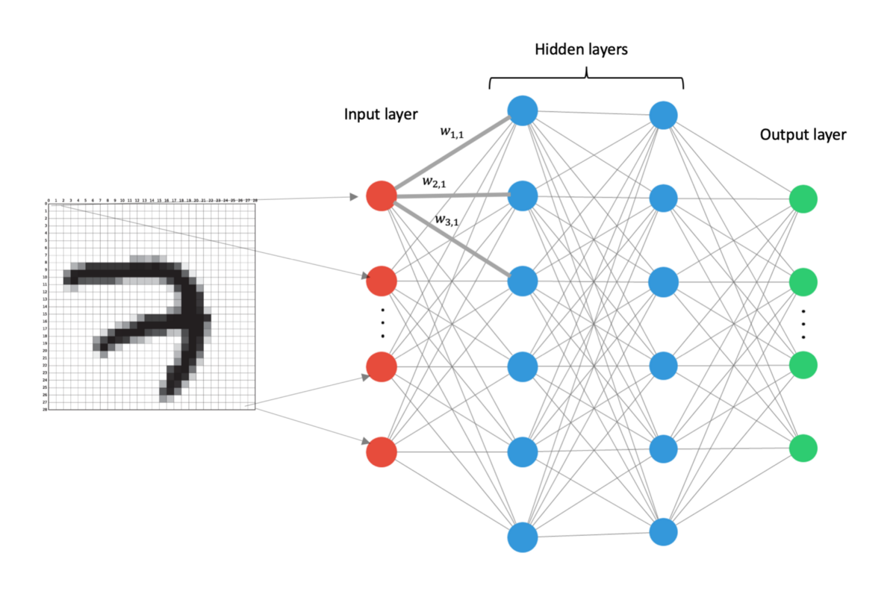
> Figure 2: A generic NN with weights


现在我们需要计算出第一个隐藏层中神经元的激活值。 我们分为两个部分。 在第一部分中，我们简单地将前一层中每个神经元的激活程度乘以附着在其上的权重。 然后，我们将所有这些术语加起来，并添加一个“ bias”（偏差）术语，我们将其表示为b。 最后，我们将加权总和通过非线性函数（例如tanh（x）或S型函数）表示，我将用σ表示。 [如果您对我们为什么要使用偏置项和非线性函数感兴趣，请参阅“问题”部分。]

让我们分解一下。 如果我们考虑在隐藏层的第一个神经元发生了什么，那么我们将在图3中显示。
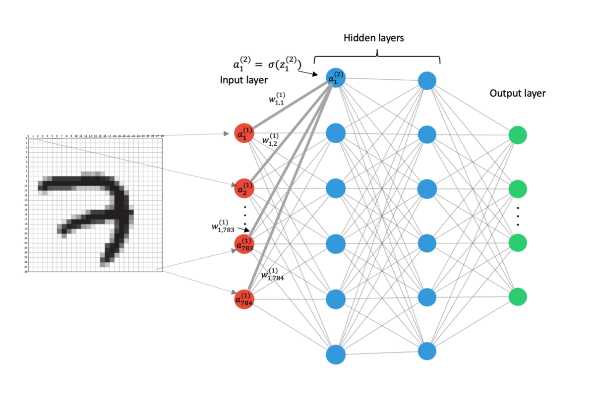
> Figure 3: A generic NN with weights and activations labelled


该神经元具有第一层中所有神经元的贡献。 第一层中的每个神经元都有各自的权重，乘以它们的权重。 然后，我们添加所有这些项并添加单个偏差项。 该加权和由符号z₁²表示，其中1表示我们正在谈论该层中的第一个神经元，上标2表示我们正在引用网络中的第二个层。 然后，将这个加权总和通过非线性函数进行处理，以获取第一隐藏层（网络的第二层）中第一神经元的激活，我们将其称为a₁²。
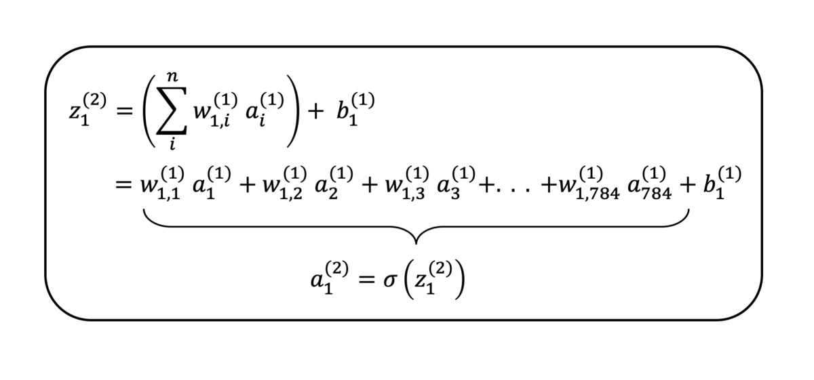
> Figure 4: Equations defining the weighted sum and activation for the first neuron in the first hidden layer


undefined

现在我们已经获得了第一隐藏层中所有神经元的激活，我们重复此过程以获取第二隐藏层中神经元的激活，然后再次获得输出层的激活。 重要的是要知道不同层之间的权重是不同的。

undefined

undefined
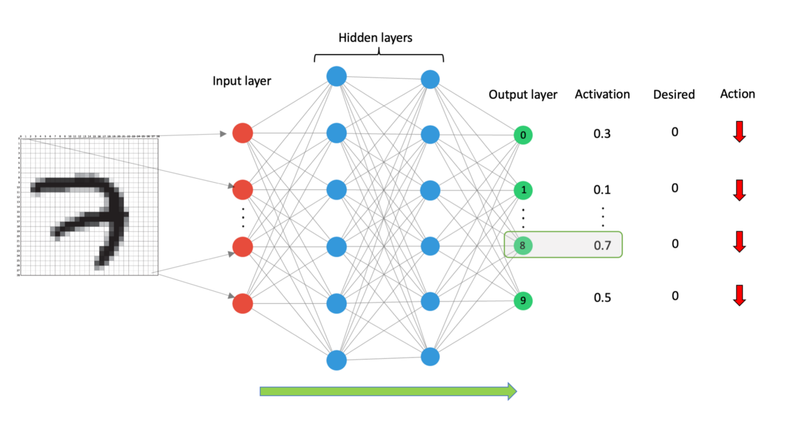
> Figure 5: Generic NN showing the output of the network for an input of the digit 7


undefined

undefined

事实证明，我们知道并且已经完成了相当长的时间[5]，该技术可以非常有效地计算所需的更改。 该算法称为反向传播。
# NN-它们如何运作？

神经网络包含两个阶段。
+ 正向传播
+ 反向传播

在NN训练期间，您将执行这两个阶段。 当您希望NN对未标记的示例进行预测时，只需执行正向传播。 反向传播实际上是使NN在传统上很难执行的任务上表现出色的魔力。
## 全民数据科学
# 神经网络初学者指南
## 深入了解“黑匣子”
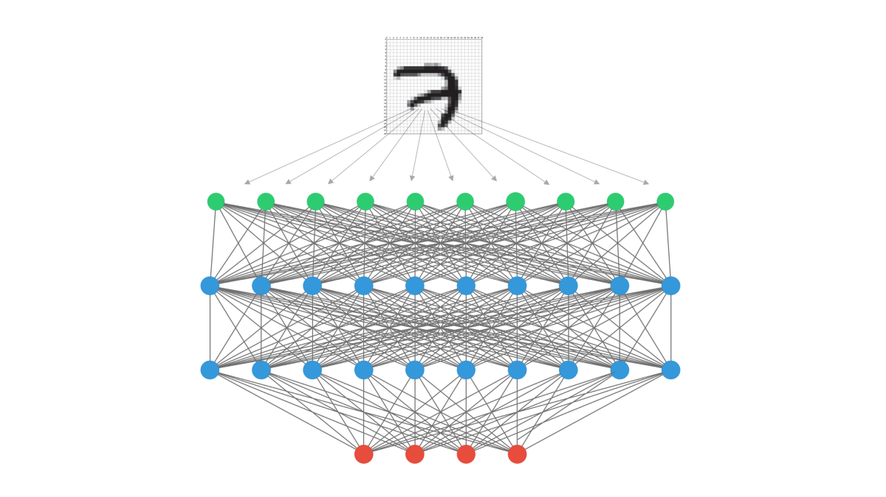
# 介绍

undefined

第一次学习NN时，最让我惊讶的是它们的数学简单性。 尽管神经网络在计算机视觉[1]和自然语言处理[2,3]等领域处于突破性的前沿，但是它们的内部结构还是很容易理解的。

undefined

因此，让我们直接开始吧。
```
(本文翻译自Shane De Silva的文章《A Beginners Guide to Neural Nets》，参考：https://towardsdatascience.com/a-beginners-guide-to-neural-nets-5cf4050117cb)
```
