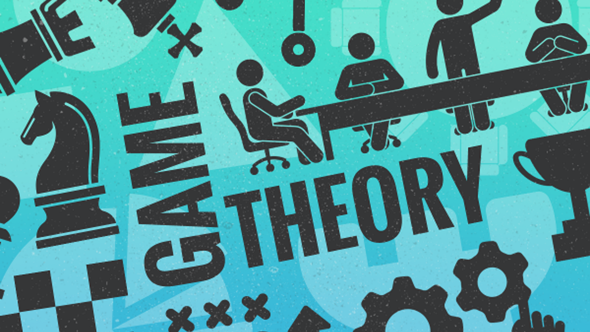
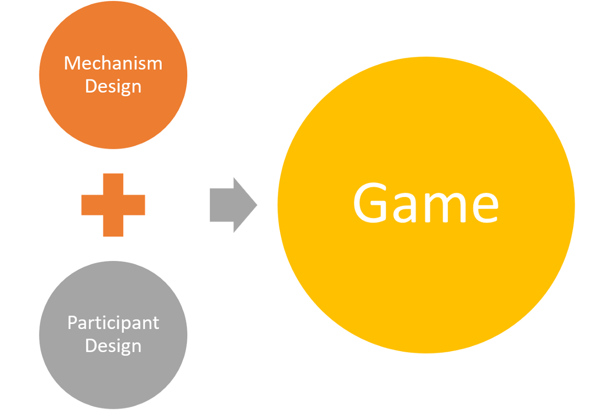
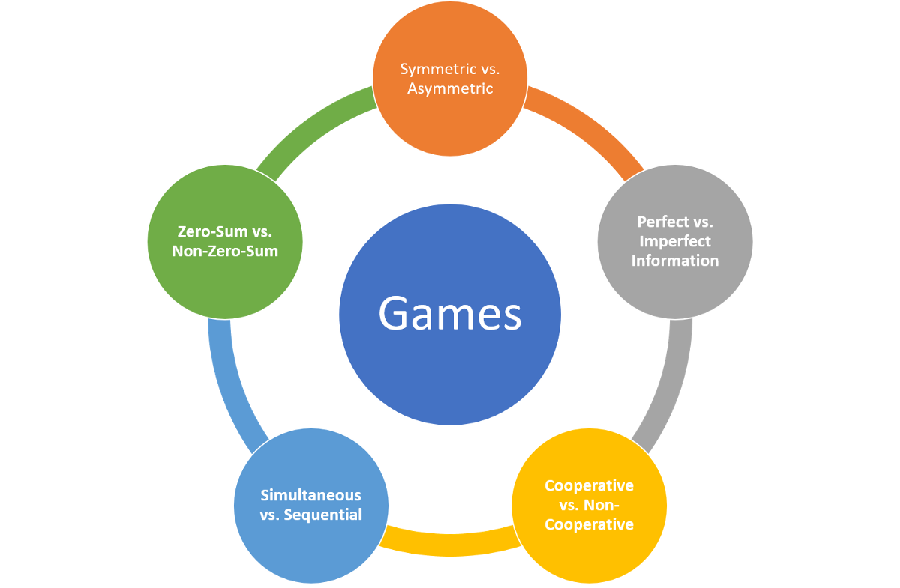
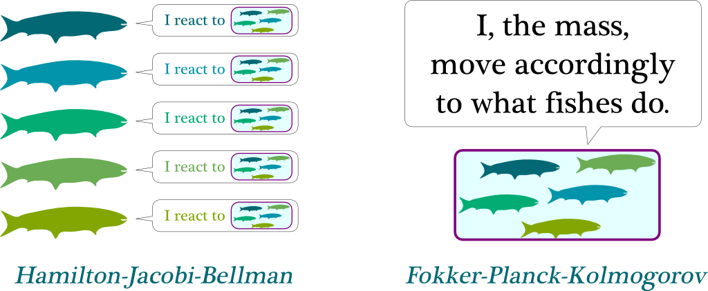
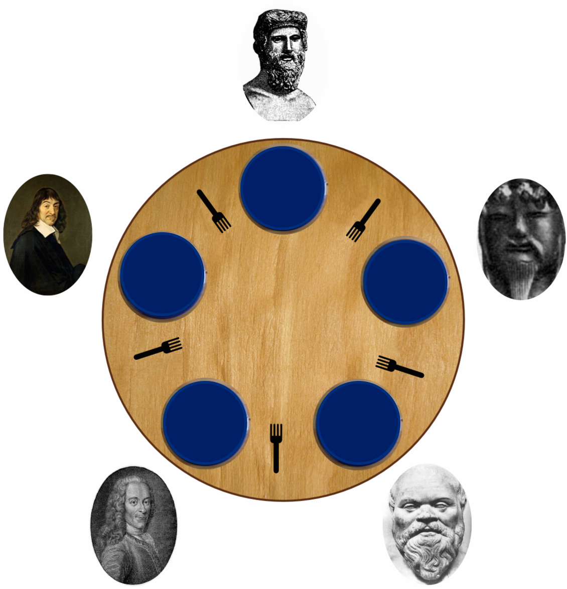
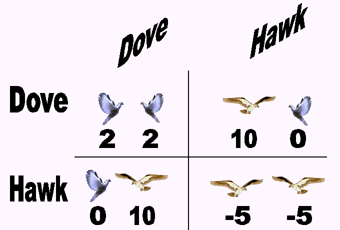

# 机器学习博弈论速成班：经典思想和新思想
## 博弈论正经历着由AI演变驱动的复兴。 数据科学家应该注意哪些经典和新的想法。


博弈论是最吸引人的数学领域之一，它影响了各个领域，例如经济学，社会科学，生物学以及显然的计算机科学。 关于博弈论的思考方法有很多，但我认为确实有用的方法（尽管过于简单）是：

博弈论是带有激励的概率

游戏在人工智能（AI）的发展中起着关键作用。 对于初学者来说，游戏环境已成为强化学习或模仿学习等领域中流行的训练机制。 从理论上讲，任何多智能体AI系统都可以在参与者之间进行游戏化互动。 阐述游戏原理的数学分支被称为游戏理论。 在人工智能（AI）和深度学习系统的背景下，博弈论对于实现多智能体环境中所需的一些关键功能至关重要，在该环境中，不同的AI程序需要交互或竞争才能实现目标。

游戏理论的历史与计算机科学的历史息息相关。 当前在博弈论中的许多研究都可以追溯到计算机科学先驱（例如Alan Turing或John Von Neumann）的工作。 电影《美丽的心灵》中流行的著名的纳什均衡是现代系统中许多AI交互的基石。 但是，多次使用博弈论原理对AI宇宙进行建模超出了纳什均衡的范围。 开始理解使用博弈论原理构建AI系统的含义的好地方是理解我们通常在社会或经济互动中遇到的不同类型的游戏。

每天，我们都会参与数百种基于游戏动态的互动。 但是，这些游戏化环境的体系结构完全不同，参与者的动机和目标也完全不同。 如何将一些原理应用于AI代理的建模？ 这是一个挑战，正在推动AI研究的整个领域，例如多主体强化学习。

显然，尽管游戏是博弈论最明显的体现，但它远不是应用这些概念的唯一空间。 从这个角度来看，博弈论与人工智能的结合可能会影响其他许多领域。 我们可以将大多数涉及多个“参与者”协作或竞争来完成一项任务的场景加以运用和精通AI技术。 即使前面的陈述是概括性的，我希望它能传达出以下观点：博弈论和AI是一种思考和建模软件系统的方法，而不是一种特定的技术。

为了使AI场景成为使用博弈论的良好候选者，它应该涉及多个参与者。 例如，诸如Salesforce Einstein之类的销售预测优化AI系统并不是应用博弈论原理的理想人选。 但是，在多参与者的环境中，博弈论会非常有效。 在AI系统中设计游戏动态可以归纳为两个基本步骤：


·参与者设计：博弈论可用于优化参与者的决策，以获得最大效用。

·机制设计：逆向博弈论的重点是为一群聪明的参与者设计游戏。 拍卖是机制设计的经典示例。
# 数据科学家应了解的5种游戏类型

假设我们正在建模一个包含多个代理的AI系统，这些代理将协作并竞争以实现特定目标。 那是博弈论的经典例子。 自1940年代问世以来，博弈论一直专注于对最常见的交互模式进行建模，而现在我们在多代理AI系统中每天都在看到这种模式。 了解环境中不同类型的游戏动力学是设计高效游戏化AI系统的关键要素。 在较高的层次上，我喜欢使用五要素标准来了解AI环境中的游戏动态：

## 对称与非对称。

游戏的最简单分类之一是基于游戏的对称性。 对称游戏描述了一个环境，其中每个玩家都有相同的目标，其结果将仅取决于所涉及的策略。 国际象棋是对称游戏的经典示例。 我们在现实世界中遇到的许多情况都缺乏对称性的数学优雅，因为参与者经常有不同甚至冲突的目标。 商务谈判是不对称博弈的一个示例，其中各方都有不同的目标，并从不同的角度评估结果（例如：赢得合同与最小化投资）。
## 完美与不完美的信息

游戏的另一个重要分类是基于可用信息的类型。 完美的信息游戏是指每个玩家都可以看到另一个玩家的动作的环境。 象棋再次是完美信息游戏的一个例子。 许多现代互动都是基于这样的环境，其中每个玩家的举动都被其他玩家隐藏，并且博弈论将这些场景归类为不完善的信息游戏。 从像扑克这样的纸牌游戏到无人驾驶汽车场景，不完美的信息游戏无处不在。
## 合作与非合作

合作游戏环境是指不同的参与者可以建立联盟以使最终结果最大化的一种游戏环境。 合同谈判通常被建模为合作博弈。 非合作场景描述了禁止玩家结成联盟的环境。 战争是非合作游戏的终极例证。
## 同时与顺序

顺序游戏发生在每个玩家都拥有有关其他玩家较早动作的信息的环境中。 棋盘游戏本质上是顺序游戏。 同时游戏表示两个玩家可以同时执行动作的场景。 证券交易是同时游戏的一个例子。
## 零和与非零和

零和博弈是指这样一种情况，在这种情况下，收益或一个玩家总是来往往会转化为其他玩家的松懈。 棋盘游戏是零和游戏的例子。 在多个玩家可以从一个玩家的行为中受益的情况下，经常会遇到非零和游戏。 非零和博弈的一个例子是多个参与者共同参与以增加市场规模的经济互动。
# 纳什均衡

对称游戏统治着AI世界，其中大多数是基于上个世纪最著名的数学理论之一：纳什均衡。

纳什均衡器以约翰·福布斯·纳什（John Forbes Nash）的名字命名，约翰·福布斯·纳什（John Forbes Nash）在电影“美丽的心灵”中被罗素·克劳（Russell Crow）永生。 本质上，纳什均衡描述了一种情况，在这种情况下，每个参与者都选择了一个策略，没有一个参与者可以从更改策略中受益，而其他参与者则保持不变。

纳什均衡是解决许多博弈论问题的美丽且功能强大的数学模型，但在许多非对称博弈环境中也达不到要求。 对于初学者而言，纳什方法假定玩家具有无限的计算能力，而在现实环境中很少出现这种情况。 同样，许多纳什均衡模型无法解释风险的概念，这种风险在大多数不对称博弈中都普遍存在于经济市场中。 结果，存在许多使用纳什均衡难以实现的非对称博弈场景。 这在需要在解决方案的数学上的优雅与实现的实用性之间找到正确平衡的多主体AI系统中尤其重要。
# 博弈论中影响机器学习的新颖思想

多主体AI系统是AI生态系统中最引人入胜的研究领域之一。 依靠多智能体系统等领域的最新进展，依靠该领域一些最先进的思想，推动了博弈论的发展。 这里有一些博弈论子学科的例子，这些学科在现代机器学习中非常普遍。
# 平均场比赛

平均场博弈（MFG）是博弈论领域中一个相对较新的领域。 MFG理论是2006年发展起来的，是Minyi Huang，RolandMalhamé和Peter Caines在蒙特利尔，以及Jean-Michel Lasry和Fields的得主Pierre-Louis Lions在巴黎发表的一系列独立论文的一部分。 从概念上讲，MFG包括研究大量理性玩家的差异博弈的方法和技术。 这些行为者不仅对他们的状态（例如财富，资本）有偏爱，而且对人口中其余个体的分布也有偏爱。 MFG理论研究了这些系统的广义纳什均衡。

MFG的一个经典例子是，在学校中鱼群如何以相同的方向和协调的方式游动。 从理论上讲，这种现象确实很难解释，但其根源是鱼对最接近的群体的行为有反应。 更具体地说，每条鱼都不在乎其他每条鱼，而是在乎附近的鱼如何大规模地移动。 如果将其转化为数学术语，则鱼对质量的反应将用Hamilton-Jacobi-Bellman方程来描述。 另一方面，确定质量运动的鱼的动作的集合对应于Fokker-Planck-Kolmogorov方程。 平均场博弈论是这两个方程的组合。

# 随机游戏

随机比赛的历史可以追溯到1950年代，由诺贝尔奖获得者，经济学家劳埃德·沙普利（Lloyd Shapley）提出。 从概念上讲，随机游戏是由有限数量的玩家在有限的状态空间玩的，在每种状态下，每个玩家都选择有限的多个动作之一。 最终的行动概况决定了每个参与者的奖励以及继任者状态的概率分布。

吃饭的哲学家问题是经典的随机游戏形式，其中有n + 1名哲学家（n≥1）坐在圆桌旁，中间有一碗饭。 在彼此相邻的任何两个哲学家之间放着一根筷子，两人都可以使用它。 由于桌子是圆的，所以筷子的数量和哲学家的数量一样多。 要从碗里吃东西，哲学家需要获得他可以使用的两把筷子。 因此，如果一个哲学家吃饭，那么他的两个邻居就不能同时吃饭。 哲学家的生活很简单，包括思考和饮食。 为了生存，哲学家需要三思而后行。 任务是设计一种协议，以允许所有哲学家生存。

# 进化游戏

进化博弈论（EGT）从达尔文的进化论中汲取了灵感。 EGT的起源可以追溯到1973年John Maynard Smith和George R. Price的竞赛形式化，作为策略进行分析，并使用数学标准来预测竞争策略的结果。从概念上讲，EGT是博弈论概念的应用，在这种情况下，一群具有多种策略的特工随着时间的流逝而相互作用，从而通过选择和复制的进化过程来创建稳定的解决方案。 EGT背后的主要思想是，许多行为涉及人口中多个主体的相互作用，而这些主体中任何一个的成功与否都取决于其战略与他人的战略如何相互作用。虽然经典博弈论一直关注静态策略，也就是说，策略不会随时间而变化，但是进化博弈论与经典博弈论的不同之处在于，它关注策略随着时间的推移如何演化以及哪种动态策略最成功。这个进化过程。

EGT的经典示例是“鹰鸽游戏”，它模拟了鹰与鸽子之间在可共享资源上的竞赛。 在游戏中，每个参赛者都严格遵循以下两种策略之一：

·鹰：发起攻击行为，直到受伤或对手退缩后才停止。

·鸽子：如果对手发起攻击性行为，则立即撤退。

如果我们假设（1）每当两个人都发起攻击性行为时，最终就会发生冲突，并且两个人同样有可能受到伤害；（2）冲突的成本会使个人适应度降低某个常数C，（3）当 一只鹰遇到一只鸽子，该鸽子立即撤退，而鹰获得资源，并且（4）当两只鸽子满足资源时，它们之间平均共享时，可根据以下矩阵总结鹰-鸽子游戏的适应性收益 ：

# 逆博弈论

在许多情况下，问题不在于优化参与者的游戏策略，而是围绕理性参与者的行为设计游戏。 这就是逆向博弈论的作用。 拍卖被认为是逆向博弈理论的主要例子之一。

博弈论正经历着由AI和多代理系统的发展推动的复兴。 由计算机科学传奇人物如Alan Turing或John Von Neumann提出的博弈论原理现已成为地球上一些最智能系统的中心，而AI的最新发展也有助于推动对博弈论的研究。 。 随着AI的不断发展，我们应该在游戏理论领域看到新的和更新颖的想法，并逐渐进入主流深度学习系统。
```
(本文翻译自Jesus Rodriguez的文章《A Crash Course in Game Theory for Machine Learning: Classic and New Ideas》，参考：https://towardsdatascience.com/a-crash-course-in-game-theory-for-machine-learning-classic-and-new-ideas-50e33ba2636d)
```
