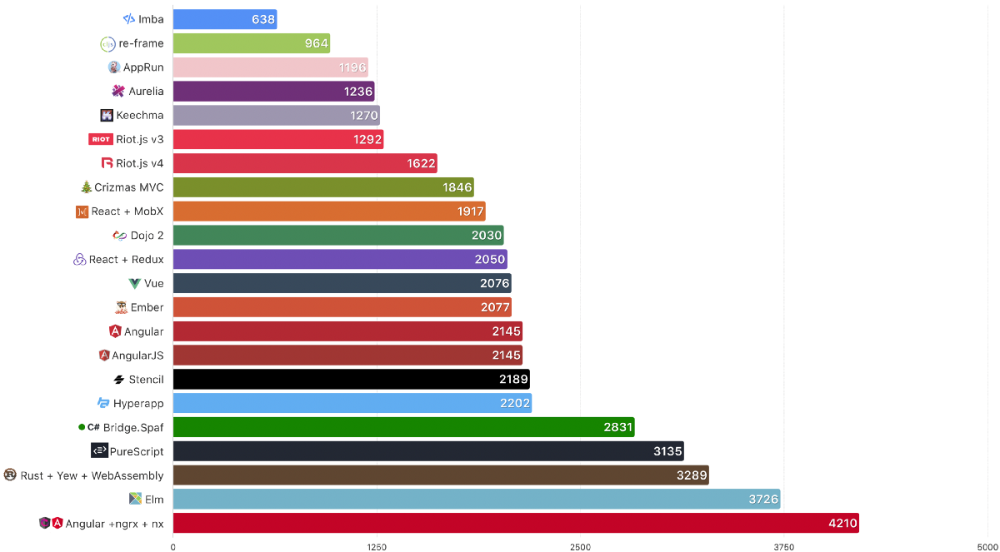
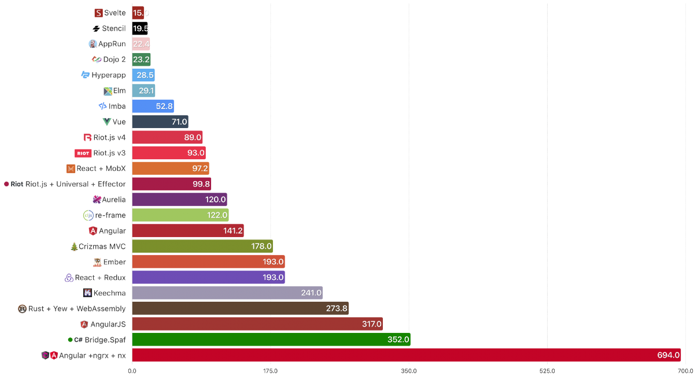
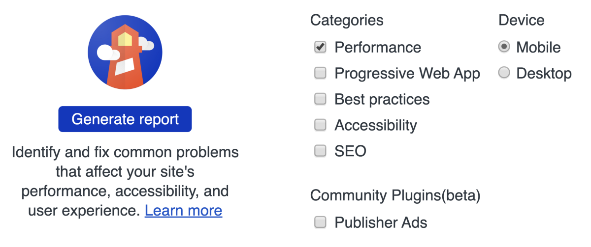
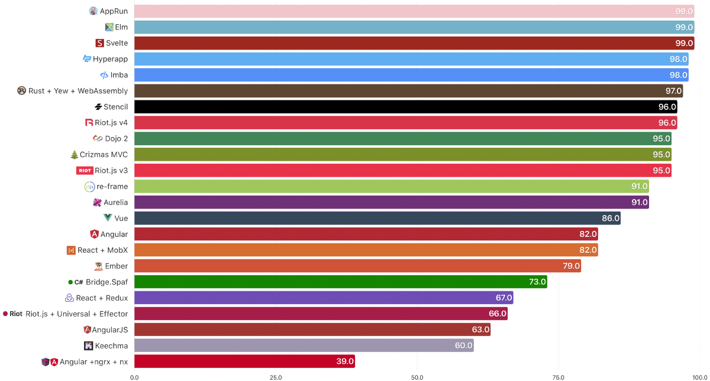
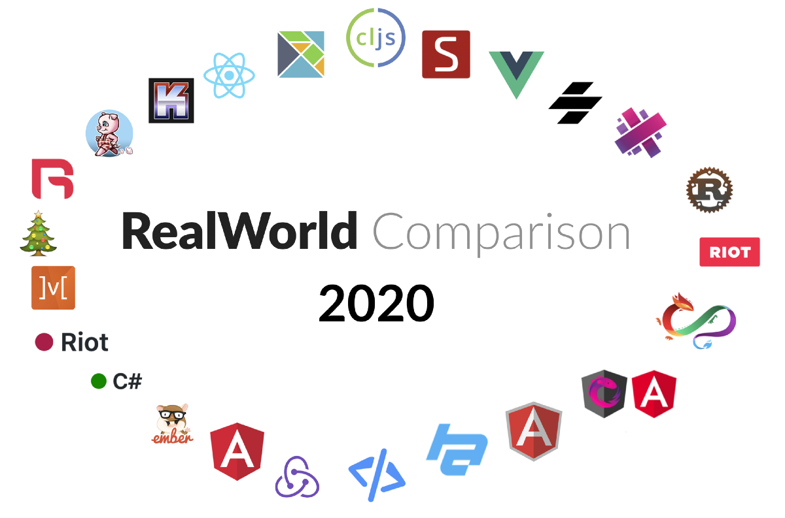
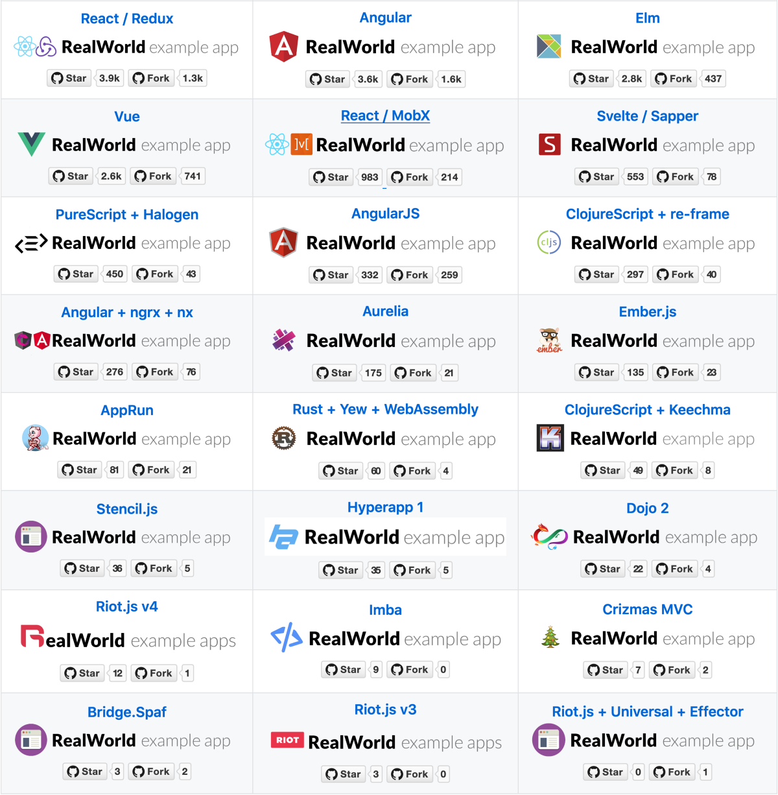

🎉学习ClojureScript和重新种植-视频教程🎉
## 学习ClojureScript并重新构图
### 我会学到什么？ 重点是ClojureScript和重新框架。 我们不会碰任何CSS。 甚至以为我们会使用样式...
# 常问问题
## ＃1为什么此比较中不包含框架X，Y和Z？

因为在RealWorld仓库中尚未完成实施。 考虑做出贡献！ 在您喜欢的选择的库/框架中实施该解决方案，我们下次将包括它！
## ＃2您为什么称其为现实世界？

因为它不只是一个待办事项应用程序。 在RealWorld中，我们并不是要比较薪水，维护，生产力，学习曲线等。还有其他一些调查可以回答其中的一些问题。 我们所说的RealWorld是一个连接到服务器，进行身份验证并允许用户CRUD的应用程序，就像真实世界中的应用程序一样。
## ＃3您为什么不包括我最喜欢的框架？

请参见上面的＃1，但以防万一，这里又来了：因为在RealWorld存储库中该实现尚未完成。 我并没有完成所有的实现-这是社区的努力。 如果您想在比较中看到您的框架，请考虑做出贡献。
## ＃4您包括哪个版本的库/框架？

在撰写本文时（2020年3月）可用。 该信息来自RealWorld回购。 我确定您可以在GitHub存储库中找到此内容。
## ＃5为什么您忘了包含一个比比较流行的框架？

同样，请参阅＃1和＃3。 在RealWorld存储库中，该实现尚未完成； 就这么简单。

如果您喜欢这篇文章，应该在Twitter上关注我。 我只写/推特有关编程和技术。
# 摘要

请记住，这并不是苹果之间的比较。 有些实现使用代码拆分，有些则没有。 其中有些托管在GitHub上，有些托管在Now上，有些托管在Netlify上。 您是否仍然想知道哪一个最好？ 我把它留给你。
# 指标3：代码行

使用cloc，我们可以计算每个存储库的src文件夹中的代码行数。 空白行和注释行不是此计算的一部分。 为什么这有意义？

如果调试是消除软件错误的过程，则编程必须是将其放入其中的过程— Edsger Dijkstra
## 基本原理

这说明给定库/框架/语言的简洁程度。 根据规范，您需要多少行代码才能实现几乎相同的应用程序（其中一些具有更多的功能）。

> # lines of code — fewer is better

## 备注

由于cloc无法处理.svelte文件，因此Svelte被跳过。

由于cloc无法处理.riot文件，因此跳过了riotjs-effector-universal-hot。

Angular + ngrx：使用/ libs文件夹完成的LoC计算仅包括.ts和.html文件。 如果您认为这是错误的，请告诉我什么是正确的数字以及如何计算。
## 结论

只有具有重新构架的Imba和ClojureScript才能在1000LoC下实施该应用程序。 Clojure以异常表达而著称。 Imba第一次出现在这里（去年是cloc，不知道.imba文件格式），看起来好像会保留下来。 如果您关心自己的LoC，那么您就会知道该怎么做。
# 指标2：大小

传输大小来自Chrome网络标签。 服务器提供的GZIPped响应标头以及响应正文。

这取决于框架的大小以及所添加的任何其他依赖项。 同样，构建构建工具可以很好地消除捆绑软件中未使用的代码。
## 基本原理

文件越小，下载速度越快，并且解析的次数也更少。

> Transfer size in KB — fewer is better

## 备注

由于缺少演示应用程序，因此跳过了PureScript。

Angular + ngrx + nx，请不要怪我Angular + ngrx + nx-检查Chrome开发工具网络标签，如果我算错了，请告诉我。

Rust + Yew + WebAssembly还包括.wasm文件
## 结论

Svelte和Stencil社区所做的惊人工作将其压缩到20KB以下，确实是一项成就。
# 指标1：效果

我们将检查Chrome随附的Lighthouse Audit的性能得分。 Lighthouse返回的性能得分在0到100之间。0是最低的得分。 有关更多详细信息，请参阅《灯塔计分指南》。
## 审核设置

> Lighthouse Audit Settings for all tested apps

## 基本原理

绘画得越早，某人可以做某事的越早，使用该应用程序的人的体验就越好。

> Performance (points 0–100) — higher is better.

## 备注

注意：由于缺少演示应用程序，因此跳过了PureScript。
## 结论

Lighthouse Audit没睡。 您可以在今年看到未维护/未更新的应用程序跌破90悬崖。 如果您的应用程序得分> 90，则可能不会有很大的不同。 也就是说，AppRun，Elm和Svelte确实令人印象深刻。

# 2020年前端框架的真实世界比较

我们再做一次。 这是2020年，还有2019年，2018年和2017年。

首先让我开始-绝对不是您应该为前端选择的比较。 它是对三个方面的比较小而相对简单的：性能，大小和非常相似的应用程序的代码行。

考虑到这一点，它是如何工作的：

我们正在比较RealWorld应用程序-不仅仅是“要做”的应用程序。 通常，“待办事项”没有传达足够的知识和观点来实际构建实际的应用程序。

它以某种方式标准化-一个符合某些规则的项目-有一个规范。 提供后端API，静态标记和样式。

由专家撰写或审查-一个一致的，真实世界的项目，理想情况下，该技术的专家应建立或审查。
# 我们正在比较哪些库/框架？

在撰写本文时，在RealWorld存储库中有24种Conduit实现。 是否有大量的追随者都没有关系。 唯一的条件是-它显示在RealWorld回购页面上。

# 我们看什么指标？

性能-此应用需要多长时间才能显示内容并变得可用？

大小-该应用程序有多大？ 我们将只比较已编译的JavaScript文件的大小。 HTML和CSS对所有变体都是通用的，并且是从CDN（内容交付网络）下载的。 所有技术都可以编译或转换为JavaScript，因此我们仅调整该文件的大小。

代码行-作者需要多少行代码才能基于规范创建RealWorld应用程序？ 公平地讲，某些应用程序有很多麻烦，但应该不会产生重大影响。 我们量化的唯一文件夹是每个应用程序中的src /。 无论它是自动生成的，都没关系-您仍然需要对其进行维护。
```
(本文翻译自Jacek Schae的文章《A RealWorld Comparison of Front-End Frameworks 2020》，参考：https://medium.com/dailyjs/a-realworld-comparison-of-front-end-frameworks-2020-4e50655fe4c1)
```
