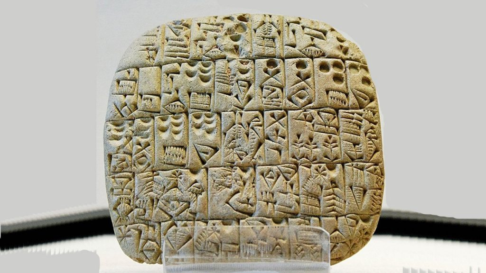
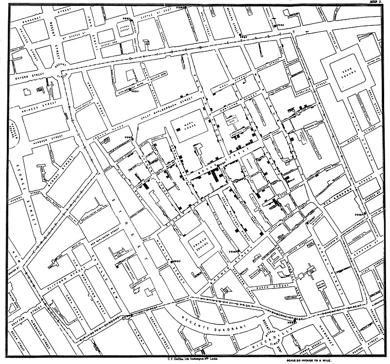
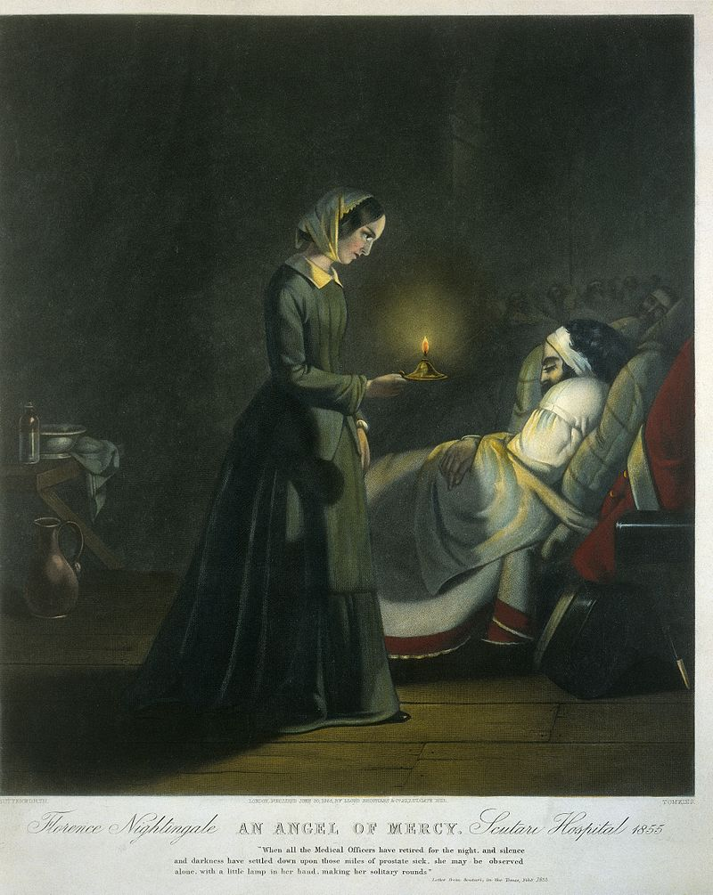
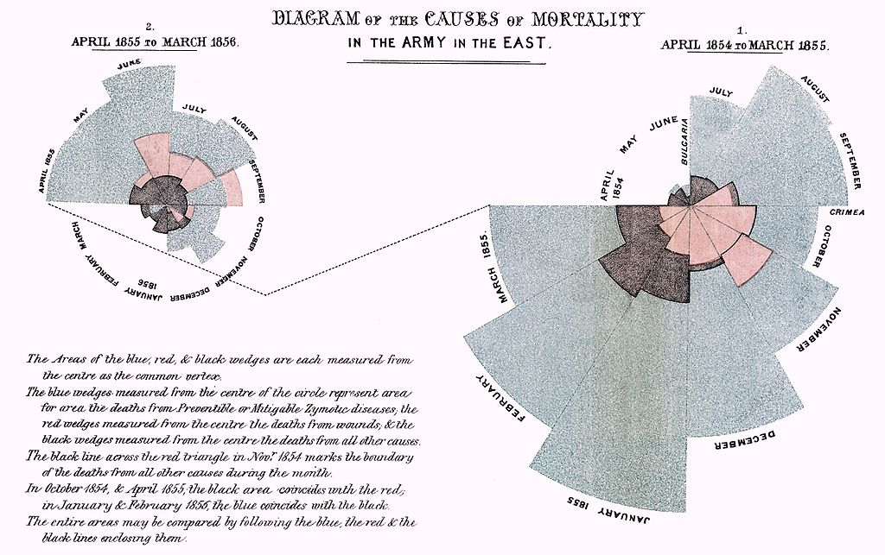
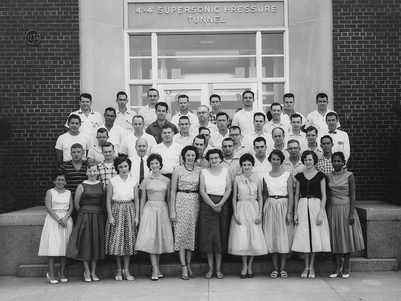
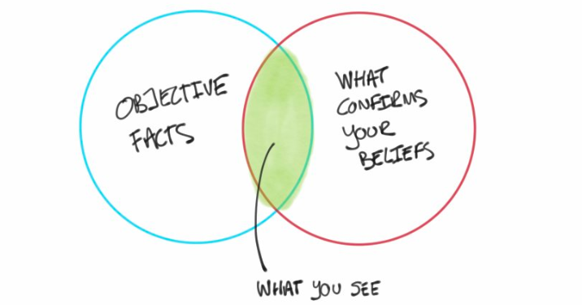
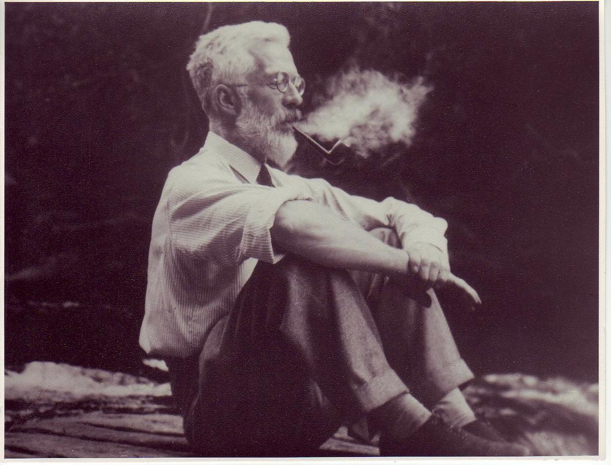
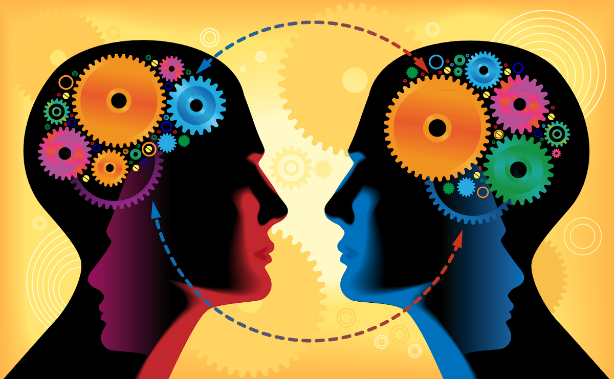

# AI =“自动灵感”
## 简要介绍数据科学的历史（和未来！）

（改编自我最初的《福布斯》人工智能文章。）

在19世纪，医生可能开出了汞用于治疗情绪波动，而砷则用于治疗哮喘。 在您进行手术之前，他们可能没有洗过手。 他们当然不是想杀了你-他们只是不知道而已。

这些早期的医生在笔记本上写有宝贵的数据，但每个人只能在一个巨大的拼图游戏中保留一张。 如果没有现代的工具来共享和分析信息，也没有科学的方法来理解这些数据，那么就没有什么可以阻止迷信取代通过可观察的事实的关键孔可以看到的东西了。

从那时起，人类在技术上已经走了很长一段路，但是今天的机器学习（ML）和人工智能（AI）的繁荣并不是过去的真正突破。 这是人类基本本能的延续，它使我们了解周围的世界，以便我们做出更明智的决策。 我们拥有比以往任何时候都更好的技术。

今天的AI繁荣并不是与过去的突破。 我们拥有比以往任何时候都更好的技术。

长期以来，这种模式的一种思考方式是数据集而不是数据点的革命。 差别并不小。 数据集帮助塑造了现代世界。
## 写作的发明

考虑一下Sumer（伊拉克现代）的抄写员，他们在5,000多年前就将其笔针压在粘土片上。 当他们这样做时，他们不仅发明了第一个书写系统，而且发明了第一个数据存储和共享技术。

> An example of the world’s first data storage and sharing technology, the clay tablet. You can’t fit much of your data on it and retrieval is a pain, literally (you’ll have to put your back into it).


如果您对AI超越人类的能力的承诺感到鼓舞，请考虑文具为我们带来了超人的记忆。 尽管今天写写作很容易，但是可靠地存储数据集的能力代表了迈向更高智能的第一步。

如果您对AI超越人类的能力的承诺感到鼓舞，请考虑文具为我们带来了超人的记忆。

不幸的是，从粘土片及其前电子表兄弟中检索信息是一件痛苦的事情。 您无法用手指指一本书来获取字数。 取而代之的是，您必须将每个单词上传到大脑中进行处理。 这使得早期的数据分析非常耗时，因此最初的尝试固守了基本要素。 尽管一个王国可以分析它从税收中筹集了多少黄金，但只有一个勇敢的人会在诸如医学之类的应用程序上尝试相同的费力推理，而数千年的传统鼓励这种情况。
## 分析的兴起

> Map by John Snow showing the clusters of cholera cases in the London epidemic of 1854.


幸运的是，我们的物种产生了一些不可思议的开拓者。 例如，约翰·斯诺（John Snow）在1858年伦敦霍乱爆发期间的死亡地图激发了医学界重新考虑这种疾病是由mi气（有毒空气）引起的迷信，并开始仔细研究饮用水。

> Florence Nightingale, Analyst (1820–1910)


如果您知道佛罗伦萨·南丁格尔（Florence Nightingale）的《戴灯的女人》，以她对护士的英勇同情，您可能会惊讶地发现她也是分析先驱。 在克里米亚战争期间，她极富创造力的信息图表将不良的卫生状况视为医院死亡的主要原因，并激发了她的政府对卫生的重视，从而挽救了许多生命。

> Polar area diagram invented by Florence Nightingale, showing the number of deaths that occurred from preventable diseases (in blue), those that were the results of wounds (in red), and those due to other causes (in black).


单数据集时代开始了，信息的价值开始在越来越多的领域中确立起来，从而导致了计算机的发明。 不，不是您今天习惯的电子伙伴。 “计算机”最初是人类的职业，其从业人员执行计算和手动处理数据以提取其价值。

> All of these people were computers! Photograph taken in the 1950s of the Supersonic Pressure Tunnel staff.


数据的优点在于，它使您可以凭空想出更好的意见。 通过查看信息，您可以跟随佛罗伦萨·南丁格尔和约翰·斯诺的足迹，提出新的问题。 这就是分析学科的全部内容：通过探索启发模型和假设。
## 分析的缺点

不幸的是，如果没有第二个数据集，您将无法知道您的这种以数据为灵感的观点是否废话。 它通常可以在您查看的特定数据点之外正常工作吗？ 您没有合法的认识方式。 欢迎使用1900年代的分析技术。

> Illustration by Paul J created for my article about confirmation bias in data-driven decision-making.


您无法相信自己的发现，因为您的潜意识偏见（例如确认偏见）使您大开眼界-您会立即看到最方便看到的内容，而您将错过所有其他内容。 您可能会认为自己已经看到了所有可以看到的东西，但实际上几乎没有刮擦表面。 人类的注意力范围和记忆力比我们想像的要小，因此探索性数据集通常是我们的狒狒陷阱。

分析是关于灵感和探索的，但超出所探索数据范围的观点不能被认真对待。

要测试您对数据之外的世界如何运作的看法，您不能一开始就使用能激发人们意见的数据。 我们的物种在薯片中发现了猫王的脸。 虽然该芯片看起来像猫王，但我们不能用它来推断大多数芯片都可以。 要了解我们的观点是否会受到启发他们的例子之外的重视，我们必须在我们从未见过的新芯片上对其进行测试。
# 从数据集到数据拆分

20世纪初，在不确定性下做出更好决策的愿望导致了并行行业的诞生：统计学。 统计人员可以帮助您测试行为是否明智，就好像某种现象也适用于您当前的数据集之外。

> Ronald A. Fisher, “The Father of Statistics” (1890–1962)


著名的例子来自罗纳德·费舍尔（Ronald A. Fisher），他开发了世界上第一本统计学教科书。 费舍尔（Fisher）描述了一项假设检验，以回应他朋友的说法，即无论饮水前后是在茶中添加牛奶，她都可以品尝。 为了证明她是错的，数据迫使他断定她可以。

严格的统计要求您在拍摄之前先进行拍照； 分析更像是事后的游戏。
## 阿喀琉斯之heel

分析和统计数据有一个致命的弱点：如果您使用相同的数据点进行假设生成和假设检验，那么您就是在作弊。 （阅读此书以了解原因。）如果您选择使用数据来代替严谨而不是灵感，那么您就必须从别处获得灵感。 经典消息来源在认真思考。 换句话说，您坐在扫帚壁橱里打坐，仔细思考一下统计问题，阐明所有假设，然后就可以测试世界上的心理模型是否真正积水了。

不幸的是，以数学方式测试您的直觉需要花费大量的精力和训练。 您需要相当的精神专注。 但是至少现在您拥有一种合法的方法来检查您的印象是否值得采取行动。 欢迎使用1900年代后期的统计数据。
## 数据集革命

严格的统计要求您在拍摄之前先进行拍照； 分析更像是事后的游戏。 这些学科在交通上几乎是不相容的，直到下一次重大革命（数据拆分）改变了一切。


数据拆分是一个简单的想法，但对像我这样的数据科学家来说，这是最深刻的想法之一。 如果只有一个数据集，则必须在分析（令人鼓舞的灵感）和统计信息（严格的结论）之间进行选择。 骇客？ 将您的数据集分为两部分，然后吃点蛋糕也吃！

两数据集时代用两个不同品种的数据专家之间的协作团队合作来取代分析统计的紧张关系。 分析师使用一个数据集来帮助您提出问题，然后统计学家使用另一个数据集来为您提供严格的答案。

将您的数据集分为两部分，然后吃点蛋糕也吃！

这样的奢侈品带有高昂的价格标签：数量。 如果您很难为一个可观的数据集收集足够的信息，那么说起来容易做起来难。 两数据集时代是一个相当新的发展，它与更好的处理硬件，更低的存储成本以及通过Internet共享收集的信息的能力紧密结合。

实际上，导致两数据集时代的技术创新迅速进入了下一阶段，即自动灵感的三数据集时代。 有一个更熟悉的词：机器学习。
## 一口气进行测试

曾经想过为什么在涉及严格性和数据性时，为什么统计学家倾向于倾向于抽搐呢？ 在计划问题之前先查看数据集会破坏其作为统计严谨性来源的纯度。 如果您问错了问题或愚蠢地提出了问题，那么您就不必第二次询问神谕了。

undefined

测试仍然是一针见血的提议-不允许您迭代地寻求解决方案。

为了使这种严格的方法有效，您必须预先计划，如果有多个问题，请使用一些道歉的数学运算，然后同时执行一次测试。 您不能多次打开该测试数据集。
## 第三数据集的奢华

既然您只有一个机会，您如何知道分析中最值得测试的“洞察力”？ 好吧，如果您有第三个数据集，则可以用它来激发您进行测试的灵感。 此筛选过程称为验证； 这是使机器学习成功的关键。

验证是使机器学习更上一层楼的核心-它使您可以自动激发灵感。

一旦您有空将所有内容扔到验证墙上，看看有什么问题，就可以放心地让每个人都提出解决方案：经验丰富的分析师，实习生，茶叶，甚至是与您的业务问题无关的算法 。 哪种解决方案在验证方面最有效，都将成为进行适当统计检验的候选者。 您刚刚授权自己可以自动化灵感！

> Image: source.

## AI =自动化灵感

这就是为什么机器学习是数据集的革命，而不仅仅是数据。 这取决于是否有足够的数据进行三路拆分。

人工智能（AI）在哪里适合？ 深度神经网络的机器学习在技术上被称为深度学习，但它又有一个绰号：人工智能。 尽管AI曾经有不同的含义，但今天您最有可能发现AI被用作深度学习的同义词。

深度神经网络在许多复杂任务上胜过不那么复杂的ML算法，因此赢得了炒作。 但是它们需要更多的数据来训练它们，并且处理要求超出了典型笔记本电脑的要求。 这就是为什么现代AI的兴起是云计算的故事； 云使您可以租用他人的数据中心，而不必致力于构建深度学习平台，从而使AI成为先试后买的命题。

现代AI的兴起是云的故事，因为云使AI成为先试后买的主张。

有了这个拼图，我们就可以拥有各种专业的补充：ML / AI，分析和统计。 涵盖所有这些术语的总称称为数据科学，即使数据有用的学科。
## 灵感的未来

现代数据科学是我们三数据集时代的产物，但是许多行业通常会生成足够多的数据。 那么是否有四个数据集的案例？

好吧，如果您刚刚训练的模型的验证分数很低，您的下一步行动是什么？ 如果您像大多数人一样，就会立即要求知道原因！ 不幸的是，您无法查询任何数据集。 您可能很想研究验证数据集，但是不幸的是，调试破坏了它有效筛选模型的能力。

通过对验证数据集进行分析，可以有效地将三个数据集变回两个。 您没有寻求帮助，而是不经意地回到了一个时代！

该解决方案不在您已经使用的三个数据集中。 要解锁更智能的训练迭代和超参数调整，您需要加入最前沿的技术：四个数据集的时代。

最前沿的是四路数据分割，以实现燃油加速。

如果您认为其他三个数据集为您提供了灵感，迭代和严格的测试，那么第四个可以加速，通过先进的分析技术缩短AI开发周期，该技术旨在提供有关每轮尝试方法的线索。 通过采用四向数据拆分，您将处于最佳位置，可以充分利用数据量！ 欢迎来到未来。
```
(本文翻译自Cassie Kozyrkov的文章《AI = “Automated Inspiration”》，参考：https://towardsdatascience.com/ai-automated-inspiration-75bff7b9481b)
```
