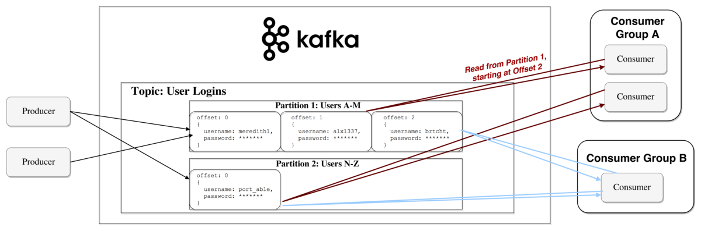
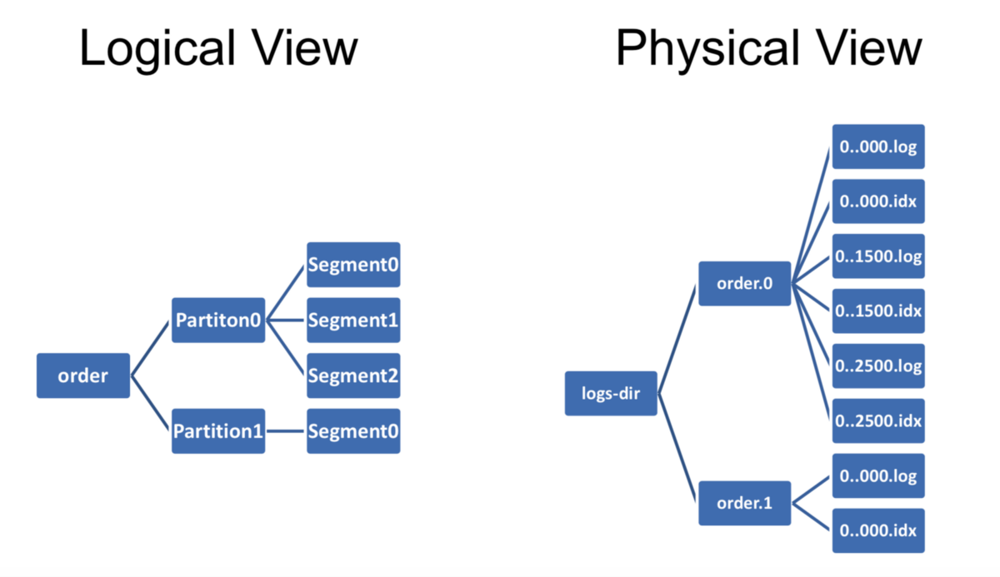
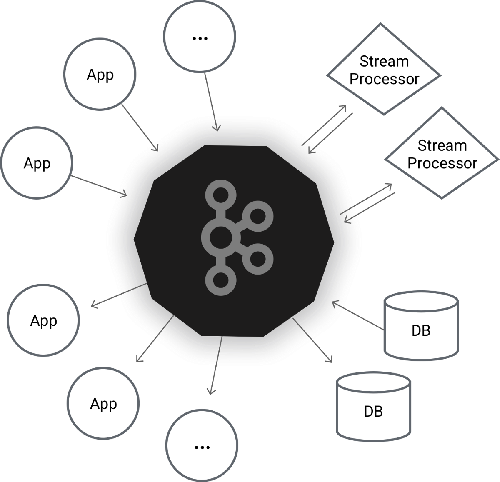
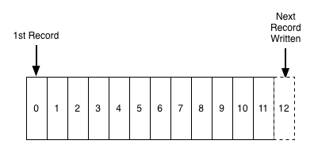
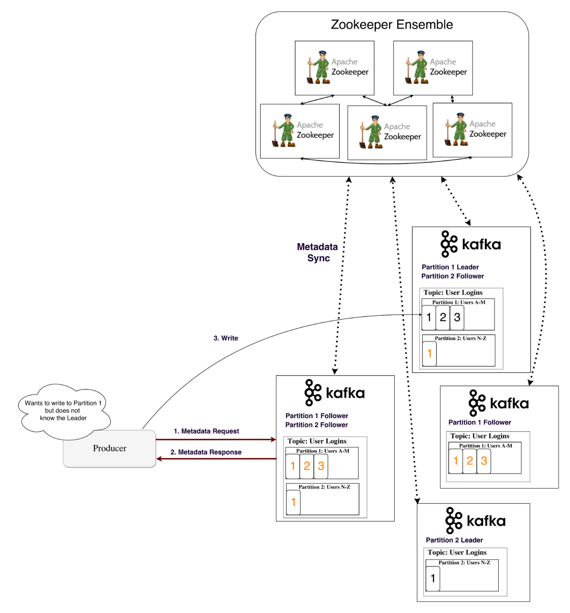

# 消费者如何检索消息？

消费者还以生产者通过查找元数据来写入消息的方式检索消息，并从领导者分区读取消息。 由于Kafka的速度非常快并且可以获取实时消息，因此单个消费者肯定会在从称为“消费者滞后”的主题中读取大量消息中存在延迟。

为了克服此问题，可以创建一个“消费方”组，该“消费方”组由多个具有相同组标识的消费者组成。 每个使用者都连接有一个唯一的分区，该分区在所有使用者之间平均分配。 将分区分配给特定的使用者是组协调员的责任-群集中的一个经纪人被提名担任此角色。 为了管理活动使用者列表，组中的所有使用者将他们的心跳发送到组协调器。 组中使用方的数量应小于或等于该特定主题中的分区的数量，违反条件将最终导致某个用户闲置的情况。
## 动手：
```
Creating a simple Consumer:bin/kafka-console-consumer.sh --bootstrap-server localhost:9091 --topic topic1Creating consumer to read from particular offset and partition:bin/kafka-console-consumer.sh --bootstrap-server localhost:9091 --topic topic1 --offset 0 --partition 1Creating a consumer group:bin/kafka-console-consumer.sh --bootstrap-server localhost:9091 --topic topic1 --group groupNameMultiple process/consumer of the above groupName can be created which is called Consumer Group.
```

一个以上的消费者可以同时阅读一个主题。 现在，为了记住特定读取的偏移量，提供了称为使用者偏移量的存储作为隐藏主题-__consumer_offsets，用于存储特定组的使用者读取的分区的最后偏移量。

消费者偏移的键为—> [组ID，主题，分区]和值—> [偏移，...]

> Consumer Group _ taken from here

## 使用者API：

与生产者API相似，Kafka提供了一些类来连接到引导服务器并获取消息。 传递标准数据类型以外的消息时，需要编写反序列化程序。

可以在以下位置找到针对生产者和消费者的Kafka Java API：https：//github.com/ercsonusharma/learnkafka
# Kafka如何快速？

Kafka遵循一定的策略，这是其设计的一部分，以使其性能更好，更快。
+ 无随机磁盘访问：它使用称为不可变队列的顺序数据结构，其中读写操作始终为恒定时间O（1）。 它在末尾附加消息，并从头开始或从特定偏移量读取。
+ 顺序I / O：现代操作系统将其大部分可用内存分配给磁盘缓存，并且更快地存储和检索顺序数据。
+ 零复制：由于根本没有修改磁盘数据，因此不必要地将它们加载到应用程序内存中。 因此，它不是将其加载到应用程序，而是通过套接字，NIC缓冲区和网络从内核上下文缓冲区发送相同的数据。
+ 消息的批处理：为了避免多次网络呼叫，将多个消息分组在一起。
+ 消息压缩：在通过网络传输消息之前，使用gzip，snappy等压缩算法对消息进行压缩，然后在使用者API层将其解压缩。
# 数据如何驻留在Broker实例/物理磁盘上？

在打开Kafka服务器之前，代理中的所有消息都存储在配置文件中配置的日志目录（log-dir-1）中。 在该目录中，可以找到包含特定主题分区的文件夹，格式为topic_name-partition_number，例如 主题1–0。 __consumer_offsets主题也存储在同一日志目录中。

> Physical Disk view


在特定主题的分区目录中，可以找到Kafka分段文件0000–00.log，索引文件0000–00.index和时间索引0000–00.timeindex。 当达到旧的段大小或时间限制时，会在创建新的段文件时将属于该分区的所有数据写入活动段中。 索引将每个偏移量映射到其消息在日志中的位置。 由于偏移量是顺序的，因此将二进制搜索应用于特定偏移量的日志文件中的数据索引。
# 记录压缩主题

重复键标记为要从段文件中删除。 可以通过将空值传递给特定键来更新和删除此处的值。

谢谢阅读！ 观看此空间以获取高级卡夫卡故事。 请也阅读我的其他故事。
# 深入了解Apache Kafka



在大数据时代，每秒（大量）的数据（量）都是从各种来源（如社交媒体，我当前正在写的博客，电子商务等）中生成的，这些数据存储在不同的平台上 在不同的模式（品种）。 为了执行任何ETL（提取，转换，加载）操作，需要一个消息传递/流传输系统，该系统应该是异步且松散耦合的，即来自各种源/客户端（如hdfs，Cassandra，RDBMS，应用程序日志文件等）的数据都可以。 可以在同一时间将其转储到一个位置，而无需所有客户端相互依赖。 解决该问题的方法之一是Kafka —一种由LinkedIn创建的开源分布式流平台，后来捐赠给了Apache。 它是用Scala编写的。
# 术语

消息：基本上是一个键值对，在值部分包含有用的数据/记录。

主题：对于多租户，可以创建多个主题，这些主题只是将消息发布和订阅到的源名称。

偏移量：消息以类似于提交日志的顺序形式存储，并且从0开始为每个消息提供顺序ID。

> Messages in a queue


代理：Kafka群集由代理组成，代理只是托管由Zookeeper维护的无状态服务器的群集中的节点。 由于这里没有主从概念，因此所有代理都是对等的。 在继续进行之前，让我们先了解一下动物园管理员。
# 什么是Zookeeper？为什么在Kafka Cluster中需要它？

Zookeeper是用于分布式集群管理的系统。 它是一个分布式键值存储。 对其进行了高度优化，但写入速度较慢。 它由称为集合的奇数个znode组成。 在卡夫卡，它需要用于：
+ 控制器选举：针对特定主题的分区中的所有读取和写入均通过副本的领导者进行。 每当领导者下台时，动物园管理员都会选举新的领导者。
+ 主题配置：与某个主题相关的元数据，即某个特定主题是否位于代理中，存在多少分区等，存储在Zookeeper端，并在产生消息时不断保持同步。
+ 主题的访问控制列表（ACL）由动物园管理员维护。
# 为什么选择卡夫卡？

Kafka的一些关键功能（这是传统消息传递系统所面临的挑战）使其更加流行：
+ 高吞吐量：吞吐量表示每秒可以处理的消息数（消息速率）。 由于我们可以划分可分布在不同代理之间的主题，因此每秒可以实现数千次读写。
+ 分布式：分布式系统是指被分成多个运行中的计算机的系统，所有这些计算机在一个群集中一起工作，以显示为最终用户的单个节点。 当Kafka在几个称为“代理”的节点上存储，读取和写入数据时，就进行了分布。该代理与Zookeeper共同创建了一个称为“ Kafka群集”的生态系统。
+ 持久性：消息队列完全保留在磁盘上，而不是保留在内存中，并且可以在不同节点上存储相同数据的多个副本/副本，称为ISR（同步副本）。 因此，由于故障转移方案而导致数据丢失的可能性不大，并且使其具有持久性。
+ 可扩展性：任何系统都可以水平或垂直扩展。 垂直可伸缩性意味着将更多资源（如CPU，内存）添加到相同的节点，并导致较高的运营成本。 通过简单地在集群中添加更多的节点就可以实现水平可伸缩性，从而增加了容量需求。 Kafka水平扩展意味着每当我们用完容量/空间不足时，就可以在集群中添加新的节点/代理。
+ 容错：如果我们有n个主题，每个主题有m个分区，那么如果我们将复制因子设置为q，则所有n * m个分区都将在q个代理上被复制。 因此，将其容忍为q-1的因子，即我们可以承受q-1代理节点的故障。 复制因子应始终小于或等于代理数量，因为违反此条件将最终在单个代理上具有同一副本的两个副本，这是没有意义的。

注意：默认情况下，Kafka保证至少一次传送，并允许用户通过在生产者上禁用重试并在处理一批消息之前提交其偏移量来最多实施一次传送。
## 动手：

您可以从以下网址下载Kafka scala库：http://kafka.apache.org/downloads，其中也包含zookeeper。

提取zip后，假设HOME_DIR = kafka_2.12–2.3.0 /

首先，我们需要通过在HOME_DIR / config / zookeeper.properties中提供dataDir名称和端口来打开Zookeeper。

./bin/zookeeper-server-start.sh ../config/zookeeper.properties

默认情况下，Zookeeper将在2181端口上启动并运行。 现在，我们需要启动Kafka服务器。 该脚本位于bin文件夹中。 与服务器相关的配置可以在HOME_DIR / config / server.properties中进行。 让我们做

broker.id = 101侦听器= PLAINTEXT：localhost：9091logldirs = some_log_dir / kafka-logs-1

./bin/kafka-servert-start.sh ../config/server.properties

这将在端口9091处启动Kafka服务器。
```
Creating a topic:bin/kafka-topics.sh --create --zookeeper localhost:2181 --replication-factor 3 partitions 1 --topic topic1Describing a particular topic:bin/kafka-topics.sh --describe --zookeeper localhost:2181 --topic topic1Deleting a topic:bin/kafka-topics.sh --delete --zookeeper localhost:2181 --topic topic1
```

注意：一旦设置为特定值，分区将无法减少，只能增加。
# 生产者如何编写消息？

生产者首先获取主题的元数据，以便知道需要使用消息更新哪个代理。 元数据也存储在代理中，并且与动物园管理员保持连续同步，因为动物园管理员节点通常比No节点少得多。 经纪人。 因此，许多生产者想连接到Zookeeper来访问元数据，并且性能降低。 现在，一旦生产者获取了有关主题和分区的元数据，它将消息写入领导者经纪人节点的日志中，而关注者（ISR）将其复制。

> Getting metadata info — source


此写入操作可以是同步的[即 仅当关注者还在其日志中复制该消息时]或异步[即， 只用新消息更新领导者，状态发送给生产者]。 保留期限：磁盘上的消息可以保留特定的持续时间，称为保留期限，在此期限之后，将自动清除旧消息，并且不再可供使用。 默认情况下，设置为7天。

可以通过三种策略将消息写到主题：

一种。 send（key，value，topic，partition）：专门提供需要进行写操作的分区。 不建议使用此方法，因为它可能会导致分区大小不平衡。

b。 send（key，value，topic）：在这里，默认的HashPartitioner用于确定要写入消息的分区，方法是查找key的哈希并以no取mod。 该主题的分区。 也可以编写我们自己的自定义分区程序。

C。 send（key = null，value，topic）：在这种情况下，消息以循环方式存储在所有分区中。
## 动手：
```
Creating a console producer:bin/kafka-console-producer.sh --broker-list localhost:9091 --topic topic1Changing retention period for a topic to 10sec:bin/kafka-configs.sh --zookeeper localhost:2181 --alter --entity-type topics --entity-name topic1 --add-config retention.ms=10000
```

生产者可以批量发送消息以提高效率。 批次达到特定大小限制后，将其一次转储到队列中。 但是，偏移量仅对所有单个消息而言是连续的，并且在将其传递给使用者API之前在使用者端进行缩小。
## 生产者API：

Kafka生产者是可以充当Kafka集群中数据源的应用程序。 生产者可以使用Kafka jar文件/依赖项提供的API将消息发布到一个或多个Kafka主题。 在发送消息之前，需要设置包含存储消息配置的属性对象。 主类ProducerRecord，KafkaProducer，Callback。

示例API：
```
Producer<String, String> producer = new KafkaProducer <>(createProperties());

        ProducerRecord<String, String> record = new
            ProducerRecord<>(TOPIC_NAME, "SyncKey", "SyncMessage");

        try {
            RecordMetadata recordMetadata = producer.send(record).get();
            System.out.println("Message is sent to Partition no " +
                recordMetadata.partition() + " and offset " + recordMetadata.offset());

        } catch (Exception e) {
            System.out.println("Exception--> "+ e);
        } finally{
            producer.close();
        }

    }
    private static Properties createProperties() {
        Properties properties = new Properties();
        properties.put("bootstrap.servers", "localhost:9091,localhost:9092");
        properties.put("key.serializer","org.apache.kafka.common.serialization.StringSerializer");
        properties.put("value.serializer", "org.apache.kafka.common.serialization.StringSerializer");
        return properties;

    }
```
```
(本文翻译自Sonu Sharma的文章《Apache Kafka in Depth》，参考：https://medium.com/@sonusharma.mnnit/apache-kafka-in-depth-49aae1e844be)
```
