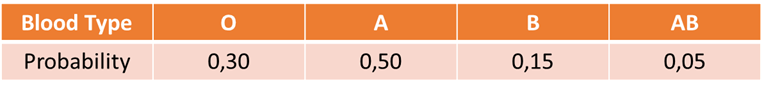
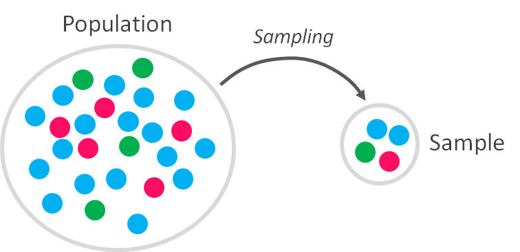
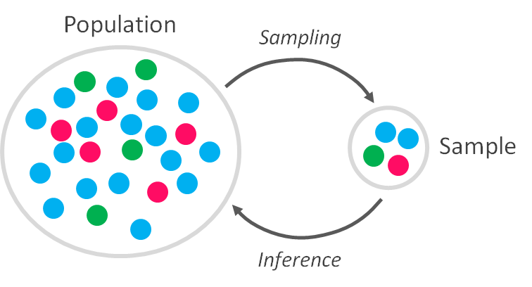

对这些主题感兴趣？ 在Linkedin或Twitter上关注我
# 概率分布之前
## 为什么我们使用概率分布，为什么它们如此重要？

> Photo by Mel Poole on Unsplash


我决定写这篇关于概率分布的介绍时，要牢记一个明确的目的：解释为什么要使用它们，并应用现实生活中的例子。 在学习概率时，我厌倦了听到抛硬币，玩纸牌游戏和编号球的知识。 除非您只喜欢赌博（这不是我的情况），否则您需要变得非常务实，应用有关概率的概念来解决其他问题，而不是中奖的几率。 但是，在进入实用主义之前（这将是我们的第一个冲突），我们需要研究一些概念性问题。 本文介绍了我们为什么关心概率，并将帮助您开发一些关键术语，我们将需要了解这些术语才能将其应用于现实生活中的问题。

什么是概率，为什么我们还要关心？

概率是关于解释和理解生活中的随机事件，并且由于我们生活在绝对随机性中（即使我们试图相信自己没有），所以它的用途变得非常明显。 概率是从某种随机过程中产生某种结果的长期机会。 它基本上告诉您不同类型事件的发生频率。

现实生活中使用概率的一些示例是：
+ 财务：通过估算给定金融资产落入或落在特定范围内的可能性，可以制定交易策略以捕获预期的结果。
+ 天气预报：气象学家无法确切预测天气会怎样，因此他们使用工具和仪器来确定下雨，下雪或冰雹的可能性。 他们还检查历史数据库，以估计当天或一周中的高温和低温以及可能的天气模式。
+ 保险：概率在分析保险政策以确定最适合客户的计划以及他们需要的可扣除金额方面起着重要作用。
+ 体育：运动员和教练使用概率来确定比赛和比赛的最佳体育策略。 像BWin这样的公司已经利用这个优势开展业务，您甚至可以使用不同的策略下注。
+ 广告：概率用于根据潜在客户估算其消费模式，从而更可能对特定活动做出积极反应。

从数字上讲，概率是一个数字，范围是0（表示事件不会发生）到1（表示事件肯定会发生），如果您采用所有可能的结果并将它们加起来 ，您的总和为1。概率值越大，事件发生的可能性就越大。

因此，举例来说，您说明天下雨的概率是40％（表示为“ P（rain）= 0,4”），或者在特定区域内发生盗车的概率是2％（定义为“ P（盗车）= 0,02”）。 在第一种情况下，您对变量“ rain”感兴趣，而在第二种情况下，您对变量“ car盗窃”感兴趣。 这些变量以及由随机过程导致的其他任何变量都称为“随机变量”。

随机变量是易于随机变化的变量，因此它可以具有多个不同的值，每个值都有关联的概率。

它没有特定的值，而是潜在值的集合。 在进行测量并显示了特定值之后，随机变量不再是随机变量，而是成为数据。

当尝试估计它们时，不同的概率呈现出不同的复杂性。 通常，将过去的数据用作可能发生的情况的替代方法，但这并不总是适用（例如，对于没有历史记录的新事件），或者在极端事件发生时可能会产生误导：考虑一下2011年的福岛事故， 海啸的高度被低估了，因为概率计算得出的地震比实际发生的地震小得多。 还有多种计算概率的方法（例如，使用计算机模拟或收集数据并计算事件发生的时间百分比），但是所有这些方法都与用于馈送它们的数据一样好。
# 概率分布

概率分布是一个随机变量的所有可能结果及其对应的概率值的列表。 概率分布将随机变量或过程的每个结果与其出现的概率联系起来。 例如，如果您在给定位置采集来自不同个体的血液样本，则可以计算其血液类型的概率分布：


您在这里所做的是计算具有不同血型的个体数，然后将每个血型组除以个体总数。 这样，您就可以得出每种血型的概率。

在这种情况下，血型是随机变量。 概率分布显示，与“ AB”血型的人相比，血型“ A”的人的发生概率最高。 同样，如果您总结不同的概率，则得到1。如何做到这一点？ 简单：定义要分析的随机变量（在此示例中为“血液类型”），设置要计数的类别（“ O”，“ A”，“ B”和“ AB”），然后 计算每个类别中的出现次数。 然后，您可以使用该绝对数（例如150例血液类型为“ A”的病例），或者将其除以病例总数（如我们的示例一样，将其占总数的百分比）。

但是这里有一个窍门。 当您估算随机变量（例如血液类型或其他类型）的概率分布时，实际上您正在使用的数据仅代表您正在分析的随机变量的实际行为的一部分。 您没有查看所有可能的数据值（以概率术语定义为“人口”），因为您只是在给定的时间点和时间范围内从其中的一个子集（称为“样本”）获取了数据。 空间。

> A sample is a subset of a population


由于随机变量的值在被分析的上下文中发生变化，因此，每次计算结果的概率时，都需要获取一部分数据（抽样），并且由于您是在特定条件下执行此操作的，因此 这意味着，如果将来再次重复分析，您可能会得到不同的结果（由于可变的随机性）。 今天，某些价值观会比其他价值观更有可能，但另一些价值观可能会在另一个时代出现。 这样，样本就代表了我们要分析的总体，但绝不会与之完全相同。

如果我们可以随时随地测量我们感兴趣的随机变量的所有可能结果并捕获其真实行为该怎么办？

我的回答是，如果您能做到，那么您的问题就解决了：您可以绝对确定地计算所有结果的概率分布，了解您感兴趣的随机变量的行为，甚至可以更好地预测它。 不过，在大多数情况下（如果不是始终如此），要获取您感兴趣的全部数据将非常昂贵（有时甚至是不可能）。

举个例子：假设我们对2.000名成年人进行了一项调查，以估算在德国（+8000万个栖息地）赞成死刑的成年人所占的百分比。 如果我们得到60％（1.200）的受访者的青睐，我们是否可以得出结论，即60％的德国人的想法相同？ 明显不是。 我们需要使用概率（和统计）工具从我们的样本中得出结论，或者获取全部数据，而忽略那些烦人的概率概念。 好吧，您能想象调查8000万人吗？

如果结果有限且随机行为是随机的，如何描述正在分析的随机变量的真实行为？

好的，现在我们知道我们要根据分析中发现的结果得出关于随机变量（不仅在样本中，而且在样本外）的“真实行为”的可靠结论。 限于我们可以得到的样本）。 有没有办法以具有代表性的方式概括这些结果？

答案是肯定的，这种概括是预测的秘密。 如果您可以将样本中特定随机变量的结果推广到总体，那么您可以预测这些随机变量的行为。
# 预测的力量

有概率分布模型可以帮助您预测特定情况下的结果。 当满足某些条件时，这些概率分布模型可以帮助您计算每个结果概率，长期平均结果并估计随机变量结果的变异性，而无需获得您的所有随机变量的实际结果 有兴趣。

这意味着有一种方法可以将对随机变量的有限分析的结果推广到更广泛的行为，这将帮助您节省时间，金钱并获得更加自信的结果。 针对不同情况存在大量的概率分布模型，关键是您必须选择适合数据的正确模型，并帮助您解释要理解的内容。

简而言之，概率分布模型是用于拟合随机变量以概括其行为的指南。 这些模型具有数学背景，并且可能非常挑剔。 为了使它们正常工作，您要适应的随机变量必须满足不同的假设，以使模型的结果具有正确的概率，并且还可以针对随机变量中的真实数据测试和验证模型。
## 随机变量的类型

到目前为止，我们一直在谈论随机变量，但是随机变量的类型有所不同。 嗯……有趣，但是我们为什么要关心它？ 由于在定义应选择哪种概率分布模型时，随机变量的类型是关键参数。

随机变量有2种主要类型：
+ 离散随机变量：具有有限或可能数量的可能结果的变量。 您可以通过计数来计算其值。

例如，考虑“给定年份某地方的出生人数”。 这是一个离散的随机变量，因为结果可能是0,1,2…999或任何其他值。 您可以通过计数获得变量的值。 在离散随机变量中，如果您选择任意两个连续的结果，那么您将不会获得介于两者之间的结果。
+ 连续随机变量：具有无法计数的无限数量的可能值。 您可以通过测量来计算其值。

考虑“算法运行任务所花费的时间”。 时间通常会四舍五入为方便的时间间隔，例如秒或毫秒，但事实是，这实际上是一个连续的过程：可能需要1.6666666秒才能运行。 重量，温度，价格都是连续的随机变量。

用概率术语来说，离散和连续随机变量是应该完全分开对待的2个不同的生物，并且每个生物都有不同的概率分布模型。 这意味着，如果您要处理离散随机变量（例如，给定区域中房主的手机数量），则需要选择一种处理离散随机变量的概率分布模型（不能选择处理随机变量的概率分布模型）。 仅具有连续随机变量）。
# 统计跳舞

概率与统计密切相关。 实际上，它们是如此紧密地联系在一起，以至于几乎不可能在不提及另一个的情况下谈论它们。 将统计应用于数据集以确定表征它们的因素或属性，以便获取有关它们的信息：这是一门与定量数据的收集和解释有关的学科，它与概率混合在一起，使我们有可能对 结果。

统计是一种数字量度，用于描述数据的某些属性，无论您相信与否，我们每天都在使用它们。 例如，当您检查足球运动员的平均得分率（以统计术语称为“均值”）或给定时期内您国家/地区最受欢迎的新生男孩名字（以统计术语称为“众数”）时， 您正在使用统计信息。

仅描述数据的统计信息部分称为“描述性统计信息”，而允许您进行预测的统计信息部分称为“推论统计信息”。

均值，众数，中位数，方差，标准差，这些是可以用来描述数据的一些统计信息，就像概率一样，除非您可以访问所有可用数据（总体），否则“统计信息”始终是 从样本中获得：如果可以从总体中获得，则将其称为“参数”。 根据这些信息，可以建立预测模型并确定在实际实现结果之前确定某些结果的可能性。 这样，您可以使用统计信息来计算出特定事件发生的可能性。

例如，如果您想知道假日飞机坠毁的几率（以黑色为例，很抱歉），您可以考虑一下一年内通常有几架飞机坠毁，并且由于该数目很小，您可以推断出该概率 飞机坠毁的事故也很小。 在这里，您实际上是通过计算某些参数来应用统计信息，例如被压碎的飞机数除以飞行总数。 或者，您可以使用统计数据（例如，从给定城镇中的女性数据样本中得出）来推断出生活在较大城市（如城市）中的更大数量的女性（年龄范围相似）。

再次，我们这样做是因为估计或推断参数比处理现实生活更容易。 我们需要统计数据来描述我们的可用数据，理解它，然后将其与概率混合在一起，以猜测“真实”（不可用）数据的行为。

这是因为从观察值计算得出的统计数据是可观察的，而作为抽象的总体参数则不可观察，必须进行估计（除非您可以完全访问它）。

> A population parameter can be estimated from a sample (inference)


那么，我们如何推断呢？

可以使用统计信息和概率以不同方式估算随机变量的可能结果：
+ 计算一个随机变量的单个结果的值（如股票价格均值的精确值），称为点估计。
+ 估计一个随机变量的可能结果的间隔或范围（例如股票价格均值的不同值），称为间隔估计。
+ 通过使用统计方法确认或拒绝该语句来测试语句（相对于总体参数）的有效性。 该陈述称为假设，为此目的使用的统计检验称为统计假设检验。

这些方法依赖于概率分布的概念，因为您需要使用概率分布模型进行推断并归纳结论。
# 最后的想法

概率分布有助于对我们的世界进行建模，使我们能够获得对特定事件可能发生的概率的估计，或估计事件的可变性。 它们是描述并可能预测事件概率的常用方法。

主要挑战是定义我们要描述其行为的变量的特征，因为有必要确定应将哪种分布应用于特定过程的模型。

正确分布的标识将允许正确应用模型（例如，标准化正态分布），该模型可以轻松预测给定事件的概率。
```
(本文翻译自Diego Lopez Yse的文章《Before Probability Distributions》，参考：https://towardsdatascience.com/before-probability-distributions-d8a2f36b1cb)
```
