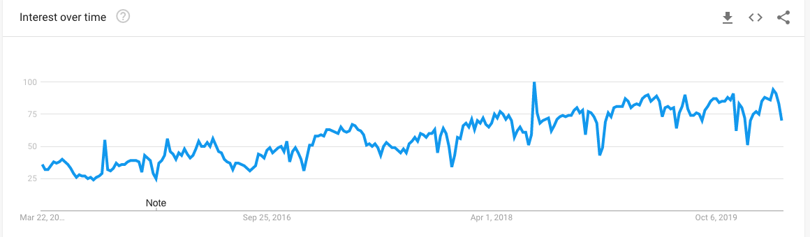
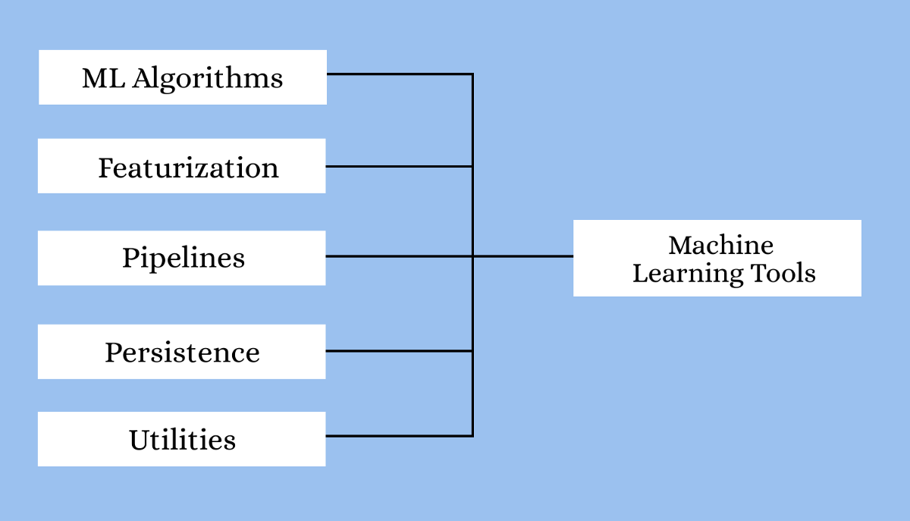

关于作者

Claire D.是Digitalogy的内容策划和营销人员，Digitalogy是一个技术采购和定制配对市场，可根据人们在全球的特定需求，将人们与预先筛选和顶尖的开发商和设计师联系起来。 在Linkedin，Twitter，Instagram上与Digitalogy联系。
# 更有趣的读物—

希望本文对您有所帮助！ 以下是一些有趣的读物，希望您也喜欢它们-
## 适用于所有人的顶级Google AI工具
### 借助Google AI Hub将创意变为现实
## 2020年AI工程师的顶级编程语言
### AI工程师和科学家可以从多种编程语言中选择适合其需求的语言。
## 可解释机器学习的Python库
### 4个库，可以更好地可视化，解释和解释模型
## 数据科学十大Python库
### 为您的数据科学探索提供一些很棒的帮助！
# 机器学习和深度学习的最佳Python库

尽管有很多语言可供选择，但是Python是对开发人员最友好的机器学习和深度学习编程语言之一，并且它具有广泛的库支持，可满足您的每个用例和项目。

> Best Python Libraries for Machine Learning (source)

# ●TensorFlow

革命就在这里！ 欢迎使用TensorFlow 2.0。

TensorFlow是一个用于研究和生产的快速，灵活，可扩展的开源机器学习库。

TensorFlow是可用于在Python上进行机器学习的最佳库之一。 由Google提供的TensorFlow使初学者和专业人士都可以轻松构建ML模型。

使用TensorFlow，您可以使用TensorFlow Lite和TensorFlow Serving在移动平台和高性能服务器上提供相同的好处，不仅可以在计算机上，而且可以在移动设备和服务器上创建和训练ML模型。

> TensorBoard(source)


TensorFlow引人注目的ML和DL中的一些重要领域是：

●处理深度神经网络

●自然语言处理

●偏微分方程

●抽象能力

●图像，文本和语音识别

●轻松协作的想法和代码

核心任务：构建深度学习模型

要了解如何在TensorFlow中完成特定任务，可以参考TensorFlow教程。
# ●凯拉斯

Keras是Python最受欢迎的开源神经网络库之一。 Keras最初由Google工程师为ONEIROS设计，是开放式神经电子智能机器人操作系统的缩写，很快就在TensorFlow的核心库中得到支持，从而使其可在TensorFlow上访问。 Keras具有创建神经网络所需的一些构造块和工具，例如：

●神经层

●激活和费用功能

●目标

●批量归一化

●辍学

●合并

> Keras Snippet(source)


Keras通过ML和DL编程的这些附加功能扩展了TensorFlow的可用性。 借助有用的社区和专用的Slack渠道，轻松获得支持。 对卷积神经网络和递归神经网络的支持也与标准神经网络一起存在。 您还可以参考斯坦福大学Keras和Computer Vision类中的其他示例模型。

Keras备忘单：https://s3.amazonaws.com/assets.datacamp.com/blog_assets/Keras_Cheat_Sheet_Python.pdf

核心任务：构建深度学习模型

Keras入门-
# ●PyTorch

由Facebook开发的PyTorch是为数不多的Python机器学习库之一。 除了Python之外，PyTorch还通过其C ++接口支持C ++。 作为最佳的机器学习和深度学习框架，PyTorch被认为是最佳竞争者之一，它面临着TensorFlow的竞争。 您可以参考PyTorch教程以了解其他详细信息。

> Basic PyTorch Workflow(source)


使PyTorch与TensorFlow脱颖而出的一些重要功能包括：

●具有通过图形处理单元加速处理能力的张量计算

●易于学习，使用并与Python生态系统的其余部分集成

●支持在基于磁带的自动差异系统上构建的神经网络

PyTorch随附的各种模块可帮助创建和训练神经网络：

●张量—火炬。张量

> Introduction to Pytorch Tensor(source)


●优化器— torch.optim模块

●神经网络— nn模块

●Autograd

优点：非常可定制，广泛用于深度学习研究

缺点：较少的NLP抽象，未针对速度进行优化

核心任务：开发和训练深度学习模型
## Keras对Tensorflow对PyTorch | 深度学习框架比较
# ●Scikit学习

Scikit-learn是另一个活跃使用的Python机器学习库。 它包括与不同的ML编程库（如NumPy和Pandas）的轻松集成。 Scikit-learn附带各种算法的支持，例如：

●分类

●回归

●聚类

●降维

●选型

●预处理

Scikit-learn围绕易于使用但仍具有灵活性的思想而构建，它专注于数据建模，而不关注其他任务，例如数据的加载，处理，操纵和可视化。 从研究阶段到部署，它足以用作端到端ML。 为了更深入地了解scikit-learn，可以查看Scikit-learn教程。

核心任务：建模

学习Scikit-学习-
# ●熊猫

Pandas是一个Python数据分析库，主要用于数据处理和分析。 它在数据集准备训练之前就起作用了。 熊猫使机器学习程序员无需费时地处理时间序列和结构化的多维数据。 熊猫在处理数据方面的一些出色功能包括：

●数据集的重塑和透视

●合并和合并数据集

●处理缺失数据和数据对齐

●各种索引选项，例如分层轴索引，花式索引

●数据过滤选项

> Pandas snippet(source)


熊猫使用DataFrames，这只是通过向程序员提供DataFrame对象来表示数据的二维表示的技术术语。

核心任务：数据处理和分析

Google趋势-随时间变化的熊猫兴趣

> Google trends pandas(source)

# ●NLTK

NLTK代表自然语言工具包，是用于自然语言处理的Python库。 它被认为是使用人类语言数据的最受欢迎的图书馆之一。 NLTK为程序员提供了简单的接口以及大量的词汇资源，例如FrameNet，WordNet，Word2Vec和其他几种。 NLTK的一些亮点是：

●搜索文档中的关键字

●文本的标记化和分类

●语音和手写识别

●单词的去词和词干

> NLTK snippet(source)


对于学生，工程师，研究人员，语言学家和使用语言的行业，NLTK及其软件包套件被认为是可靠的选择。

核心任务：文本处理
# ●Spark MLlib

MLlib是Apache Spark的可扩展机器学习库

Spark MLlib由Apache开发，是一个机器学习库，可轻松缩放计算。 它易于使用，快速，易于设置，并且可以与其他工具顺利集成。 Spark MLlib立即成为开发机器学习算法和应用程序的便捷工具。

Spark MLlib带到表中的工具是：

> Spark Mllib Machine Learning Tools


使用Spark MLlib进行机器学习的程序员可以利用的一些流行算法和API是：

●回归

●聚类

●优化

●尺寸缩减

●分类

●基本统计

●特征提取
# ●Theano

Theano是一个功能强大的Python库，可轻松定义，优化和评估功能强大的数学表达式。 使Theano成为进行大规模科学计算的强大库的一些功能包括：

●与GPU相比，支持GPU在重型计算中表现更好

●与NumPy的强大集成支持

●对最棘手的变量进行更快，更稳定的评估

●能够为您的数学运算创建自定义C代码

使用Theano，您可以快速开发一些最高效的机器学习算法。 在Theano之上构建的是一些著名的深度学习库，例如Keras，Blocks和Lasagne。 有关Theano中更高级的概念，您可以参考Theano教程。
# ●MXNet

灵活高效的深度学习库

> MXnet — A flexible and efficient library for deep learning


如果您的专业领域包括深度学习，那么您将发现MXNet非常适合。 MXNet用于训练和部署深度神经网络，具有高度可扩展性，并支持快速模型训练。 Apache的MXNet不仅可以使用Python，而且还可以使用其他多种语言，包括C ++，Perl，Julia，R，Scala，Go等。

MXNet的可移植性和可伸缩性使您可以从一个平台迁移到另一个平台，并根据项目的苛刻需求进行扩展。 科技和教育领域的一些知名企业，例如英特尔，微软，麻省理工学院等，目前都支持MXNet。 亚马逊的AWS首选MXNet作为首选的深度学习框架。
# ●脾气暴躁

> The Numpy library


适用于Python的NumPy库专注于处理大量的多维数据以及对数据进行操作的复杂数学函数。 NumPy可以快速计算和执行处理数组上的复杂函数。 支持NumPy的观点很少：

●支持数学和逻辑运算

●形状处理

●排序和选择功能

●离散傅立叶变换

●基本的线性代数和统计运算

●随机模拟

●支持n维数组

NumPy致力于一种面向对象的方法，并且具有用于集成C，C ++和Fortran代码的工具，这使NumPy在科学界中非常受欢迎。

核心任务：数据清理和处理

Google趋势-随着时间的流逝，人们兴趣浓厚

> Google trends Numpy(source)

# 结论

Python是真正出色的开发工具，它不仅可以用作通用编程语言，还可以满足项目或工作流的特定需求。 大量的库和程序包扩展了Python的功能，使其全面发展，非常适合希望开发程序和算法的任何人。 上面已简要讨论了一些适用于Python的现代机器学习和深度学习库，您可以对这些库各自提供的内容有所了解。
# 为什么Python是机器学习和AI的首选？

作为机器学习的首选语言，Python似乎正在赢得一场战斗。 库和开放源代码工具的可用性使其成为开发ML模型的理想选择。

长期以来，Python一直是机器学习和人工智能开发人员的首选。 Python为开发人员提供了一些最佳的灵活性和功能，这些功能不仅提高了生产力，而且还提高了代码质量，更不用说广泛的库有助于减轻工作量。 下面列出了将Python列为机器学习，深度学习和人工智能的顶级编程语言的各种功能：

●自由和开放源代码的性质使其对社区友好，并保证长期改进

●详尽的资料库可确保为每个现有问题提供解决方案

●流畅的实施和集成，使技能水平各异的人都可以轻松地适应它

●通过减少编码和调试时间来提高生产率

●还可用于软计算，自然语言处理

●与C和C ++代码模块无缝协作

Python是您仍然可以阅读的最强大的语言。-Pau Dubois
# 机器学习和深度学习的最佳Python库
## 适用于现代机器学习模型和项目的Python库

> Best Python Libraries for Machine Learning and Deep Learning


“机器学习的突破将使十个微软值得。”-比尔·盖茨

随着AI行业的发展，机器学习和深度学习近来一直在增长，并且这项技术的早期采用者开始看到它硕果累累。 随着越来越多的企业加入潮流，并开始投入时间和精力来发掘这个尚未开发的领域的潜力，这对于在该地区工作的开发人员来说将是更好的选择。

几种编程语言可以帮助您从AI，ML和DL入手，每种语言都提供了特定概念的据点。 用于ML和DL的一些流行编程语言是Python，Julia，R，Java以及其他一些语言。 到目前为止，我们将重点放在Python上。
```
(本文翻译自Claire D.的文章《Best Python Libraries for Machine Learning and Deep Learning》，参考：https://towardsdatascience.com/best-python-libraries-for-machine-learning-and-deep-learning-b0bd40c7e8c)
```
