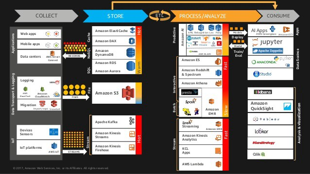
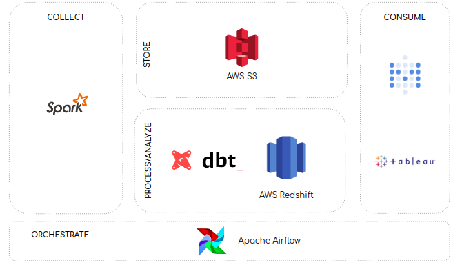

# 建立数据仓库：基本架构原则
## 一种简化数据仓库的方法

> Photo by Sergey Zolkin on Unsplash


数据仓库理论有很多有用的资源。 但是，如此大量的资源有时可能不堪重负-或至少在我们开始构建数据仓库时才如此。

最初，当我们开始调整数据仓库架构时，我们提出的第一个问题是：什么是数据仓库的正确架构？ 然后，经过一番研究，我们意识到没有正确或错误的架构。 它始终取决于您的需求。

尽管如此，在开始构建数据仓库时，您应该牢记一些行业公认的有用架构原则。 特别是，在构建数据仓库架构时，对我们有很大帮助的三个基本原则是：
+ 构建分离的系统，即在数据仓库方面，不要试图将所有流程放在一起。 一种尺寸并不适合所有尺寸。 因此，了解流程的本质，并使用正确的工具完成正确的工作。
+ 实施功能性数据管道，即，来自管道的数据应易于重现-例如，如果您要重新运行流程，则应确保它将产生始终相同的结果。 这可以通过执行功能数据工程范式来实现。
+ 实现不可变的暂存区，即数据应存储在不可变的暂存区中。 从那里，数据应该被转换并加载到您的数据仓库中。

在我们开始遵循这些原则之后，数据仓库过程变得容易一些。 因此，在本文中，我们想与您分享有关此类架构原则的一些知识，以及它们如何帮助我们建立数据仓库的架构。 此外，我们想与您分享我们在AWS中建立数据仓库的首次尝试。
# 第一原则：建立解耦系统

该原则遵循关注点分离原则。 它基于这样的假设，即每个系统都应以某种方式处理某个问题，该问题应由系统本身封装。

特别是，数据仓库可以分为四个方面，可以将它们视为数据管道的一部分：收集，存储，处理/分析和使用-请查看Siva Raghupathy的演讲以获取更多信息。 因此，属于我们数据管道的每个系统都应封装这四个问题之一的职责。

> Illustration by Siva Raghupathy on Slideshare

# 第二条原则：实现功能数据管道

该原理基于“功能数据工程范式”，这是将功能编程范式带入数据工程学科的尝试。

实现功能数据管道的基础是在纯任务之上定义数据过程。 根据Maxime Beauchemin的说法：

“纯任务应该是确定性和幂等的，这意味着它每次运行或重新运行时都会产生相同的结果”

因此，任何提取，转换或加载过程都应遵循纯任务的标准-请查看此帖子以获取更多信息。
# 第三原则：实现一个不变的临时区域

该原则基于在您的数据管道上实现一个过渡区域，理想情况下，数据应以其原始形式（或接近原始形式）存储。

我们希望使源不可变，因此可以确保数据可重复性。 根据Maxime Beauchemin的观点，不变的暂存区原理是可重复性的关键，因为从理论上讲，它确保可以从头开始重新计算整个数据仓库的状态。
# 案例分析

数据管道架构是根据Siva Raghupathy陈述的关注点设计的：收集，存储，处理/分析和使用。 建立解耦的数据管道的问题在于编排起来可能很复杂，因此，通过这种方式，我们在建立数据管道体系结构时将这一过程作为一个额外的注意事项加以考虑。

在下一张图片中，我们将介绍这五个问题如何影响我们的数据管道体系结构。

> Data Warehouse architecture in AWS — Author’s implementation


数据管道体系结构以这种方式解决了上述问题：
+ 收集：使用Apache Spark从本地数据库中提取数据。 然后，将其加载到AWS S3。
+ 存储：数据以其原始形式存储在S3中。 它充当数据仓库的不变暂存区。
+ 流程/分析：使用DBT转换数据并将其插入到AWS Redshift。 请记住，DBT仅用作在数据仓库本身内部执行转换的工具。 一种解决方法是通过Redshift Spectrum外部表访问AWS S3数据，因此可以使用DBT在Redshift中对其进行转换和实现。
+ 消耗：数据通过不同的BI工具（例如Metabase和Tableau）由用户使用。
+ 编排：数据流程由Airflow编排。 它允许解决编排去耦系统时可能遇到的大多数问题。

最后，功能数据工程范式在整个数据管道中实现。 我们确保在纯任务之上定义所有数据流程（例如，数据加载和数据转换）。 因此，通过这种方式，我们确保它们是确定性和幂等的—请查看此帖子以获取更多信息。
# 结论

我们旨在使本文中提供的信息可以简化您的数据仓库流程。

特别是，我们认为这些基本的架构原则可以帮助人们入门。 但是，请记住，本文中提供的信息只是对整个数据仓库理论的一部分的简化。

在这里，您可以找到一些参考资料，这些参考资料可以帮助您理解一些超出本文范围的内容：
+ 数据仓库工具包
+ ABD201-AWS上的大数据架构模式和最佳实践
+ 在AWS上构建数据湖和分析; 模式和最佳实践— BDA305 —芝加哥AWS峰会
+ 功能数据工程-批处理数据的现代范例
+ 使用Airflow在数据加载过程中实施功能数据工程范式
+ 使用Airflow通用化数据加载过程
+ 建立没有更新的现代批处理数据仓库

我们希望您能从中找到有用的信息。

感谢您的阅读直到最后。

下篇再见！
```
(本文翻译自Antony Henao的文章《Building a Data Warehouse: Basic Architectural principles》，参考：https://towardsdatascience.com/building-a-data-warehouse-basic-architectural-principles-66bd7059ffd0)
```
