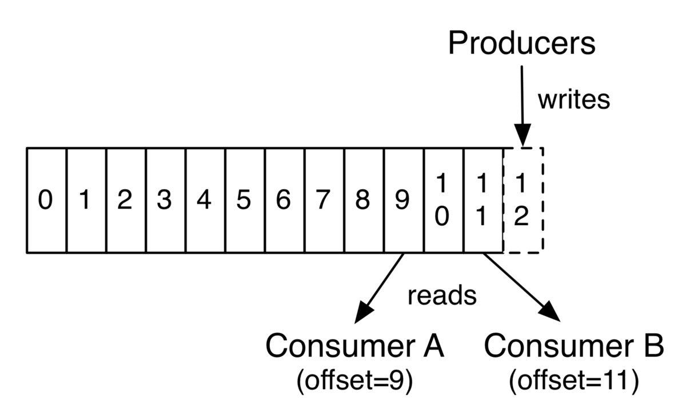

# 使用Kafka构建数据管道
## 目标：使用Kafka和使用Redis的服务层编写数据管道。

# 先决条件

请根据您的操作系统安装以下组件：
+ 卡夫卡
+ 动物园管理员
+ 雷迪斯
+ 爪哇
# 目标观众

本文针对的是正在构建第一个数据管道的工程师。 但是，已建立数据管道的工程师可以快速浏览它。
# 期待什么

关于如何建立数据管道的概念证明。 这不包括数据管道可操作，具有弹性和可扩展性（即生产就绪）所需的工作。
# 大纲

假设我们有一种只能通过语音访问的产品（类似于Google Home或Amazon Alexa）。 在产品（以硬件设备的形式）处于打开状态的整个会话中，我们有权听取用户的对话。

> Photo by Ben White on Unsplash

# 目的

在每个家庭（或设备通过WiFi连接的任何位置）中查找当前正在讨论的有趣话题。 这些信息将帮助我们更好地为客户提供服务。注意：我们要找到的有趣主题与Kafka主题不同。 以下各节中有关Kafka主题的更多信息。
# 方法
+ 语音对话应转换为文本。 语音朗读等技术可为我们提供帮助。 我们可以建立自己的模型或购买第三方服务。 对于此帖子，此模块超出范围。
+ 转换后的文本应实时发送到后端系统。 这些系统/过程称为生产者。
+ 数据的保存方式应使过程（生产者除外）可以要求将来的数据，也可以等待将来的数据生成。 我们称这种系统为遵循先进先出语义的队列。
+ 应该部署称为使用者的进程，以从队列中读取数据，将数据在内存中保留一定时间（通常以分钟为单位），并执行所需的业务逻辑计算。
+ 根据需要，可以将上述计算的结果汇总的数据发送到另一个Queue或将其持久化到数据库中。

注意：某些硬件设备能够执行业务逻辑计算（这类设备称为边缘设备）。 使用边缘设备构建数据管道不在当前文章的讨论范围之内。
# 假设条件

电影说明用于模拟用户的对话。 在下一篇文章中，我们将用电影字幕代替描述。 每部电影都被视为家。
# 卡夫卡概念

在动手构建第一个数据管道之前，让我们清晰地了解以下Kafka的基本构建基块。 经纪人：经纪人是生态系统的切入点。 它们允许生产者将数据写入主题分区中的Queue中，并允许使用者以特定偏移量读取数据在主题分区中。 主题：主题是Kafka存储中的逻辑标识符。 它类似于数据库中的表名。 生产者和消费者必须指定主题名称以分别写入或读取Kafka存储。

分区：分区是Kafka分布式系统中容错能力和吞吐量的基础。

分区是Kafka中并行性的一个单元。 更多分区将允许消费者并行使用消息。 但是，这样做的代价是要写入分区需要更多的文件指针，客户端（生产者和使用者）都需要更多的内存。 有关此的更多信息，请查看有关分区的融合博客。

当Kafka作为多节点群集启动时，其中一个节点被分配为[特定主题]每个分区的领导者。 每个分区都复制到多个节点以实现容错功能。 领导者节点负责将写入其中的数据发送到其复制节点。 如果领导者节点停止服务，则将复制的节点之一选作分区的领导者。

设计分区：设计编号 以下主题中的分区和分区键的重要性应给予重视：
+ 顺序保证-应该按时间顺序阅读所有生成的事件。 可以说，消耗模式是按顺序读取所有事件（从我们的示例中读取），然后分区键可以是唯一标识符。 这将确保同一家庭的所有事件都将进入同一分区。 这并不意味着我们需要为每个房屋创建一个分区，该分区可能以百万计。 一个分区将包含来自多个家庭的对话。 但是在2个分区中不会出现家庭对话。
+ 并发性—可以同时读取分区中的消息。
+ 逻辑上的数据分离—能够同时读取数据是好的。 分区键的设计方式应使我们的消费模式所需的所有数据都驻留在分区中。

偏移量：分区中的每条消息都用一个偏移量标识，该数量不断增加。 偏移量类似于表中的索引或数组中的索引。 这些偏移量用作检索数据的参考。

> Anatomy of Kafka Topic


生产者：生产者是使用生产者API与经纪人建立联系的任何客户端。 它必须提到一个主题名称才能将数据写入Kafka。 如果尚未创建主题，则将自动创建新主题（可以从属性中关闭自动创建新主题的配置）

消费者：消费者是使用消费者API与经纪人建立联系的任何客户端。 它必须提到一个主题名称才能从Kafka中读取数据。

> Producer writes and consumer(s) read simultaneously


使用者组：一组使用者（可能在同一台计算机上或在不同计算机上运行）可以具有唯一的使用者组ID [字符串或整数]。 使用消费者API扩展新消费者时，可以使用此消费者组ID。 消费者组的消费者订阅一个主题（或多个主题）。 Kafka负责将下一条消息传递给订阅该主题的消费者。 Zookeeper用于记录每个消费者组读取的偏移量。 一旦服务器确认消费者已经阅读了该消息，就下一条消息被传递。

示例：消费者组的示例是具有组ID为emailnotif的电子邮件通知发送组，具有组ID为smsnotif的SMS通知发送组，具有组ID为appnotif的App通知发送组等。我们代码库中的消费者组配置可以包含-消费者的名称 消费者组的组ID消费者组中的消费者数量。 该信息可以另存为配置文件或数据库中，并用于启动足够数量的使用者线程。
# 发布者-订阅者（Pubsub）模型

Pubsub是产生和使用消息的唯一方法，即生产者将发布消息，而消费者将订阅主题分区以读取消息。 Kafka主题仅用作消息的存储系统。 在邮件的保留期之前，邮件将保留在系统中。 之后，Kafka将清除消息。

消息队列模式：Pubsub模型也可以用于使用应用程序逻辑将主题转换为消息队列。 当所有使用者组中的一个使用者已读取消息时，通常应使用此模式。一旦使用者组读取消息，应用程序逻辑应从主题中删除消息。

可以说，我们在队列中有一条消息流，对于队列中的每条消息，我们都需要发送电子邮件，应用程序和SMS通知[您可以假定该消息将具有所有必需的详细信息]。 在这种情况下，我们将一组消费者分配给消费者组ID，Kafka将确保仅将消息发送给其中一个消费者。
# 让我们（实际上）开始

运行Zookeeper和Kafka服务器

制作人：让我们将有关主题语音的消息写到Kafka Server。

创建一个线程安全的KafkaProducer实例。 实例可以在多个线程之间共享，而没有任何额外的开销。
```
Properties producerProps = new Properties();
producerProps.put(ProducerConfig.BOOTSTRAP_SERVERS_CONFIG, "localhost:9092");
producerProps.put("acks", "all");
producerProps.put("retries", 0);
producerProps.put("batch.size", 16384);
producerProps.put("buffer.memory", 33554432);
producerProps.put("linger.ms", 1);
producerProps.put("key.serializer", "org.apache.kafka.common.serialization.StringSerializer");
producerProps.put("value.serializer", "org.apache.kafka.common.serialization.StringSerializer");

//KafkaProducer is thread-safe
listenProducer = new KafkaProducer<String, String>(producerProps);

```

为什么使用带有键值对的KafkaProducer？Key可以是任何数据类型（例如，在大多数情况下为Integer或String），可用于在主题中指定分区。 值可以是任何数据类型（Avro或Json等），最终将由Kafka编码为字节数组，然后再由生产者发送给代理，并在消费者收到消息后由Kafka解码为原始dataype。

通过使用包含电影ID和电影摘要作为制表符分隔行的文件来模拟文本对话
```
//simulate: read a file and send its content to kafka
try (Stream<String> lines = Files.lines(Paths.get("plot_summaries.txt"))) {
  lines.forEach(p::action);
 } catch (IOException e) {
 //additional logging as needed. 
  e.printStackTrace();
}
```

对于上述文件plot_summaries.txt中的每一行，将执行以下操作，该操作还涉及将数据发送到代理
```
    void action(String s) {
        String[] split = s.split("\\t");
        s = split[1];
        listenProducer.send(new ProducerRecord<>("voice", split[0], s));
    }
```

操作.send不会立即调用网络调用。 这由batch.size和buffer.memory配置平衡。
+ 邮件是批量发送的。 批次取决于batch.size（以字节为单位）。 此设置适用于每个分区。
+ 客户端调用.send方法时，将使用buffer.memory对消息进行缓冲以累积到batch.size。 buffer.memory适用于整个生产者
+ 如果buffer.memory已填满，.producer客户端将阻止.send调用。 如果在max.block.ms之前客户端可以将消息添加到缓冲区，则客户端将被阻止。 发布max.block.ms异常将被引发

制作人的完整代码可以在ListenProducer上找到

使用者：允许从主题语音中读取数据。
```
consumerProps = new Properties();
consumerProps.put("bootstrap.servers", "localhost:9092");
consumerProps.put("group.id", "text-reading-group");
consumerProps.put("enable.auto.commit", true);
consumerProps.put("auto.commit.interval.ms", 1000);
consumerProps.put(ConsumerConfig.AUTO_OFFSET_RESET_CONFIG, "latest");
consumerProps.put("key.deserializer", "org.apache.kafka.common.serialization.StringDeserializer");
consumerProps.put("value.deserializer", "org.apache.kafka.common.serialization.StringDeserializer");
```

KafkaConsumer不是线程安全的。 因此，不能在多个线程之间共享KafkaConsumer的单个实例。 创建子线程之后，应该启动新的使用者。 生产者的完整代码在ListenConsumer中。
```
ListenFrom l = new ListenFrom();
//KafkaConsumer is not thread-safe
KafkaConsumer<String, String> listenConsumer = new KafkaConsumer<>(l.consumerProps);
listenConsumer.subscribe(Arrays.asList("voice"));
```

有两种方法可以确定线程数。
+ 使用分配方法：当需要对分配给使用者线程的分区进行更好的控制时，将使用分配。 应当注意，属于同一使用者组的多个使用者线程不会读取同一分区。
+ 使用订阅方法：使用订阅，kafka可以确保使用者线程之间分区的公平平衡。 它使消费者工作更灵活地分叉适当的编号。 消费者线程。 这将是创建使用者线程的理想方法。

注意：
+ 还有其他方法可以确定编号。 消费者，但总的来说太复杂而无法编码和维护（在我看来）。
+ 为了建立数据管道，如果使用了任何流处理框架（例如Spark或Flink），则创建线程[或内核]的开销将由框架本身来处理。

让我们应用业务逻辑：从文件中读取停用词并从中创建列表。 此列表用于删除无关紧要的单词（例如I，you，a，an等单词）
```
Stream<String> lines = Files.lines(Paths.get("stopwords.txt"));
List<String> stopwords = lines.map(String::trim)
                              .map(String::toLowerCase)
                              .distinct()
                              .collect(Collectors.toList());
```

对于服务器上每分钟的轮询，以获取最新消息，根据需要处理记录，并将聚合的数据持久保存到Redis。
```
while (true) {
  Duration d = Duration.ofMillis(1000*60);
  ConsumerRecords<String, String> records = listenConsumer.poll(d);
  l.consume(records, stopwords);
}

private void consume(ConsumerRecords<String, String> records, List<String> stopwords) {
        for (ConsumerRecord r : records) {
            String[] tokens = ((String) r.value()).split("\\s");
            HashSet<String> keys = new HashSet<>();
            for (String t : tokens) {
                if (!stopwords.contains(t.toLowerCase())) {
                    String key = (String) r.key();
                    //TODO: change to pipeline commands
                    j.zincrby(key, 1.0, t);
                    j.zincrby("global-token-count", 1.0, t);
                    keys.add(key);
                }
            }
            if(keys.size()>0) {
                System.out.println(keys);
                String[] a = new String[keys.size()];
                j.sadd("movies-list", keys.toArray(a));
            }

        }
    }
```

数据消耗层：通过我们的数据管道持久化到Redis的数据可以被多个下游客户端使用。 一个这样的客户端每5分钟查询一次Redis，并检查对话次数最多的最新10个主题。
```
public ViewLayer() {
        //TODO: change to pool
        j = new Jedis("127.0.0.1", 6379);
    }

public static void main(String args[]) throws InterruptedException {
        ViewLayer v = new ViewLayer();
        while (true) {
            Set<Tuple> tokens = v.j
                                  .zrevrangeByScoreWithScores("global-token-count", "+inf", "-inf", 10, 10);
            for (Tuple token : tokens) {
                System.out.println(token.getElement() + "," + token.getScore());
            }
            Thread.sleep(1000*60*5);
            //TODO: repeat the same for each movie
//            for (String s : j.smembers("movieslist")) {
//
//            }
        }
    }
```

后续步骤：尽管标题中未提及，但我们现在构建的是实时数据管道，但没有任何分布式处理框架（如Spark或Flink）的支持。

由于以下原因，我们现在构建的管道难以扩展：
+ 数据管道开发人员应编写和维护胶合代码，以使多个使用者根据负载扩展规模。 这与应该编写的处理逻辑代码一起将是额外的负担。
+ 实时数据管道有两种。 一种读取偏移量的数据应用所需的业务逻辑，然后写入目标。 第二种将在一定时间内以分钟为单位从一个或多个流中累积相关数据，以执行业务逻辑。 业务逻辑可以包括与我们的示例类似的转换和聚合。 这称为微批处理。 分布式框架（如Spark）具有处理这些多个微批处理的能力。 对于第一种方法，要使管道具有可伸缩性，容错性和弹性，最好使用分布式处理框架。

因此，在我们的下一篇文章中，让我们将当前的实时数据管道转换为使用Flink和Spark等分布式框架。

资源：1。 plot_summaries.txt在CMU电影摘要语料库中。

2. stopwords.txt在NLTK停用词列表中。
```
(本文翻译自Sarath Jiguru的文章《Building Data Pipelines With Kafka》，参考：https://medium.com/@sarathjiguru/building-data-pipelines-with-kafka-735ea0b739b4)
```
