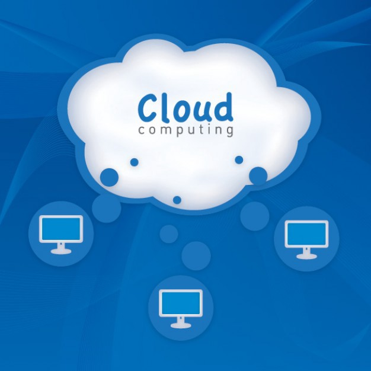

# 云计算的采用-企业有选择的余地吗？

> Source: Freepik website


在讨论更大的问题为什么要使用云计算之前，让我们首先了解云计算的一些基本知识：
## 什么是云计算？

简而言之，云计算是指使用按需购买的IT资源，该资源通过Internet使用按需付费的定价模型来提供。 与购买基础架构的传统模式相比，主要区别在于，提供商（而不是购买自己的硬件）由提供商（例如Google，Amazon，Microsoft，IBM，阿里巴巴或任何其他提供商）为您维护。

云提供商提供核心IT基础架构服务（例如，计算，存储，网络，数据库）以及核心基础架构（大数据和分析，物联网，SaaS应用程序等）之上的解决方案。
## 云采用是企业的选择还是必需？

在我们回答这个问题之前，让我们看看采用云技术在购买和维护传统IT基础架构方面的好处是什么
+ 收入增长导向型收益

a）以敏捷性和速度来管理不断增长的客户群：随着业务的增长，您需要更多的IT基础架构来管理不断增长的客户需求（例如，更高的计算能力，更多的数据存储，更快的响应时间）。 您如何处理？
+ 选择1（传统）：每当现有硬件无法管理工作负载时，购买更多硬件。 这更像是一个逐步功能，您可以购买足够的新工作负载（并在需求增加时继续购买），或者购买足够的数量来满足未来几个月/几年的高峰需求（这意味着大量的容量浪费）。 如果您没有管理此权限，则可能会对收入产生影响（例如，响应时间短，网站无法加载等原因导致客户不满意）
+ 选择2（基于云）：借助云的强大功能，您无需在需求变化时购买/出售物理硬件-放大/缩小可以动态，自动进行

b）有效地使用数据进行客户获取/保留/交叉销售/追加销售：借助您周围不同来源（企业应用程序，社交媒体，交易数据，物联网数据等）提供的大量数据，您拥有2 组织的选择：
+ 选择1（传统）：使用固定容量的IT基础架构，仅处理基础架构允许的数据量
+ 选择2（基于云）：挖掘所有可用数据，利用云弹性功能将其存储（或有意识地丢弃）在基于云的数据湖/数据仓库中，并创建真实的360度客户视图以推动与客户增长相关的分析 用例

c）以敏捷的方式应对变化：由于市场上竞争者如此之多，客户的格局也在不断变化，您需要不断发展以保持相关性。 环境要求推出新产品/功能，并以前所未有的方式推动客户/员工体验的极限。 您如何解决？
+ 选择1（传统）：在现有硬件和软件解决方案的约束下工作以开发和部署新产品（或等待很长时间购买和集成任何新的外部解决方案）。
+ 选择2（云本地）：利用云上可用的众多解决方案快速开发/部署新产品/功能； 利用数据和分析平台，而无需为之构建一个平台； 使用现有的客户服务解决方案（例如，启用AI的聊天机器人）

d）支持地理增长：您需要扩展到新的地理环境，您要做什么？
+ 选择1（传统）：在新的地理环境中设置整个技术基础架构，并在此部署应用程序
+ 选择2（基于云）：立即为Cloud中的新地理环境配置基础架构，在新地理环境中部署应用程序并上线！

2.降低成本的收益

a）将资本支出转移到运营支出，并降低每单位的运营成本（按使用量付费；无需支付未使用的零件的费用，这是传统模型中固定容量的情况）。

b）避免成本：消除硬件更新，维护，升级等成本。

c）提高生产力：减少停机管理成本； 使用Cloud上可用的自动化解决方案来提高生产力

d）增强弹性：减少由于硬件故障而造成的停电和停机时间

鉴于云影响核心业务和关键KPI（业务收入和利润）的方式多种多样，因此说采用云仅仅是众多IT选择之一是不明智的。 如果做得正确，它可以为企业带来一些真正的核心业务收益。

Netflix就是一个有趣的案例，它是如何使用Cloud来驱动其核心业务的。 可以在AWS网站上找到详细信息：

https://aws.amazon.com/solutions/case-studies/netflix-case-study/
## 有哪些不同的云迁移策略？

一旦确定要开始迁移到Cloud，有哪些不同的选项可用于将技术环境迁移到Cloud？ （请注意，以下策略是从应用程序组合角度出发的，最终会影响对运行应用程序的基础基础结构的选择）

a）保留：某些应用程序可能太复杂而无法迁移到云（特别是在短期到中期），因此最好不要改动。 在大型旧版应用程序中，这通常是正确的

b）放弃/合并：可能不再需要某些应用程序（例如，另一个应用程序已提供的功能）。 这些应该从应用程序组合中丢弃

c）重新托管（迁移）：在大型遗留迁移方案中，组织希望快速扩展其迁移以满足业务需求，因此大多数应用程序都被重新托管。 可以使用工具极大地实现重新托管，并带来一些快速的成功（但是，这并不能提供Cloud本机应用程序提供的长期优势）

d）重新平台：此方法进行了一些Cloud（或其他）优化，以实现一些明显的好处，但是您无需改变应用程序的核心架构。

e）Rearchitect（云原生）：这是由强大的业务需求驱动的，这些需求需要添加功能，规模或性能，而这些功能，规模或性能在应用程序的现有环境中是很难实现的

f）回购：这意味着完全放弃您的内部应用程序，并从其他提供商转到SaaS模型

任何云迁移策略都不必只是其中之一。 根据产品组合中不同应用程序的不同需求，可以混合使用这些策略。
## 典型的云迁移程序执行的阶段是什么？

如果您决定迁移，那么您将如何计划迁移以及涉及哪些不同阶段？

a）根据您要从Cloud迁移计划中实现的目标，评估上一节所述的各种迁移策略。

b）评估迁移准备情况：这涉及查看您的产品组合中的所有应用程序，并针对不同的策略对其进行评估（例如，对重新配置的评估涉及查看不同应用程序的代码级别详细信息，以查看与其他应用程序的依赖关系，接口数量等）。 。

c）调整机会：在进行实际迁移之前，任何迁移都应包括创建业务案例，以识别潜在的收益（和所需的投资）。

d）迁移：建立业务案例后，请根据最终战略进行实际迁移。

e）验证：进行迁移后测试/检查，以验证迁移已按照计划进行，没有中断用户旅程，未达到所需的性能水平等。

f）优化：确保优化云成本以最大程度地从迁移程序中获得收益非常重要。 通常对于新的云采用者而言，这可能是一个巨大的挑战，因为他们专注于保持一段时间的正常运行并确保在云迁移后业务正常运行。 然后他们开始研究现有Cloud设置的成本合理化（例如评估计算实例，存储实例的数量等）。
## 这些组织面临的典型挑战是什么？它们如何克服这些挑战？

在描述了采用云技术的所有好处，不同的策略和阶段之后，同样重要的是要承认这不是一件容易的事（尤其是对于拥有大量传统设置的大型企业而言，这是多年的经验）。 企业在采用云的过程中面临一些共同的挑战，例如
+ 正确了解云：了解云的细微差别是最大的障碍之一。 通常，我们会尽量避免做一些我们不了解的事情-这是人类的基本天性。 因此，无论云可以为企业提供强大的上行潜力，都有一种趋势可以继续使用“照常营业”。
+ 对变化的恐惧：通常会有对变化的恐惧-“如果事情停止运转该怎么办？”，“如果所实现的收益未如预期那样该怎么办？”。
+ 了解执行路径：诸如“我从哪里开始？”，“路线图是什么”，“时间表是什么？”，“我按什么顺序移动应用程序”，“我从哪个提供商那里选择？”之类的问题。 等等是决策者心目中非常普遍的一些。

好消息是，这些挑战中的大多数可以通过生态系统中可用人才的正确搭配来解决，以支持组织的转型之旅。 人才组合通常是
+ 内部人才：组织中了解云并帮助定义云采用策略的人员。
+ 云提供商：Amazon（AWS），Google（GCP），Microsoft（Azure）之类的。
+ 带来急需的公正看法和客观性（例如选择合适的云提供商）并帮助组织计划/执行云采用计划的不同阶段的IT服务提供商。
## 那么，您什么时候应该开始采用Cloud？

用马克·吐温（Mark Twain）的话说：“从现在起二十年后，您将比未做的事情更失望，所以抛开船头，驶离安全港，顺风而行 在你的帆中。 探索，梦想，发现。”
```
(本文翻译自Arpit kumar的文章《Cloud adoption — Do Enterprises have a choice?》，参考：https://towardsdatascience.com/cloud-adoption-do-enterprises-have-a-choice-a83656bba8ac)
```
