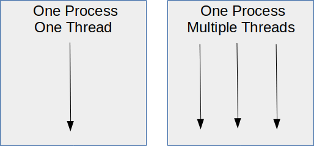
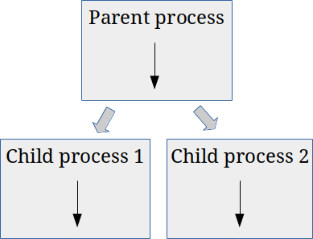

# 包起来

总结一下：
+ 将线程库（或asyncio）用于受I / O约束的软件：它轻巧，可显着提高性能
+ 使用多处理库解决CPU受限的问题。 它充分利用了系统中所有CPU的全部潜能。

感谢您的阅读。 如果发现任何错误，请告诉我。 您会帮助很多人！
# 使用Python进行多处理

经过相当长但必要的解释之后，我们已准备好进行一些示例代码和实验。 开始工作吧！
## 我们的测试功能

我们首先定义一个函数，我们可以使用该函数对不同的选项进行基准测试。 以下所有示例都使用相同的函数，称为heavy：
```
def heavy(n, myid):  for x in range(1, n):    for y in range(1, n):      x**y  print(myid, "is done")
```

重功能是一个执行乘法的嵌套循环。 它是受CPU限制的功能。 如果您在执行此操作时观察系统，则会发现CPU使用率接近100％。 您可以将其替换为所需的任何内容，但要注意竞争状况-请勿使用共享对象或变量。

我们将以不同的方式运行此功能，并探讨常规单线程Python程序，多线程和多处理之间的区别。
## 选项1：基准

每个Python程序都有至少一个线程：主线程。 您可以在下面找到单线程版本，它是速度的基准。 它按顺序运行我们的重功能80次：
```python
from lib import heavy
import time

# A CPU heavy calculation, just
# as an example. This can be
# anything you like
def heavy(n, myid):
    for x in range(1, n):
        for y in range(1, n):
            x**y
    print(myid, "is done")

def sequential(n):
    for i in range(n):    
        heavy(500, i)

start = time.time()
sequential(80)
end = time.time()
print("Took: ", end - start)

# On my system, this takes
# about 46 seconds.
```
## 选项2：使用线程

在下面的示例中，我们使用多个线程再次运行80次。 每个调用都有自己的线程：
```python
import threading
import time

# A CPU heavy calculation, just
# as an example. This can be
# anything you like
def heavy(n, myid):
    for x in range(1, n):
        for y in range(1, n):
            x**y
    print(myid, "is done")

def threaded(n):
    threads = []

    for i in range(n):
        t = threading.Thread(target=heavy, args=(500,i,))
        threads.append(t)
        t.start()

    for t in threads:
        t.join()

start = time.time()
threaded(80)
end = time.time()
print("Took: ", end - start)

# This takes about 47s on my system

# If the heavy function had a lot of
# blocking IO, like network calls or
# filesystem operations, this would 
# be a big optimization though

# The reason this is *not* an optimization
# for CPU bound functions, is the GIL!
```

如果Python没有GIL，则速度会更快。 但是，尽管有80个线程，但运行速度大致与基线一样快。 实际上，基线甚至更快一些，因为它没有线程创建和线程之间切换的所有开销。

这是工作中的GIL。 每个线程轮流执行，而不是一次运行。 但是，如果将重载作为I / O绑定功能，则可以极大地提高速度。 让我们测试一下！ 我们可以使用time.sleep（）模拟I / O绑定。 我在下一个代码片段中修改了重功能：
```python
import threading
import time

# An I/O intensive calculation.
# We simulate it with sleep.
def heavy(n, myid):
    time.sleep(2)
    print(myid, "is done")

def threaded(n):
    threads = []

    for i in range(n):
        t = threading.Thread(target=heavy, args=(500,i,))
        threads.append(t)
        t.start()

    for t in threads:
        t.join()

start = time.time()
threaded(80)
end = time.time()
print("Took: ", end - start)

# This takes a little over 2s on my system
```

即使我们有80个线程都在睡眠两秒钟，但此代码仍会在两秒钟多的时间内完成。 在睡眠期间，Python将安排其他线程运行。 甜！
## 选项3：使用多重处理

现在，我们将通过多处理库尝试真正的并行性。
```python
import time
import multiprocessing

# A CPU heavy calculation, just
# as an example. This can be
# anything you like
def heavy(n, myid):
    for x in range(1, n):
        for y in range(1, n):
            x**y
    print(myid, "is done")

def multiproc(n):
    processes = []

    for i in range(n):
        p = multiprocessing.Process(target=heavy, args=(500,i,))
        processes.append(p)
        p.start()

    for p in processes:
        p.join()

start = time.time()
multiproc(80)
end = time.time()
print("Took: ", end - start)

# This takes about 23 seconds.
# That's half of the threaded version.
# My pc has two cores, so it's exactly
# what we would expect.

# On my Mackbook Pro, with 4 cores
# that are faster as well,
# it takes 10 seconds!
```

如您所见，就代码而言，这看起来几乎与线程版本相同。 故意使线程和多处理库等效。 但是这次80次重调用的完成速度大约是这次的两倍！

我的测试系统（一台小型台式计算机）只有两个CPU内核，因此可以解释为什么它只有两个。 如果我在具有4个更快CPU内核的全新笔记本电脑上运行此代码，则速度将提高四倍以上。 这完美地证明了在CPU约束代码的情况下，线性提速多处理为我们提供了。
## 选项4：对池使用多处理

通过使用multiprocessing.Pool（p），我们可以使多处理版本更加优雅。 该帮助程序创建一个大小为p的进程池。 如果不提供p的值，则默认为系统中CPU内核的数量，这是明智的选择。

通过使用Pool.map（）方法，我们可以将工作提交到池中。 这项工作以简单的函数调用的形式出现：
```python
import time
import multiprocessing

# A CPU heavy calculation, just
# as an example. This can be
# anything you like
def heavy(n, myid):
    for x in range(1, n):
        for y in range(1, n):
            x**y
    print(myid, "is done")

def doit(n):
    heavy(500, n)

def pooled(n):
    # By default, our pool will have
    # numproc slots
    with multiprocessing.Pool() as pool:
       pool.map(doit, range(n))

start = time.time()
pooled(80)
end = time.time()
print("Took: ", end - start)

# This takes about 23 seconds as well.
# That's half of the threaded version.
# My pc has two cores, so it's exactly
# what we would expect.
```

此版本的运行时与非池版本大致相同，但是它必须创建更少的进程，因此效率更高。 我们没有创建80个流程，而是创建了四个并每次都重复使用。
# GIL：是福是祸？

Python具有一个特殊性，使得并发编程更加困难。 它称为GIL，是Global Interpreter Lock的缩写。 GIL确保在任何时候都只有一个线程在运行。 由于一次只能运行一个线程，因此不可能同时使用多个带有线程的处理器。 但请放心，这是可以解决的。

GIL确保在任何时候都只有一个线程在运行。

GIL的发明是因为CPython的内存管理不是线程安全的。 一次只运行一个线程，CPython可以放心，永远不会出现竞争条件。
## 比赛条件？ 线程安全？

这些术语可能对您来说并不陌生，因此让我们对其进行定义：
+ 当多个线程可以同时访问和更改共享数据时，就会发生争用情况。
+ 线程安全代码仅以不干扰其他线程的方式操纵共享数据。

如前所述，线程共享相同的内存。 在多个线程同时运行的情况下，我们不知道线程访问共享数据的顺序。 因此，访问共享数据的结果取决于调度算法。 该算法决定哪个线程何时运行。 线程正在“竞争”以访问/更改数据。

举例来说，我们创建一个共享变量a，其值为2：
```
a = 2
```

现在假设我们有两个线程，thread_one和thread_two。 他们执行以下操作：
+ thread_one：a = a + 2
+ thread_two：a = a * 3

如果thread_one能够首先访问且thread_two能够访问第二，则结果将是：
+ a = 2 + 2，a现在是4。
+ a = 4 * 3，a现在是12。

但是，如果发生这种情况，先运行thread_two，然后运行thread_one，我们将获得不同的输出：
+ a = 2 * 3，a =现在6
+ a = 6 + 2，a现在是8

因此，执行顺序显然对输出很重要。 不过，可能会有更糟的结果。 如果两个线程同时读取a并执行各自的操作，然后分配新值，该怎么办？ 他们都将看到a =2。取决于谁首先写入结果，a最终将是4或6。这不是我们期望的！ 这就是我们所说的竞赛条件。

竞争条件很难发现，尤其是对于不熟悉这些问题的软件工程师而言。 而且，它们倾向于随机发生，导致不稳定和不可预测的行为。 众所周知，这些错误很难发现和调试。 这就是Python拥有GIL的原因-使大多数Python用户的生活更加轻松。

但是，如果GIL在并发方面使我们受挫，我们是否应该摆脱它或能够将其关闭？ 没有那么容易。 其他功能，库和软件包已经依赖于GIL，因此必须替换某些GIL，否则整个生态系统将崩溃。 事实证明这是一个难以解决的问题。 如果您感兴趣，可以在Python Wiki上阅读有关此内容的更多信息。

这就是Python拥有GIL的原因-使大多数Python用户的生活更加轻松。
# Python中的并发
## 在Python程序中实现并发的3种方法

> Photo by Dennis van Zuijlekom on Flickr

# 什么是并发？

并发同时处理多个事情。 在Python中，这可以通过几种方式完成：
+ 通过线程化，可以让多个线程轮流使用。
+ 通过执行任务并继续执行其他任务，而不是等待来自网络或磁盘的答案。 这就是异步IO与asyncio库一起运行的方式。
+ 通过多处理，我们使用了多个过程。 这样，我们可以使用多个处理器内核一次真正完成一件事情。 这称为并行性。
## 线程和进程之间的区别

线程是一个独立的执行序列，但它与属于您程序的所有其他线程共享内存。 默认情况下，Python程序具有一个主线程。 您可以创建更多它们，并让Python在它们之间切换。 这种切换发生得如此之快，以至于它们似乎同时并排运行。

> Single-threaded vs multithreading — Image © by author


流程也是独立的执行顺序。 与线程不同，一个进程具有自己的内存空间，该内存空间不与其他进程共享。 一个进程可以克隆自己，创建两个或更多实例。

下图说明了这一点：

> Multiprocessing — Image © by author


异步IO既不是线程化的，也不是多处理的。 实际上，它是单线程，单进程的范例。 我不会在本文中介绍异步IO。
```
(本文翻译自Erik-Jan van Baaren的文章《Concurrency in Python》，参考：https://towardsdatascience.com/concurrency-in-python-e770c878ab53)
```
