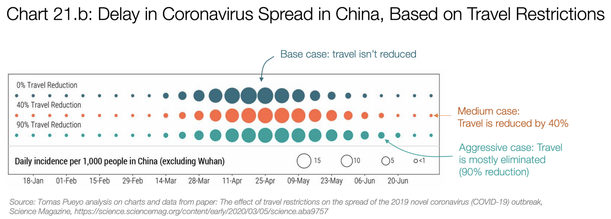

我将在此处开始添加指向翻译的链接。 除西班牙语，法语和意大利语外，我无法验证其他任何语言，因此，如果翻译质量不佳，请告诉我。

法语西班牙语意大利语意大利语德语葡萄牙语（以及替代版本和另一个）繁体中文保加利亚语俄语土耳其语乌克兰语捷克捷克斯洛伐克语希腊语阿拉伯语挪威语越南语越南语加泰罗尼亚语匈牙利语蒙古立陶宛语塞尔维亚语爱沙尼亚语波斯语波兰语（和替代翻译）罗马尼亚语（部分翻译）希伯来语（部分翻译，希伯来语部分翻译）
# 冠状病毒：为什么必须立即采取行动
## 政治家，社区领袖和企业领袖：您应该做什么以及何时做？

于3/13/2020更新。 现在反映了遏制与缓解策略的更新。 底部26种翻译。 在底部的私人注释中给我发送更多现有的翻译。 上周，本文已获得2800万次观看。

关于冠状病毒的一切事情，可能很难决定今天该怎么做。 您应该等待更多信息吗？ 今天做什么？ 什么？

这是我将在本文中介绍的内容，其中包含大量图表，数据和模型以及大量来源：
+ 您所在地区会出现多少例冠状病毒？
+ 这些情况一旦发生，将会发生什么？
+ 你该怎么办？
+ 什么时候？

阅读完本文后，您将获得以下内容：

冠状病毒来了。 它以指数级的速度发展：逐渐地，然后突然地。这是几天的事情。 大概一两个星期，如果这样做的话，您的医疗系统将不堪重负，您的同胞将在走廊上受到治疗。 精疲力竭的医护人员将崩溃。 有些人会死，他们将不得不决定哪个病人吸了氧气，哪个死了。 防止这种情况的唯一方法是当今的社会隔离。 不是明天。 今天，这意味着从现在开始让尽可能多的人回家。

作为政治家，社区领袖或企业领袖，您有权力和责任防止这种情况的发生。

您今天可能会有恐惧：如果我反应过度怎么办？ 人们会嘲笑我吗？ 他们会生我的气吗？ 我会看起来很蠢吗？ 等别人先采取步骤会更好吗？ 我会对经济造成太大伤害吗？

但是在2到4周内，当整个世界都处于封锁状态时，当您将能够度过的宝贵的社交间隔的几天将挽救生命时，人们将不再批评您：他们将感谢您做出正确的决定。

好吧，让我们这样做。
# 1.您所在地区会出现多少例冠状病毒？
## 国家成长


直到中国遏制了这种情况，案件总数才成倍增长。 但是后来，它泄漏到外面了，现在是一种流行病，没人能阻止。


截至今天，这主要归功于意大利，伊朗和韩国：


在韩国，意大利和伊朗，情况如此之多，很难看到其他国家/地区，但让我们放大一下右下角的那个角落。


有数十个国家的指数增长率很高。 截至今天，其中大多数是西方国家。


如果您仅用一周的时间就可以保持这种增长率，那么您将获得：


如果您想了解将要发生的事情或如何防止它发生，则需要查看已经发生的情况：中国，具有SARS经验的东方国家和意大利。
# 中国

> Source: Tomas Pueyo analysis over chart from the Journal of the American Medical Association, based on raw case data from the Chinese Center for Disease Control and Prevention


这是最重要的图表之一。

它以橙色条显示了湖北省每天的官方病例数：当天被诊断出多少人。

灰色条显示了每天的真实冠状病毒病例。 中国疾病预防控制中心通过在诊断过程中询问患者何时开始出现症状来发现这些疾病。

至关重要的是，当时还不知道这些真实的案例。 我们只能找出它们是向后看的：当局不知道有人刚开始出现症状。 他们知道何时有人去看医生并得到诊断。

这意味着橙色的条形图显示了您所知道的内容，而灰色的条形图则显示了实际情况。

1月21日，新诊断病例（橙色）呈爆炸式增长：大约有100个新病例。 实际上，当天有1,500个新病例，呈指数增长。 但是当局不知道。 他们所知道的是，突然有100例这种新疾病的新病例。

两天后，当局关闭了武汉。 那时，每天诊断出的新病例数约为400。 请注意该数字：他们决定每天关闭仅400个新病例来关闭这座城市。 实际上，那天有2500个新病例，但他们不知道。

第二天，湖北又有15个城市关闭。

直到1月23日，武汉关闭时，您可以查看灰色图表：它呈指数增长。 真实案例呈爆炸式增长。 武汉关闭后，案件数量就会减慢。 1月24日，当另外15个城市关闭时，真实病例（再次为灰色）的数量却停了下来。 两天后，达到了真实病例的最大数量，此后一直下降。

请注意，橙色（官方）案件仍在呈指数级增长：再过12天，这件事似乎仍在爆炸。 但事实并非如此。 只是这些病例的症状越来越严重，需要去看医生更多，而识别它们的系统也越来越强。

官方案件和真实案件的概念很重要。 让我们牢记在后。

中央政府很好地协调了中国其他地区，因此立即采取了严厉措施。 结果如下：


每条平线都是在中国有冠状病毒病例的地区。 每个人都有潜力成倍增长，但是由于在一月底才采取措施，所有这些人都阻止了该病毒传播。

同时，韩国，意大利和伊朗有一个月的学习时间，但没有。 他们在2月底之前开始了湖北的指数增长，并遍及了其他所有中国地区。
## 东方国家

韩国的案件数量激增，但您是否想知道为什么日本，台湾，新加坡，泰国或香港没有？

> Taiwan didn’t even make it to this graph because it didn’t have the 50 cases threshold that I used.


他们所有人都在2003年受到SARS的打击，他们都从中吸取了教训。 他们了解了病毒的致命性，因此他们知道必须认真对待。 这就是为什么他们的所有图表，尽管开始增长的时间都比较早，但看起来却仍然不像指数。

到目前为止，我们有冠状病毒爆炸，政府意识到威胁并将其遏制的故事。 但是，对于其他国家/地区来说，情况则完全不同。

在我跳到他们之前，先介绍一下韩国：该国可能是一个离群值。 前30例中包含冠状病毒。 患者31是超级传播者，将其传递给了成千上万的其他人。 由于该病毒在人们出现症状之前就已经传播，因此当当局意识到这一问题时，该病毒就已经存在了。 他们现在正在为此事承担后果。 然而，他们的遏制努力表明：意大利已经通过了许多案件，伊朗将在明天（2020年3月10日）通过它。
## 华盛顿州

您已经看到了西方国家的增长，以及仅仅一周的糟糕表现。 现在想象一下，没有像武汉或其他东方国家那样发生遏制事件，那么您将面临巨大的流行病。

让我们看看一些情况，例如华盛顿州，旧金山湾区，巴黎和马德里。


华盛顿州是美国的武汉。那里的案件数量呈指数增长。 目前是140。

但是早期发生了一些有趣的事情。 死亡率是通过屋顶。 在某个时候，该州有3例死亡1例。

我们从其他地方知道，冠状病毒的死亡率在0.5％到5％之间（稍后会更多）。 死亡率如何达到33％？

事实证明，这种病毒已经传播了数周，未被发现。 不是只有3个案例。 当局只知道3个人，其中一个已经死亡，因为情况越严重，对某人进行测试的可能性就越大。

这有点像中国的橙色和灰色条形图：在这里，他们只知道橙色条形图（官方案例），而且看起来不错：只有3个。但实际上，有成百上千个真实案例。

这是一个问题：您只知道官方案件，而不是真实案件。 但是，您需要了解真实的情况。 您如何估算真实的呢？ 事实证明，有两种方法。 而且我为两者提供了一个模型，因此您也可以使用数字（直接链接到模型的副本）。

首先，通过死亡。 如果您所在的地区有死亡病例，则可以用它来猜测当前的真实病例数。 我们知道该人从感染病毒到死亡平均大约需要花费多长时间（17.3天）。 这意味着在华盛顿州2/29死亡的人可能在2/12左右被感染。

然后，您知道死亡率。 在这种情况下，我使用的是1％（稍后我们将详细讨论）。 这意味着，大约2/12，该地区已经有大约100例病例（其中只有1例在17.3天后死亡）。

现在，使用冠状病毒的平均倍增时间（平均将病例加倍的时间）。 是6.2。 这意味着在此人死亡的17天内，案件必须乘以〜8（= 2 ^（17/6））。 这意味着，如果您不诊断所有病例，那么今天的一例死亡意味着今天的800例真实病例。

华盛顿州今天有22人死亡。 通过这种快速的计算，您今天可以获得大约16,000例真正的冠状病毒病例。 多达意大利和伊朗的官方案件之和。

如果仔细研究，就会发现其中有19人死于一个集群，这可能并未广泛传播该病毒。 因此，如果我们将这19例死亡视为1例，那么该州的死亡总数为4例。 使用该数字更新模型，今天我们仍然可以收到约3,000个案例。

Trevor Bedford的这种方法着眼于病毒本身及其突变，以评估当前的病例数。

结论是，华盛顿州目前大约有1,100例。

这些方法都不是完美的，但是它们都指向相同的信息：我们不知道真实案例的数量，但是它比官方案例高得多。 不是数百个。 数以千计，也许更多。

旧金山湾区

直到3/8，湾区才没有死亡。 这使得很难知道有多少个真实案例。 正式地，有86个案件。 但是，由于没有足够的工具包，美国的测试能力大大不足。 该国决定创建自己的测试套件，结果证明该套件无效。

以下是截至3月3日在不同国家/地区进行的测试数量：

> Sources for each number here


在没有冠状病毒病例的土耳其，每位居民的测试量是美国的10倍。 今天的情况并没有好得多，在美国进行了约8,000次测试，这意味着约有4,000人接受了测试。


在这里，您可以将一部分官方案件用于真实案件。 如何决定哪一个？ 对于湾区，他们正在测试所有旅行或与旅行者接触的人，这意味着他们知道大多数与旅行有关的案例，但没有一个社区传播案例。 通过了解社区传播与旅行传播的关系，您可以知道有多少真实案例。

我查看了韩国的这一比例，该数据很好。 到他们有86例时，其中来自社区传播的百分比为86％（86和86％是巧合）。

使用该数字，您可以计算真实案例的数量。 如果今天的湾区有86例，那么实际数字可能是600左右。
## 法国和巴黎

法国今天要求赔偿1400例，造成30人死亡。 使用上面的两种方法，您可以处理多种情况：24,000到140,000。

今天法国的冠状病毒实际病例数可能在24,000和140,000之间。

让我重复一遍：法国的真实病例数可能比官方报告的数字高一到两个数量级。

不相信我吗？ 让我们再次查看武汉图。

> Source: Tomas Pueyo analysis over chart and data from the Journal of the American Medical Association


如果将橙色条堆叠到1/22，则得到444箱。 现在将所有灰色条加起来。 他们总计约有12,000例。 因此，当武汉认为它有444例时，则是27倍。 如果法国认为它有1400个案件，那么很可能会有数万个

同样的数学适用于巴黎。 在城市内部大约有30例病例，真实病例数可能在数百甚至数千中。 法兰西岛地区有300例病例，该地区的病例总数可能已经超过数万。
## 西班牙和马德里

西班牙的数字与法国非常相似（1200例对比1400例，均有30例死亡）。 这意味着同样的规则是有效的：西班牙可能已经有超过2万个真实案例。

在马德里自治区，有600例官方病例和17例死亡，真实病例数可能在10,000至60,000之间。

如果您阅读了这些数据并告诉自己：“不可能，那是不对的”，那就想想：在这种情况下，武汉已经处于封锁状态。

我们今天在美国，西班牙，法国，伊朗，德国，日本，荷兰，丹麦，瑞典或瑞士等国家看到的案件数量很多，武汉已经处于封锁状态。

而且，如果您对自己说：“嗯，湖北只是一个地区”，让我提醒您，它的人口接近六千万，比西班牙还大，大约相当于法国。
# 2.当这些冠状病毒病例变为现实时会发生什么？

因此，冠状病毒已经在这里。 它是隐藏的，并且呈指数增长。

到时我们国家会发生什么？ 很容易知道，因为我们已经有好几个地方在发生。 最好的例子是湖北和意大利。
## 死亡率

世界卫生组织（WHO）的死亡率为3.4％（感染冠状病毒然后死亡的人的百分比）。 这个数字是没有上下文的，所以让我解释一下。


这确实取决于国家和当前情况：韩国为0.6％，伊朗为4.4％。 那是什么 我们可以使用技巧来解决。

您可以通过两种方式计算死亡率：死亡/总病例数和死亡/结案率。 第一个可能是被低估了，因为许多未结案件仍可能最终死亡。 第二个原因是高估了，因为死亡的解决速度可能快于恢复速度。

我所做的只是看一下两者如何随着时间演变。 一旦所有案例都结案，这两个数字将收敛为相同的结果，因此，如果您将过去的趋势预测为未来，则可以猜测最终的死亡率。

这就是您在数据中看到的。 中国的死亡率目前在3.6％至6.1％之间。 如果您预计将来会出现这种情况，则它似乎会收敛至〜3.8％-4％。 这是目前估计的两倍，比流感还要糟30倍。

它由两个完全不同的现实组成：湖北和中国其他地区。


湖北的病死率可能会接近4.8％。 同时，对于中国其他地区，该数字可能会收敛至约0.9％：


我还绘制了伊朗，意大利和韩国的数字，这是仅有的死亡人数足以使这一数字变得有意义的国家。


伊朗和意大利的死亡/总病例数都趋向于3％-4％。 我的猜测是，他们的人数最终也将围绕该数字。


韩国是最有趣的例子，因为这两个数字是完全不相关的：死亡/总病例只有0.6％，但是死亡/结案却高达48％。 我认为那里发生了一些独特的事情。 首先，他们正在对每个人进行测试（有很多未结案件，死亡率似乎很低），然后将案子开放更长的时间（因此当病人死亡时，他们会迅速结案）。 其次，他们有很多病床（见图17.b）。 我们可能还不知道其他原因。 重要的是，自一开始以来，死亡/病例就一直徘徊在0.5％左右，这表明它将继续存在，很可能受到医疗保健系统和危机管理的严重影响。

最后一个相关的例子是“钻石公主号”巡洋舰：706例，死亡6例，康复100例，病死率在1％至6.5％之间。

请注意，每个国家的年龄分布也会产生影响：由于老年人的死亡率要高得多，因此与日本这样的年轻国家相比，日本等人口老龄化国家受到的平均冲击要更大。 也有天气因素，尤其是湿度和温度，但是目前尚不清楚这将如何影响传播和死亡率。

您可以得出以下结论：
+ 排除这些情况，有准备的国家/地区的死亡率将达到〜0.5％（韩国）至0.9％（中国其他地区）。
+ 不堪重负的国家的死亡率将在〜3％-5％之间

换句话说：行动迅速的国家可以将死亡人数减少十倍。 这只是计算死亡率。 快速采取行动还可以极大地减少案件的发生，这更加使人轻而易举。

快速采取行动的国家将死亡人数至少降低了10倍。

那么一个国家需要准备什么呢？
## 什么会对系统造成压力

约有20％的病例需要住院治疗，约5％的病例需要重症监护病房（ICU），约2.5％的病例需要非常密集的帮助，需要使用呼吸机或ECMO（体外充氧）等物品。


问题是呼吸机和ECMO等物品难以生产或购买。 例如，几年前，美国共有250台ECMO机器。

因此，如果您突然有100,000人被感染，其中许多人将要接受测试。 大约有20,000人将需要住院治疗，5,000人将需要ICU，而1,000人将需要我们今天没有足够的机器。 仅十万个案例。

那是没有考虑面具等问题的。 像美国这样的国家/地区，只有1％的口罩可以满足医护人员的需求（1200万N95、3000万外科手术和3.5B）。 如果一次出现很多病例，则只有2周的口罩。

日本，韩国，香港或新加坡等国家以及湖北以外的中国地区已经做好了准备，并给予了患者所需的护理。

但是其他西方国家则朝着湖北和意大利的方向发展。 那么那里发生了什么？
## 不堪重负的医疗保健系统看起来像什么

湖北和意大利发生的故事开始变得异常相似。 湖北在十天内就建立了两家医院，但即便如此，它仍然不堪重负。

他们俩都抱怨病人淹没了他们的医院。 他们必须在任何地方得到照顾：在走廊，候诊室……
## Medico Humanitas su Facebook：“ Situazione drammatica，普通流感”
### 丹尼尔·麦基尼（Daniele Macchini）的社交杂志，医学博士，人文医学杂志。 Una testimonianza…

医护人员会花费数小时来购买一件防护装备，因为防护装备不足。 结果，他们无法离开感染区数小时。 当他们这样做时，它们就会崩溃，脱水并筋疲力尽。 转变不再存在。 人们被迫从退休中退下来以满足需求。 对护理一无所知的人会在一夜之间接受培训，以发挥关键作用。 每个人都在随时待命。

> Francesca Mangiatordi, an Italian nurse that crumbled in the middle of the war with the Coronavirus


也就是说，直到他们生病为止。 发生这种情况的原因很多，因为他们没有足够的防护装备就经常暴露在病毒中。 发生这种情况时，他们需要隔离14天，在此期间他们无能为力。 最好的情况是丢失2个星期。 最坏的情况是他们已经死了。

最糟糕的是在ICU中，当患者需要共享呼吸机或ECMO时。 这些实际上是不可能共享的，因此医护人员必须确定将使用哪种患者。 那真的意味着，哪一个人死了。
## 冠状病毒：“我们必须选择要治疗的人”，意大利医生说
### 一名在意大利伦巴第大区的意大利医生因新的冠状病毒（Covid-19）而被隔离...

“几天后，我们必须选择。 […]并非所有人都可以插管。 我们根据年龄和健康状况做出决定。” —意大利医学博士克里斯蒂安·萨拉罗利（Christian Salaroli）。

> Medical workers wear protective suits to attend to people sickened by the novel coronavirus, in the intensive care unit of a designated hospital in Wuhan, China, on Feb. 6. (China Daily/Reuters), via Washington Post


所有这一切促使系统的死亡率达到〜4％，而不是〜0.5％。 如果您希望自己的城市或国家成为这4％的一部分，今天就什么也不要做。

> Satellite images show Behesht Masoumeh cemetery in the Iranian city of Qom. Photograph: ©2020 Maxar Technologies. Via The Guardian and the The New York Times.

# 3.你应该怎么做？
## 展平曲线

现在这是一种大流行病。 它无法消除。 但是我们可以做的是减少其影响。

一些国家在这方面起到了示范作用。 最好的一个是台湾，它与中国有着极为紧密的联系，但到今天为止还不到50例。 最近的这篇论文解释了他们早期采取的所有措施，这些措施都集中在遏制上。
## 台湾对COVID-19的回应：大数据分析，新技术和主动测试
### 该观点描述了台湾政府在SARS之后开发的疫情应对基础设施。

他们已经能够控制它，但是大多数国家都缺乏这种专业知识而没有。 现在，他们在玩另一种游戏：缓解游戏。 他们需要使这种病毒尽可能不受攻击。

如果我们尽可能减少感染，我们的医疗保健系统将能够更好地处理病例，从而降低死亡率。 而且，如果我们将其逐步传播，我们将达到可以为整个社会接种疫苗的地步，从而完全消除了风险。 因此，我们的目标不是消除冠状病毒感染。 是要推迟他们。

> Source


我们推迟的病例越多，医疗体系的功能越好，死亡率越低，在被感染之前要进行疫苗接种的人群所占的比例就越高。

我们如何展平曲线？
## 社会距离

我们可以做的一件很简单且有效的事情：社会隔离。

如果回到武汉图表，您会记住，一旦发生封锁，案件就会减少。 那是因为人们之间没有互动，并且病毒没有传播。

目前的科学共识是，如果有人咳嗽，这种病毒可以在2米（6英尺）内传播。 否则，水滴会掉落到地面，不会感染您。

然后，最严重的感染会通过表面传播：该病毒在不同的表面（例如金属，陶瓷和塑料）上可以生存长达9天。 这意味着门把手，桌子或电梯按钮之类的东西可能是可怕的传染媒介。

真正减少这种状况的唯一方法是与社会保持距离：让人们尽可能长时间地呆在家里，直到这种情况消退为止。

过去已经证明了这一点。 即在1918年的流感大流行中。
## 从1918年流感大流行中学到的东西


您会看到费城如何迅速采取行动，死亡率急剧上升。 将其与圣路易斯进行比较。

然后看一下丹佛，它制定了措施，然后放松了措施。 他们有一个双峰，第二个比第一个高。


如果一概而论，您会发现：


该图表显示，对于1918年的美国流感，根据采取多快措施，每个城市有多少人死亡。 例如，像圣路易斯这样的城市在匹兹堡前六天采取了措施，每个公民的死亡人数不到一半。 平均而言，提前20天采取措施可使死亡率降低一半。

意大利终于明白了这一点。 他们首先在周日锁定伦巴第大区，一天后，在星期一，他们意识到自己的错误，并决定必须锁定整个国家。

希望我们将在未来几天看到结果。 但是，这需要一到两个星期才能看到。 记住武汉的图表：从宣布封锁到官方案件（橙色）开始下降之间有12天的延迟。
## 政客如何为社会分化做贡献？

政治家今天问自己的问题不是他们是否应该做某事，而是要采取什么适当的行动。

控制流行病有几个阶段，从预期开始到以根除结束。 但是今天对于大多数选择来说为时已晚。 在这种情况下，政客面对的两个唯一选择就是遏制和缓解。

遏制

遏制可以确保所有案件都得到识别，控制和隔离。 新加坡，香港，日本或台湾的情况就是这样：它们很快限制了人员进入，发现病人，立即隔离他们，使用重型防护装备保护其卫生工作者，跟踪他们的所有联系人，隔离他们…… 当您做好准备并且尽早进行时，它的工作效果非常好，并且无需费劲地停止经济就可以实现它。

我已经吹捧台湾的做法。 但是中国也很好。 它包含病毒的时间令人难以置信。 例如，他们有多达1800个团队，由5个人组成，每个团队追踪每个被感染的人，与他们互动的每个人，然后与这些人互动的每个人，并隔离一群人。 这样，他们就能在一个十亿人口的国家/地区遏制该病毒。

这不是西方国家所做的。 现在为时已晚。 美国最近宣布禁止从欧洲旅行，这是对一个国家的一种遏制措施。截止到今天，该国湖北关闭时的情况已经是其三倍，并且呈指数增长。 我们怎么知道是否足够？ 事实证明，通过查看武汉旅行禁令可以知道。

> Link to source


此图显示了武汉旅行禁令延迟了该流行病的影响。 气泡大小显示每日的病例数。 第一行显示了什么都不做的情况。 另外两条线显示了如果取消40％和90％的行程会产生的影响。 这是由流行病学家创建的模型，因为我们不确定。

如果看不出太大差别，那是对的。 很难看到流行病的发展有任何变化。

研究人员估计，总体而言，武汉旅行禁令仅将其在中国的传播延迟了3-5天。

现在研究人员认为减少传播的影响是什么？


顶部集团与您之前看到的相同。 其他两个块显示传输速率降低。 如果传播率下降了25％（通过“社交疏散”），则曲线变平并使峰顶延迟了整整14周。 将转换率降低50％，即使在四分之一以内也无法看到这种流行病。

美国政府对欧洲旅行的禁令是好的：它可能已经为我们买了几个小时，也许是一两天。 但是没有更多。 那还不够。 在需要缓解的地方进行控制。

一旦有成千上万的病例在增长，阻止更多的病例来袭，跟踪现有病例并隔离他们的联系就不再足够了。 下一级是缓解措施。

减轻

缓解措施需要远离社会。 人们需要停止传播，以降低传播速率（R），从不加采取措施的病毒所遵循的R =〜2-3降低到1以下，以使其最终灭绝。

这些措施要求关闭公司，商店，公共交通，学校，实施封锁措施……您的处境越糟，社会距离就越差。 实施较重的措施的时间越早，所需的时间就越少，越容易识别出酿造案例，感染的人就越少。

这就是武汉要做的。 这是意大利被迫接受的。 因为当病毒猖ramp时，唯一的措施是锁定所有受感染的区域，以立即停止传播。

拥有成千上万的正式案件以及成千上万的真实案件，这就是伊朗，法国，西班牙，德国，瑞士或美国等国家所需要做的。

但是他们没有这样做。

一些公司在家工作，这真是太好了;一些群众活动正在停止;一些受影响的地区正在隔离自己。

所有这些措施将减慢病毒的速度。 它们会将传播速率从2.5降低到2.2，也许是2。但是，这还不足以在持续时间内阻止我们将其降至1以下。 如果无法做到这一点，则需要使它尽可能长时间地接近于1，以使曲线变平。

因此，问题就变成了：我们在降低R值时需要进行哪些权衡？ 这是意大利摆在我们所有人面前的菜单：
+ 除非有确凿的家庭或工作原因，否则任何人都不能进入或退出禁区。
+ 除非在紧急情况下出于个人或工作原因有正当理由并且不能推迟行动，否则应避免在这些地区内行动。
+ 强烈建议有症状（呼吸道感染和发烧）的人呆在家里。
+ 医护人员的标准休息时间已暂停
+ 关闭所有教育机构（学校，大学等），健身房，博物馆，滑雪站，文化和社会中心，游泳池和剧院。
+ 酒吧和餐厅的开放时间从早上6点到下午6点有限，人与人之间的距离至少为一米（约3英尺）。
+ 所有酒吧和俱乐部必须关闭。
+ 客户之间的所有商业活动必须保持一米的距离。 那些无法实现的必须关闭。 寺庙可以保持开放，只要它们可以保证此距离即可。
+ 家人和朋友的医院就诊次数有限
+ 工作会议必须推迟。 必须鼓励在家工作。
+ 所有公共或私人体育赛事和比赛均被取消。 重要事件可以在不公开的情况下举行。

然后两天后，他们补充说：不，实际上，您需要关闭所有非关键业务。 因此，我们现在将关闭所有商业活动，办公室，咖啡馆和商店。 只有运输，药店，杂货店才会开放。”

一种方法是逐步增加措施。 不幸的是，这为病毒传播提供了宝贵的时间。 如果您想安全起见，请选择武汉风格。 人们现在可能会抱怨，但稍后会感谢您。
## 企业领导者如何为社会分化做贡献？

如果您是企业领导者，并且想知道应该怎么做，那么最适合您的资源就是Staying Home Club。
## 谁因为COVID-19而待在家里？
### 由于covid-19而导致所有公司WFH或事件发生变化的列表

这是美国科技公司已颁布的社会疏远政策的清单，到目前为止，共有328个。

它们的范围从允许到要求的“在家工作”，以及受限的访问，旅行或事件。

每个公司还必须确定更多的事情，例如如何处理小时工，是否保持办公室开放，如何进行面试，如何与自助餐厅相处……如果您想了解我的公司，课程 Hero处理了其中一些问题，并向您的员工发布了模型公告，这是我公司使用的公告（此处仅查看版本）。
# 4.什么时候？

到目前为止，您很可能已经同意我所说的一切，并且只是想知道从一开始就何时做出每个决定。 换句话说，对于每种度量，我们应该具有哪些触发条件。
## 基于风险的触发器模型

为了解决这个问题，我创建了一个模型（直接复制链接）。
## 冠状病毒-什么时候应该关闭办公室？
### 如何在家中使用冠状病毒工作模式此模型应帮助您和您的公司就是否…进行决策。

它使您能够评估您所在地区可能发生的病例数，员工已被感染的可能性，随着时间的推移如何演变以及应该如何告诉您是否保持开放状态。

它告诉我们类似的东西：
+ 如果您的公司在华盛顿州地区有100名员工，在3/8上有11例冠状病毒死亡，那么您至少有一名员工有25％的机会被感染，您应该立即关闭。
+ 如果您的公司主要在南湾拥有250名员工（圣马特奥县和圣塔克拉拉县，在3/8上总共有22宗官方案件，实际数字可能至少为54），那么到3/9时，您应该有〜2 ％至少有一名员工被感染的机会，您也应该关闭办公室。
+ [自3/12起更新]如果您的公司位于巴黎（intramuros），并且拥有250名员工，那么今天您的员工中就有95％的可能性患有冠状病毒，您应该在明天关闭办公室。

该模型使用诸如“公司”和“雇员”之类的标签，但是同一模型也可以用于其他任何方面：学校，公共交通……因此，如果您在巴黎只有50名员工，但他们都将乘坐火车 在成千上万的其他人中，突然至少有一个人被感染的可能性更高，您应该立即关闭办公室。

如果您因为没有人显示症状而仍在犹豫，请意识到26％的传染病是在没有症状之前发生的。
## 您是领导小组成员吗？

这种数学是自私的。 它会逐一检查每个公司的风险，并承担我们想要承担的尽可能多的风险，直到不可避免的冠状病毒锤将我们的办公室关闭为止。

但是，如果您是一个由商业领袖或政治家组成的联盟的一部分，则您的计算不仅针对一家公司，而且针对整个公司。 数学公式变为：我们的任何一家公司被感染的可能性有多大？ 如果您是一个由50家公司组成的集团，平均每人250名员工，那么在SF湾地区，至少有35％的公司感染了一名员工，而下周这种情况的发生率则为97％。 我在模型中添加了一个选项卡以进行操作。
# 结论：等待的成本

今天做出决定可能会让人感到恐惧，但您不应该这样考虑。


这种理论模型显示了不同的社区：一个没有采取社会疏离措施，一个在疫情爆发的第n天采取措施，另一个在n + 1天采取措施。 所有数字都是完全虚构的（我选择它们的目的类似于湖北发生的情况，最坏的情况是每天约有6000例新病例）。 他们只是用来说明一天对于指数级增长的事物有多重要。 您可以看到一日延迟的峰值在以后甚至更高，但随后每日情况收敛到零。

但是累积案件呢？


在这种类似于湖北的理论模型中，再等待一天会增加40％的案件！ 因此，也许，如果湖北当局以1/22而不是1/23宣布锁定，他们可能将案件数量减少了惊人的20k。

请记住，这些只是案例。 死亡率会更高，因为不仅死亡人数将直接增加40％。 医疗系统的崩溃也将大大增加，导致死亡率比我们以前看到的高10倍。 因此，社会疏远措施的一日差异可以通过增加更多的病例和更高的病死率来结束社区中的死亡人数。

这是一个指数威胁。 每一天都很重要。 当您将决定推迟一天时，您可能并没有参与一些案例。 您的社区中可能已经有成千上万的案例。 每天都没有社交距离，这些情况呈指数增长。
# 分享词

这可能是过去十年中分享一篇文章可能挽救生命的时候。 他们需要了解这一点才能避免灾难。 现在该采取行动了。
```
(本文翻译自Tomas Pueyo的文章《Coronavirus: Why You Must Act Now》，参考：https://medium.com/@tomaspueyo/coronavirus-act-today-or-people-will-die-f4d3d9cd99ca)
```
