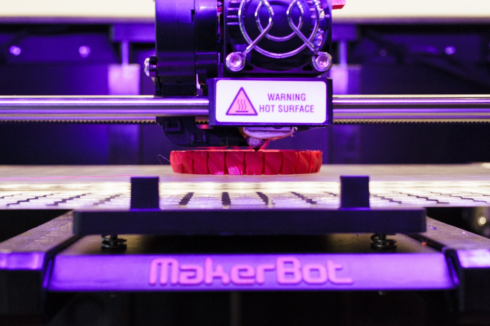
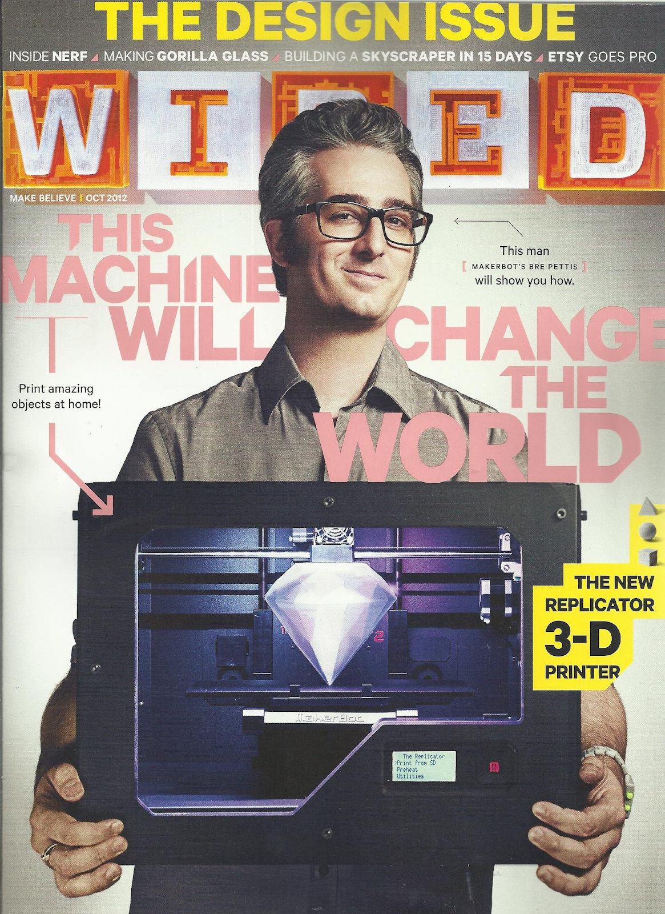
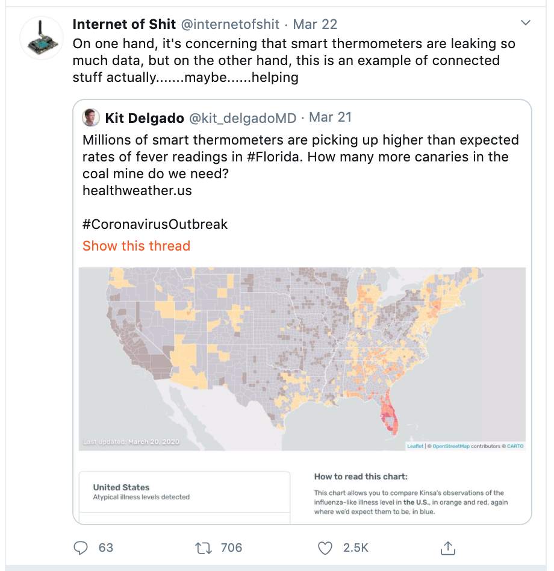

# 冠状病毒正在带回2012年被遗忘的技术趋势
## MOOC，3D打印机和智能体温计还有另一个时刻

> Photo: James Leynse/Getty Images


八年前的本月，Udacity首席执行官塞巴斯蒂安·特伦（Sebastian Thrun）粗暴地预言说，众所周知，教育将被大规模，开放，在线课程或MOOC颠覆。 同一个月（2012年3月），一家名为Kinsa的初创公司发明了一种“智能温度计”，可以利用“大数据”来追踪健康趋势。 九月份，布鲁克林的初创公司MakerBot推出了一款新型家用3D打印机，《连线》封面报道说“将改变世界”。 在肯塔基州上空的天空中，Google X在秘密测试巨型气球，以将互联网服务传送到农村地区。

多年来，这些平凡的希望被打破了。 由于很少有学生成功完成课程，Thrun在2017年宣布MOOC处于“死亡”状态，而Udacity则转向有偿职业培训。 金莎（Kinsa）幸免于难，但在大数据和与互联网连接的小工具的强烈反对下，实现个人健康革命的梦想没有实现。 MakerBot卖给了增材制造公司Stratasys，该公司很快放弃了在每个家庭中安装3D打印机的想法。 Google迅速将气球剥离成Alphabet的子公司Loon，其业务尚未开展。

被驳回的想法正在重新审视-这次不是出于乐观的乐观，而是更像是绝望。


随之而来的是一场全球性的大流行，这比任何一家初创公司都更突然地破坏了社会。 突然，那些被夸大了或无法实施而被驳回的大想法正在重新出现-这次不是出于乐观的乐观，而是更像是绝望。 尽管Covid-19掩盖了大范围的经济并导致数百万人失业，但它似乎正在重新振兴一个因垄断合并而沉闷而幻灭的技术行业，其承诺是“使世界变得更美好”。

MOOC可能仍然死了，但是由于Covid-19校园关闭，在线教育突然被推到了Thrun曾经设想的领导角色中。 全国各地的教师和教授都在争先恐后地将他们的课程放到网上，就像2012年各大学相互跳槽以与Courseda（Udacity的竞争对手）合作一样，后者承诺向所有人提供常春藤联盟的教育。

简短而令人失望的虚拟教室历史表明，一旦病毒消退，许多教育工作者就会大声疾呼要回到教室和讲台。 这场危机已经加剧了学生获得在线体验和资料的不平等现象。 尽管如此，被迫学习在线教学仍将使世界各地的教师获得未来可能会使用的新技能。 在某些情况下，这可能不是一个选择：与远程工作一样，对于金钱或空间有限的学校，远程教学可能会成为削减成本的选择。 作为下雪天，临时建筑关闭或未来爆发的后备选择，它也可能变得更加牢固。

谁将大写尚不清楚。 Coursera正在向世界各地的大学免费提供其更高版本的平台，与此同时，关于幸福感科学，英语为第二语言以及冠状病毒本身的课程入学人数激增。 学校正在注册Zoom帐户。 但是真正的赢家可能是像Pearson这样的大型教科书出版商，这些出版商已经在网上推广课程，现在有理由证明其供应合理。

试图利用大数据来预测爆发的技术也有片刻。 智能温度计公司Kinsa一直在出售有关客户位置和温度读数的数据，以帮助Clorox等商业客户确定广告支出目标。 这是收入，但这几乎不是一场革命。 尽管金莎说，对数据进行匿名化非常谨慎，但隐私权倡导者担心这种敏感信息的广泛收集。

突然之间，数据对人们的价值远远超出了漂白业务。 金莎（Kinsa）已发布了一张全国性的“健康天气图”，显示了发烧的地点，这可能是在确定冠状病毒热点的测试数据之前。 甚至专门模仿模仿“智能”小玩意的流行Twitter帐户Internet of Shit，也打破了角色，承认它是“实际上是互联的东西……也许……在帮助”的一个例子。


金莎只是一个例子。 回顾2012年：那是Google流感趋势的最后一年，它是一种基于搜索查询来预测流感季节严重程度的工具，受到了公共卫生界的高度重视。 《连线》杂志称这是一次“史诗般的失败”，因为它严重高估了2012-13流感季节及其后一个流感季节。 然而，快进到2020年，谷歌正在争夺唐纳德·特朗普总统冠状病毒计划的重要组成部分，因为它竞相建立一个网站，将人们使用Covid-19测试和公共卫生资源联系起来。

同时，疾病控制与预防中心（CDC）与微软合作建立了冠状病毒自我检查机器人，该机器人向人们询问有关其症状的问题，并提供从“待在家里照顾自己”到“ 拨打911。” 当时聊天机器人（曾经是热门技术趋势）似乎已不受欢迎。 值得一提的是，Apple与CDC和联邦紧急事务管理局（FEMA）合作开发了Covid-19应用程序。

2012年，无处不在的营销流行语是“ SoLoMo”，是社交，本地和移动的缩写。 这个想法是利用人们智能手机中有关他们的位置和社交网络的数据，以广告定位他们。 在公众日益关注在线隐私的过程中，大量涌入此类数据的公司被忽视了，但他们从未停止收集数据。

现在，他们正从木制品中爬出来，将他们的秘密监视改写为公共物品。 一家名为Unacast的公司根据其手机GPS数据数据库推出了“社交距离记分卡”。 另一个名为Tectonix GEO的推特发布了一个可视化图，显示了自当地爆发以来纽约人如何散布在全国各地，有可能加剧其传播。

在冠状病毒爆发之前，有关此类数据的丑闻使国会有动力制定更严格的联邦隐私法规。 现在，以遏制大流行的名义放弃了对隐私的担忧。 短期内可以理解：据报道，监视是一些国家相对成功的应对措施中的一项关键措施。 令人担心的是，就像9/11之后的恐怖主义威胁一样，美国和其他国家将以紧急情况为借口破坏公民自由。

关于大约在2012年的3D打印的字眼是，它可能引发“第三次工业革命”。 未来主义者宣称，当人们只需在自己家里打印所需物品时，制造就不再需要集中在工厂中了。 然而，自MakerBot联合创始人布雷·佩蒂斯（Bre Pettis）登上Wired封面以来的七年多时间里，3D打印实际上已经对当时的优点产生了好处：快速的桌面原型设计思想和更小规模的制造 无需建立常规的装配线。

从面罩到口罩再到医院呼吸机的个人防护用品的严重短缺，突显了该技术的另一个重要作用：当需求暂时超过常规生产能力时，这是一种救生的应急装置。 捷克3D打印制造商上载了一项设计，该设计可以让拥有3D打印机的任何人制作自己的面罩。 俄亥俄州的一家公司正在将其机器投入使用，可以拉出100,000个鼻拭子。 Stratasys是2014年收购MakerBot的公司，已启动了Covid-19响应网站，并与马萨诸塞州总医院共同发起一项创新挑战，以设计可打印的呼吸机。 就个人而言，甚至台式机爱好者也可以打印免提开门器之类的东西，以帮助与社会保持距离。

这些都无法使我们更接近彻底地重塑制造业。 但这增强了分布式制造的价值，并提醒我们家用3D打印机不仅仅是玩具。

至于Loon，这是Google母公司Alphabet的网络气球项目吗？ 经过八年的开发，直到本月为止，它尚未获得全球任何地方的商业测试的最终批准。 肯尼亚政府指出需要更好的通讯基础设施来对抗冠状病毒，因此很快就对Loon的批准进行了跟踪。 考虑到其他几个国家都处于观望状态，这可能标志着风的转变，使整个项目陷入了困境。 也就是说，假设它证明了自己的价值。

这些发明并非源于必要性，而是源于似乎一切皆有可能的时间和地点的繁荣。 除了卢恩（Loon）总是被称为月球外，他们没有寻求解决明确或紧急的社会需求，而是创造和填补了新的需求。 因此，他们在很大程度上失败了。

但是寻找问题的解决方案的事情是，有时他们最终会找到它。 公司发言人尼塔·尼赫鲁（Nita Nehru）在一封电子邮件中对OneZero表示：“金萨（Kinsa）成立时的使命就是，通过及早发现和早期响应来帮助阻止疾病传播。” “我们为将这一使命付诸行动感到自豪。”

这并不意味着智能温度计，在线教育，家用3D打印机或互联网气球将永远达到其创造者或2012年数字“福音主义者”所设想的高度。 忘记他们动摇的原因将是一个错误。 特别是，我们不应让暂时的危机通过无处不在的数字监控或我们的健康状况和位置永久侵蚀我们的个人隐私。

不过，在很多事情都无法解决的时候，很高兴看到一些以前从未真正起作用过的事情终于得以实现。 即使我们迫不及待想再次从他们那里继续前进。

有关新型冠状病毒和Covid-19的更多信息，请访问cdc.gov。
```
(本文翻译自Will Oremus的文章《Coronavirus Is Bringing Back the Forgotten Tech Trends of 2012》，参考：https://onezero.medium.com/coronavirus-is-bringing-back-the-forgotten-tech-trends-of-2012-2f80132daabf)
```
