如果您同意本文并希望美国政府采取行动，请签署白宫请愿书以实施“制止和打击舞弊”战略。
## 为我们争取时间与冠状病毒进行战斗，并通过锤子和舞蹈抑制器挽救数百万人的生命……
### 我们的医疗保健系统正在崩溃。 只会变得更糟。 缓解（“使曲线变平”）还不够。 我们必须…

如果您是该领域的专家，并且想批评或认可这篇文章或其中的某些部分，请随时在此处或上下文中留下私人注释，我将予以答复或解决。

如果您想翻译这篇文章，请在中型帖子上进行翻译，并在此处给我一个私人注释，并提供链接。 以下是当前可用的翻译：

法文中文（繁体）德文越南文

本文是一群全天候工作的普通市民辛勤工作的结果，目的是找到所有可用的相关研究，以将其整理成一份，以防它可以帮助其他人处理有关该物品的所有信息。 冠状病毒。

特别感谢卡尔朱诺博士（流行病学），布兰登·法恩斯塔德博士，皮埃尔·德坚，皮尔·阿尔瓦，约翰·许，Genevieve Gee，埃琳娜·贝利，克里斯·马丁内斯，亚瑟敏·德纳里，克里斯蒂娜·吉布森，马特·贝尔，丹·沃尔什，杰西卡·汤普森，卡里姆 Ravji，Annie Hazlehurst和Aishwarya Khanduja。 这是团队的努力。

也感谢Berin Szoka，Shishir Mehrotra，QVentus，Illumina，Josephine Gavignet，Mike Kidd和Nils Barth的建议。 感谢我的公司Course Course，让我有时间和自由地专注于此。
# 冠状病毒：锤子和舞蹈
## 如果领导者给我们时间，接下来的18个月会是什么样子

本文遵循冠状病毒：为什么必须立即采取行动，这篇文章将4000万浏览量翻译成20多种语言，描述了冠状病毒问题的紧迫性。 如果您同意本文，请考虑签署相应的白宫请愿书。 底部提供4种语言的翻译版本。

文章摘要：如今，强有力的冠状病毒措施只能持续数周，此后不应再出现很大的感染高峰，并且所有这些都可以为社会付出合理的代价，从而挽救数百万人的生命。 如果我们不采取这些措施，由于医疗保健系统将崩溃，数以千万计的人将被感染，许多人将与其他需要重症监护的人一起死亡。

一周之内，世界各地的国家已经从：“这件冠状病毒事关大事”变成了宣布紧急状态。 然而，许多国家仍然没有做很多事情。 为什么？

每个国家都在问同样的问题：我们应该如何回应？ 答案对他们而言并不明显。

此后，法国，西班牙或菲律宾等一些国家已下令严厉封锁。 美国，英国，瑞士或荷兰等其他国家则拖延了脚步，不愿冒险采取社会疏远措施。

这是我们今天要讨论的内容，再次提供了许多图表，数据和具有大量来源的模型：
+ 目前情况如何？
+ 我们有什么选择？
+ 现在最重要的一件事是：时间
+ 一个好的冠状病毒策略是什么样的？
+ 我们应如何考虑经济和社会影响？

阅读完本文后，您将获得以下内容：

我们的医疗体系已经崩溃了，国家有两种选择：要么现在就在与之抗争，要么将遭受大规模的流行病;如果选择这种流行病，数十万人将丧生。 在一些国家，数以百万计的人甚至可能无法消除进一步的感染浪潮。如果我们现在努力奋斗，我们将遏制死亡，我们将减轻我们的医疗保健系统，我们将做得更好，我们将学习，世界从未学到 我们需要它，因为我们对该病毒知之甚少。所有这些都将实现至关重要的事情：为我们争取时间。

如果我们选择艰苦奋斗，那么斗争将是突然的，然后是渐进的。我们将被锁定数周而不是几个月，然后，我们将获得越来越多的自由，这可能不会立即恢复正常。 但这将很快结束，并最终恢复正常。我们也可以在考虑经济其他方面的同时做到这一点。

好吧，让我们这样做。
# 1.情况如何？

上周，我显示了此曲线：
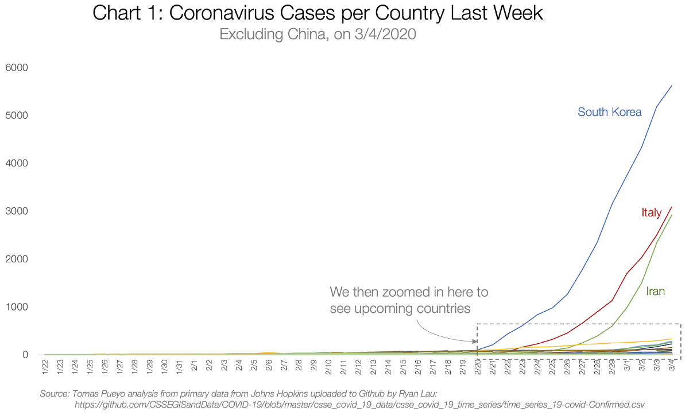

它显示了中国以外世界各地的冠状病毒病例。 我们只能看到意大利，伊朗和韩国。 因此，我必须放大右下角才能看到新兴国家。 我的意思是，他们很快将加入这3个案例。

让我们看看发生了什么。
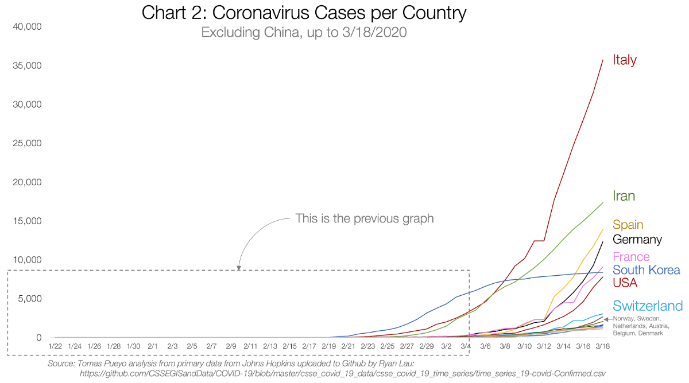

如预测的那样，在数十个国家中病例数激增。 在这里，我被迫只展示有1000多个案例的国家。 注意事项：
+ 西班牙，德国，法国和美国下令封锁的案件均比意大利多
+ 如今，受封锁的国家比湖北还多，有16个国家：日本，马来西亚，加拿大，葡萄牙，澳大利亚，捷克，巴西和卡塔尔的案件多于湖北，但不到1000个。 瑞士，瑞典，挪威，奥地利，比利时，荷兰和丹麦的案件均超过1,000起。

您是否注意到这个国家/地区列表有些奇怪？ 在遭受大规模，不可否认爆发的中国和伊朗以及巴西和马来西亚之外，该名单中的每个国家都是世界上最富有的国家之一。

您认为这种病毒针对富裕国家吗？ 还是富裕国家更有可能更好地识别该病毒？

较贫穷的国家不太可能不会受到影响。 温暖潮湿的天气可能有所帮助，但并不能阻止爆发本身，否则新加坡，马来西亚或巴西就不会遭受爆发。

最可能的解释是，冠状病毒可能需要较长的时间才能到达这些国家，因为它们之间的联系较少，或者已经存在，但是这些国家没有足够的投资来进行检测。

无论哪种方式，如果这是事实，那就意味着大多数国家都不会逃脱冠状病毒。 他们看到爆发并需要采取措施只是时间问题。

不同国家可以采取哪些措施？
# 2.我们有什么选择？

自上周发表文章以来，对话已发生变化，许多国家已采取措施。 以下是一些最具说明性的示例：
## 西班牙和法国的措施

在一个极端中，我们有西班牙和法国。 这是西班牙采取措施的时间表：

3/12星期四，总统驳回了有关西班牙当局一直低估健康威胁的建议。星期五，他们宣布进入紧急状态。星期六，采取了以下措施：
+ 人们不能离开家，除非有以下关键原因：杂货，工作，药房，医院，银行或保险公司（极端理由）
+ 明确禁止带孩子出去散步或去见朋友或家人（除了照顾需要帮助的人，但要有卫生和身体上的距离措施）
+ 所有酒吧和餐馆都关闭了。 只能带回家。
+ 所有娱乐场所关闭：体育，电影，博物馆，市政庆典...
+ 婚礼不能有客人。 丧葬人数不能超过几个。
+ 大众运输仍然开放

星期一，陆地边界被关闭。

有人认为这是一个很好的措施清单。 其他人则举起双手，绝望地哭泣。 本文将尝试解决这种差异。

法国的措施时间表很相似，只是法国花费了更多的时间来实施这些措施，而且它们现在更具侵略性。 例如，小型企业的租金，税金和公用事业被暂停。
## 美国和英国的措施

美国和英国像瑞士或荷兰等国家一样，在实施措施方面也拖延了脚步。 这是美国的时间表：
+ 3/11星期三：旅行禁令。
+ 星期五：宣布国家紧急状态。 没有社会疏远措施
+ 星期一：政府敦促公众避开餐厅或酒吧，并参加超过10人的活动。 实际上，没有任何社会疏远措施可以执行。 这只是一个建议。

许多州和城市正在采取主动行动，并要求采取更为严格的措施。

英国也看到了一系列类似的措施：很多建议，但授权却很少。

这两类国家说明了与冠状病毒作斗争的两种极端方法：缓解和抑制。 让我们了解它们的意思。
## 选项1：什么都不做

在此之前，让我们来看看对像美国这样的国家不采取任何行动是什么：
![This fantastic epidemic calculator can help you understand what will happen under different scenarios. I’ve pasted below the graph the key factors that determine the behavior of the virus. Note that infected, in pink, peak in the tens of millions at a certain date. Most variables have been kept from the default. The only material changes are R from 2.2 to 2.4 (corresponds better to currently available information. See at the bottom of the epidemic calculator), fatality rate (4% due to healthcare system collapse. See details below or in the previous article), length of hospital stay (down from 20 to 10 days) and hospitalization rate (down from 20% to 14% based on severe and critical cases. Note the WHO calls out a 20% rate) based on our most recently available gathering of research. Note that these numbers don’t change results much. The only change that matters is the fatality rate.](1!TO2056gWgab1vnkHLIACkA.png)
> This fantastic epidemic calculator can help you understand what will happen under different scenarios. I’ve pasted below the graph the key factors that determine the behavior of the virus. Note that infected, in pink, peak in the tens of millions at a certain date. Most variables have been kept from the default. The only material changes are R from 2.2 to 2.4 (corresponds better to currently available information. See at the bottom of the epidemic calculator), fatality rate (4% due to healthcare system collapse. See details below or in the previous article), length of hospital stay (down from 20 to 10 days) and hospitalization rate (down from 20% to 14% based on severe and critical cases. Note the WHO calls out a 20% rate) based on our most recently available gathering of research. Note that these numbers don’t change results much. The only change that matters is the fatality rate.


如果我们什么都不做：每个人都被感染，医疗保健系统将不堪重负，死亡率激增，约一千万人丧生（蓝色竖条）。 举个例子，如果大约75％的美国人被感染而4％的人死亡，那就是1000万人的死亡，大约是第二次世界大战中美国死亡人数的25倍。

您可能会想：“这听起来很多。 我所听到的远不止于此！”

那么有什么收获呢？ 有了这些数字，您很容易感到困惑。 但是只有两个数字很重要：感染病毒并患病的人数比例以及死亡人数。 如果只有25％患病（因为其他人患有病毒，但没有症状，因此不算作病例），并且死亡率是0.6％而不是4％，那么在美国您将有50万人死亡。 仍然庞大。 但是比上面少20倍。

死亡率是至关重要的，所以让我们更好地了解它。 什么真正导致冠状病毒死亡？
## 我们应该如何考虑死亡率？

这是与以前相同的图表，但是现在查看的是住院患者，而不是感染者和死亡者：
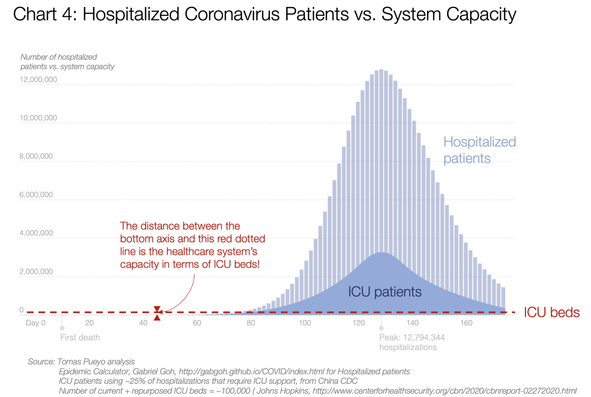

浅蓝色区域表示需要去医院的人数，深蓝色区域表示需要去重症监护病房（ICU）的人数。 您可以看到该数字将达到300万以上的峰值。

现在，将其与我们在美国拥有的ICU床数量进行比较（今天为5万张，我们可以将其用于其他空间的数量增加一倍）。 那是红色的虚线。

不，那不是错误。

红色虚线表示我们拥有ICU病床的容量。 该线以上的每个人都处于危急状态，但将无法获得他们所需的护理，甚至可能死亡。

除了ICU床外，您还可以查看呼吸机，但结果大致相同，因为美国的呼吸机少于10万。

截止到今天，至少有一家西雅图医院由于设备短缺而无法为65岁以上的患者插管，并使他们有90％的死亡机会。

这就是为什么人们在湖北成群结队死亡，而现在在意大利和伊朗成群结队死亡的原因。 湖北的病死率最终好于预期，因为他们几乎在一夜之间建立了两家医院。 意大利和伊朗无法做到这一点； 很少有其他国家能做到的。 我们将在那里看到最终的结果。

那么为什么病死率接近4％呢？

如果您的病例中有5％需要重症监护而您无法提供，那么大多数人会丧生。 就如此容易。

此外，最近的数据表明，美国的案件比中国的案件更为严重。 我希望就是这样，但事实并非如此。
## 附带损害

这些数字仅显示死于冠状病毒的人。 但是，如果冠状病毒患者使您的所有医疗系统崩溃，会发生什么？ 其他人也因其他疾病而死亡。

如果您有心脏病发作，但救护车只需50分钟即可到达，而不是8分钟（冠状病毒病例过多），怎么办？一旦到达，就没有ICU，也没有医生可用？ 你完蛋了。

在美国，每年有400万人进入ICU，其中有50万人（〜13％）死亡。 如果没有ICU病床，该份额可能会接近80％。 即使只有50％的人死亡，在一年的流行病中，每年的死亡人数也从50万增加到200万，因此，加上附带损害，您的死亡人数就增加了150万。

如果冠状病毒继续传播，美国医疗体系将崩溃，死亡人数将达数百万，甚至超过一千万。

对于大多数国家来说，同样的想法是正确的。 ICU病床，呼吸机和医护人员的数量通常与美国相似，或者在大多数国家中较低。 无节制的冠状病毒意味着医疗系统崩溃，这意味着大规模死亡。

无节制的冠状病毒意味着医疗系统崩溃，这意味着大规模死亡。
## 选项2：缓解策略

到现在为止，我希望我们已明确采取行动。 我们拥有的两个选择是缓解和抑制。

缓解措施是这样的：“现在无法预防冠状病毒，所以就让它顺其自然，同时努力减少感染高峰。 让我们稍微弄平曲线，使其对医疗保健系统更易于管理。”
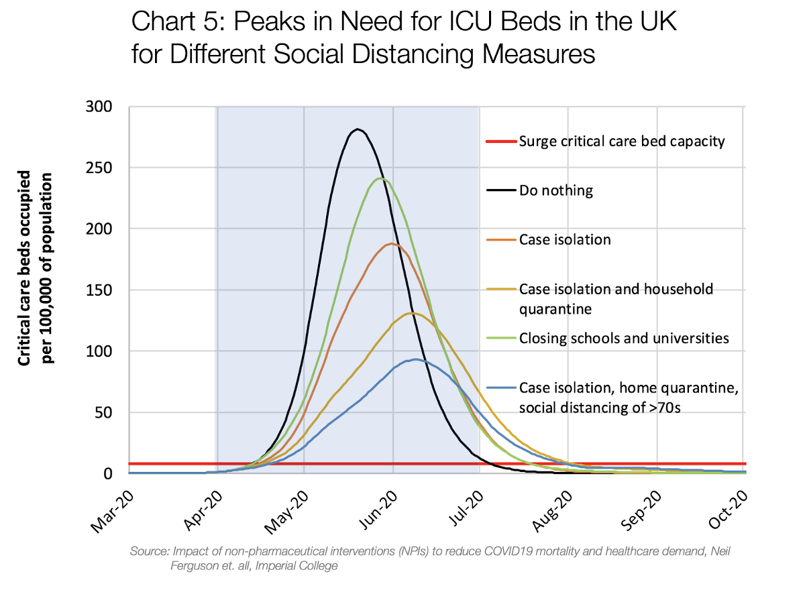

该图表出现在伦敦帝国理工学院上周末发表的非常重要的论文中。 显然，这促使英国和美国政府改变了路线。

与上一张非常相似。 不一样，但在概念上是等效的。 在这里，“什么都不做”的情况就是黑色曲线。 如果我们实施越来越严格的社会疏离措施，那么其他每条曲线都会发生。 蓝色的代表了最严厉的社会疏远措施：隔离感染者，隔离可能感染的人以及隔离老年人。 蓝线大致上是当前英国的冠状病毒策略，尽管目前他们只是在建议而不是强制执行。

再次，红线是这一次在英国的ICU容量。 同样，那条线非常接近底部。 红线上方的所有曲线区域代表冠状病毒患者，这些患者大多会因缺乏ICU资源而死亡。

不仅如此，而且通过使曲线变平，ICU会塌陷数月，从而增加附带损害。

你应该感到震惊。 当您听到：“我们将采取一些缓解措施”时，您真正应该听到的是：“我们将故意压倒医疗保健系统，将病死率至少提高10倍。”

您会想象这已经够糟糕了。 但是我们还没有完成。 因为此策略的主要假设之一是所谓的“ Herd Immunity”。
## 牛群免疫和病毒变异

这个想法是，所有被感染然后康复的人现在都对这种病毒免疫。 这是该策略的核心：“看，我知道这将在一段时间内变得困难，但是一旦我们完成工作，几百万人死亡，我们其余人将对此免疫，因此 停止传播，我们将告别冠状病毒。 最好一次完成并完成它，因为我们的替代方法是进行长达一年的社交疏远，否则就有可能在稍后发生此高峰的风险。”

除此之外，我们假设的是一件事：病毒的变化不会太大。 如果变化不大，那么很多人的确会获得免疫力，在某些时候，流行病会死亡

这种病毒突变的可能性有多大？ 它已经有。

中国已经发现了两种病毒：S和L。S集中在湖北和更致命的地方，但L是在世界范围内传播的。

不仅如此，而且这种病毒还在继续变异。

> This graph represents the different mutations of the virus. You can see that the initial strains started in purple in China, but then they started mutating. The strains in Europe are mostly green and yellow families, while the US is seeing a different family in red. As more time passes, more of these strains will start appearing.


这不足为奇：像冠状病毒或流感这样的基于RNA的病毒突变的速度往往比基于DNA的突变快约100倍-尽管冠状病毒的突变速度比流感病毒慢。

不仅如此，这种病毒变异的最佳方法是拥有数百万次的机会，这正是缓解策略所能提供的：数亿人被感染。

因此，您每年都必须注射流感疫苗。 因为有太多的流感病毒株，而且总是有新的流感株出现，所以流感疫苗永远无法抵御所有的菌株。

换句话说，缓解策略不仅假设美国或英国这样的国家有数百万人死亡。 它也赌注事实是该病毒不会突变太多，而我们知道确实如此。 而且它将为它提供变异的机会。 因此，一旦我们完成了几百万人的死亡，我们可以为每年增加几百万人做好准备。 这种日冕病毒可能像流感一样成为生活中反复出现的事实，但致命性却高出许多倍。

这种病毒变异的最佳方法是拥有数百万的机会，这正是缓解策略所能提供的。

因此，如果什么都不做，缓解不起作用，那有什么选择呢？ 这就是抑制。
## 选项3：抑制策略

缓解策略并没有试图遏制这种流行病，只是使曲线变平了一点。 同时，“遏制战略”试图采取严厉措施，以迅速控制这一流行病。 特别：
+ 现在努力吧。 命令严重的社会疏远。 控制住这件事。
+ 然后，释放这些措施，使人们逐渐恢复自由，一些可以恢复正常的社会和经济生活的事物将得以恢复。

看起来像什么？
![All the model parameters are the same, except that there is an intervention around now to reduce the transmission rate to R=0.62, and because the healthcare system isn’t collapsed, the fatality rate goes down to 0.6%. I defined “around now” as having ~32,000 cases when implementing the measures (3x the official number as of today, 3/19). Note that this is not too sensitive to the R chosen. An R of 0.98 for example shows 15,000 deaths. Five times more than with an R of 0.62, but still tens of thousands of deaths and not millions. It’s also not too sensitive to the fatality rate: if it’s 0.7% instead of 0.6%, the death toll goes from 15,000 to 17,000. It’s the combination of a higher R, a higher fatality rate, and a delay in taking measures that explodes the number of fatalities. That’s why we need to take measures to reduce R today. For clarification, the famous R0 is R at the beginning (R at time 0). It’s the transmission rate when nobody is immune yet and there are no measures against it taken. R is the overall transmission rate.](1!UeKXgacW7ruih10qYVYa5w.png)
> All the model parameters are the same, except that there is an intervention around now to reduce the transmission rate to R=0.62, and because the healthcare system isn’t collapsed, the fatality rate goes down to 0.6%. I defined “around now” as having ~32,000 cases when implementing the measures (3x the official number as of today, 3/19). Note that this is not too sensitive to the R chosen. An R of 0.98 for example shows 15,000 deaths. Five times more than with an R of 0.62, but still tens of thousands of deaths and not millions. It’s also not too sensitive to the fatality rate: if it’s 0.7% instead of 0.6%, the death toll goes from 15,000 to 17,000. It’s the combination of a higher R, a higher fatality rate, and a delay in taking measures that explodes the number of fatalities. That’s why we need to take measures to reduce R today. For clarification, the famous R0 is R at the beginning (R at time 0). It’s the transmission rate when nobody is immune yet and there are no measures against it taken. R is the overall transmission rate.


在压制策略下，第一波浪过后，死亡人数是数千，而不是数百。

为什么？ 因为我们不仅减少了案例的指数增长。 由于医疗保健系统并未完全淹没，因此我们也降低了死亡率。 在这里，我使用的死亡率是0.9％，大约是我们今天在韩国看到的死亡率，这在实施抑制策略时最有效。

这样说，听起来很容易。 每个人都应遵循抑制策略。

那么为什么有些政府会犹豫呢？

他们担心三件事：
+ 第一次锁定将持续数月，这对于许多人来说似乎是无法接受的。
+ 长达数月的封锁将破坏经济。
+ 它甚至无法解决问题，因为我们只是将这一流行病推迟了：稍后，一旦我们发布社会疏离措施，人们仍然会被成千上万的人感染并死亡。

帝国理工学院的团队是如何对镇压进行建模的。 绿线和黄线是不同的抑制方案。 您会发现这种情况看起来并不好：我们仍然会遇到巨大的高峰，那为什么还要麻烦呢？
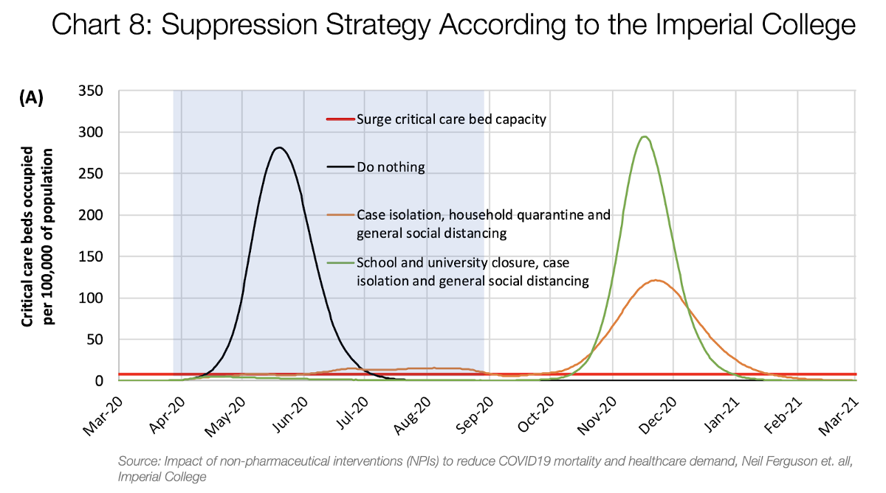

我们稍后会解决这些问题，但之前还有一些更重要的事情。

这完全没有意义。

像这样呈现，缓解和抑制这两个选项并排看起来并不吸引人。 要么很多人很快就死了，我们今天不伤害经济，或者我们今天伤害了经济，只是为了推迟死亡。

这忽略了时间的价值。
# 3.时间的价值

在上一篇文章中，我们解释了挽救生命的时间价值。 每天，我们等待采取措施的每一小时，这种指数威胁都在继续蔓延。 我们看到了一天如何可以将总病例减少40％，将死亡人数减少更多。

但是时间比那更有价值。

我们将面临有史以来医疗体系面临的最大压力。 我们完全没有准备，面对一个我们不认识的敌人。 那不是战争的好位置。

如果您将要面对最大的敌人，而您对此知之甚少，并且有两种选择，该怎么办：要么朝着它奔跑，要么逃避为自己腾出一点时间做准备。 你会选哪一个？

这就是我们今天要做的。 世界已经觉醒。 每一天，我们延迟冠状病毒，我们都可以做得更好。 接下来的部分详细说明了当时的购买力：
## 减少案件数量

如我们上周在湖北看到的那样，有了有效的制止，真实病例的数量将在一夜之间暴跌。
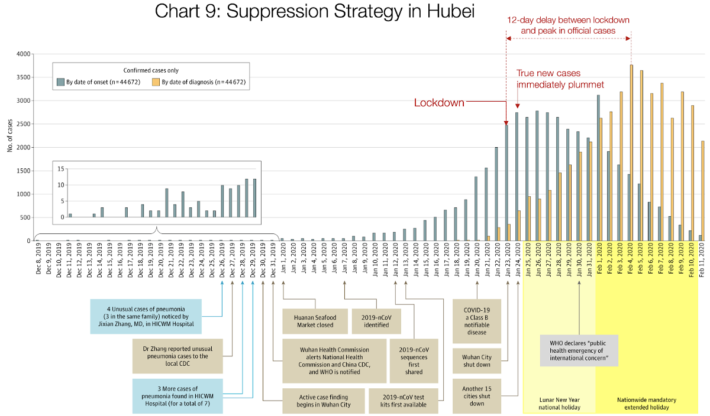
> Source: Tomas Pueyo analysis over chart and data from the Journal of the American Medical Association


截至今天，湖北整个6000万大区域每天有0例冠状病毒新病例。

诊断将持续上升几个星期，但随后它们将开始下降。 更少的情况下，病死率也开始下降。 而且附带损害也减少了：由于医疗体系简直不堪重负，死于与非冠状病毒无关的原因的人数将减少。

抑制将使我们：
+ 冠状病毒病例总数减少
+ 立即减轻卫生保健系统及其运行人员的负担
+ 降低死亡率
+ 减少附带损害
+ 感染，隔离和隔离的医护人员有能力康复并恢复工作。 在意大利，医护人员占所有传染病的8％。
## 了解真正的问题：测试和跟踪

目前，英国和美国对他们的真实情况一无所知。 我们不知道有多少。 我们只知道官方数字不正确，真正的数字是成千上万的案件。 发生这种情况是因为我们没有测试，也没有追踪。
+ 再过几周，我们就可以整理测试情况，并开始对每个人进行测试。 有了这些信息，我们最终将知道问题的真正范围，需要在哪里采取更加积极的行动以及哪些社区可以安全地从锁定中释放出来。
+ 新的测试方法可以加快测试速度，并大幅降低成本。
+ 我们还可以像在中国或其他东亚国家/地区中一样，建立寻人机构，在那里他们可以识别每个病者遇到的所有人，并可以将他们隔离。 这将为我们提供大量的情报，以便稍后发布有关社会隔离措施的信息：如果我们知道病毒在哪里，我们就只能针对这些地方。 这不是火箭科学：这是东亚国家如何能够控制这次疫情而又没有其他国家日益严重的那种严峻的社会距离的基础。

undefined
## 建设能力

美国（大概是英国）将在没有装甲的情况下进行战争。

我们只有两个星期的口罩，个人防护设备很少，通风机不足，ICU床位数不足，ECMO（血液氧合机）不足……这就是为什么在缓解策略中死亡率如此之高的原因 。

但是，如果我们花一些时间自己买，我们可以解决这个问题：
+ 我们有更多时间购买未来浪潮所需的所有设备
+ 我们可以快速建立口罩，个人防护设备，呼吸机，ECMO和其他任何重要设备的生产，以降低死亡率。

换句话说：我们不需要几年的时间来获得装甲，我们需要数周。 让我们尽一切可能使我们的生产变得嗡嗡作响。 国家动员起来。 人们正在发挥创造力，例如将3D打印用于呼吸机零件。 我们可以做到这一点。 我们只需要更多时间。 在面对致命的敌人之前，您是否需要等待几周才能获得一些盔甲？

这不是我们需要的唯一能力。 我们将尽快需要卫生工作者。 我们从哪里得到它们？ 我们需要培训人员以协助护士，还需要让医务人员退休。 许多国家已经开始，但这需要时间。 我们可以在几周内做到这一点，但是如果一切都崩溃了，那是不可能的。
## 降低公众传染性

公众感到害怕。 冠状病毒是新的。 我们还不知道怎么办！ 人们还没有学会停止握手。 他们仍然拥抱。 他们没有用肘打开门。 他们在触摸门把手后不会洗手。 他们在坐前不对桌子消毒。

一旦有了足够的口罩，我们也可以在医疗保健系统之外使用它们。 目前，最好为医护人员保留口罩。 但是，如果不稀缺，人们应该在日常生活中佩戴它们，这样一来，他们生病时感染他人的可能性就会降低，并且经过适当的培训还可以减少佩戴者被感染的可能性。 （与此同时，穿什么总比没有好。）

所有这些都是降低传输速率的非常便宜的方法。 该病毒传播的次数越少，我们将来需要采取的措施就越少。 但是我们需要时间对人们进行所有这些措施的教育并为其配备设备。
## 了解病毒

我们对该病毒知之甚少。 但是每周都有数百篇新论文到来。
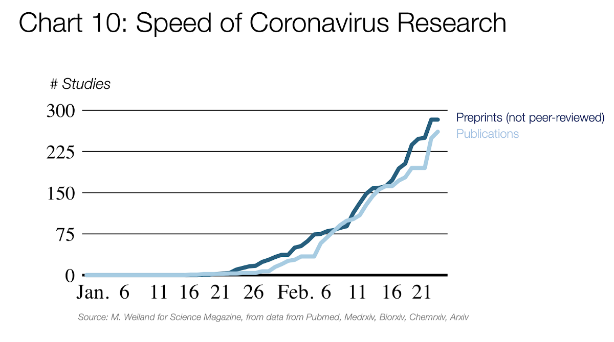

世界终于团结起来对抗一个共同的敌人。 全球研究人员正在动员以更好地了解这种病毒。

病毒如何传播？如何减慢传染速度？无症状携带者所占份额是多少？它们具有传染性吗？ 多少钱？什么是好的治疗方法？它能存活多长时间？在什么表面上？不同的社会隔离措施如何影响传播率？它们的成本是多少？追踪最佳实践的方法是什么？测试的可靠性如何？

对这些问题的明确答案将有助于使我们的响应尽可能有针对性，同时最大程度地减少附带的经济和社会损失。 他们将在几周内，而不是几年内到来。
## 寻找治疗

不仅如此，如果我们在接下来的几周内找到治疗方法，该怎么办？ 我们购买的任何一天都使我们更接近这一点。 目前，已经有几种候选药物，例如Favipiravir或Chloroquine。 如果事实证明，在两个月内我们发现了一种冠状病毒的治疗方法呢？ 如果我们在采取缓解策略后已经有数百万的死亡，我们会显得多么愚蠢？
## 了解成本效益

以上所有因素均可帮助我们挽救数百万生命。 那应该足够了。 不幸的是，政客们不仅会考虑被感染者的生活。 他们必须考虑所有人口，繁重的社会疏远措施会影响其他人。

目前，我们不知道不同的社会隔离措施如何减少传播。 我们也不知道他们的经济和社会成本是多少。

如果我们不知道它们的成本或收益，那么决定我们长期需要的措施是否有点困难？

几周后，我们将有足够的时间开始学习它们，理解它们，确定它们的优先级并决定要遵循哪些。

更少的案例，更多的了解问题，积累资产，了解病毒，了解各种措施的成本效益，教育公众……这些是抵抗病毒的一些核心工具，我们只需要几个星期的时间就可以开发出许多 其中。 承诺采取一种战略，使我们毫无准备地陷入敌人的下巴，这不是很愚蠢吗？
# 4.锤子与舞蹈

现在我们知道，缓解策略可能是一个糟糕的选择，并且抑制策略具有巨大的短期优势。

但是人们对此策略有合理的担忧：
+ 实际上会持续多久？
+ 它要多少钱？
+ 如果我们什么都没做，还会有第二个高峰吗？

在这里，我们将研究一个真正的抑制策略。 我们可以将其称为“锤子与舞蹈”。
## 锤子

首先，您要迅速而积极地采取行动。 由于上面提到的所有原因，给定时间的价值，我们希望尽快中止此事情。
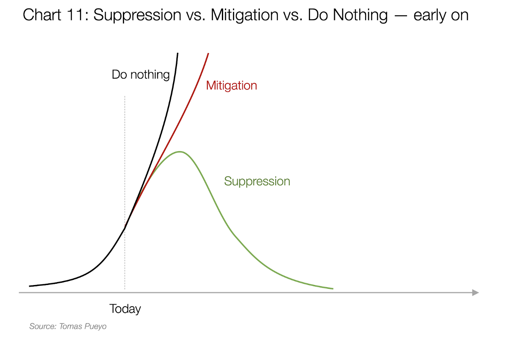

最重要的问题之一是：持续多长时间？

每个人都担心，随着随之而来的经济灾难和精神崩溃，我们将一次被关在家里几个月。 不幸的是，这个想法在著名的帝国学院论文中得到了招待：


你还记得这张图吗？ 从3月底到8月底的淡蓝色区域是本文推荐的“锤子”时期，其中包括严重的社会距离。

undefined

但这不是必须的。 这份针对当今驾驶政策的论文因存在核心缺陷而遭到残酷的批评：他们忽略了联系追踪（在韩国，中国或新加坡等政策的核心）或旅行限制（在中国至关重要），忽略了大批人群的影响 …

锤子需要的时间是几周，而不是几个月。
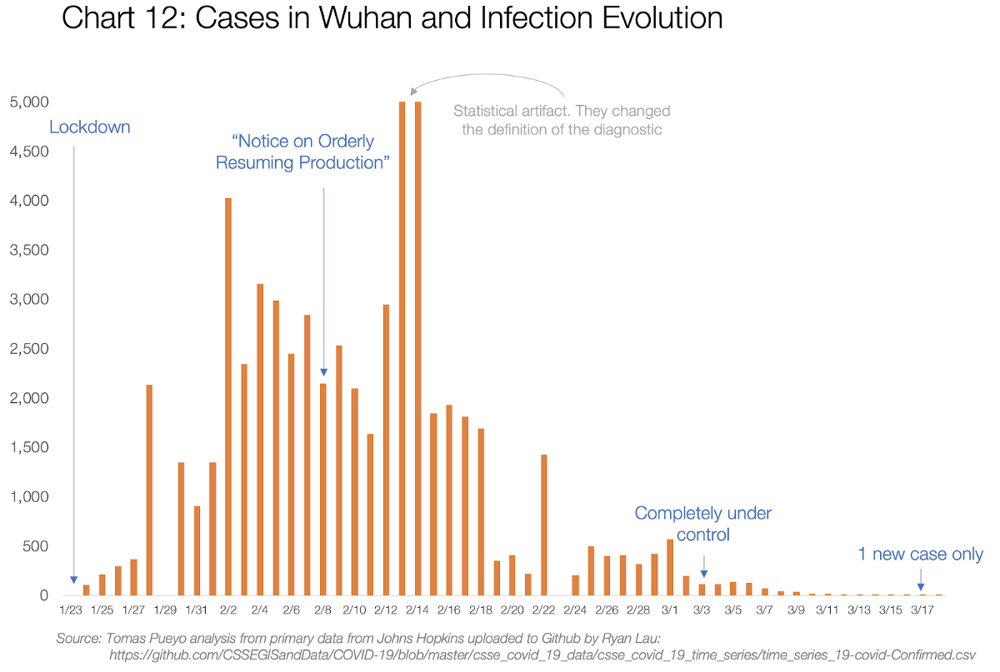

该图显示了自1/23以来每天湖北地区的新病例（6000万人）。 在2周内，该国开始恢复工作。 在约5周内，它已完全受到控制。 在7周内，新的诊断方法只是a花一现。 让我们记住这是中国最糟糕的地区。

再次记住，这些是橙色条。 真实情况下的灰色条早就暴跌了。

undefined

我们可以在家里呆几周以确保数百万人不会死亡吗？ 我想我们可以。 不过，这取决于接下来发生的事情。
## 舞蹈

如果您对冠状病毒进行锤击，那么在几周之内您就可以控制它，并且您将可以更好地应对它。 现在需要长期的努力来控制这种病毒，直到有疫苗为止。
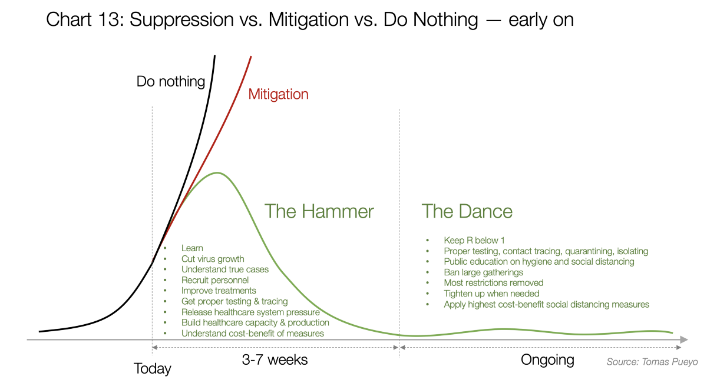

这可能是人们在考虑此阶段时犯下的最大，最重要的错误：他们认为它将使他们待在家里几个月。 事实并非如此。 实际上，我们的生活可能会恢复正常。
## 成功国家的舞蹈

在韩国，新加坡，台湾和日本，有很长的案件是怎么发生的？在韩国，成千上万的案件却没有被关在家里？
## 冠状病毒：韩国看到了“稳定趋势”
### 韩国外交大臣姜京华说，她认为早期测试一直是韩国经济低迷的关键。

在此视频中，韩国外相解释了韩国的做法。 这非常简单：有效的测试，有效的跟踪，旅行禁令，有效的隔离和有效的隔离。

本文介绍了新加坡的做法：
## 中断COVID-19的传播：新加坡遏制工作的经验教训
### 突出。 尽管多次进口导致当地的传播链，新加坡仍然能够控制…

想猜测他们的措施吗？ 与韩国相同。 在他们的情况下，他们为隔离和旅行禁令和延误提供了经济帮助。

对于其他国家来说为时已晚？ 不会。通过应用锤子，您将获得新的机会，并且可以正确地做到这一点。

但是，如果所有这些措施还不够呢？
## R之舞

我将锤子和疫苗之间的长达数月的时间称为舞蹈，因为这期间的措施永远不会相同。 有些地区会再次爆发，而其他地区则不会很长一段时间。 根据情况的演变，我们将需要加强社会疏离措施，或者我们将能够释放这些措施。 这就是R的舞步：经济与医疗保健之间的一种舞步，它使我们的生活重回正轨并传播疾病。

这种舞蹈如何运作？

所有这些都绕着R旋转。如果您还记得的话，那就是传输速率。 在一个标准的，没有准备的国家中，早期感染率大约在2到3之间：在有人感染的几周内，他们平均感染另外2到3个其他人。

undefined

在“锤子”行动期间，目标是使R尽可能快地接近零，以消除流行病。 在武汉，计算得出的R最初为3.9，在锁定和集中隔离后，R下降到0.32。

但是一旦您跳入舞蹈中，就无需再这样做了。 您只需要将R保持在1以下即可。只需执行一些简单的措施就可以完成很多操作
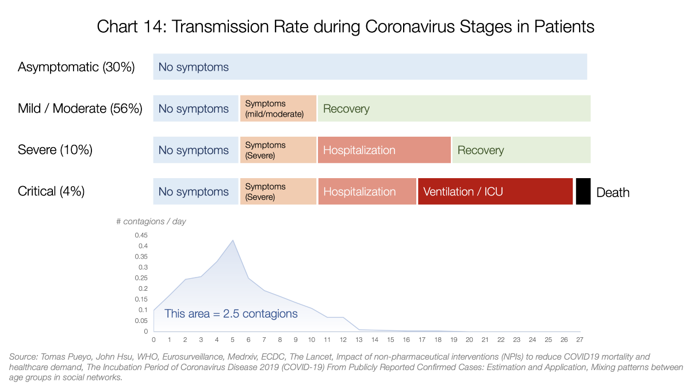
> Detailed data, sources and assumptions here


这是不同类型的患者对病毒的反应方式以及其传染性的近似值。 没人知道这条曲线的真实形状，但是我们已经从不同的论文中收集了数据，以近似其外观。

感染病毒后，人们每天都有一定的传播潜力。 所有这些传染病天加起来平均平均有2.5传染病。

undefined

例如，您早期感染了病毒但没有症状，因此您的行为正常。 与人交谈时，会传播病毒。 当您触摸鼻子然后打开门把手时，下一个打开门并触摸鼻子的人会被感染。

病毒在您体内繁殖的越多，您的感染力就越大。 然后，一旦出现症状，您可能会慢慢停止上班，卧床休息，戴口罩或开始就医。 症状越大，您与社交的距离就越远，从而减少了病毒的传播。

一旦住院，即使您具有极强的传染性，您也不会因为自己被隔离而传播那么多病毒。

在这里，您可以看到新加坡或韩国等政策的巨大影响：
+ 如果人们经过大量测试，则甚至可以在症状出现之前就将其识别出来。 被隔离，他们什么也不能传播。
+ 如果人们受过训练以及早发现症状，则他们可以减少蓝色的工作天数，从而降低总体传染性
+ 如果人们一出现症状就被隔离，橙色相的传染就会消失。
+ 如果人们受过有关个人距离，戴口罩，洗手或消毒空间的教育，那么在整个时期内，他们传播的病毒较少。

只有当所有这些都失败时，我们才需要采取更大的社会隔离措施。
## 社会距离的投资回报率

undefined

有一些非常便宜的方法可以做到这一点，例如禁止超过一定人数（例如50、500）的人参加活动，或者要求人们在可能的情况下在家工作。

其他的则要贵得多，例如关闭学校和大学，要求所有人呆在家里或关闭酒吧和餐馆。
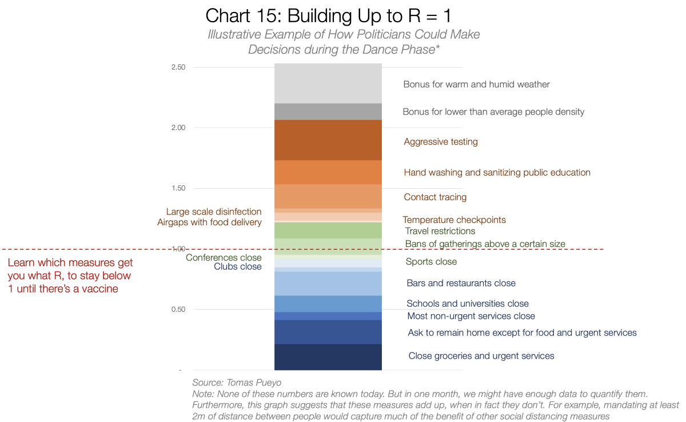

该图表已编入，因为今天不存在。 没有人对此进行足够的研究或以可以比较它们的方式将所有这些措施组合在一起。

不幸的是，因为这是政客做出决定所需的最重要的单个图表。 它说明了他们思想中真正发生的事情。

在“锤子”时期，他们希望尽可能降低，同时仍能承受。 在湖北，他们一路攀升至0.32。 我们可能不需要：可能只是0.5或0.6。

但是在R的“ Dance”期间，他们希望将鼠标悬停在尽可能接近1的位置，同时长期保持在该水平以下。

这意味着无论领导者是否意识到这一点，他们在做什么：
+ 列出他们可以采取的减少R的所有措施
+ 了解应用它们的好处：R的减少
+ 了解其成本：经济和社会成本。
+ 根据成本效益对计划进行排名
+ 选择那些将R减少最大到1的那些，以最低的成本。
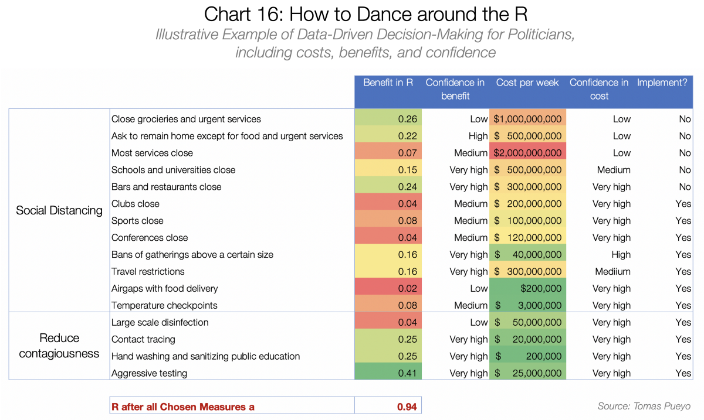
> This is for illustrative purposes only. All data is made up. However, as far as we were able to tell, this data doesn’t exist today. It needs to.


最初，他们对这些数字的信心将很低。 但这仍然是他们的思考方式-应该考虑这一点。

他们需要做的是使过程正式化：了解这是一个数字游戏，我们需要尽快学习我们在R上的位置，每项措施对降低R的影响以及它们的社会和经济成本。

只有这样，他们才能对应该采取的措施做出理性的决定。
# 结论：给我们买时间

冠状病毒仍在几乎各处传播。 152个国家有病例。 我们不分昼夜。 但是我们不必如此：有一种清晰的方法可以考虑这一点。

有些国家，尤其是那些尚未受到冠状病毒严重打击的国家，可能会想知道：这会发生在我身上吗？ 答案是：可能已经有了。 您只是没有注意到。 真正奏效时，您的医疗系统将比那些拥有强大医疗系统的富裕国家更加糟糕。 安全好过后悔，现在应该考虑采取行动。

对于已经存在冠状病毒的国家，选项很明确。

一方面，各国可以采取缓解措施：制造大规模的流行病，淹没医疗系统，驱使数百万人死亡，并在野外释放这种病毒的新突变。

另一方面，国家可以战斗。 他们可以锁定几个星期来为我们争取时间，制定受过教育的行动计划，并控制这种病毒，直到我们获得疫苗为止。

迄今为止，包括美国，英国，瑞士或荷兰在内的世界各国政府已经选择了缓解途径。

这意味着他们不战而放弃。 他们看到其他国家已经成功地与之抗争，但他们说：“我们不能这样做！”

如果丘吉尔说了同样的话怎么办？ 纳粹分子已经在欧洲无处不在。 我们不能打架。 让我们放弃吧。” 这就是当今世界许多政府正在做的事情。 他们没有给您机会与之抗争。 您必须要求它。
# 分享词

不幸的是，数百万人的生命仍然处于危险之中。 如果您认为这篇文章可以改变人们的看法，请分享此文章（或任何类似的文章）。 领导者需要了解这一点，以免发生灾难。 现在该采取行动了。

任何人都可以按照我们的政策在“中”上发布，但我们并没有对每个故事进行事实检查。 有关冠状病毒的更多信息，请参见cdc.gov。
```
(本文翻译自Tomas Pueyo的文章《Coronavirus: The Hammer and the Dance》，参考：https://medium.com/@tomaspueyo/coronavirus-the-hammer-and-the-dance-be9337092b56)
```
