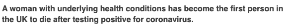
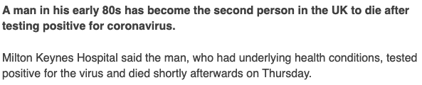
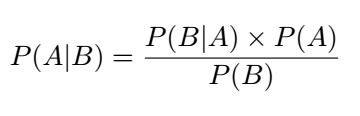

# 是时候改变了

我已经展示了获取与读者实际相关的计算是多么容易。 上面的示例仅与92％的人口相关，其他8％同样重要。 该示例确定了随着年龄增长而死亡的可能性，但是基础健康可能同样重要。 如果没有潜在的健康状况，那么死亡的可能性实际上是0.9％²。 当然，理想情况下，我们将拥有一个考虑到所有年龄，基本健康状况以及其他相关背景信息的大模型，但是到那时，我们正在进入更高级的统计领域，而这超出了范围。 简短的文章。

我受够了，沮丧和害怕。 因为尽管了解统计数据，但我仍然一次又一次看到相同的标题。 现在该是更负责任的统计报告了，我对如何做到这一点有一些想法。
# 前进的道路……在某些情况下
+ 对于读者：了解无条件概率告诉您什么。 当我们听说死亡率为3.4％时，实际上是在告诉所有感染COVID-19的人，其中3.4％死了（过去时）。 这并不意味着在有100个人的情况下，会有3个人死亡。 无条件的概率可以告诉我们过去，也可以告诉我们简单的统计信息，而忽略了重要和重要的信息。 无条件概率绝不能用于对未来进行索赔。
+ 对于媒体：停止报告无条件概率。 而是尝试：“在感染COVID-19的65岁以下人群中死亡的比例不到1％”或“在没有基本健康状况的人群中，只有不到1％的人群因COVID-19死亡”。 当然，这有可能按年龄和健康状况区分读者，但这是一个开始。
+ 对于媒体：好吧，所以您可能不会停下来，但是如果您坚持要继续报告无条件概率，则必须准确强调它们的作用和不代表的情况。 强调过去时态，而不是未来时态：“ 3.4％的人死亡”。 强调缺乏知识-“ 3.4％的已报告病例已死亡，但这一数字取决于个人情况”（好吧，虽然不那么吸引人，但您可以理解）。

> Keep washing your hands — Photo by Curology on Unsplash

# 参考文献

¹新型冠状病毒性肺炎紧急反应流行病学团队。 [3]邓小平，李明。2019年新型冠状病毒病（COVID-19）爆发的流行病学特征-中国，2020年[J]。 中国疾病预防控制中心周刊，2020，2（8）：113-122。 http://weekly.chinacdc.cn/zh/article/id/e53946e2-c6c4-41e9-9a9b-fea8db1a8f51.²https://www.worldometers.info/coronavirus/coronavirus-age-sex-demographics/³https： //www.bbc.co.uk/news/health-51674743⁴https://ourworldindata.org/age-structure
# 冠状病毒和概率—媒体必须立即学习如何报告统计信息
## 随着围绕COVID-19的普遍恐慌，媒体现在必须了解两种截然不同的统计数据之间的区别。

> Source: https://www.bbc.co.uk/news/uk-51759602


> Source: https://www.bbc.co.uk/news/uk-51771815


在几乎所有新闻报道中都会出现“潜在症状”这一短语，其中有人死于看起来很常见的事件。 不管是过敏患者还是冠状病毒（“ covid”）的受害者，“潜在症状”都是用来减轻恐惧的。 作为下位症和统计学家的不幸组合，每当我看到这样的新闻文章时，我都会立即浏览并找到相关内容，然后对自己说：“ phe，那我可以。” 当然，这是难以置信的以自我为中心的思维。 但是，只要媒体报道了无条件的概率，公众（当然是我）的人身危险感就会增强。
# 无条件与条件概率

为了更好地解释我正在谈论的问题，我们将不得不稍微看一下统计数据，在这里我将其保持为尽可能基本，稍后我们将进行更详细的介绍。

undefined

P（模具= 6）

读作“骰子等于6的概率”。 现在，假设我们知道（无论出于何种原因）骰子必须降落在大于3的数字上，我们要预测骰子降落在6上的概率。那么我们想知道：

P（模具= 6 |模具> 3）

垂直线“ |”表示“给定”。

这两个方程式的区别在于，第一个方程式是无条件的-我们想在没有其他信息的情况下知道事件发生的可能性-第二个方程式是有条件的-我们想知道事件发生的可能性并取决于（或“ 给定”）其他条件或事件。

> Photo by Mike Szczepanski on Unsplash

# 贝叶斯定理

当我们开始谈论贝叶斯定理（或贝叶斯定律）时，这才真正与众不同。 请注意：这里有数学和统计数据，如果您不想再看方程式，可以随时跳到“改变的时间”。

贝叶斯定理用于根据其他可用信息来计算或更新条件概率。 等式为：

> Bayes’ Theorem


换句话说：给定某个事件B，事件A发生的概率等于给定事件A发生事件B的概率，再乘以事件A的概率，再除以事件B的概率。 一口，所以让我们来看一个例子。

我们将事件A称为：冠状病毒死亡（请问我要去哪儿吗？），事件B称为：未满65岁。

P（死于covid，未满65岁）= P（死于65岁，死于covid）×P（死于covid）/ P（未满65岁）

并用一些代数对其进行整理：

P（C | A <65）= P（A <65 | C）×P（C）/ P（A <65）

在这里，我们将C视为死于covid，而A则为某人的年龄。

因此，考虑到新闻中发布的统计数据，让我们看看是否可以找到更相关的死亡风险。 我们需要找到：
+ P（A <65 | C）-死于covid的不到65岁的概率。
+ P（C）—死于covid的（无条件）概率。
+ P（A <65）—低于65的（无条件）概率。

警告：我的电话号码在这里不会太准确。

从研究和报告中我们知道，目前的估计死亡率为3.4％³，因此

P（碳）= 0.034

根据一个网站的说法⁴，人口的8％是65岁以上，这意味着

P（A <65）= 0.92

现在最困难的部分是计算由于covid死亡而低于65岁的概率。 在这一点上，我们不得不转向原始数据。 数据无法告诉我们确切的死亡率P（C | A <65），因为我们不知道谁感染和不感染该病毒，即可能有许多未报告的病例。 （这也是P（C）的问题，但出于本示例的考虑，我将其忽略了）。 但是，数据可以准确地告诉我们P（A <65 | C）。 我们将使用中国疾病预防控制中心¹的最新研究数据。 根据这项研究，

P（A <65 | C）= 0.19

这个数字实际上是针对P（A <60 | C），但对我们来说足够了。 所以把所有这些放在一起

P（C | A <65）= 0.19×0.034 / 0.92 = 0.007 = 0.7％。

因此，如果您的年龄在65岁以下，那么根据我们的计算，死于COVID-19的可能性实际上仅约为0.7％（与更准确的估算值相符²）。
```
(本文翻译自Raphael Sonabend的文章《Coronavirus and Probability — The media must learn how to report statistics now》，参考：https://towardsdatascience.com/coronovarius-and-probability-the-media-must-learn-how-to-report-statistics-now-973ed2d52959)
```
