# CSS：度量单位（px，em，rem，vw，％等）

> Photo by Charles Deluvio on Unsplash

# 介绍

我决定写这个博客的目的是希望探索更多有关使用CSS调整大小的方法。 有这么多种可能性，很容易感到不知所措和困惑。 浏览器当前支持16种度量单位：像素，英寸，皮卡，厘米，毫米，点，百分比，em，rem，视口尺寸（vw，vh），ex，ch，Vmax（最大视口）和vmin （viewportmin）在这16个单位中有两类：相对长度和绝对长度。
# 相对长度

首先要了解相对长度，它们会在其他物体上获得尺寸，这些尺寸在您要设定尺寸的元素之外或相对于它们，例如，父级的尺寸，字体大小和视口尺寸。
## 百分比

百分比基于其父元素。 因此，如果一个元素为200px * 200px，并且该元素的子元素的宽度为50％，高度为50％，则该子元素的等效尺寸为100px * 100px，因为200px的50％为100px。
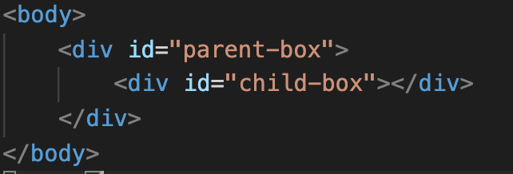

在这里，我们有一个名为“ parent-box”的div元素和一个名为“ child-box”的子div元素。
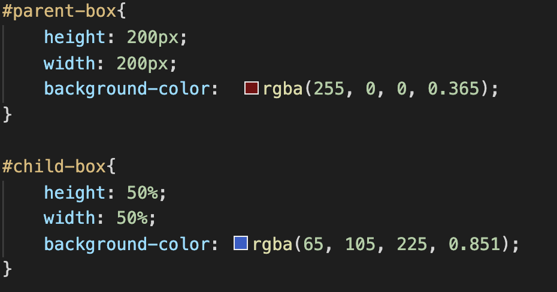

在css文件中，我将父盒的高度和宽度设置为200px，子盒的宽度和高度设置为50％，这意味着现在子盒将是父盒尺寸的50％，因此 如果父框为200px * 200px，则表示子框为100px * 100px，结果如下：


如您所见，蓝色元素（即子元素）正好是粉红色框（即父元素）的50％。
## 视口尺寸

当前有四种类型的视口尺寸单位，vw（视口宽度），vh（视口高度），vmin（视口最小）和vmax（视口最大）。 使用这些单位时要知道的第一件事是，它们会自动将浏览器的屏幕划分为100 x 100的不可见网格，网格中的每个正方形或单位将根据情况代表一个vw，vh，vmin或vmax。
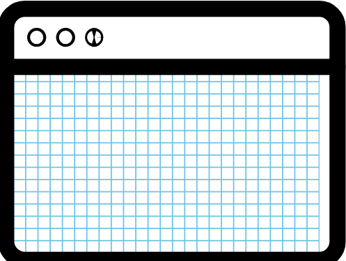
## 大众与大众

因此，让我们更深入地研究这两个。 如果我们声明一个元素的宽度为50vw且高度为50vh，我们将看到该元素将恰好占据页面高度的一半，并且占据页面宽度的一半，每个vw或vh现在相当于那个不可见的100 *中的一个单元 100，所以如果我们声明一个元素为50vw，它将是浏览器宽度的一半，下面我们来看一个示例。
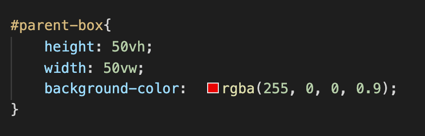
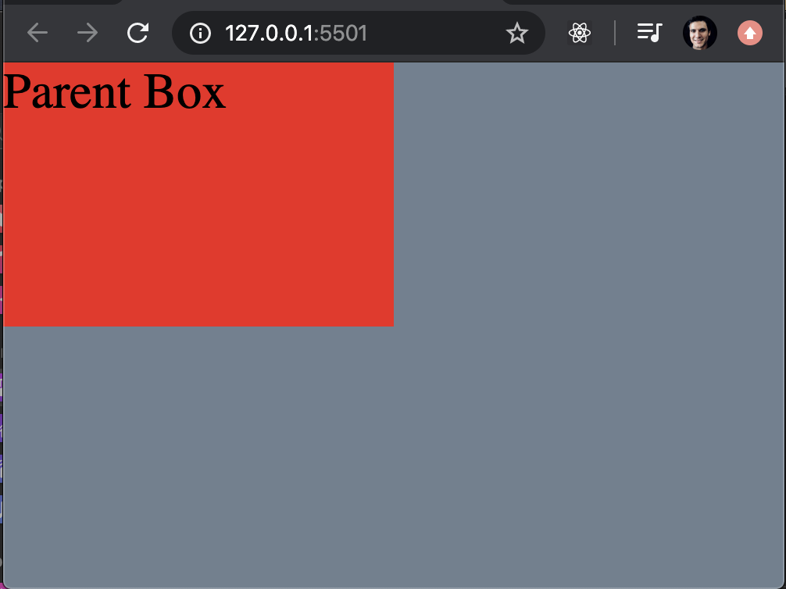

在这里，我们看到父元素恰好是浏览器高度和宽度的一半。
## Vmin和Vmax

这些单位比较棘手。 因此，这些单元的工作方式是将使用高度或宽度的最大或最小长度。 例如，让我们声明父框的宽度为50vmax，如果浏览器的宽度为800px，高度为500px，则父框的宽度为400px，因为宽度大于高度，所以 元素将从浏览器的水平部分的不可见网格中获取50个单位，现在，如果高度为1000px，宽度为500px，则父框的宽度现在为500px，因为浏览器的高度现在大于宽度，因此父元素 box将占据浏览器垂直边100平方中的50平方，并使用它来声明父对象的框宽。

现在进入vmin。 假设我们声明父级框的宽度为50vmin，那么从最小视口尺寸开始，父级框的宽度将占据50个网格单位。 同样的示例，如果浏览器的宽度为800px，高度为500px，则父框的宽度现在将为250px，因为我们声明父框的宽度为最小视口尺寸的50个单位， 在这种情况下，是高度。 现在，如果高度为1000像素，宽度为600像素，则父框的宽度现在为300像素，我知道这非常令人困惑，因此让我们回到第一个示例：
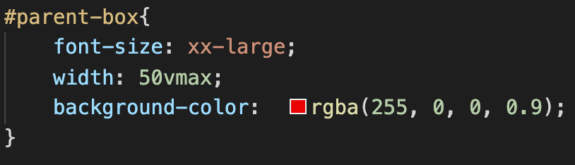
> Here we declare the width to be 50vmax (50 units out of 100 from the BIGGEST viewport dimension)


这样看起来像这样：
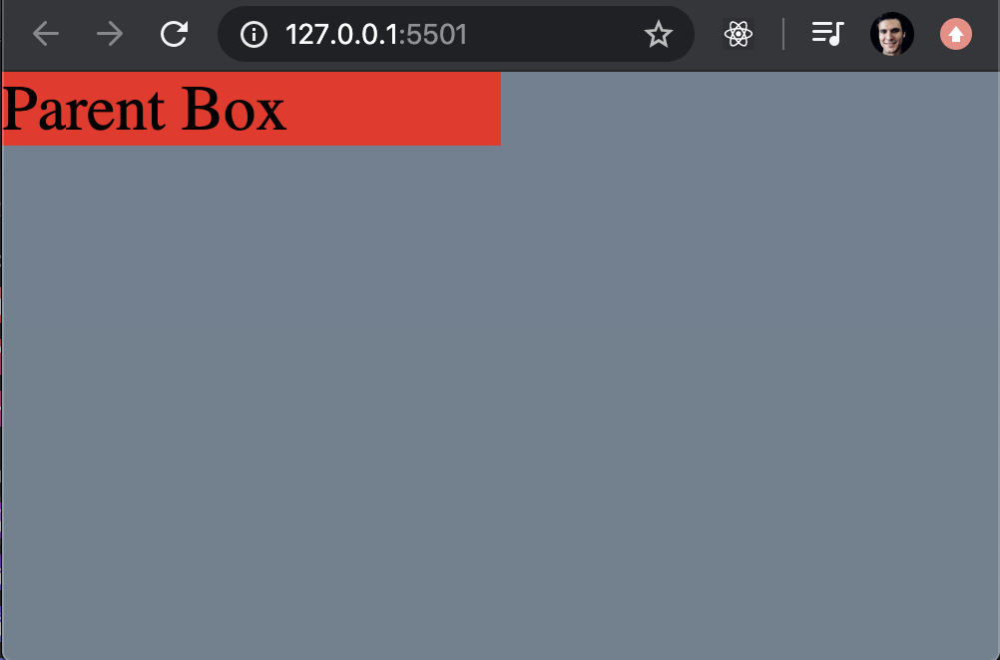

我们可以看到父框现在恰好是浏览器宽度长度的一半，这是因为浏览器的宽度大于高度。 现在，如果我们改变一切，将会得到不同的结果。
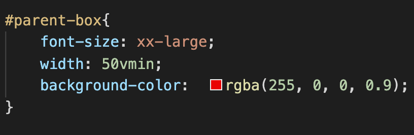
> Here we declare the width to be 50vmin (50 units out of 100 from the SMALLEST viewport dimension)


所以看起来像这样：
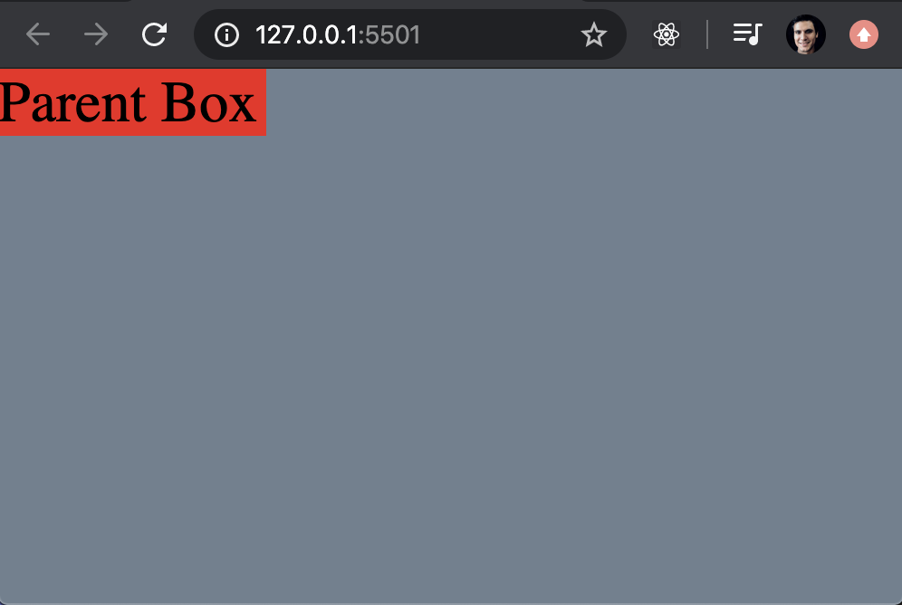

我们可以看到父框现在恰好是浏览器高度的一半，这是因为浏览器的高度小于宽度。
## 基于字体属性的单位
## 事前

我从未使用过这些单元，但让我们看看它们是如何工作的。 所以首先让我们从ex开始。 这个单位测量您正在使用的任何字体系列的字母“ X”的高度，这是指字母“ X”的高度？ 因此，如果此“ X”的高度为10px（字面的字母为“ X”），则1ex将为10px，假设您使用的是另一个字体系列中的“ X”，其中“ X”的高度为9px，所以现在1ex 是9px。

ch的行为方式非常相似，不同之处在于1ch的长度将基于字体家族的字母“ O”的宽度，因此，如果字母“ O”的宽度为5px，则1ch将等于5px 。
## EM

此单位响应父元素的字体大小，因此，如果父元素的字体大小为10px，则每个em现在等于10 px。
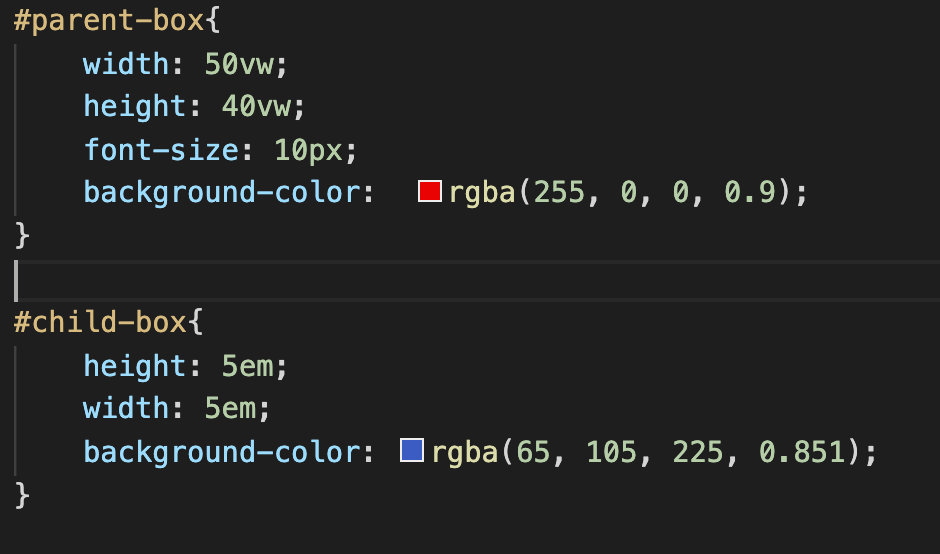

在这里，我们在父框内声明一个10px字体大小，并将子元素的宽度和高度设置为5em，因此，如果父元素的字体大小为10px，则意味着每个em值10px，因此我们的子元素将为50px * 50像素
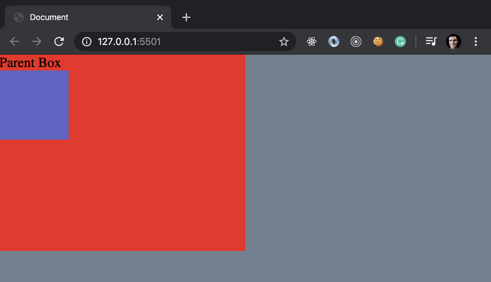

em的作用是它们级联，这意味着什么？ 因此，如果子元素内有另一个元素，并且将其尺寸设置为5em，则第二个子元素将为100px * 100px
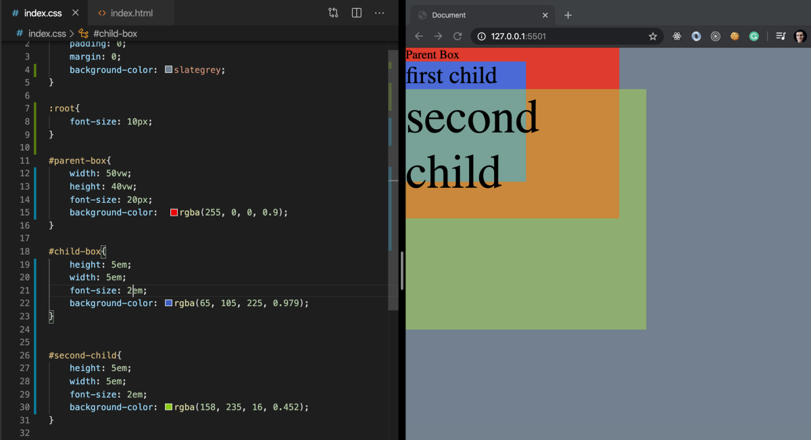

发生这种情况的原因是，当一个孩子中有另一个元素时，第二个孩子会将值乘以2，疯狂吗？ 这就是为什么在使用em时我们必须小心。
## 雷姆

现在，rem与em有所不同，因为rem基于根字体大小而不是父字体来确定其尺寸。 rem一词的意思是“ root em”，这解决了我们在em元素级联时遇到的问题，通过基于root取其维度，rem值在整个文件中都相同。 因此，让我们看一下相同的示例，但带有rem。
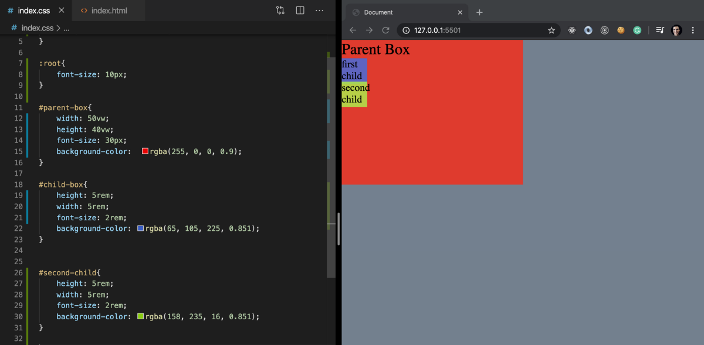

因此，如果将本示例与上面的示例进行比较，我们可以看到父框的字体大小现在为30，但是第一个和第二个子控件的字体大小较小，我们还可以看到元素没有级联， 是因为以10px的字体大小声明了根，所以无论何时我们现在使用rem，它都将始终引用10px。
# 绝对长度

绝对长度不会根据其他因素或页面，父级，视口等其他因素来决定其大小。
## 英寸，厘米和毫米。

因此，我觉得关于这些度量单位的解释很多。 如果您将某物声明为1in，则无论屏幕大小如何，该值都将为1in。 厘米和毫米也一样
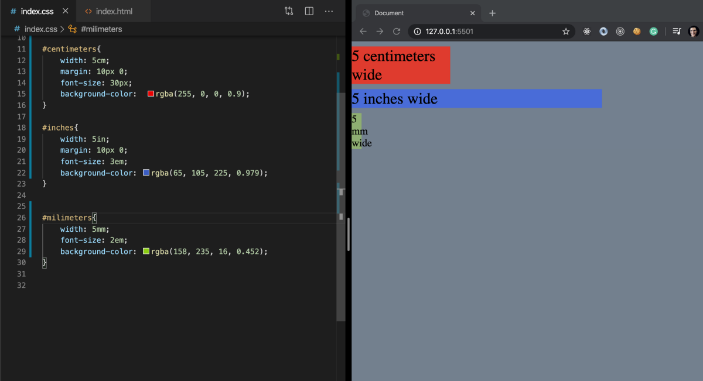
## 点数和Picas

因此，积分和异食癖是印刷术语。 点是1/72英寸，因此很小，12点活字就是12点或1/6英寸。

最后但并非最不重要…
## 像素！

现在，像素是绝对长度，但是它们的大小可能取决于您所使用的设备，某些设备的像素比其他设备大，这取决于它们的密度和分辨率。
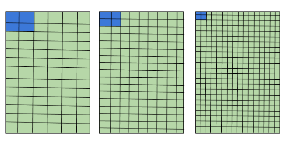
```
(本文翻译自Sebastian Delima的文章《CSS: Units Of Measurement (px, em, rem, vw, %, etc.)》，参考：https://medium.com/swlh/css-units-of-measurement-px-em-rem-vw-etc-ed8522620775)
```
