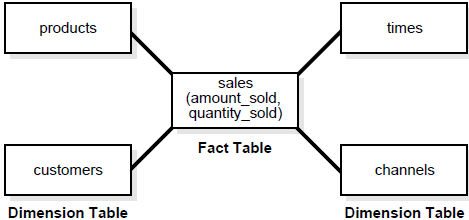
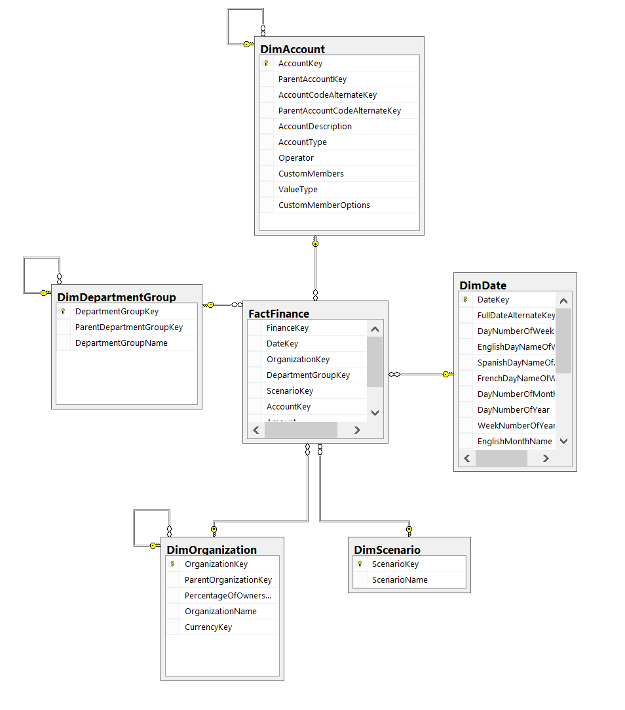

# 接下来我们要谈论什么？

这是我们希望有关数据工程的几篇文章的第一篇。 我们希望通过进行数据管道开发，指标，数据仓库设计等来继续本系列文章。

我们希望这会有所帮助，我们将继续探讨这些主题。 如果您有任何疑问或想在本主题的特定部分上寻求帮助，请告诉我们。

谢谢。
# 数据工程词汇

> Photo by Brett Jordan on Unsplash


首先，让我们列出一些对DE来说很重要的词汇。

我们将在这里概述基础知识，因为经常，如果您刚刚辍学，您会听到很多词汇，只是点了点头而没有完全理解这些可能是什么。
## 数据仓库

> source: https://www.wisdomjobs.com/e-university/data-warehousing-tutorial-237/star-schemas-2620.html


数据仓库是数据分析师和BI专业人员可以访问的中心位置，以访问他们的所有数据。 关于数据仓库，数据集市，Kimball与Inmon以及所有这些含义的争论很多。

归根结底，数据仓库通常是非规范化的数据集，通常从单个应用程序数据库或内部用于回答业务问题的多个应用程序数据库中提取数据。

它与应用程序数据库不同，因为数据仓库设计用于处理分析查询和事务查询。

此外，数据仓库通常还会容纳多个应用程序数据库。 这是数据仓库可以提供的价值之一。 将来自多个系统的数据整合在一起。

同样，在现代时代，诸如BigQuery，Redshift和Snowflake之类的许多数据系统都是专门为管理数据仓库样式的查询而开发的。 这意味着查询需要运行大量的分析，求和和汇总，并且通常不以事务为重点。

但不仅如此。 它们旨在简化理解。 一个好的数据仓库应该让分析师容易理解，这样他们就可以将其数据可视化工具与其连接。

最终目标通常是创建某种自助服务分析系统。 这意味着不应有过于复杂的数据模型，而应有一套明确定义的业务逻辑，工程和业务团队都应在理论上达成共识。

但是，让我们继续进行数据管道。
## 数据管道和ETL

通常，您会听到数据工程师使用术语“数据管道”。 这通常也可以用术语ETL代替。 两者之间有些细微差别。 但总体而言，两者都引用了相似的概念。

ETL是指提取，转换和加载（有时它实际上可以是ELT），但是我们将避免使事情复杂化。

ETL和数据管道是自动化的工作流程，可将数据从A点传输到B点，并按照其方式进行转换以提高其分析能力。

从应用程序数据库中提取数据时，通常会将其放入某种形式的CSV或JSON提取物中。 这些摘录可能来自抓取应用程序数据库表，从API中提取数据，抓取日志等。

在提取阶段，数据通常仍限于当前时间的数据库快照或所有历史数据。 同样，即使在这里，也有很多细微之处会改变ETL的设计。 例如，是否允许修改，删除，复制数据等等。

采用这种方式建立应用程序数据库的理由很充分，因为它对于保持站点快速响应具有很大的作用，但会限制分析人员获得的见解。

随着用户对配置文件进行更新并编辑各种信息，状态可能会随着时间而改变。

因此，ETL也将以跟踪随时间变化的方式帮助插入数据。 通常，这种形式的跟踪变更管理被称为缓慢变化的维度。

数据转换后，将被加载到数据仓库中。
## 达格

DAG代表有向无环图。

ETL只是DAG这一非常复杂的难题的一部分。 转换数据时，通常会按照特定的顺序进行操作。 但是，您如何告诉系统呢？ ETL如何知道何时运行哪个部分？

这就是DAG发挥作用的地方。

DAG在数据工程领域一直存在。 长期以来，它们是通过CRON，一些自定义的元数据库以及Bash，Python和PowerShell脚本的组合进行管理的。

这是非常混乱且耗时的。

如今，有许多现代工具和库可以帮助您管理ETL管道。 其中包括Airflow，Luigi，petl和Dagster（适用于初学者）。 有数十个（即使不是数百个）针对此主题的工具和库。

就个人而言，我们非常依赖Airflow，因为它拥有大量的用户群。 但是有很多很棒的库，随着您对数据领域的了解越来越多，您可能会使用其中的一些库。
## 事实表

undefined

当您开始在数据仓库中工作时，将在表上看到前缀“ fact_”或“ f_”。

此前缀引用您将在此表中找到的数据类型。 特别地，事实通常是实际的交易类型数据。 这些可能是电子商务网站上的订单，健康声明总额等等。

通常，事实将具有某种可汇总的值，例如购买的商品总数或销售总额，以及所谓的dim_ table键，例如store_id，product_type_id等。

通常可以将事实看成是中心表。

例如，在下面的图像中，您将看到事实表位于所有内容的中心。 同样，这是因为事实代表了您正在分析和报告的核心思想。 这可能是交易，用户，打开电子邮件等。

> Source: https://www.sqlshack.com/sql-server-business-intelligence-features-sql-server-data-tools-business-intelligence/

## 尺寸表

数据仓库中确实有许多不同类型的表。 但是，事实表和维度表可能是最常见的。

维度表是更具描述性的数据。 想想当您分析数据时，您通常希望按商店，地区，网站，办公室经理等对数据进行分组。

undefined

再次看上面的图片，维度表位于事实表的四周。

它将帮助您描述和分组事实数据。
# 数据工程101：从批处理到流
## 无论如何，数据如何到达数据科学家和机器学习工程师？

> Photo by Science in HD on Unsplash


与软件工程不同，数据工程没有很多大学课程。 也没有大量的新兵训练营来教授这种做法。

这导致经常在工作中学习最佳实践，以及在团队和公司中使用各种技术。

那么，什么定义了数据工程师？

尤其是随着该角色从数据库管理和BI的源头发展而来，它的确发生了变化，并且期望比以前更多。 过去，数据工程师只需要了解基本数据仓库，ETL和数据可视化就可以摆脱困境。

但是，近年来，对理解分布式计算，DevOps，数据操作和实现机器学习模型的需求对这一概念提出了挑战。

实际上，从许多方面来说，许多高级DE经常更专门于软件或DS工作。 必须从头开始创建与API，流数据服务等交互的系统和框架。

仅仅将管道混在一起不再是基线。

但是，所需的所有技能都是压倒性的，特别是对于刚毕业的新手或经典数据工程师而言。

您想入门数据工程世界，但您不知道从哪里开始。 这就是本系列文章和视频的主题。

首先，本文将向您介绍数据工程师以及我们依赖的一些工具。 所有这些将导致开发数据仓库和数据管道。

因此，让我们开始吧。
```
(本文翻译自SeattleDataGuy的文章《Data Engineering 101: From Batch Processing to Streaming》，参考：https://medium.com/better-programming/data-engineering-101-from-batch-processing-to-streaming-54f8c0da66fb)
```
