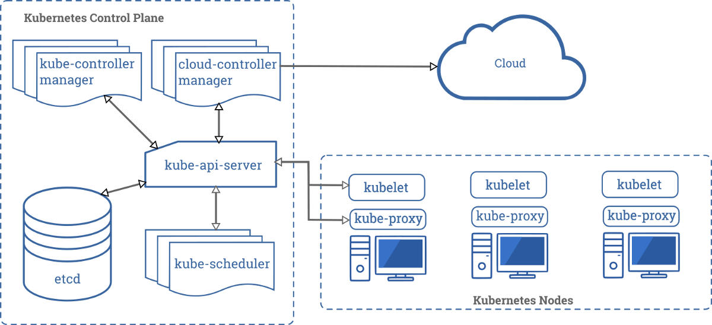

# 结论

在考虑Kubernetes是否适合您的项目或组织时，我们已经考虑了一些注意事项。 Kubernetes最初是由Google设计的，用于解决Google问题。 这些问题涉及到在生产中运行大量的工作负载，而对于我们这些凡人来说，扩展需求是不可想象的。

事实是，没有公司是谷歌。 好吧，当然，除了Google。 虽然您可能会遇到Google在设计Kubernetes时遇到的同样问题，但您肯定会遇到困难。

在决定将Kubernetes用作您的业务基础之前，非常值得仔细考虑这对您的组织，开发团队以及平台的长期稳定性的影响。 该技术仍然相对较新，并且精通Kubernetes的工程师相对较难。

这并不是说Kubernetes是解决问题的错误解决方案。 我以前曾参与过一些项目，这些项目依靠Kubernetes为最终用户提供价值，而这一规模很难与其他类似技术相提并论。 关键要点是，尽管Kubernetes背后的炒作非常真实，但将Kubernetes纳入应用程序领域的决定是一个不容轻视的决定。

有时候很合适-但绝对不是一直如此。
# 运行微服务

Kubernetes主要面向运行由应用程序组成的许多小型工作负载。 如上一节所述，它的主要功能之一是独立扩展基础结构的各个部分，而无需扩展整个应用程序。

这些架构（通常称为微服务架构）在Kubernetes上蓬勃发展。 它的体系结构允许轻松的服务发现，以及总体拓扑中各个组件之间的轻松交互。

因此，这里的考虑不是在Kubernetes上运行微服务是否是一个好主意-而是一个问题，即微服务是否是给定应用程序的正确架构原则。 尽管微服务架构通常比传统的单片架构更受青睐，但它们也会给开发人员带来沉重的开销。

具有各自定义职责的独立服务是合理的体系结构选择。 将这些职责划分为不同的服务似乎是一个合乎逻辑的下一步，但这不是必须的。 为了使开发人员能够分析和修复微服务格局中的错误，他们需要访问构成该格局的大多数（如果不是全部）服务。

这使整个应用程序更难以有效地工作。 由于开发人员将无法仅在其开发计算机上运行该应用程序，因此您需要引入各种工具才能对问题进行故障排除。 考虑针对每个单个环境的分布式日志记录，消息队列和性能监视。

这对开发人员生产力的影响并不明显。 同样，这样做可能值得，特别是对于拥有许多开发团队的大型组织，每个开发团队都在各自的微服务上进行工作，这是更大范围的一部分。 但是，对于较小的公司和团队来说，微服务架构的价格是无限高的。 Kubernetes并不一定会使这些问题更容易解决。 实际上，这甚至可能使它们变得更糟。

如果启用微服务架构是吸引您使用Kubernetes的原因，请仔细考虑职责分离是否不是代码中可以解决的问题，而不是通过在基础架构中引入诸如Kubernetes之类的庞大组件来解决。
# 应用程序需要扩展吗？

Kubernetes的关键功能之一是能够扩展应用程序的各个部分。 流量会在Pod之间自动路由和分配，如果配置，Kubernetes甚至可以为您自动扩展Pod。

如果应用程序具有一个或多个需要能够处理突发事件的热组件，则此功能将非常有用。例如，用于在线游戏的身份验证服务，每当有新的扩展或功能出现时，登录请求可能会突然增加 推出了。 或针对那些在发布后变得非常流行并且需要快速扩展其基础架构而又不必担心网络，存储和所有爵士乐问题的游戏。 神奇宝贝围棋（PokémonGo）是这类游戏的一个例子，它在推出后不久便吸引了大量玩家涌入。 他们广泛使用Kubernetes为全球大量玩家提供服务。

但是，对于大多数其他应用程序而言，单个服务构成整个环境的瓶颈是一个问题，与优化相比，通过优化可以更好地解决此问题。 当然，您可以再扔几个Pod来解决问题，然后祈祷问题消失了，也就是说，直到您最终遇到存储层的限制为止，此时简单地扩展Pod都无法解决问题。

不要误会我的意思-能够动态扩展部署是一个很大的好处。 但是，在我所见过的绝大多数情况下，扩展部署以解决瓶颈是在解决症状，而不是原因。

此外，扩展应用程序的方式比使用Kubernetes的方式多。 Heroku，Azure和AWS均提供了动态运行和扩展应用程序的方式。 例如，Azure Web App可以选择横向扩展，其效果与在Kubernetes中运行多个Pod并在它们前面放置负载平衡器相同。

如果扩展能力吸引了您使用Kubernetes，请首先仔细考虑其他维护成本较低的替代方案。

> Photo by Марьян Блан | @marjanblan on Unsplash

# 学习曲线

Kubernetes有自己的做事方式。 它围绕一些概念进行设计，并且要在生产环境中运行Kubernetes，必须熟悉其中的大多数概念。 这引入了相当陡峭的学习曲线。 不仅适用于系统管理员，还适用于开发人员。

为了让您有个想法，这里是Kubernetes架构的高级概述：

> Kubernetes Architecture (Kubernetes Components, CC-BY 4.0)


所有这些管理器，调度程序和服务器负责全天候运行您的应用程序（也称为k8s中的工作负载）。 他们每个人都有各自的职责，并实施Kubernetes的许多概念中的一个或多个。

如果您具有Docker或更传统的系统管理经验，那么这些概念并不一定是您熟悉的概念。 每次将新应用程序部署到集群时，Kubernetes都会创建以下最小数量的对象供您的应用程序运行：
+ 代表您的应用程序的Deployment对象
+ 与部署关联的副本集以缩放节点）
+ （可选）可以满足您部署的网络要求的一项或多项服务
+ 代表实际容器的一个或多个Pod。 这是Kubernetes架构中最好的一种

如您所见，对于不熟悉Kubernetes的人来说，这可能是很多事情。 而且，可以通过多种方式配置这些对象中的每一个，从而大大改变其行为。

要启动和运行Kubernetes并正确配置其所有组件，需要花费大量时间。 托管的Kubernetes提供程序会占用很多底层配置和集成，但是某些工作将不可避免地渗透到开发人员中，而开发人员至少需要具备Kubernetes的基本技能才能正常工作。

您不需要Kubernetes来运行您的应用程序。 它只是运行生产软件的众多选择之一。 仔细考虑增加的学习曲线和配置开销是否值得转向Kubernetes的好处。

> Photo by Hitesh Choudhary on Unsplash

# 您实际上是否需要Kubernetes？
## Kubernetes解决了一些非常实际的问题。 但是，这些真的是您面临的问题吗？

> Photo by Chris Leipelt on Unsplash


在过去的几年中，Docker已成为构建，交付和运行应用程序的一种非常流行的方式。 过去必须依靠服务器配置和其他外部因素的日子已经一去不复返了。 只需为Docker构建一次应用程序-即可在任何地方运行它！

尽管这是我们开发软件的方式的巨大飞跃，但它确实带来了一些新的挑战。 对于初学者来说，Docker容器与主机之间的网络连接并非易事。 它与我们过去使用的传统联网方法有很大的不同，并且需要一定程度的技巧才能正确实现。

存储是另一个挑战。 默认情况下，Docker卷绑定到其主机。 这意味着，如果我们要运行共享一个卷的服务的多个实例，则必须设置复制或将设置配置为使用云存储服务。

似乎Docker本身是一项伟大的技术，但它缺少将其联系在一起的组件。 Kubernetes正是该组件。 尤其是以Azure，AWS和DigitalOcean等云平台提供的完全托管形式，Kubernetes解决了所有这些问题，同时通过所谓的概念将这些问题从最终用户抽象出来。

Kubernetes（也称为k8s）是由Google创建的，旨在解决他们在世界范围内运行成千上万个应用程序时所面临的问题。 尽管最初批评自己过于固执己见，但采用率却迅速增长，越来越多的公司正在寻找精通k8的工程师。

虽然Kubernetes的实现已经为Spotify，ING和许多其他公司做出了出色的成绩，但它可能并不是每个公司的最终解决方案。 在生产中运行Kubernetes也会引起一些严重的麻烦。 在本文中，我们将探讨在决定过渡到Kubernetes之前应考虑的一些注意事项。
```
(本文翻译自Martin Cerruti的文章《Do You Actually Need Kubernetes?》，参考：https://medium.com/better-programming/do-you-actually-need-kubernetes-a342b0a90fd8)
```
