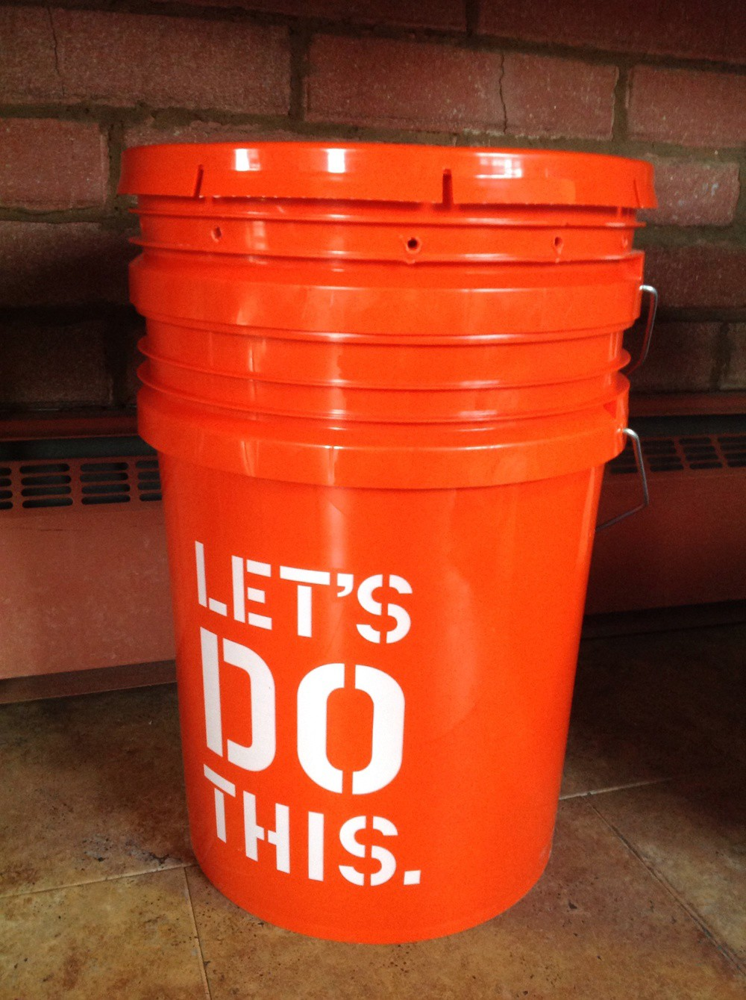
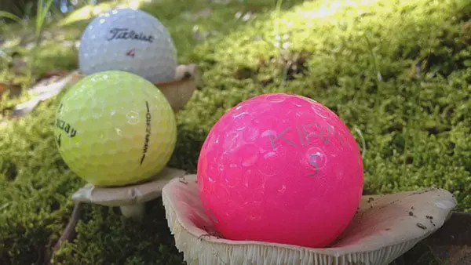
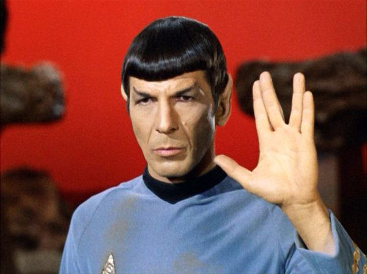

# 您是否理性地做出决定？
## undefined

undefined

> Image: SOURCE.

# 两个小赌博游戏

假设我的客厅里有一个装有90个高尔夫球的水桶，我们将用它玩两轮赌博游戏。 （哇，您在想，那真是个大问题。是的，我们正在为此而发挥想象力。）

您的工作将是预先选择两种赌博的条件（在抽出任何球之前）。

然后我会闭上眼睛，将球彻底打乱，拔出一个球，向您展示，放回去，然后重复。 （您将通过屏幕实时观看我，因此我不会作弊）。 得到它了？ 好的，这是最重要的事情-您对水桶有什么了解？

> Image: SOURCE.

# 铲斗的内容

桶中有30个白色球和60个其他黄色或粉红色的球（您不知道每种球有多少个）。

现在供您选择。
# 游戏1

您可以选择“赌博A”或“赌博B”：

undefined

undefined

undefined

> Image: SOURCE.


提醒：桶中仍然有30个白色球和60个其他粉红色或黄色的球。
# 游戏2

您可以在C赌博或D赌博之间进行选择：

赌博C：如果我画一个白色或粉红色的球，您将获得$ 100；如果球是黄色，您将获得$ 0。

赌博D：如果我画一个粉红色或黄色的球，您将获得$ 100；如果球是白色，您将获得$ 0。

记下您的选择（C或D），以便我们开始这个聚会。 和以前一样，如果您真的没有偏好，可以扔硬币。
# 您选择合理吗？

undefined
+ A＆C
+ 广告
+ 公元前
+ B＆D

继续，看看其他人选择了什么，然后明天早晨检查此空间（或我的Twitter），以获取您的诊断和解释...

> Image: SOURCE.

```
(本文翻译自Cassie Kozyrkov的文章《Do you make decisions rationally?》，参考：https://towardsdatascience.com/do-you-make-decisions-rationally-d12a0eb9c89b)
```
