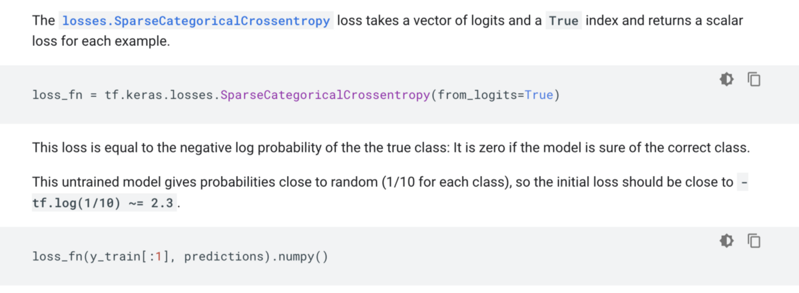

# 不学习机器学习
## 了解如何使用ML模型构建软件

> Source: Pexels


免责声明：以下内容基于我对机器学习团队的观察，而不是对该行业的学术调查。 就上下文而言，我是Cortex的贡献者，Cortex是一个用于在生产中部署模型的开源平台。

如果您是开发人员，则可能至少对机器学习有过时的兴趣。 可以教自己进行预测的算法概念有点……很酷。

但是，如果您决定学习ML并遵循典型的入门建议，那么您很有可能会花两周的时间学习线性代数和多变量微积分，然后放弃。

这样做的原因是，大多数机器学习入门材料都不适合开发人员，而是针对ML研究人员的，这对于只想使用机器学习构建产品的开发人员来说是一个问题。
# 您想生产产品还是进行研究？

在2000年代后期之前，机器学习或多或少只是一个研究问题。 几乎没有多少公司以有意义的方式在生产中使用机器学习。

因此，从该研究的角度来看，许多可用于机器学习的入门材料都采用了这种方法。 首先从数学角度解释神经网络，解释ML背后的所有理论，例如反向传播和对抗网络。

甚至非大学附属材料在某种程度上也遵循这种模式。 例如，这直接取自TensorFlow的“初学者快速入门”：

> Source: TensorFlow


如果您认为我是挑剔的语言，我邀请您阅读全文。

如果您已经熟悉了机器学习背后的数学知识，或者对学习它感到兴奋，那么这种方法将为您服务。 但是，如果您主要是想用机器学习来构建东西，那么这可能并不是您想要的。

要将编程作为必然结果，这种方法就像通过首次学习汇编学习编写代码。 几乎没有开发者会像这样学习。

注意：如果您以某种方式学会了汇编代码，那么我会接受您的愤怒评论，并且让您印象深刻的是，您可以将浏览器安装在正在运行的任何晦涩的Linux发行版上。

当您学习编码时，您很可能是用高级语言编写了hello world。 然后，当您向项目引入一点点复杂性时，您就根据需要学习了越来越多的底层编程。

这种学习模式在构建软件的人员中很成功，因为它优先考虑构建事物。如果您对构建推荐引擎比对发表论文更感兴趣，这就是学习ML的方式。
# 如何通过构建软件来学习机器学习

如果您是通过学习课程学习最多的人，最好的资源，并且可能是这种自顶向下的，边做边学的ML学习方法的倡导者，那就是fastai的《面向程序员的实用深度学习》课程。

本文的目的不是成为Fastai的巨大广告，但足以说，其创始人（Jeremy Howard和Rachel Thomas）开设了几门课程，通过使开发人员实际构建事物，深入研究基础理论来教他们进行深度学习。 因为它与正在建设的项目有关。 要了解他们的教学风格，请查看Rachel Thomas的演讲：

另外，如果您是那种能够通过潜入并自行构建事物来学习最好的人，那么机器学习入门与任何其他编程小知识一样。 选择一个听起来很有趣的项目-我在这里整理了一个庞大的对初学者友好的NLP项目列表-然后加入。

假设您是通过这种方式学习的，那么一种熟悉ML构建的好方法是：
+ 确定目标，例如构建文本自动完成程序或车牌标识符。
+ 找到适合您的项目的预训练模型-GPT-2或YOLOv3分别适用于前面提到的项目。
+ 如果您喜欢，可以使用gpt-2-simple之类的库来微调（根据您自己的数据定制）模型。
+ 最后，将模型部署为微服务。

将模型部署为API之后，就可以像查询其他任何Web服务一样对其进行查询，并围绕它构建应用程序。

您实际上可以在这个项目中看到此过程的实际应用，该项目是由一个涉足ML的独奏工程师创建的：

通过这种方法，您可以了解各种流行的模型架构和机器学习方法，以及它们适合的应用程序。 同样重要的是，您将学习ML基础架构，这对于从模型构建真实产品至关重要。
# 一旦可以使用机器学习进行构建，然后学习理论

如果您是工程师，则可能之前已经实施了某种形式的身份验证，这意味着（希望）您已对密码进行了哈希处理。

设置密码哈希时，您是否编写了自定义哈希算法？ 您花了数周时间研究密码学吗？ 还是您只是使用bcrypt？

同样，在构建第一个Web应用程序时，您是否花了数周的时间来学习数据库？ 你是从头开始写自己的吗？ 还是您使用了自己喜欢的框架附带的任何ORM？

同样的逻辑也适用于机器学习。 如果您是那种喜欢构建软件的人，请首先使用机器学习来构建软件，然后让工具，经过预训练的模型和ML框架抽象出底层的ML理论。 然后，如果您好奇或您的项目需要更多的复杂性，请更深入地研究它的工作原理。
```
(本文翻译自Caleb Kaiser的文章《Don’t learn machine learning》，参考：https://towardsdatascience.com/dont-learn-machine-learning-8af3cf946214)
```
