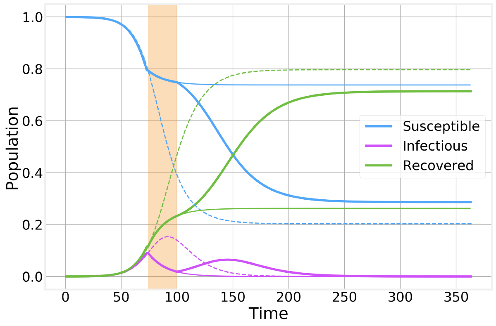
# 流行病建模101：或者为什么您的CoVID19指数拟合不正确

在过去的几周中，一种可怕的苦难正在世界范围内蔓延。 否则，健康高效的社会成员就感染了这种毁灭性疾病，导致他们启动Excel，Python或R，并开始推断其所在的城镇，州，国家甚至整个世界的最新CoVID19确诊病例！
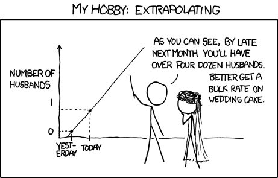
> XKCD: “By the third trimester, there will be hundreds of babies inside you”


撇开所有笑话，当前SARS-CoV-2流行的严重程度是不可否认的，人们自然会以各种方式应对生活中增加的压力（由于锁定程序而增加了空闲时间）。

我最痛苦的是我自己的物理学家（人口统计学家）的人口统计信息，这导致了一些小型博客行业的兴起，这些博客，LinkedIn出版物甚至arXiv论文都在尽最大的努力来模拟这种疾病的传播，而对此却知之甚少。 流行病传播的动态。 西蒙·狄德（Simon DeDeo）不朽的话再次被证明是正确的：

毫无疑问，我们无畏的约翰·斯诺（John Snow）追随者（并非您所想的）最终以该图的一些变化为例，比较了不同国家/地区随时间的累积病例或死亡人数与时间的函数关系，并呈指数级增长。
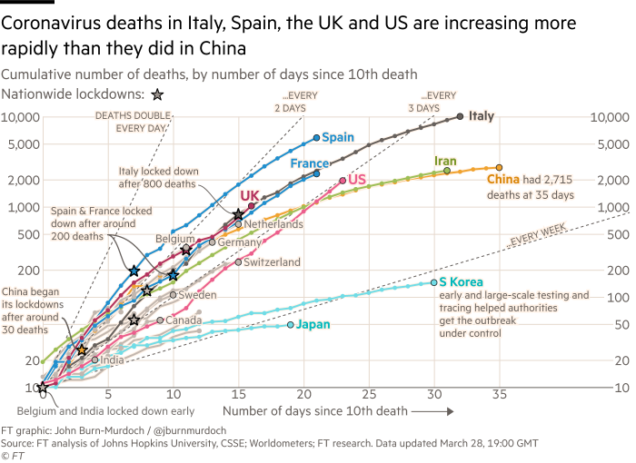
> Financial Times, March 29, 2020


外推到不切实际的数字，对一个国家何时可能超越另一个国家的预测，对遏制措施成败的考虑以及随之而来的其他各种恶作剧。

将混乱带入一个混乱的世界一直是人类进步的驱动力，可以说这仅仅是它的最新化身：Numerati试图利用他们的建模和数据科学技能来了解周围的世界。 近年来，这种趋势导致机器学习，人工智能和数据科学领域取得了令人瞩目的进步。 不幸的是，尽管有充分的理由期望流行病的蔓延初期呈指数级增长，但有许多实际因素共同影响了简单曲线拟合的功效，而对传统流行病建模的一点背景知识可能会走很长一段路。

以下是我的个人观点，作为一个在先前的大流行期间具有流行病建模经验的个人，并且不应该反思我可能所属的任何团体或机构。
# 隔室模型

流行病学中的数学建模有着悠久而丰富的历史，最早可追溯至1920年代的Kermack–McKendrick理论。 基本想法看似简单：我们可以将人群分为代表疾病不同阶段的不同部分，并使用每个部分的相对大小来模拟数字随时间的变化。

在下面的讨论中，我将介绍几个简单的模型和方案，以帮助说明仅通过对经验数字进行曲线拟合即可说明的问题。 您可以在为这篇文章专门制作的GitHub存储库中找到我编写的用于实现模型并生成图的笔记本：
## 科学/流行病学数据101
### 通过在GitHub上创建一个帐户来为DataForScience / Epidemiology101开发做出贡献。
## SI模型

让我们首先看一下最简单的流行病模型：易感感染模型。 在这里，我们将人口分为两个部分，即健康部分（通常称为易感部分）和传染部分。 当健康的人与传染性的人接触时，其动态也很简单，他/他会以给定的概率被感染。 并且，在这个简单的示例中，当您被感染时，您将永远被感染。 从数学上讲，这通常写为：
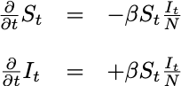
> Mathematical description fo the Susceptible-Infected model


这只是说健康人数减少与感染者人数增加相同的一种奇特的说法。 进一步来说：
+ N只是人口总数
+ β是感染率
+ 它/ N是感染者的比例，它表示易感人群遇到感染者的可能性。

毫不奇怪，这不是一个非常有趣的模型：只要有足够的时间，每个人都会被感染：
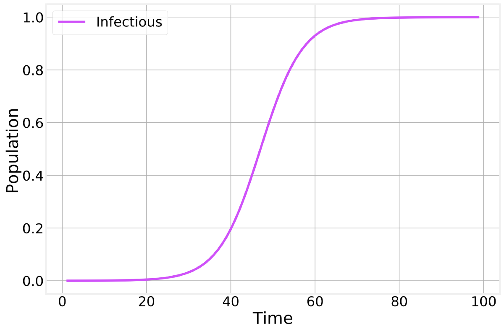
> Infectious fraction of the total population as a function of time.


这个简单的模型只考虑了一种在各部分之间进行转换的方法：通过S和I之间的交互作用（接触），从S到I。表示这种情况的紧凑方法是：
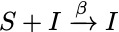
> The transition in the SI model

## SIR模型

可以通过添加更多隔离和过渡来开发更现实的流行模型。 最常见的此类模型是易感传染恢复模型：
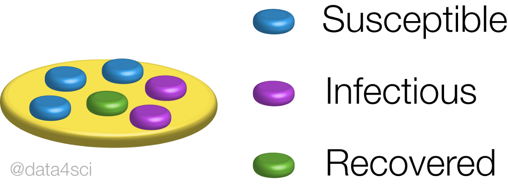
> SIR Model


在这里，我们有一个新的隔间，Recovered，该隔间代表过去曾患该疾病并自此康复后变得免疫的人们。 Recovered的存在会随着允许其恢复而缓慢减少传染性个体的数量。

就过渡而言，可以写成：
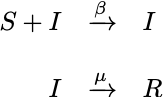
> The transitions in the SIR model


第二行表示以固定速率μ从感染性到恢复性的自发（非交互）过渡。

或者，数学上为：
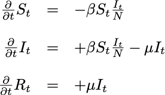
> Susceptible-Infectious-Recovered model


这清楚地表明，恢复的人数的增长仅取决于当前的感染人数。 还应该注意的是，该模型暗示人口规模恒定：
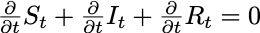
> Fixed total population


也可以为SI模型编写类似的表达式。

如果现在集成完整的SIR模型，则会发现：
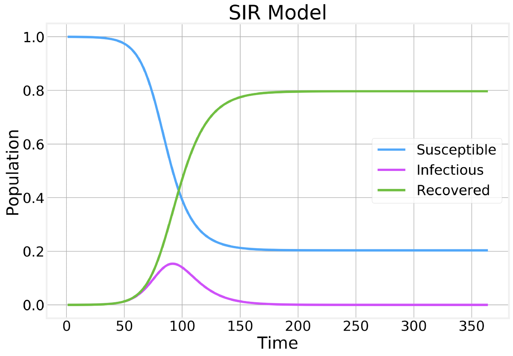
> Fraction of the population in each compartment as a function of time


关于这个情节应该注意一些事情：
+ 易感个体的数量只能减少
+ 恢复的数量只能增加
+ 传染性个体的数量在达到顶峰并开始下降之前会增长到某个点。
+ 大多数人口被感染并最终康复。

如果仅放大感染隔室的行为，则会发现：
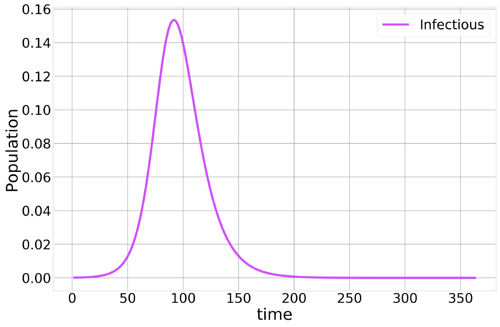
> SIR Infectious compartment


这意味着可以同时感染大量人口，这可能导致（取决于感染的严重程度）医疗保健系统不堪重负。 当您听到有关“展平曲线”的信息时，这就是他们所指的曲线。
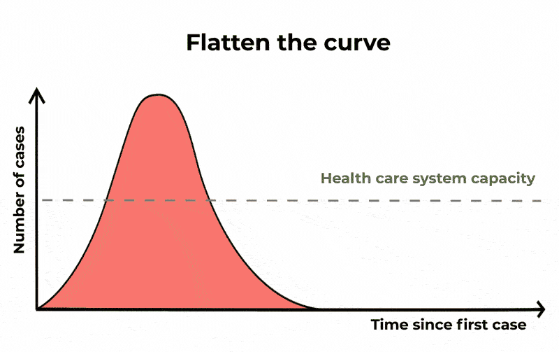
> The Conversation/CC BY ND


根据上面SIR模型的数学表达式，可以轻松获得一些有趣的结果。 如果我们专注于流行病传播的初期，我们可以假设易感个体的比例仍为〜1并发现：
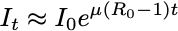

每个人都想适应的指数！ 这里，
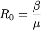

被称为“ R naught”，是该疾病的基本繁殖数。 这个简单的数字定义了我们是否有流行病。 如果Rₒ<1，该病死亡，否则，它呈指数增长！

解释R +的一种直观方法是单个感染个体产生的新感染的平均数量。 如果一个人能够在康复之前将疾病传播到至少另一种疾病，那么这种流行病就可以继续，否则，它就死了。

这是我们需要确定的，并且取决于该病毒的许多不同因素，正如凯特·温斯莱特（Kate Winslet）雄辩地将其放入2011年电影《传染病》中一样。

目前对引起CoVID19的冠状病毒SARS-CoV-2的Rₒ值的最佳估计约为2.5。

Rₒ的值在决定流行病的过程中也起着基本作用。 如果我们考虑描述SIR模型的第二个方程：
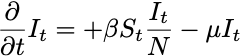

我们发现，只要有以下情况，传染数量的导数就变为负数：
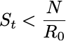

这是我们到达顶峰，流行开始消退的时刻。 在这一点上，人群开始具有足够的所谓的“牛群免疫力”，无法使疾病进一步传播。 只要有疫苗，就设计疫苗接种程序，以帮助人群获得牛群免疫，而不必感染很大一部分人群。

Rₒ还确定了不受该疾病影响的整个人群的最后一部分：
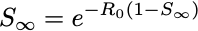

其中S_infinity指的是该流行病有时间完全遵循其病程之后健康的（从未感染）个体的总数。 该表达式不适用于封闭形式的解决方案，但可用于以数字方式估算S_infinity的值。 上面的SIR图是通过使用Rₒ= 2生成的，我们看到S_infinity〜0.2可以很容易地通过将这些数字插入此表达式来验证。
# 实际考虑

到目前为止，我们对流行病模型的分析都集中在理想情况下，这似乎证明了拟合指数曲线的方法是尝试预测流行病过程的简单方法。 不幸的是，现实世界在各种方面都变得更加复杂。
## 无症状和轻度感染病例

到目前为止描述的方法的局限性之一是它做出了一些不切实际的假设：
+ 没有潜伏期或潜伏期。 潜伏期会延迟整个流行的时间表。 对于我们这里的目的而言，这个问题并不重要。
+ 有一种传染性个体。 在现实世界中，不同的免疫系统对病毒的反应不同，从而导致某些人完全无症状（无任何症状）和轻度感染病例。 就CoVID19而言，无症状病例数被认为是40％或更高。

这两个困难都可以通过添加新的隔离专区和过渡到我们的基本SIR模型来解决，而没有太大的困难。 但是，在处理官方公布的数字时，它们构成了重大挑战。

在流行的初期，只有更严重的病例（无症状和非轻度）患病足以寻求医疗帮助并得到正式诊断。 这自然会导致在给定的城市或国家/地区发现首例病例的时间延迟，并且由于严重程度更高的病例更有可能死亡，因此高估了疾病的严重程度。

发布的数字通常也具有累积性，使总数看起来更大。 从我们的简单SIR模型中提取可能确诊病例数的一种简单方法是计算从易感隔间中移走了多少人。 将ϕ定义为确实经过检验的传染病例的一部分，我们有：
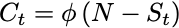
> Confirmed cases


结果，发布的数字直接取决于严重程度足以导致医疗护理和测试的病例比例：
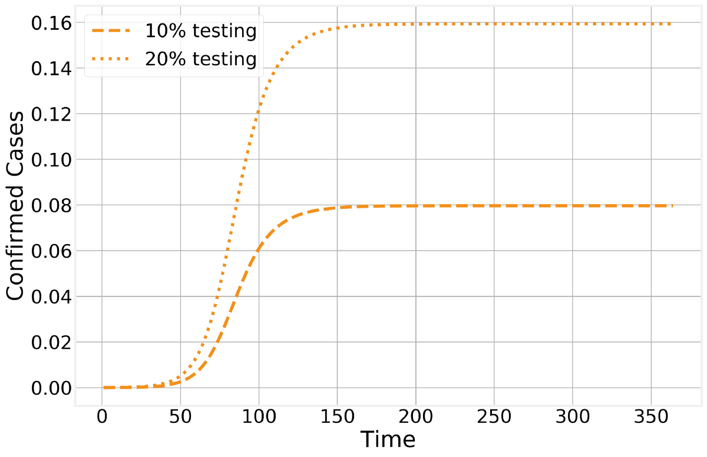
> Confirmed cases in the SIR model


然后，（观察到的）恢复个体的数量将遵循类似的轨迹，尽管由于疾病的自然时间线而滞后了几天：
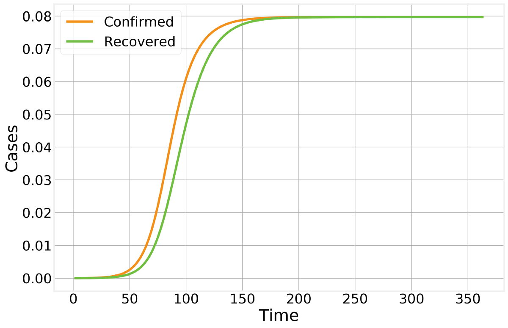
> Observed recovered number of cases


自然，对于新型疾病，需要花费时间来开发和分发准确的测试。 如果我们进一步认为测试分数time也与时间有关，那么很容易看出在确认病例的时间轴中观察到的许多功能是由本地策略和测试可用性引起的：
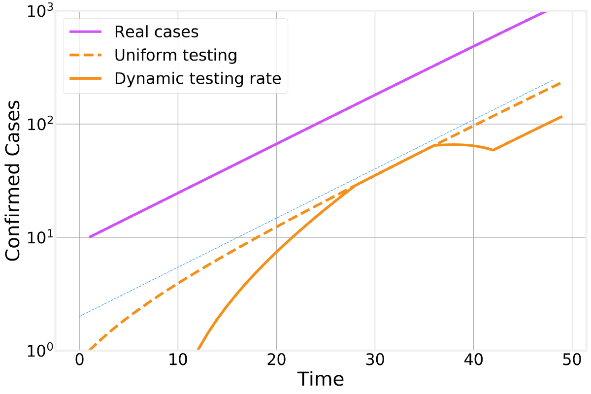
> Effect of time dependent testing rate


在此图中，我们比较了实际感染病例的数量（紫色），统一检测的结果（橙色虚线）和动态检测率（橙色实线）。 为了清楚起见，我们以对数标度绘制不同的曲线（从一条水平网格线到下一条水平网格线的变化相当于10倍），并包括一条指数拟合线（细蓝线）作为代表眼睛的参考线。 总体指数趋势。
## 动态滞后

要考虑的另一个重要因素是疾病进展所固有的时间演变。 健康的个体与感染者接触并被感染。 她的感染将持续特定的天数，这意味着当前的感染人数是今天，昨天，前一天等所有感染者的总和……还没有时间恢复。

这意味着在新感染的高峰与传染个体总数的高峰之间存在自然的滞后，该滞后与传染期的持续时间成正比。
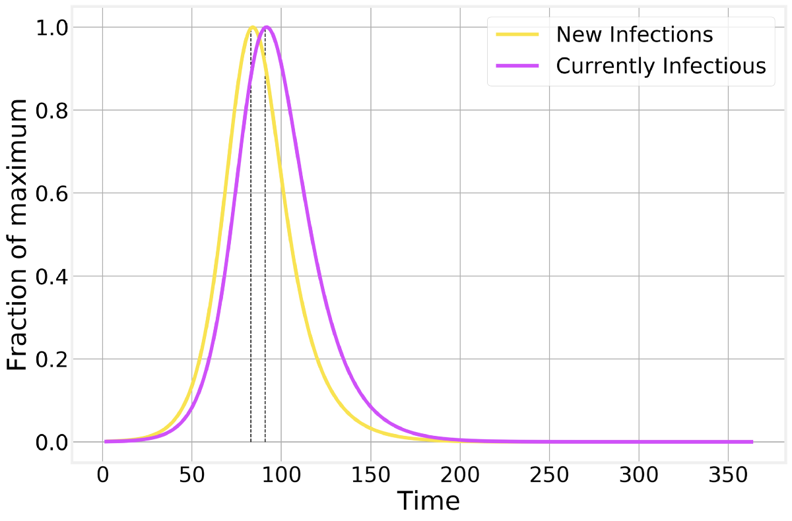
> Lag between the peak in new infections and in the number of currently infections individuals


这种滞后的一个重要后果是，即使今天的新感染病例数比昨天和前一天要少，但仍需要几天的时间才能看到明显的效果，因为感染病例总数减少了。
## 锁定程序

随着流行病的发展，世界上许多国家（从中国开始）都试图实施封锁或隔离程序，以遏制该疾病的传播。 这些措施由于其社会和经济后果而在公众中不受欢迎，因此重要的是要了解它们在阻止流行病蔓延中所起的作用。

让我们想象一个完美的收容方案。 我挥舞着魔杖，每个人都呆在家里，始终保持彼此相距6英尺，并且不会产生新的感染。 在我们的SIR框架中，这对应于突然设置Rₒ= 0或简单地从模型中消除交互转换。 结果是惊人的：
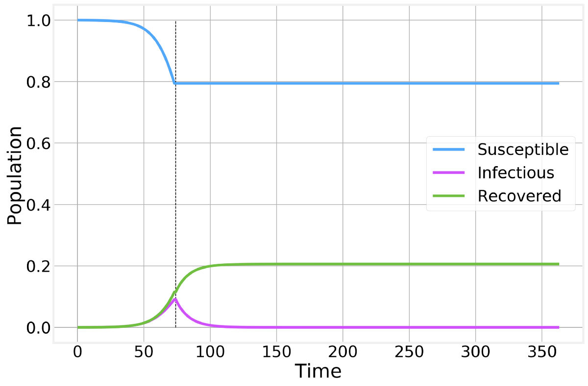
> Perfect containment strategy. Strategy is implemented at the time indicated by the vertical dashed line and maintained as long as necessary for the number of infectious individuals to reach zero.


尽管没有新的感染发生，但是由于当前受影响的人们逐渐从疾病中恢复过来，因此感染个体的总数仍保持了数周之高。

自然，没有任何一种遏制策略是完美的，但可以说我们做得很好，而不是将Rₒ设置为0，而是设法将其设置为0.5。 如上所示，只要Rₒ<1，该流行病就开始消亡，但与理想情况相比，流行时间要长得多，并导致大量的总感染：

> Imperfect containment strategy. Strategy is implemented at the time indicated by the vertical line and maintained for as long as necessary for the number of infected to reach zero. Thin solid lines correspond to the previous perfect scenario and are shown for comparison.


但是，如果由于某种原因，封锁的社会或经济成本被认为过于昂贵，并且过早取消了隔离，我们只需回到以前的，不受约束的，流行的传播场景：

> Imperfect containment strategy. Strategy is implemented at the time indicated by the vertical shaded area. Dashed and thin solid lines correspond to the no-intervention and imperfect lockdown scenarios, respectively, and are shown for comparison.


如我们所见，过早的锁定已导致第二波流行病的爆发，导致几乎没有任何干预的总病例数。 但是，它仍然具有将患病高峰期人数保持在正常水平以下的优势，并且使流行曲线“扩散”了：换句话说，曲线的平坦化将有助于防止医疗保健的泛滥。 系统。

为了清楚起见，让我们也仅看看传染病的数量
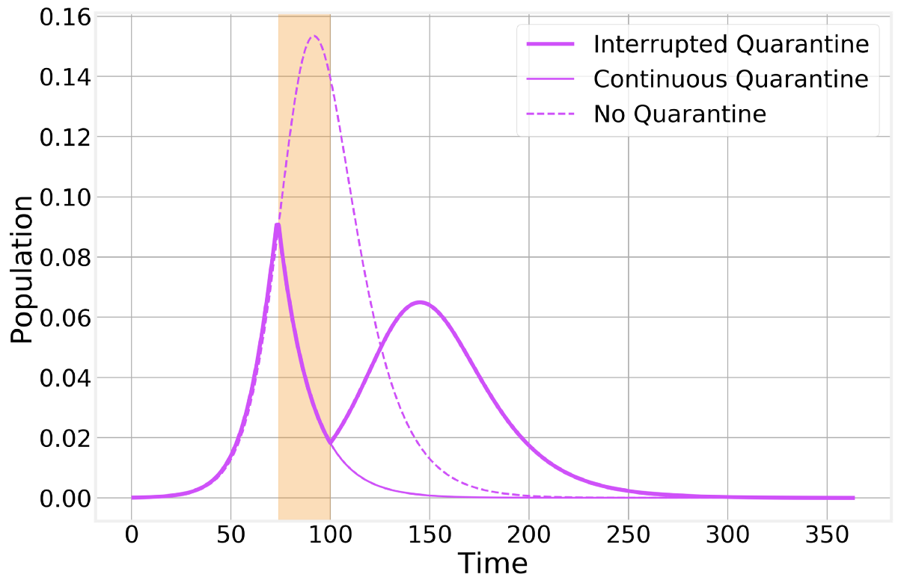
> Imperfect containment strategy. Strategy is implemented at the time indicated by the vertical shaded area. Dashed and thin solid lines correspond to the no-intervention and imperfect lockdown scenarios, respectively, and are shown for comparison.


不是像我这样的贫穷物理学家就当前的全球停产在经济上或社会上是否值得进行思考。 我能做的最好的就是帮助您更好地了解其实际效果。
# 结构化人群

这篇文章已经很长了，但我想考虑一点。 隔室模型就其本质而言可以进行大量的简化和假设。 一个基本的假设是基础人群混合良好：每个人都可能与其他任何人接触。 虽然这对于任何大批人口显然都是错误的，但对于流行病动力学的定性分析，通常这是一个足够好的近似值。

但是，如果我们尝试过度扩展这种模型，我们很快就会发现国家和城市不是同质人口。 国家由国家组成，国家由城市和农村地区组成等。
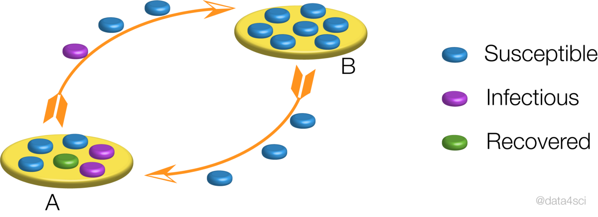
> Schematic representation of the epidemic in between neighboring populations.


在每个人群中，如上文所述，疫情仍将继续，但是当我们将多个人群结合在一起时，其结果还不清楚。 让我们考虑两个邻近城市的人口。 流行病始于其中之一，通勤或旅行最终导致一个感染者感染附近的城市，导致两个人群之间的时间差异。 如果我们天真地将这些多个种群视为一个种群（如仅查看州或国家的总数），则结果曲线将受到两个种群之间时间差异的强烈影响，从而导致流行曲线与简单人群几乎没有相似之处 到目前为止，我们已经分析了一些示例，使指数拟合的任何时间都变得毫无用处，几乎没有实际用途。
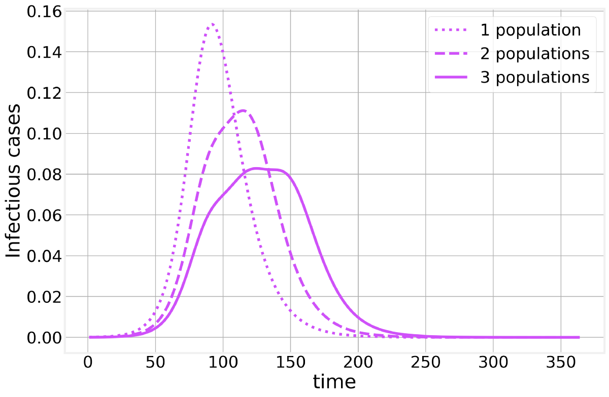
# 资源资源

如果您已经做到了，那么恭喜。 您现在比大多数无所畏惧的曲线拟合者更了解流行病建模，并且希望您不会犯同样的错误。

可以在以下GitHub存储库中找到实现上述模型并生成所用图形所需的所有代码：
## 科学/流行病学数据101
### 通过在GitHub上创建一个帐户来为DataForScience / Epidemiology101开发做出贡献。

如果您喜欢这篇文章，那么您可能还会喜欢我的每周时事通讯，在那里我分享机器学习和数据科学的最新新闻和发展以及我撰写的任何将来的博客文章。

任何人都可以根据我们的政策在“中”上发布，但我们并没有对每个故事进行事实检查。 有关冠状病毒的更多信息，请参见cdc.gov。
```
(本文翻译自Bruno Gonçalves的文章《Epidemic Modeling 101: Or why your CoVID19 exponential fits are wrong》，参考：https://medium.com/data-for-science/epidemic-modeling-101-or-why-your-covid19-exponential-fits-are-wrong-97aa50c55f8)
```
