# 11. Google字体
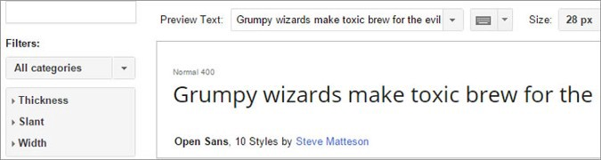

这也是所有设计师和开发人员不可转让的工具之一，而Google字体可能是该领域中最好的工具。

将此添加为书签，并将其放在顶部列表的顶部。 这是必须的，最好的部分是它免费且易于使用。
# 10. Adobe色彩
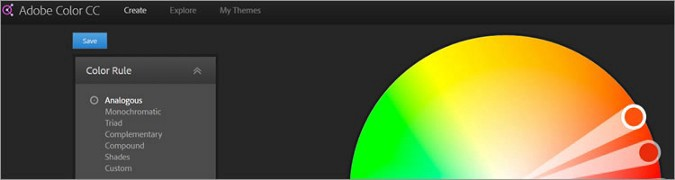

对于每个设计人员和开发人员来说，这都是不可转让的工具。 强烈建议您在要探索或测试设计提案或项目所需的颜色组合时使用。

有成千上万种颜色组合可供选择，还有一些建议可以轻松用于Photoshop，Illustrator等。
# 9.五秒钟测试
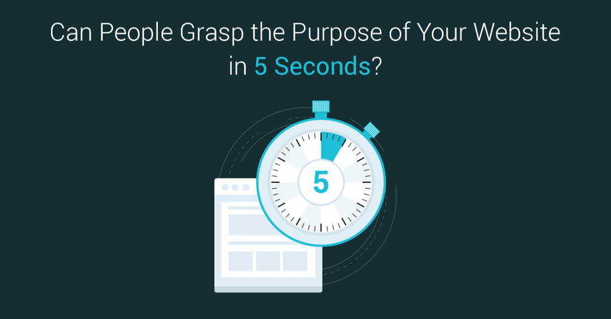

一旦您的项目准备就绪，请确保牢记大多数用户希望您的网站在大约两秒钟内加载的可靠调查结果，并且如果花费的时间比该魔幻数字长，则用户或访客很有可能会 退出或关闭您的网站。

五秒测试是解决此问题的好方法-您所要做的只是向他们共享主页，图像，登录页面和所有其他营销材料，然后他们将查看您的所有网站资产，以确定是否 有任何需要改进甚至删除的地方。
# 8. Remove.bg
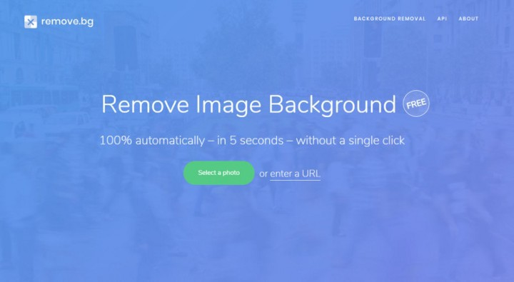

这可能解决了一个非常简单的问题，但这是最关键的问题之一。 由于有了Remove.bg，您不再需要成为Photoshop的专家即可从照片中删除背景。 您可以将任何图片上传到Remove.bg，其余的工作都将由它负责。

它是免费的，不需要注册。 它将完成所有需要的工作。
# 7.运球
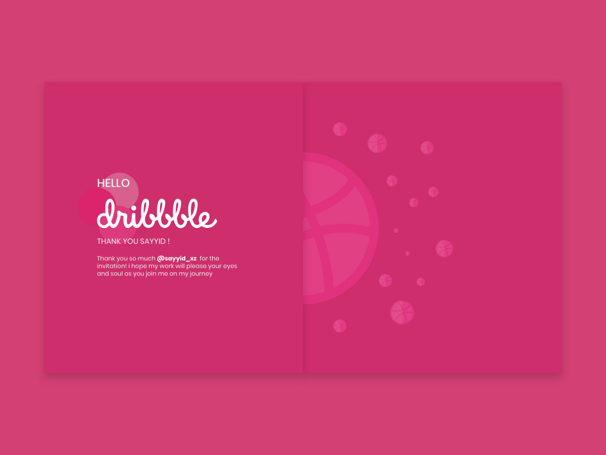

该网站提供了广泛的灵感。 您必须为此添加书签-里面的所有东西都是魔术。

“要由焦点小组设计产品确实非常困难。 很多时候，人们不知道自己想要什么，除非您向他们展示。

—史蒂夫·乔布斯
# 6.引导程序
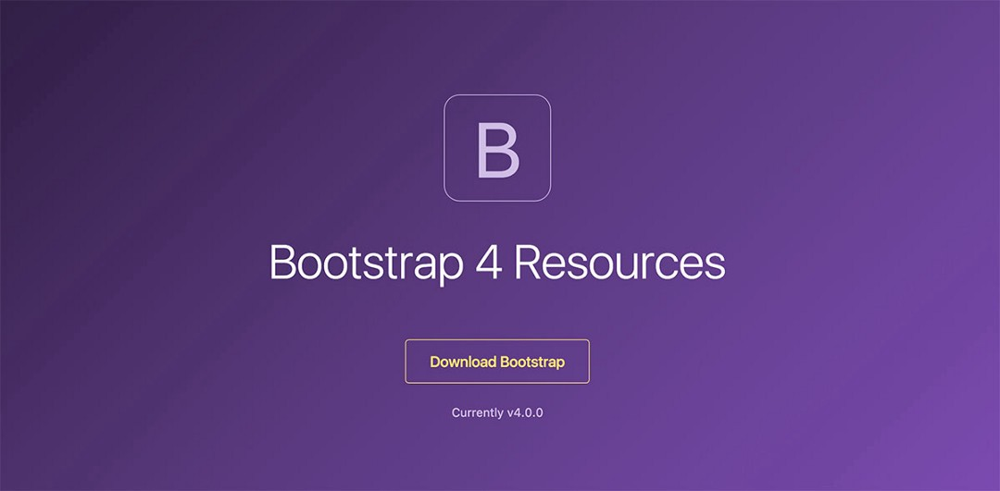

Bootstrap在所有前端开发人员中都很受欢迎。 由于网站正在推广移动优先的网页设计方法，因此有助于使您的网站具有响应性和移动友好性。

Bootstrap由Twitter背后的开发人员和工程师设计。 该平台本身是可下载的-可以预编译或通过源代码下载。

它功能齐全且易于使用。 它的主要功能之一是能够轻松设计功能齐全的HTML和CSS元素的网格。 您只需按名称调用它们即可使用该组件。 它们是每个前端开发人员的最爱-这样可以节省大量开发时间，并提供易于理解的代码。
# 5. Canva
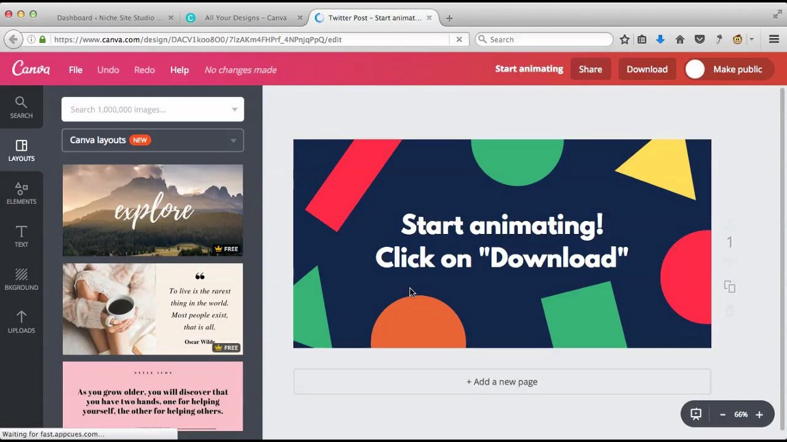

如今，Canva越来越受欢迎。 您可以免费创建数字设计，它非常易于使用，并且有数千种免费资源可供选择。 它们还提供了各种示例，您可以轻松使用它们，而只需替换文本即可。 您也可以上传图像并将其保存在那里以备将来使用。

他们还拥有数百万张照片，徽标和图标，您可以购买-每张起价为1美元-或者您可以只使用400,000多张免费照片，插图和模板。 我使用Canva已有两年多了，我无法相信他们免费提供了如此广泛的服务。 它仍然令我惊讶。
# 4.视觉
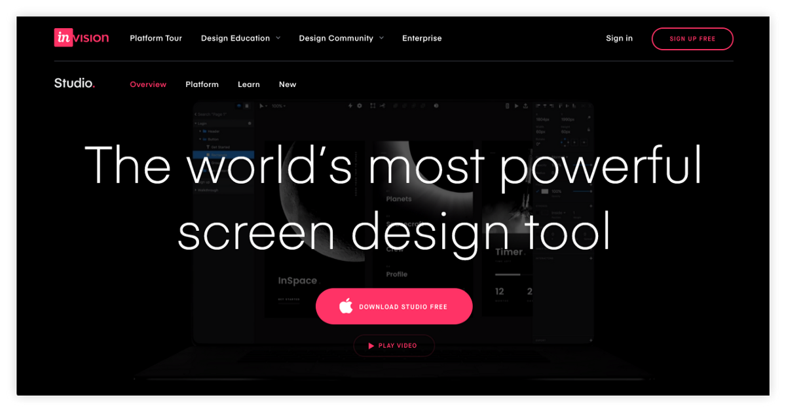

我强烈推荐InVision-我已经使用InVision两年了。 我只是觉得它很容易使用，而且它的黑暗主题吸引了我。

我还在UI / UX创建项目和移动应用演示中使用InVision。 我对这个工具很满意，希望您也喜欢。

最好的部分是免费的。
# 3. Balsamiq
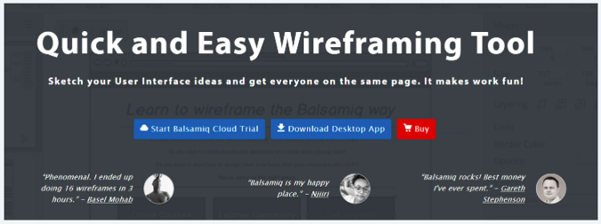

当谈到简单的线框图时，Balsamiq是设计师中最受欢迎的工具之一。 它非常易于使用，直接操作，也可用于您的桌面和云应用。 在团队中工作也很好-您可以轻松创建并邀请其他团队成员进行协作。

从移动设计到网站设计，它们具有多种可用功能供您选择。 您可以轻松地将几个UI元素拖放到项目线框中。 原型项目完成后，您可以轻松地将其打印或运行测试，然后再将其发送给前端开发人员。

他们提供一个月的免费试用。
# 2. Adobe XD
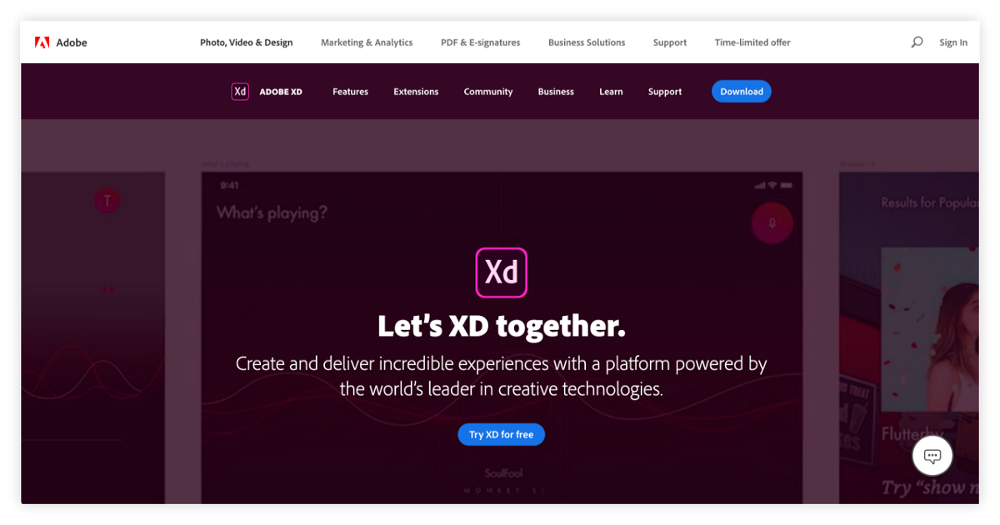

Adobe XD是基于矢量的，因此，对于持续的设计和原型制作，它非常适合UI设计人员和UX设计人员，包括前端开发人员。 我个人使用Adobe XD来设计和制作演示文稿的原型。 这是每个设计师以及所有有抱负的UI / UX设计师必备的工具。

它非常易于使用，最好的部分是我免费获得了它。
# 1.素描
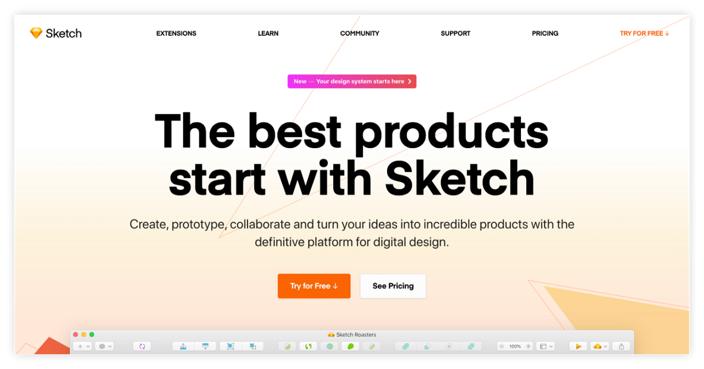

我之所以没有使用Sketch，是因为即使我在编码之前进行了部分设计，但我并没有完全了解所有设计细节。 但我知道大家都听说过Sketch，并且我都同意这是最受欢迎的工具之一。

根据互联网上的反馈，Sketch对于线框图和原型制作非常有用，我相信大多数专业的UI / UX设计师都会强烈建议使用此工具，特别是对于初学者。
# 开发人员必须具备的11种Web设计工具和资源
## 前端备忘单上应该包含什么

> Photo by Markus Spiske on Unsplash


“专注和简单。 简单可能比复杂更难：您必须努力工作以使您的想法变得简洁。 但最终还是值得的，因为一旦到达那里，您就可以搬山。”

—史蒂夫·乔布斯

我将收集的大多数工具和资源，也是我收集的，高级开发人员推荐的工具以及我今天仍在使用的工具。

如果您还没有阅读我以前的文章，那么我是一位自学成才的网络和移动开发人员-已有四年了。 我获得了商务信息管理学位。 我第一次接触技术是通过使用用于业务，MySQL和Visual Basic的数据库，以及会计科目和投资。 那时我还没想到要攻读学位的技术方面，但是三年后，我找到了一个对网络开发非常感兴趣的朋友。 他鼓舞了我，参加了一个4-6个月的现在就读的新兵训练营，以应对挑战，因为当时我们讨厌工作。

由于它的潜力，我变得很感兴趣，而我做的研究越多，我就越兴奋。 但是，由于我的处境不太可能，我不能只是辞掉工作重返学习。 我当时正在养活自己，所以我需要工作。 当时我还没有做好财务准备，但是我一直想着。

快进：我追求学习网络开发。 我制定了一个计划，一个为期一年的计划，并承诺将尽我所能。 我决定至少继续工作一年–我浪费了数年的生活，每天都住在隔间里，只能跟随老板和人事部门。 我讨厌那种驱使我前进，使我加油的系统，这让我非常生气，以至于我知道我需要做一些新的工作，否则我将永远无法改变自己的生活。

因此，我在非技术性工作中的工作时间为9-5，并且在我上班前三个小时和下班后三个小时在我办公室附近的咖啡馆喝咖啡。 我在周末和节假日每天学习10个小时。 我避免了很多聚会，朋友，聚会，旅行和开销。 我向自己保证了一年-如果无论我如何尝试仍然无法正常工作，那就可以了。 我已经尽力了-不后悔。

如果您有勇气去做所有需要做的工作而没有任何借口和抱怨，而您只是在努力，最终运气就会找到您。 就我而言，六个月后我获得了第一份网络开发人员的工作。 我以粗体大写字母签上了名为WEB DEVELOPER的新雇佣合同的那天，也是我发送辞职信的那天。 这是一个美好的一天。

因此，请回到学习前端开发的角度：我做得还不够。 我在以前的著作中已经多次提到这一点-建立良好基础的重要性。 作为前端开发人员或鼓舞人心的前端开发人员，重要的是，您必须了解这些基本工具，这些工具将帮助您更快更好地进行设计，并提高创造力。

将想法变为现实需要几个阶段。 就像构建应用程序一样，它将从一个想法开始。 它会形成文字，并首先存在于文字和草稿中。 很快，它将具有其形式，形状和功能。 然后，它将进入开发，品牌推广，市场营销等阶段。

将它们添加为书签，下载并用作参考。 相信我：即使您已经工作了四年或十年，最终您都会忘记它们，然后再次尝试寻找它们。 现在在这里-我刚刚给您列出了一个清单。
```
(本文翻译自Ann Adaya的文章《11 Must-Have Web Design Tools and Resources for Developers》，参考：https://medium.com/better-programming/every-front-end-developers-web-designing-cheatsheet-9851771eb5b6)
```
