最初发布在https://www.linkedin.com。

作者：谢雪儿
# 举例说明：网络

所以我最近遇到了一个朋友，就像所有朋友一样，我们赶上了约会生活。 她提出了一个有趣的概念，她使用了“柠檬市场”这一经济学理论，提出了这样的观念：当我们在买卖双方之间的市场中获得不对称信息时，优质的“桃子”就会被低估而不良的质量 “柠檬”被高估了，最终，我们生活中的柠檬过多。 然后，我们对不对称信息不仅会扭曲市场，而且还会扭曲生活中的其他事物（例如人际关系）大加欢笑。

然后我心想，如果我们可以设置防火墙来保护自己免受不良关系的影响，那岂不是很好吗？

因此，我开始考虑要使用哪种防火墙。 但首先，让我们谈谈OSI模型和TCP / IP模型。

OSI模型？

是的，开放系统互连模型或OSI模型。 我不会说谎，网络给我带来的痛苦多于喜悦，但重要的是要了解如何正确地进行网络连接，因为如果处理不当，将给人带来更痛苦的感觉，就像不良的人际关系一样。 我一直很难记住OSI模型的7层，所以今天，我将创建OSI（关系）模型，该模型研究一对夫妇如何进行交互：
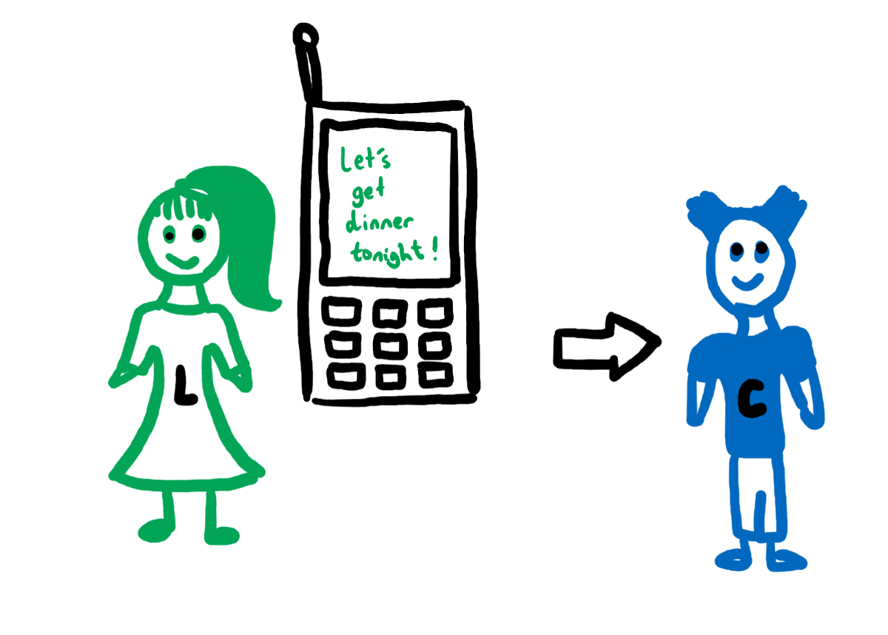

我们将从应用程序层第7层开始。 琳达（Linda）向科林（Collin）发送消息，询问他那天晚上是否有空吃晚饭。 这被称为应用程序层，因为用户（Linda）直接与应用程序交互以发送消息。

现在，此消息实际上如何发送到Collin的电话应用程序？

我们向下移动到第6层，即Presentation层。 之所以称为表示层，是因为必须将消息“呈现”为网络可以理解的格式。 人类可能会理解文本语言，但是计算机会理解另一种语言，即1s和0s的二进制语言。 但是在深入了解二进制内容之前，我们需要首先完成其他所有步骤。

为什么？

好吧，对于初学者来说，翻译“今晚吃饭吧！”实际上很容易。 转换成二进制：
```
01001100 01100101 01110100 00100111 01110011 00100000 01100111 01100101 01110100 00100000 01100100 01101001 01101110 01101110 01100101 01110010 00100000 01110100 01101111 01101110 01101001 01100111 01101000 01110100 00100001
```

但是，如果我们立即对此进行翻译，琳达的电话消息应用程序将如何知道此消息需要传递到柯林的电话消息应用程序？

诸如加密之类的事情通常也在这一层上完成，特别是如果此消息是敏感信息的话。 例如，琳达可能发送了：“今晚我们吃饭吧！ 另外，您可以在下午5点在纽约市百老汇街55号接我。 我们要去这个很特别的地方，所以如果您准时，那晚饭就在我这里。”

现在，假设我是一个邪恶的（渴望的）黑客，他一直在努力拦截人们的信息，以查看我可以得到多少免费晚餐。 假设Linda是盲人，如果此消息未加密发送，那么我可以截取此消息，将其从二进制转换回人工文本，然后读取消息。 然后，我将在下午4:59出现，接琳达，并假装在剩下的晚上成为柯林，以获得免费晚餐。

现在，如果此消息是加密的，没有正确的密钥，我将无法解释其含义，因为它可能看起来像这样：
```
ETSL TGE ERNIDN TOINTGH SOLA CAN UYO KPCI EM PU AT DYBARAOW ESERTT NEW YROK CTYI TA PM EW AER GGION TO IHST RYELAL CNAFY ELCAP OS UYO ARE NO EIMT TNHE ENIRDN IS NO EM
```

好的，因此加密很重要，但我们仍未弄清楚如何将其发送到Collin的电话。

好吧，接下来我们将其下一层移到第5层（会话层）。 现在，数据（消息）已加密并转换为网络可以理解的格式，因此现在我们只需要确定如何通过网络传送（或传输）此数据（消息），以便最终将其保存在Collin的电话中， Craig的电话或Cherry的电话。 会话层非常重要，因为它的作用是打开一个会话，使两个设备相互通信。

等等，为什么我们需要维护会话？

好吧，如果我们回到“今天晚上吃晚饭！” 信息。 该消息的二进制表示形式已经很长了，我们都可以认为该消息的文本表示形式不是那么长。 因此，您可以想象甚至更长的文本消息或其他类型的消息（如图像）的二进制表示形式可以达到多长时间。 当我们通过网络发送数据（消息）时，我们通常必须将其拆散，因为否则将无法立即处理。 因此，实际可能发生的是“让我们一起吃饭”和“今晚的狂欢！” 可能会分解并作为两个单独的数据加载发送，然后重新组合为“今晚我们共进晚餐！” 当它到达Collin的电话时。 因此，我们需要维护一个会话，以确保同一条消息的所有分解片段都通过某种形式发送，就像需要正确呈现所有拼图碎片一样，需要呈现所有拼图碎片。
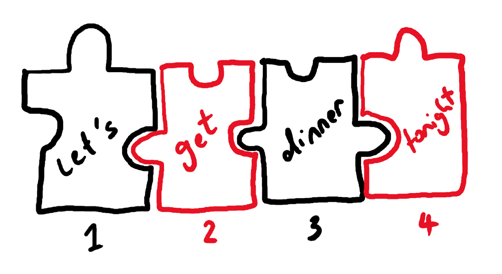

现在，让我们向下移动一层到第四层，即传输层。 在这一层，数据（消息）被划分为段。 该层几乎决定了应发送多少数据，应由谁接收数据以及应以多快的速度发送数据。 例如，Collin的电话可能比Linda的新电话更旧或更旧，因此自然而然地，它可以接收的数据和接收的速率将比Linda的电话低很多。 在此层，协议（通常为TCP或UDP）将根据Collin的电话一次可以接收的数据量来决定如何对数据进行分段，对分段进行标记，以便他们知道所有分段均已成功接收，如果未成功 ，仅重新发送缺少的细分。
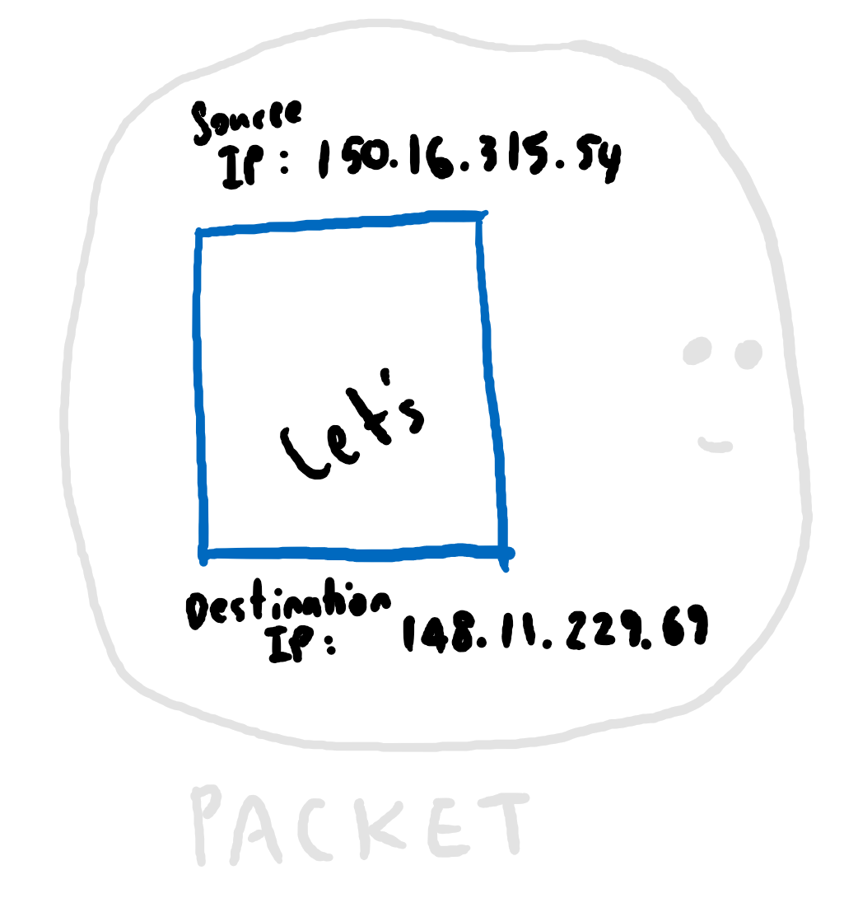

然后，将这些段传递到第3层（网络层）。 在网络层，这些段变成很少的数据包，每个数据包都有一个附加的源（发送者）IP地址和一个（收件人）目标IP地址。 IP地址告诉网络将消息发送到哪里以及消息来自何处。

为什么IP地址采用数字格式？

好吧，还记得我说过计算机和网络只处理1和0的问题吗？ 因此，150.16.315.54和148.11.229.69实际上只是32位1和0的数字表示，它们告诉网络中的路由器该数据包应发送到的位置。 这种IP地址也称为IPv4地址。 现在，148.11.229.69并不代表Collin的电话。 这只是意味着，如果您将其发送到148.11.229.69，则Collin的电话会以某种方式接收它。

嗯，怎么样？
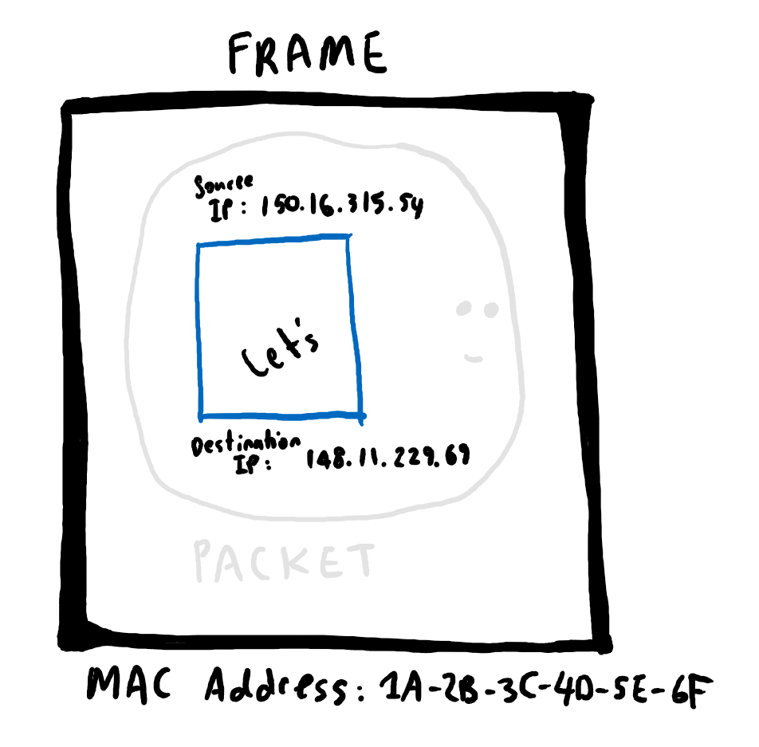

因此，基本上，您可以将其视为我们需要将其发送到与148.11.229.69处于同一网络上的设备，但是要弄清楚该设备是Collin的电话，我们需要将其向下移动一层到第二层， 数据链路层。 在这一层，数据包变成分配了物理设备地址的数据帧。 这些物理设备地址称为MAC地址。 因此，例如，Collin的电话可能具有MAC地址：1A-2B-3C-4D-5E-6F。

什么是MAC地址？

IP地址通常用于（路由器的）网络，您可以将其视为互联网或企业内部网，以尝试将消息从一个网络传递到另一个网络，而MAC或媒体访问控制地址本质上是一个标识， 分配给他们的设备会告诉网络：“嘿，这是我的身份。 如果有人通过该网络向Collin的手机发送了一条消息，请发送给我。 谢谢！”。

为什么我们必须使用段，数据包和数据帧？
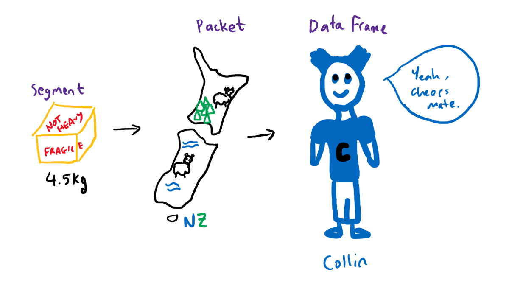

我在上一篇文章中使用了邮购类比来解释这一点。 因此，请考虑运送包裹。 该细分市场基本上告诉送货员，“嘿，这个包裹重4.5公斤。” 包裹告诉送货员，“请把它寄到这个国家，这个城市，这个地区和这个街道地址的公寓。” 最后，数据框告诉送货员：“一旦到达该地址，请找到Collin，因为他需要签名并确认他已收到包裹。”

好的，那第一层是什么？ 好吧，第1层是物理层。 现在都是1和0。 因此，将所有信息打包后，我们便拥有将其转换为二进制1和0并通过网络从Linda的电话应用程序传递消息的一切所需，以便最终可以在Collin的电话应用程序中使用。

这意味着一旦所有这些位在整个网络上移动到了Collin的电话上，它就必须从物理层备份到应用层的OSI模型的所有7层，再到应用层，才能让Collin看到人类可读的文本语言的消息。 就像将物品包装好后才能交付一样，然后在交付完成后必须拆开所有包装才能取回该物品。

尽管要学习OSI模型很重要，但是今天实际使用的是在OSI模型之前开发的TCP / IP模型。
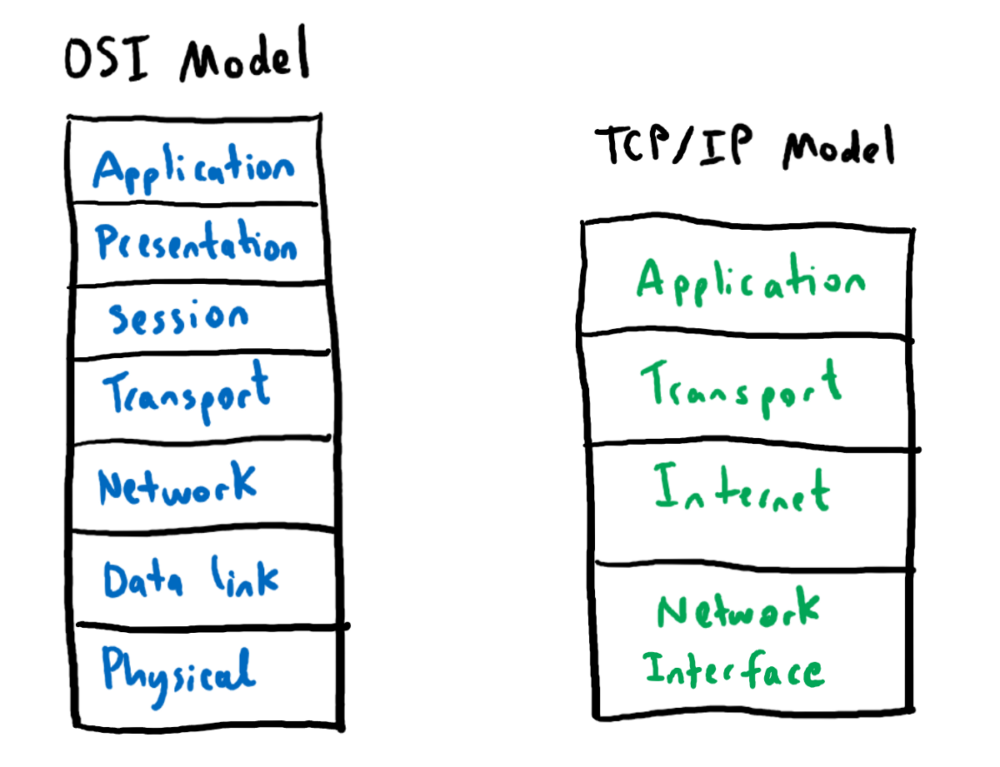

与OSI模型不同，TCP / IP模型（或Internet协议套件）仅由4层组成。 如果我们将OSI模型的7层映射到TCP / IP模型。

我们可以认为映射为：
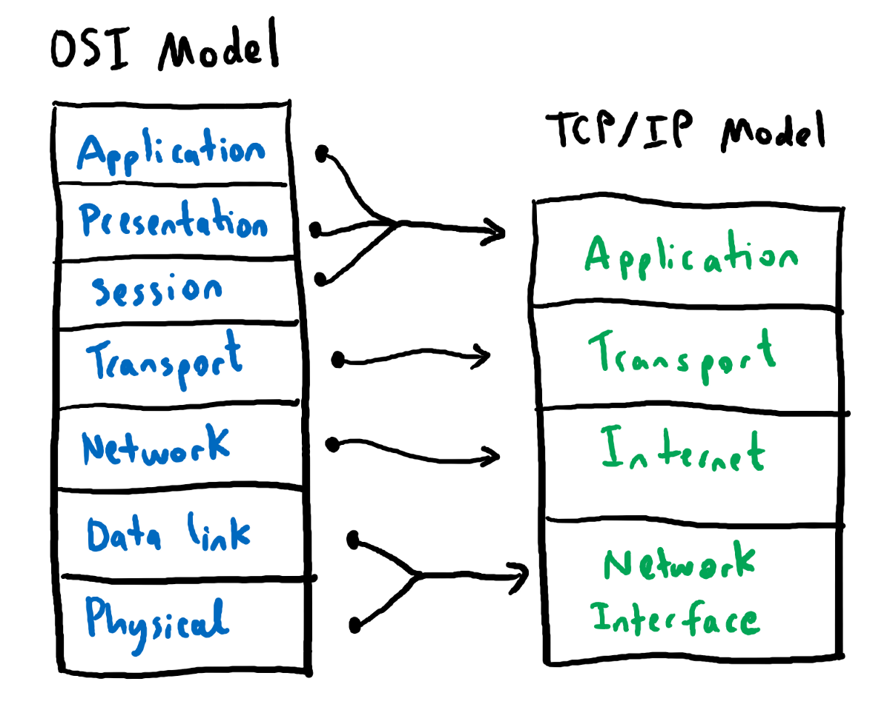

等等，协议？

各层之间的分离和区分较少。 TCP / IP模型的应用层是定义协议的地方。
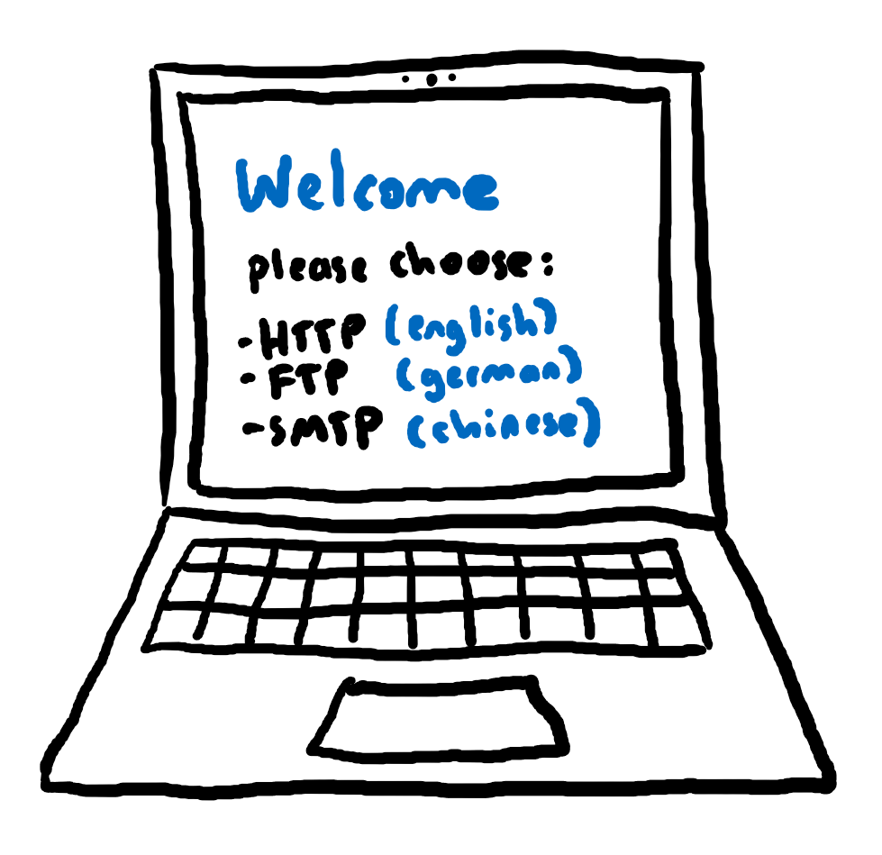

因此，您可以想到一种协议，例如在初次设置计算机时选择一种语言，它为您提供了以英语，德语，中文等进行设置的选项。然后，其余的设置说明将在您选择的语言。但是，与实际的人类语言不同，假设您选择交流的语言决定了您可以做什么。如果我选择HTTP（超文本传输​​协议）作为协议，那么我只能做的事情是获取一些东西，在某些地方放置一些东西，删除一些东西，在某些地方张贴一些东西，等等。HTTP或更常见的是HTTPS（这是安全HTTP）通常在您浏览网络时使用。如果我选择FTP（文件传输协议）作为协议，那么我告诉网络：“我想发送和接收文件，所以请给我说明，以使我能够执行此操作。”如果我选择了SMTP（简单邮件传输协议），那么我告诉网络：“我即将发送和接收电子邮件，请给我说明。 TCP / IP支持更多协议，包括DNS，SSH，RTP，MQTT等。

TCP / IP模型中的传输层类似于OSI模型中的传输层。 在这一层，数据被分成多个部分，并且该层还决定了如何在网络上传输这些部分。 前面我提到过，在此层使用的两个协议是TCP或UDP。
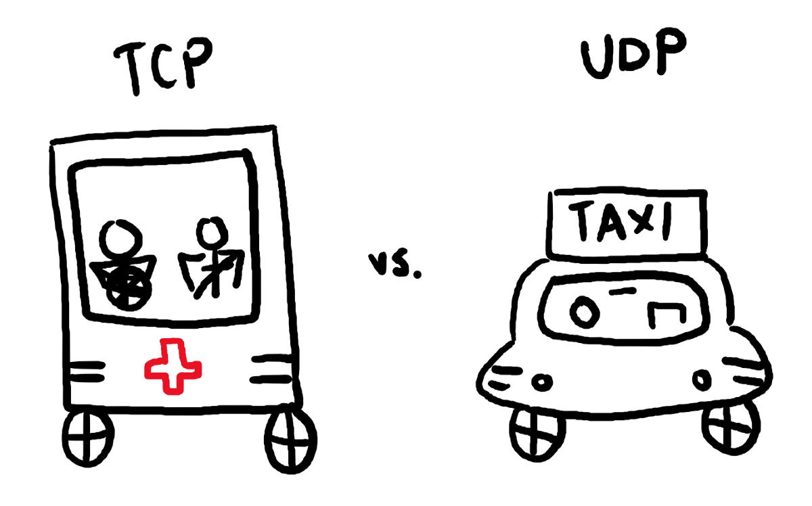

我不会详细介绍TCP或UDP的工作原理，因为有人告诉我们避免因COVID-19危机而立即握手。但是您可以想到通过TCP发送的数据包，例如调度紧急服务。由于数据包的重要性，即使您要重新发送数据包，直到您确认他们已接收到该数据包，也要确保接收方实际上已收到该数据包。与紧急服务调度员类似，他们需要确保发出的紧急服务车辆在结束呼叫之前确实到达了呼叫者。现在，通过UDP发送数据包就像呼叫出租车服务。最好的情况是要求出租车服务的人收到出租车服务。最坏的情况是他们没有得到出租车服务，但是即使如此，也没有人会死。因此，派遣出租车服务的操作员无需挂在电话上即可确保出租车到达接听呼叫者。因此，TCP比UDP更可靠。

现在，TCP / IP模型的Internet层实质上是OSI模型的网络层。 同样，这里是IP地址的输入，以便数据包可以在Internet（或网络）上从路由器跳到另一路由器，以从发送它的路由器（从源，例如Linda的电话）发送到直接到达路由器的路由器。 连接到接收者的网络（目的地，例如Collin的电话）。

TCP / IP堆栈的底部是网络接口，它对应于OSI模型的数据链路层和物理层。 还记得我曾说过通过网络发送数据就像使用邮购类比向某人发送包裹吗？
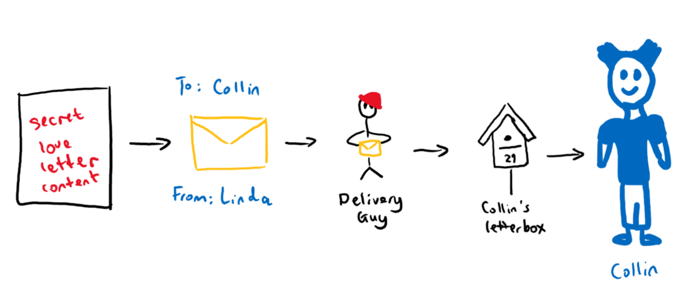

通过网络传递数据的方式与将信件或包裹传递给某人的方式非常相似。 无论是OSI模型还是TCP / IP模型，当您向下浏览堆栈时，每一层都会使用元数据包装该数据。您可以将元数据视为告知网络的信息，以告知网络信件或包裹应去往何处。 “致：科林，致：琳达”。 在每一层，例如，上一层的一些元数据可能会用不同的元数据“替换”，例如，送货员找到Collin的（IP）地址后，他会在（IP）地址的顶部加上新标签 标签，因为当Collin从信箱中拿起信件时，他不再需要知道特定信件的发往哪个地址，而是需要知道该信件是否发给他或他的家人。
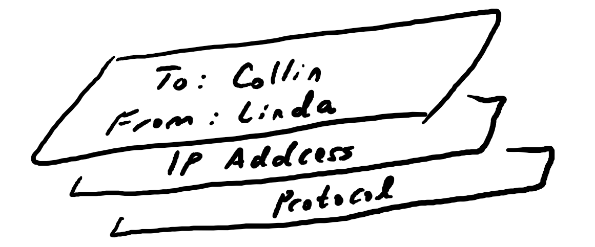

当我们谈论网络中的节点或路由器时，您可以将其像世界各地的所有物理邮局一样。 在您的包裹或信件实际送达您的地址之前，必须先在您当地的邮局购物。 现在您可能已经听说过当人们谈论网络时会用到术语LAN和WAN。 LAN（或局域网）本质上是您的本地邮局。 为了将任何东西发送给您，它必须首先去您当地的邮局（或您的局域网）。 另一方面，WAN（或广域网）就像您的本地邮局与世界各地的其他邮局有联系。 这意味着，如果您想发送或接收来自世界各地的任何东西，则不必了解世界各地的所有其他邮局，而只需了解您当地的邮局，然后您的当地邮局就会使用 他们的网络来发送您的包裹或将它们运送到您家。

什么是防火墙？
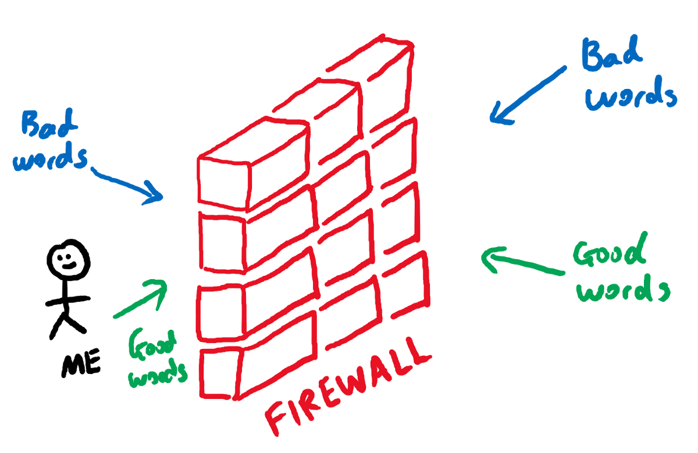

因此，通过Internet交换信息就像在邮局传递东西一样，但是具有更多的技术术语，电缆，电线以及1和0。

我开始写这篇博客文章时就想到了使用防火墙阻止不良关系的想法，但是后来在解释网络工作原理的过程中费尽心思，所以我决定将主题从“防火墙”更改为“网络”，但让我们开始吧 回到我真正想谈论的内容：防火墙。

防火墙本质上是一个屏障或过滤器，它使您可以决定是否应允许某些流量进出系统。 让我们考虑一下人们通常如何互动。 具有较强社会智慧的人可能在其中安装了非常好的（人类）防火墙。 他们知道应该对别人说些什么，以及如何对别人说的话做出反应，因为他们能够在说出“坏”或“有害”字之前过滤掉任何东西，并过滤掉任何坏或坏的东西。 被忽略而对他们说的有害的话。 他们只说出他们信任的单词是“好”和“肯定”单词，同样只接受他们相信的单词是好和积极的单词。 因此，具有较高社会智慧的人可能会与他人建立许多良好的关系。 这就是为什么防火墙很重要。
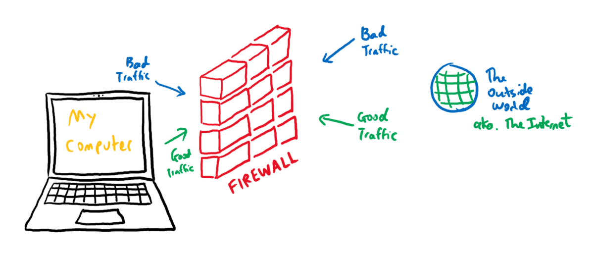

在网络世界中，防火墙充当计算机或系统与外部世界（即Internet）之间的网关或屏障。并非所有发送到您的计算机或系统的流量都是良好的流量。有时，来自想要破坏您的系统的恶意攻击者的流量可能很大。那么，如何区分好流量和差流量呢？好吧，就像一个高度社交化的人，他可能有一套规则将单词分类为“好”单词，将哪些单词分类为“不良”单词一样，（网络）防火墙也有一套（网络流量） ）基于信任模型确定哪些流量被视为“好”流量以及哪些流量被视为“坏”流量的规则。现在，恶意活动可以双向进行，就像一个人可以选择说或接受“坏”字一样。您可能有一个内部用户，决定将公司的敏感或高度机密信息发送给全世界。您无法选择一个人是好人还是坏人，选择是他们的，但是您可以使用防火墙来保护自己（或公司），但对使用系统的人进行限制与外界互动以及外界如何与您的内部系统互动。

您可以使用不同类型的防火墙：
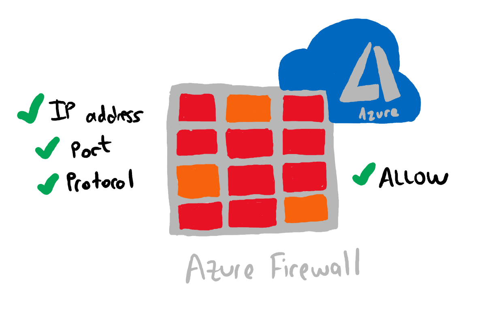

Azure防火墙是基于云的防火墙，可根据IP地址，端口和协议过滤往返于Azure的流量。

假设Collin在信箱中收到以下信息：
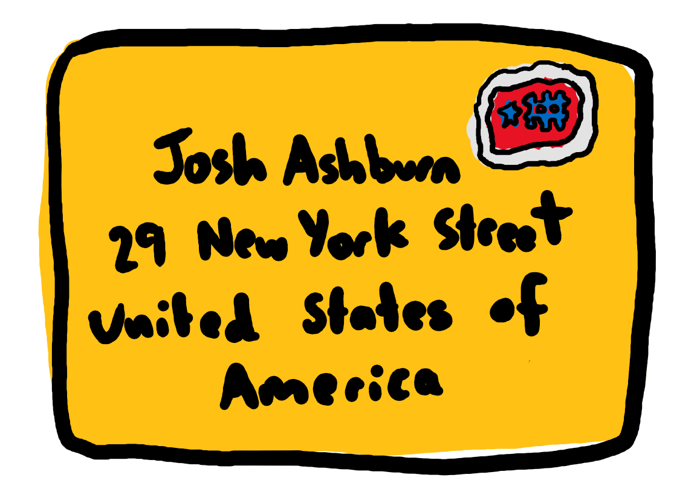

首先，（IP）地址错误，Collin住在纽约街29号，而不是纽约街29号。 港口也错了，这封信是写给乔什·阿什伯恩的。 Collin不认识Josh Ashburns。 基于此，Azure防火墙知道这封信是意外发送到Collin的信箱还是恶意发送到Collin的，因此在甚至到达Collin的信箱之前，Azure防火墙都会拒绝该信件（拒绝流量）到达Collin。

在Azure应用程序网关中，还有另一种类型的防火墙，称为Web应用程序防火墙（或WAF）。 Web应用程序防火墙在应用程序层上工作。

等等，什么是Azure应用网关？

Azure应用程序网关也称为App Gateway，它是负载平衡器。 负载平衡器将流量分配到后端中的多个相同服务器。 如果我要您为我打印此博客文章的副本，则可能只需要一台打印机即可。 但是，如果我告诉您打印1000份并且需要在10分钟之内完成怎么办？ 无需建造大型打印机来满足我的需求，您只需找到另外9台打印机（假设打印速度为10份/分钟）即可。 如果您是负载平衡器，则可能会监视哪个打印机不在打印，然后将所有剩余的打印发送到该打印机，直到完成作业。 由于诸如App Gaterway之类的负载平衡器会为您将流量路由到后端服务器，这意味着您可以设置路由规则。
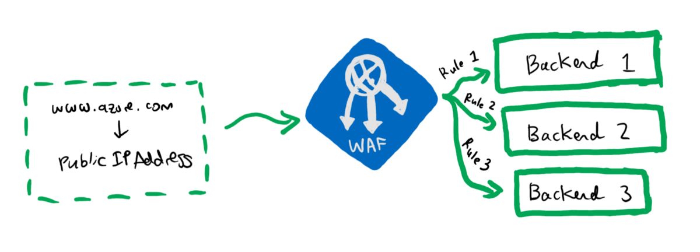

因此，基本上在前端（前端）有一个URL，该URL转换为特定的公共IP地址，该地址设置为每次调用时都会攻击您的Web应用程序防火墙。 在WAF（后端）的后面，它知道约3个后端池（在此特定示例中）。 这些后端池可以是虚拟机（服务器）或Web应用程序（Azure App Service）。 然后，您要做的是设置路由规则（基于协议和端口）以将Web流量路由到特定的后端。

例如，后端3可能仅接受指定以下内容的网络流量：
+ 通讯协定：HTTPS
+ 端口：443

后端1和后端2都接受使用以下内容的网络流量：
+ 通讯协定：HTTP
+ 端口：80

因此，如果使用HTTP传入流量并将其定向到端口80，则WAF会将流量路由到后端1或后端2。

还有其他支持WAF的负载平衡器，例如Azure前门（它是全局负载平衡器），而App Gateway则更多是本地负载平衡器。

Annnnnnd，我又不再讨论话题了，所以让我在打印机真正摆脱冗长的博客帖子之前，在这里停止。 我现在暂时停放负载平衡器，然后再改一天。
```
(本文翻译自Michelle Xie的文章《Explain By Example: Networking》，参考：https://medium.com/swlh/explain-by-example-networking-49d73a140c66)
```
