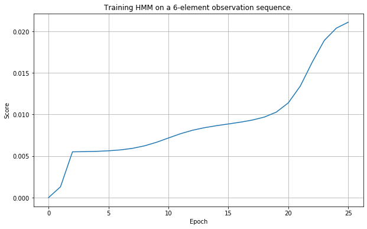

最初发布在https://zerowithdot.com。
# 隐藏的马尔可夫模型-从头开始实施

> A short pause in the summer heat. Portugal, 2019.

# 介绍

互联网上到处都是很好的文章，很好地解释了隐马尔可夫模型（HMM）的理论（例如1、2、3和4）。 但是，其中许多作品都包含相当数量的相当高级的数学方程式。 虽然方程式对于解释这一理论是必要的，但我们决定将其推向新的高度，并逐步创建一个温和的实际实施方案，以补充他人的出色工作。

在这两篇文章的简短系列中，我们将重点介绍将所有复杂的数学转换为代码。 我们的起点是Mark Stamp编写的文档。 我们将使用本文来定义我们的代码（本文），然后使用一个有点奇怪的“早晨精神错乱”示例来演示其在实践中的性能。
## 符号

在开始之前，我们先回顾一下将要使用的符号。 顺便说一句，如果您不清楚其中的某些内容，请不要担心。 我们会牵着你的手。
+ T-观察序列的长度。
+ N-潜在（隐藏）状态的数量。
+ M-可观察数。
+ Q = {q₀，q₁，…}-隐藏状态。
+ V = {0，1，…，M_1}-可能的观测值集合。
+ -状态转换矩阵。
+ B-发射概率矩阵。
+ π-初始状态概率分布。
+ O-观察序列。
+ X =（x₀，x₁，…），x_t∈Q-隐藏状态序列。

定义该集合后，我们可以使用矩阵来计算任何状态和观察的概率：
+ A = {a_ij}-开始一个转换矩阵。
+ B = {b_j（k）} —是一个发射矩阵。

与过渡和观测（发射）相关的概率为：


因此，该模型被定义为一个集合：

# 基本定义

由于HMM基于概率矢量和矩阵，因此我们首先定义代表基本概念的对象。 为了有用，对象必须反映某些属性。 例如，概率向量的所有元素必须为数字0≤x≤1，并且它们的总和必须为1。因此，让我们设计对象以固有的方式保护数学属性的方式。
```
import numpy as npimport pandas as pdclass ProbabilityVector:    def __init__(self, probabilities: dict):        states = probabilities.keys()        probs  = probabilities.values()                assert len(states) == len(probs),             "The probabilities must match the states."        assert len(states) == len(set(states)),             "The states must be unique."        assert abs(sum(probs) - 1.0) < 1e-12,             "Probabilities must sum up to 1."        assert len(list(filter(lambda x: 0 <= x <= 1, probs))) == len(probs), \            "Probabilities must be numbers from [0, 1] interval."                self.states = sorted(probabilities)        self.values = np.array(list(map(lambda x:             probabilities[x], self.states))).reshape(1, -1)            @classmethod    def initialize(cls, states: list):        size = len(states)        rand = np.random.rand(size) / (size**2) + 1 / size        rand /= rand.sum(axis=0)        return cls(dict(zip(states, rand)))        @classmethod    def from_numpy(cls, array: np.ndarray, state: list):        return cls(dict(zip(states, list(array))))    @property    def dict(self):        return {k:v for k, v in zip(self.states, list(self.values.flatten()))}    @property    def df(self):        return pd.DataFrame(self.values, columns=self.states, index=['probability'])    def __repr__(self):        return "P({}) = {}.".format(self.states, self.values)    def __eq__(self, other):        if not isinstance(other, ProbabilityVector):            raise NotImplementedError        if (self.states == other.states) and (self.values == other.values).all():            return True        return False    def __getitem__(self, state: str) -> float:        if state not in self.states:            raise ValueError("Requesting unknown probability state from vector.")        index = self.states.index(state)        return float(self.values[0, index])    def __mul__(self, other) -> np.ndarray:        if isinstance(other, ProbabilityVector):            return self.values * other.values        elif isinstance(other, (int, float)):            return self.values * other        else:            NotImplementedError    def __rmul__(self, other) -> np.ndarray:        return self.__mul__(other)    def __matmul__(self, other) -> np.ndarray:        if isinstance(other, ProbabilityMatrix):            return self.values @ other.values    def __truediv__(self, number) -> np.ndarray:        if not isinstance(number, (int, float)):            raise NotImplementedError        x = self.values        return x / number if number != 0 else x / (number + 1e-12)    def argmax(self):        index = self.values.argmax()        return self.states[index]
```

初始化此对象的最自然的方法是使用字典，因为它将值与唯一键相关联。 不幸的是，字典没有提供任何对值施加约束的断言机制。 因此，我们构建了自定义的ProbabilityVector对象以确保我们的值正确运行。 最重要的是，我们强制执行以下操作：
+ 值的数量必须等于键的数量（我们各州的名称）。 尽管从字典初始化对象时这不是问题，但是稍后我们将使用其他方式。
+ 状态的所有名称必须唯一（适用相同的参数）。
+ 概率总和必须为1（达到一定的容差）。
+ 所有概率必须为0≤p≤1。

确保这一点之后，我们还提供了两种方法来实例化ProbabilityVector对象（使用@classmethod装饰）。
+ 我们随机实例化对象-训练时将很有用。
+ 我们使用现成的numpy数组并在其中使用值，并且仅提供状态的名称。

为了方便和调试，我们提供了两种其他方法来请求值。 装饰后，它们以字典或熊猫数据框的形式返回PV对象的内容。

PV对象需要满足以下数学运算（出于构造HMM的目的）：
+ 比较（__eq__）-要知道两个PV是否相等，
+ 两个PV的按元素乘法或标量（__mul__和__rmul__）的乘法。
+ 点积（__matmul__）-执行向量矩阵乘法
+ 除以数字（__truediv__），
+ argmax查找概率最高的状态。
+ __getitem__以启用通过键选择值。

请注意，例如 将PV与标量相乘，返回的结构是结果numpy数组，而不是另一个PV。 这是因为乘以1以外的任何值都会违反PV本身的完整性。

在内部，这些值存储为大小为（1×N）的numpy数组。

## 例
```
a1 = ProbabilityVector({'rain': 0.7, 'sun': 0.3})a2 = ProbabilityVector({'sun': 0.1, 'rain': 0.9})print(a1.df)print(a2.df)print("Comparison:", a1 == a2)print("Element-wise multiplication:", a1 * a2)print("Argmax:", a1.argmax())print("Getitem:", a1['rain'])# OUTPUT>>>              rain  sun    probability   0.7  0.3                 rain  sun    probability   0.9  0.1>>> Comparison: False>>> Element-wise multiplication: [[0.63 0.03]]>>> Argmax: rain>>> Getitem: 0.7
```
## 概率矩阵

另一个对象是概率矩阵，它是HMM定义的核心部分。 形式上，A和B矩阵必须是行随机的，这意味着每行的值必须总和为1。因此，我们可以通过堆叠几个PV来定义PM，我们通过构造PV来保证这种约束 。
```
class ProbabilityMatrix:    def __init__(self, prob_vec_dict: dict):                assert len(prob_vec_dict) > 1, \            "The numebr of input probability vector must be greater than one."        assert len(set([str(x.states) for x in prob_vec_dict.values()])) == 1, \            "All internal states of all the vectors must be indentical."        assert len(prob_vec_dict.keys()) == len(set(prob_vec_dict.keys())), \            "All observables must be unique."        self.states      = sorted(prob_vec_dict)        self.observables = prob_vec_dict[self.states[0]].states        self.values      = np.stack([prob_vec_dict[x].values \                           for x in self.states]).squeeze()     @classmethod    def initialize(cls, states: list, observables: list):        size = len(states)        rand = np.random.rand(size, len(observables)) \             / (size**2) + 1 / size        rand /= rand.sum(axis=1).reshape(-1, 1)        aggr = [dict(zip(observables, rand[i, :])) for i in range(len(states))]        pvec = [ProbabilityVector(x) for x in aggr]        return cls(dict(zip(states, pvec)))    @classmethod    def from_numpy(cls, array:                   np.ndarray,                   states: list,                   observables: list):        p_vecs = [ProbabilityVector(dict(zip(observables, x))) \                  for x in array]        return cls(dict(zip(states, p_vecs)))    @property    def dict(self):        return self.df.to_dict()    @property    def df(self):        return pd.DataFrame(self.values,                columns=self.observables, index=self.states)    def __repr__(self):        return "PM {} states: {} -> obs: {}.".format(            self.values.shape, self.states, self.observables)    def __getitem__(self, observable: str) -> np.ndarray:        if observable not in self.observables:            raise ValueError("Requesting unknown probability observable from the matrix.")        index = self.observables.index(observable)        return self.values[:, index].reshape(-1, 1)
```

在这里，我们实例化PM的方法是向类的构造函数提供PV的字典。 这样，我们不仅可以确保PM的每一行都是随机的，而且还可以为每个可观测的名称提供名称。

因此，我们的PM可以为任何可观察到的系数给出一个数组。 从数学上讲，PM是一个矩阵：


其他方法的实现方式与PV相似。
## 例
```
a1 = ProbabilityVector({'rain': 0.7, 'sun': 0.3})a2 = ProbabilityVector({'rain': 0.6, 'sun': 0.4})A  = ProbabilityMatrix({'hot': a1, 'cold': a2})print(A)print(A.df)>>> PM (2, 2) states: ['cold', 'hot'] -> obs: ['rain', 'sun'].>>>      rain  sun   cold   0.6  0.4   hot    0.7  0.3b1 = ProbabilityVector({'0S': 0.1, '1M': 0.4, '2L': 0.5})b2 = ProbabilityVector({'0S': 0.7, '1M': 0.2, '2L': 0.1})B =  ProbabilityMatrix({'0H': b1, '1C': b2})print(B)print(B.df)>>> PM (2, 3) states: ['0H', '1C'] -> obs: ['0S', '1M', '2L'].>>>       0S   1M   2L     0H  0.1  0.4  0.5     1C  0.7  0.2  0.1P = ProbabilityMatrix.initialize(list('abcd'), list('xyz'))print('Dot product:', a1 @ A)print('Initialization:', P)print(P.df)>>> Dot product: [[0.63 0.37]]>>> Initialization: PM (4, 3)     states: ['a', 'b', 'c', 'd'] -> obs: ['x', 'y', 'z'].>>>          x         y         z   a  0.323803  0.327106  0.349091   b  0.318166  0.326356  0.355478   c  0.311833  0.347983  0.340185   d  0.337223  0.316850  0.345927
```
# 实施隐马尔可夫链

在继续计算分数之前，让我们使用PV和PM定义实施隐马尔可夫链。

同样，我们将作为一个类，将其称为HiddenMarkovChain。 它将在A，B和π处进行整理。 稍后，我们将实现更多适用于此类的方法。
## 计算分数

计算分数意味着在给定我们的（已知）模型λ=（A，B，π）的情况下，发现特定观察链O的概率是多少。 换句话说，我们对找到p（O |λ）很感兴趣。

我们可以通过对隐藏变量X的所有可能链进行边际化来找到p（O |λ），其中X = {x₀，x₁，…}：


由于p（O | X，λ）= ∏ b（O）（与可观察物相关的所有概率的乘积）和p（X |λ）=π∏ a（从x在t处转变为所有概率的乘积 x在t + 1处，我们寻找的概率（分数）为：


这是一种简单的分数计算方式，因为我们需要计算每个可能的链X的概率。无论哪种方式，让我们在python中实现它：
```
from itertools import productfrom functools import reduceclass HiddenMarkovChain:    def __init__(self, T, E, pi):        self.T = T  # transmission matrix A        self.E = E  # emission matrix B        self.pi = pi        self.states = pi.states        self.observables = E.observables        def __repr__(self):        return "HML states: {} -> observables: {}.".format(            len(self.states), len(self.observables))        @classmethod    def initialize(cls, states: list, observables: list):        T = ProbabilityMatrix.initialize(states, states)        E = ProbabilityMatrix.initialize(states, observables)        pi = ProbabilityVector.initialize(states)        return cls(T, E, pi)        def _create_all_chains(self, chain_length):        return list(product(*(self.states,) * chain_length))        def score(self, observations: list) -> float:        def mul(x, y): return x * y                score = 0        all_chains = self._create_all_chains(len(observations))        for idx, chain in enumerate(all_chains):            expanded_chain = list(zip(chain, [self.T.states[0]] + list(chain)))            expanded_obser = list(zip(observations, chain))                        p_observations = list(map(lambda x: self.E.df.loc[x[1], x[0]], expanded_obser))            p_hidden_state = list(map(lambda x: self.T.df.loc[x[1], x[0]], expanded_chain))            p_hidden_state[0] = self.pi[chain[0]]                        score += reduce(mul, p_observations) * reduce(mul, p_hidden_state)        return score
```
## 例
```
a1 = ProbabilityVector({'1H': 0.7, '2C': 0.3})a2 = ProbabilityVector({'1H': 0.4, '2C': 0.6})b1 = ProbabilityVector({'1S': 0.1, '2M': 0.4, '3L': 0.5})b2 = ProbabilityVector({'1S': 0.7, '2M': 0.2, '3L': 0.1})A = ProbabilityMatrix({'1H': a1, '2C': a2})B = ProbabilityMatrix({'1H': b1, '2C': b2})pi = ProbabilityVector({'1H': 0.6, '2C': 0.4})hmc = HiddenMarkovChain(A, B, pi)observations = ['1S', '2M', '3L', '2M', '1S']print("Score for {} is {:f}.".format(observations, hmc.score(observations)))>>> Score for ['1S', '2M', '3L', '2M', '1S'] is 0.003482.
```

如果我们的实现是正确的，则对于给定模型，所有可能的观察链的所有得分值应加起来为1。 即：

```
all_possible_observations = {'1S', '2M', '3L'}chain_length = 3  # any int > 0all_observation_chains = list(product(*(all_possible_observations,) * chain_length))all_possible_scores = list(map(lambda obs: hmc.score(obs), all_observation_chains))print("All possible scores added: {}.".format(sum(all_possible_scores)))>>> All possible scores added: 1.0.
```

确实。
# 前进得分

以上面的方式计算分数很幼稚。 为了找到特定观察链O的数目，我们必须计算所有可能的潜在变量序列X的分数。这需要2TN ^ T乘法，即使对于较小的数目也需要时间。

另一种方法是计算直到时间t的序列的部分观测值。

对于和i∈{0，1，…，N-1}和t∈{0，1，…，T-1}：


所以，


和


然后


注意，α_t是长度为N的向量。乘积αa的总和实际上可以写为点积。 因此：


在星号上，我们表示逐元素乘法。

通过此实现，我们可以将乘法次数减少到N²T，并可以利用矢量化的优势。
```
class HiddenMarkovChain_FP(HiddenMarkovChain):    def _alphas(self, observations: list) -> np.ndarray:        alphas = np.zeros((len(observations), len(self.states)))        alphas[0, :] = self.pi.values * self.E[observations[0]].T        for t in range(1, len(observations)):            alphas[t, :] = (alphas[t - 1, :].reshape(1, -1)                          @ self.T.values) * self.E[observations[t]].T        return alphas        def score(self, observations: list) -> float:        alphas = self._alphas(observations)        return float(alphas[-1].sum())
```
## 例
```
hmc_fp = HiddenMarkovChain_FP(A, B, pi)observations = ['1S', '2M', '3L', '2M', '1S']print("Score for {} is {:f}.".format(observations, hmc_fp.score(observations)))>>> All possible scores added: 1.0.
```

…对。
# 仿真与融合

让我们再测试一件事。 基本上，让我们以λ=（A，B，π）为基础，并使用它从某个初始状态概率π开始生成一系列随机可观测量。

如果期望的长度T是“足够大”，则我们期望系统收敛于一个序列，该序列平均提供与直接从A和B矩阵期望的事件数量相同的事件数。 换句话说，过渡矩阵和发射矩阵以一定的概率“决定”每一步的下一状态是什么以及观察到的结果。 因此，最初看起来像随机事件的平均水平应该反映矩阵本身的系数。 我们也检查一下。
```
class HiddenMarkovChain_Simulation(HiddenMarkovChain):    def run(self, length: int) -> (list, list):        assert length >= 0, "The chain needs to be a non-negative number."        s_history = [0] * (length + 1)        o_history = [0] * (length + 1)                prb = self.pi.values        obs = prb @ self.E.values        s_history[0] = np.random.choice(self.states, p=prb.flatten())        o_history[0] = np.random.choice(self.observables, p=obs.flatten())                for t in range(1, length + 1):            prb = prb @ self.T.values            obs = prb @ self.E.values            s_history[t] = np.random.choice(self.states, p=prb.flatten())            o_history[t] = np.random.choice(self.observables, p=obs.flatten())                return o_history, s_history
```
## 例
```
hmc_s = HiddenMarkovChain_Simulation(A, B, pi)observation_hist, states_hist = hmc_s.run(100)  # length = 100stats = pd.DataFrame({    'observations': observation_hist,    'states': states_hist}).applymap(lambda x: int(x[0])).plot()
```

> Figure 1. An example of a Markov process. The states and the observable sequences are shown.

# 潜在状态

状态矩阵A由以下系数给出：


因此，与先前的状态无关，在t + 1时处于“ 1H”状态的“存在”概率为：


如果我们假设处于某个状态的先验概率是完全随机的，则p（1H）= 1和p（2C）= 0.9，这在重新归一化后分别为0.55和0.45。

如果我们计算每个状态的出现次数并将其除以序列中元素的数量，则随着序列长度的增加，我们将越来越接近这些状态。
## 例
```
hmc_s = HiddenMarkovChain_Simulation(A, B, pi)stats = {}for length in np.logspace(1, 5, 40).astype(int):    observation_hist, states_hist = hmc_s.run(length)    stats[length] = pd.DataFrame({        'observations': observation_hist,        'states': states_hist}).applymap(lambda x: int(x[0]))S = np.array(list(map(lambda x:         x['states'].value_counts().to_numpy() / len(x), stats.values())))plt.semilogx(np.logspace(1, 5, 40).astype(int), S)plt.xlabel('Chain length T')plt.ylabel('Probability')plt.title('Converging probabilities.')plt.legend(['1H', '2C'])plt.show()
```

> Figure 2. Convergence of the probabilities against the length of the chain.


undefined
# 扩大班级

我们将α定义为部分观测到时间序列的概率。


现在，让我们定义“相反”的可能性。 即，观察从T-1向下到t的序列的概率。

undefined


c`1和以前一样，我们可以递归计算β（i）：


然后对于t≠T-1：


矢量化形式为：


最后，我们还定义了一个新的量γ来指示时间t处的状态q_i，对于该状态，概率（向前和向后计算）的可能性最大：


undefined

```
class HiddenMarkovChain_Uncover(HiddenMarkovChain_Simulation):    def _alphas(self, observations: list) -> np.ndarray:        alphas = np.zeros((len(observations), len(self.states)))        alphas[0, :] = self.pi.values * self.E[observations[0]].T        for t in range(1, len(observations)):            alphas[t, :] = (alphas[t - 1, :].reshape(1, -1) @ self.T.values) \                         * self.E[observations[t]].T        return alphas        def _betas(self, observations: list) -> np.ndarray:        betas = np.zeros((len(observations), len(self.states)))        betas[-1, :] = 1        for t in range(len(observations) - 2, -1, -1):            betas[t, :] = (self.T.values @ (self.E[observations[t + 1]] \                        * betas[t + 1, :].reshape(-1, 1))).reshape(1, -1)        return betas        def uncover(self, observations: list) -> list:        alphas = self._alphas(observations)        betas = self._betas(observations)        maxargs = (alphas * betas).argmax(axis=1)        return list(map(lambda x: self.states[x], maxargs))
```
# 验证方式

undefined
## 例
```
np.random.seed(42)a1 = ProbabilityVector({'1H': 0.7, '2C': 0.3})a2 = ProbabilityVector({'1H': 0.4, '2C': 0.6})b1 = ProbabilityVector({'1S': 0.1, '2M': 0.4, '3L': 0.5}) b2 = ProbabilityVector({'1S': 0.7, '2M': 0.2, '3L': 0.1})A  = ProbabilityMatrix({'1H': a1, '2C': a2})B  = ProbabilityMatrix({'1H': b1, '2C': b2})pi = ProbabilityVector({'1H': 0.6, '2C': 0.4})hmc = HiddenMarkovChain_Uncover(A, B, pi)observed_sequence, latent_sequence = hmc.run(5)uncovered_sequence = hmc.uncover(observed_sequence)|                    | 0   | 1   | 2   | 3   | 4   | 5   ||:------------------:|:----|:----|:----|:----|:----|:----|| observed sequence  | 3L  | 3M  | 1S  | 3L  | 3L  | 3L  || latent sequence    | 1H  | 2C  | 1H  | 1H  | 2C  | 1H  || uncovered sequence | 1H  | 1H  | 2C  | 1H  | 1H  | 1H  |
```

如我们所见，最可能的潜在状态链（根据算法）与实际引起观察的链不同。 这是预料之中的。 毕竟，取决于潜在序列，每个观察序列只能以一定概率出现。

下面的代码评估产生我们的观察序列的不同潜在序列的可能性。
```
all_possible_states = {'1H', '2C'}chain_length = 6  # any int > 0all_states_chains = list(product(*(all_possible_states,) * chain_length))df = pd.DataFrame(all_states_chains)dfp = pd.DataFrame()for i in range(chain_length):    dfp['p' + str(i)] = df.apply(lambda x:         hmc.E.df.loc[x[i], observed_sequence[i]], axis=1)scores = dfp.sum(axis=1).sort_values(ascending=False)df = df.iloc[scores.index]df['score'] = scoresdf.head(10).reset_index()|    index | 0   | 1   | 2   | 3   | 4   | 5   |   score ||:--------:|:----|:----|:----|:----|:----|:----|--------:||        8 | 1H  | 1H  | 2C  | 1H  | 1H  | 1H  |     3.1 ||       24 | 1H  | 2C  | 2C  | 1H  | 1H  | 1H  |     2.9 ||       40 | 2C  | 1H  | 2C  | 1H  | 1H  | 1H  |     2.7 ||       12 | 1H  | 1H  | 2C  | 2C  | 1H  | 1H  |     2.7 ||       10 | 1H  | 1H  | 2C  | 1H  | 2C  | 1H  |     2.7 ||        9 | 1H  | 1H  | 2C  | 1H  | 1H  | 2C  |     2.7 ||       25 | 1H  | 2C  | 2C  | 1H  | 1H  | 2C  |     2.5 ||        0 | 1H  | 1H  | 1H  | 1H  | 1H  | 1H  |     2.5 ||       26 | 1H  | 2C  | 2C  | 1H  | 2C  | 1H  |     2.5 ||       28 | 1H  | 2C  | 2C  | 2C  | 1H  | 1H  |     2.5 |
```

上面的结果显示了给定观察序列的潜在序列的排序表。 实际的潜在序列（引起观测的序列）位于第35位（我们从零开始计算索引）。
```
dfc = df.copy().reset_index()for i in range(chain_length):    dfc = dfc[dfc[i] == latent_sequence[i]]    dfc|   index | 0   | 1   | 2   | 3   | 4   | 5   |   score ||:-------:|:----|:----|:----|:----|:----|:----|--------:||      18 | 1H  | 2C  | 1H  | 1H  | 2C  | 1H  |     1.9 |
```
# 训练模型

现在是展示培训程序的时候了。 形式上，我们有兴趣寻找λ=（A，B，π），以便在给定所需的观察序列O的情况下，我们的模型λ将提供最佳拟合。
# 扩大班级

在这里，我们的起点将是我们先前定义的HiddenMarkovModel_Uncover。 我们将添加新的方法进行培训。

知道了我们的潜在状态Q和可能的观察状态O，我们就自动知道了矩阵A和B的大小，因此也知道了N和M。但是，我们需要确定a和b和π。

对于t = 0、1，...，T-2和i，j = 0、1，...，N -1，我们定义“ di-gammas”：


γ（i，j）是q在t到t + 1跃迁的概率。用α，β，A，B表示：


现在，从实现的角度考虑，我们希望避免同时循环遍历i，j和t，因为这会非常致命。 幸运的是，我们可以向量化方程：


有了γ（i，j）的方程，我们可以计算


为了找到λ=（A，B，π），我们做

对于i = 0、1，...，N-1：


要么


undefined


对于j = 0、1，...，N-1和k = 0、1，...，M-1：

```
class HiddenMarkovLayer(HiddenMarkovChain_Uncover):    def _digammas(self, observations: list) -> np.ndarray:        L, N = len(observations), len(self.states)        digammas = np.zeros((L - 1, N, N))        alphas = self._alphas(observations)        betas = self._betas(observations)        score = self.score(observations)        for t in range(L - 1):            P1 = (alphas[t, :].reshape(-1, 1) * self.T.values)            P2 = self.E[observations[t + 1]].T * betas[t + 1].reshape(1, -1)            digammas[t, :, :] = P1 * P2 / score        return digammas
```

通过对._difammas方法补充“层”，我们应该能够执行所有必要的计算。 但是，将层的“管理”委托给另一个类是有意义的。 实际上，模型训练可以总结如下：
+ 初始化A，B和π。
+ 计算γ（i，j）。
+ 更新模型的A，B和π。
+ 我们重复2.和3.直到得分p（O |λ）不再增加。
```
class HiddenMarkovModel:    def __init__(self, hml: HiddenMarkovLayer):        self.layer = hml        self._score_init = 0        self.score_history = []    @classmethod    def initialize(cls, states: list, observables: list):        layer = HiddenMarkovLayer.initialize(states, observables)        return cls(layer)    def update(self, observations: list) -> float:        alpha = self.layer._alphas(observations)        beta = self.layer._betas(observations)        digamma = self.layer._digammas(observations)        score = alpha[-1].sum()        gamma = alpha * beta / score         L = len(alpha)        obs_idx = [self.layer.observables.index(x) \                  for x in observations]        capture = np.zeros((L, len(self.layer.states), len(self.layer.observables)))        for t in range(L):            capture[t, :, obs_idx[t]] = 1.0        pi = gamma[0]        T = digamma.sum(axis=0) / gamma[:-1].sum(axis=0).reshape(-1, 1)        E = (capture * gamma[:, :, np.newaxis]).sum(axis=0) / gamma.sum(axis=0).reshape(-1, 1)        self.layer.pi = ProbabilityVector.from_numpy(pi, self.layer.states)        self.layer.T = ProbabilityMatrix.from_numpy(T, self.layer.states, self.layer.states)        self.layer.E = ProbabilityMatrix.from_numpy(E, self.layer.states, self.layer.observables)                    return score    def train(self, observations: list, epochs: int, tol=None):        self._score_init = 0        self.score_history = (epochs + 1) * [0]        early_stopping = isinstance(tol, (int, float))        for epoch in range(1, epochs + 1):            score = self.update(observations)            print("Training... epoch = {} out of {}, score = {}.".format(epoch, epochs, score))            if early_stopping and abs(self._score_init - score) / score < tol:                print("Early stopping.")                break            self._score_init = score            self.score_history[epoch] = score
```
## 例
```
np.random.seed(42)observations = ['3L', '2M', '1S', '3L', '3L', '3L']states = ['1H', '2C']observables = ['1S', '2M', '3L']hml = HiddenMarkovLayer.initialize(states, observables)hmm = HiddenMarkovModel(hml)hmm.train(observations, 25)
```

> Figure 3. Example of the score funciton during training.

# 验证

让我们看一下生成的序列。 “需求”顺序为：
```
|    | 0   | 1   | 2   | 3   | 4   | 5   ||---:|:----|:----|:----|:----|:----|:----||  0 | 3L  | 2M  | 1S  | 3L  | 3L  | 3L  |RUNS = 100000T = 5chains = RUNS * [0]for i in range(len(chains)):    chain = hmm.layer.run(T)[0]    chains[i] = '-'.join(chain)
```

下表总结了基于100000次尝试（见上文）的模拟运行，并显示了发生频率和匹配观察值的数量。

底线是，如果我们真正地训练了模型，我们应该看到它有很强的趋势来生成类似于我们所需序列的序列。 让我们看看它是否发生。
```
df = pd.DataFrame(pd.Series(chains).value_counts(), columns=['counts']).reset_index().rename(columns={'index': 'chain'})df = pd.merge(df, df['chain'].str.split('-', expand=True), left_index=True, right_index=True)s = []for i in range(T + 1):    s.append(df.apply(lambda x: x[i] == observations[i], axis=1))df['matched'] = pd.concat(s, axis=1).sum(axis=1)df['counts'] = df['counts'] / RUNS * 100df = df.drop(columns=['chain'])df.head(30)---|---:|---------:|:----|:----|:----|:----|:----|:----|----------:||  0 |    8.907 | 3L  | 3L  | 3L  | 3L  | 3L  | 3L  |         4 ||  1 |    4.422 | 3L  | 2M  | 3L  | 3L  | 3L  | 3L  |         5 ||  2 |    4.286 | 1S  | 3L  | 3L  | 3L  | 3L  | 3L  |         3 ||  3 |    4.284 | 3L  | 3L  | 3L  | 3L  | 3L  | 2M  |         3 ||  4 |    4.278 | 3L  | 3L  | 3L  | 2M  | 3L  | 3L  |         3 ||  5 |    4.227 | 3L  | 3L  | 1S  | 3L  | 3L  | 3L  |         5 ||  6 |    4.179 | 3L  | 3L  | 3L  | 3L  | 1S  | 3L  |         3 ||  7 |    2.179 | 3L  | 2M  | 3L  | 2M  | 3L  | 3L  |         4 ||  8 |    2.173 | 3L  | 2M  | 3L  | 3L  | 1S  | 3L  |         4 ||  9 |    2.165 | 1S  | 3L  | 1S  | 3L  | 3L  | 3L  |         4 || 10 |    2.147 | 3L  | 2M  | 3L  | 3L  | 3L  | 2M  |         4 || 11 |    2.136 | 3L  | 3L  | 3L  | 2M  | 3L  | 2M  |         2 || 12 |    2.121 | 3L  | 2M  | 1S  | 3L  | 3L  | 3L  |         6 || 13 |    2.111 | 1S  | 3L  | 3L  | 2M  | 3L  | 3L  |         2 || 14 |    2.1   | 1S  | 2M  | 3L  | 3L  | 3L  | 3L  |         4 || 15 |    2.075 | 3L  | 3L  | 3L  | 2M  | 1S  | 3L  |         2 || 16 |    2.05  | 1S  | 3L  | 3L  | 3L  | 3L  | 2M  |         2 || 17 |    2.04  | 3L  | 3L  | 1S  | 3L  | 3L  | 2M  |         4 || 18 |    2.038 | 3L  | 3L  | 1S  | 2M  | 3L  | 3L  |         4 || 19 |    2.022 | 3L  | 3L  | 1S  | 3L  | 1S  | 3L  |         4 || 20 |    2.008 | 1S  | 3L  | 3L  | 3L  | 1S  | 3L  |         2 || 21 |    1.955 | 3L  | 3L  | 3L  | 3L  | 1S  | 2M  |         2 || 22 |    1.079 | 1S  | 2M  | 3L  | 2M  | 3L  | 3L  |         3 || 23 |    1.077 | 1S  | 2M  | 3L  | 3L  | 3L  | 2M  |         3 || 24 |    1.075 | 3L  | 2M  | 1S  | 2M  | 3L  | 3L  |         5 || 25 |    1.064 | 1S  | 2M  | 1S  | 3L  | 3L  | 3L  |         5 || 26 |    1.052 | 1S  | 2M  | 3L  | 3L  | 1S  | 3L  |         3 || 27 |    1.048 | 3L  | 2M  | 3L  | 2M  | 1S  | 3L  |         3 || 28 |    1.032 | 1S  | 3L  | 1S  | 2M  | 3L  | 3L  |         3 || 29 |    1.024 | 1S  | 3L  | 1S  | 3L  | 1S  | 3L  |         3 |
```

这是我们不希望模型创建的序列。
```
|     |   counts | 0   | 1   | 2   | 3   | 4   | 5   |   matched ||----:|---------:|:----|:----|:----|:----|:----|:----|----------:|| 266 |    0.001 | 1S  | 1S  | 3L  | 3L  | 2M  | 2M  |         1 || 267 |    0.001 | 1S  | 2M  | 2M  | 3L  | 2M  | 2M  |         2 || 268 |    0.001 | 3L  | 1S  | 1S  | 3L  | 1S  | 1S  |         3 || 269 |    0.001 | 3L  | 3L  | 3L  | 1S  | 2M  | 2M  |         1 || 270 |    0.001 | 3L  | 1S  | 3L  | 1S  | 1S  | 3L  |         2 || 271 |    0.001 | 1S  | 3L  | 2M  | 1S  | 1S  | 3L  |         1 || 272 |    0.001 | 3L  | 2M  | 2M  | 3L  | 3L  | 1S  |         4 || 273 |    0.001 | 1S  | 3L  | 3L  | 1S  | 1S  | 1S  |         0 || 274 |    0.001 | 3L  | 1S  | 2M  | 2M  | 1S  | 2M  |         1 || 275 |    0.001 | 3L  | 3L  | 2M  | 1S  | 3L  | 2M  |         2 |
```

正如我们所看到的，尽管确切的序列（匹配6/6的序列）已经将自己置于第10位，但我们的模型仍倾向于生成与所需序列相似的序列！ 另一方面，根据该表，前10个序列仍然与我们要求的序列有些相似。

undefined
```
hml_rand = HiddenMarkovLayer.initialize(states, observables)hmm_rand = HiddenMarkovModel(hml_rand)RUNS = 100000T = 5chains_rand = RUNS * [0]for i in range(len(chains_rand)):    chain_rand = hmm_rand.layer.run(T)[0]    chains_rand[i] = '-'.join(chain_rand)df2 = pd.DataFrame(pd.Series(chains_rand).value_counts(), columns=['counts']).reset_index().rename(columns={'index': 'chain'})df2 = pd.merge(df2, df2['chain'].str.split('-', expand=True), left_index=True, right_index=True)s = []for i in range(T + 1):    s.append(df2.apply(lambda x: x[i] == observations[i], axis=1))df2['matched'] = pd.concat(s, axis=1).sum(axis=1)df2['counts'] = df2['counts'] / RUNS * 100df2 = df2.drop(columns=['chain'])fig, ax = plt.subplots(1, 1, figsize=(14, 6))ax.plot(df['matched'], 'g:')ax.plot(df2['matched'], 'k:')ax.set_xlabel('Ordered index')ax.set_ylabel('Matching observations')ax.set_title('Verification on a 6-observation chain.')ax2 = ax.twinx()ax2.plot(df['counts'], 'r', lw=3)ax2.plot(df2['counts'], 'k', lw=3)ax2.set_ylabel('Frequency of occurrence [%]')ax.legend(['trained', 'initialized'])ax2.legend(['trained', 'initialized'])plt.grid()plt.show()
```

> Figure 4. Result after training of the model. The dotted lines represent the matched sequences. The lines represent the frequency of occurrence for a particular sequence: trained model (red) and freshly initialized (black). The initialized results in almost perfect uniform distribution of sequences, while the trained model gives a strong preference towards the observable sequence.


看来我们已经成功实施了培训程序。 如果我们看这些曲线，则仅初始化模型将以几乎相等的概率生成观察序列。 这是完全随机的。 但是，经过训练的模型给出的序列与我们期望的序列高度相似，并且频率更高。 尽管真正的序列仅在总运行中的2％中创建，但其他相似序列的生成频率却差不多。
# 结论

undefined

PS。 对于此处的等式表示不佳，我深表歉意。 基本上，我需要手动完成所有操作。 但是，请随时在我的家庭博客上阅读此文章。 在那里，我照顾好了;）
```
(本文翻译自Oleg Żero的文章《Hidden Markov Model — Implemented from scratch》，参考：https://towardsdatascience.com/hidden-markov-model-implemented-from-scratch-72865bda430e)
```
