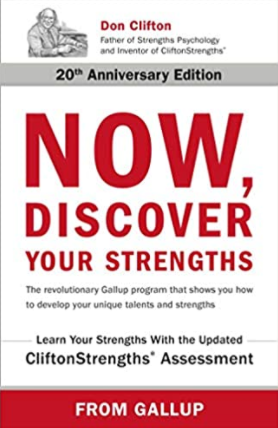

# 从这往哪儿走
+ 在此网页的底部描述了34种优势-阅读它们。 还有一些免费的在线讲座，深入探讨每个主题：
## 34个CliftonStrengths主题是什么？
### 要真正成功使用CliftonStrengths，您需要超越它们的定义，并花时间开发它们。
+ 在线评估可帮助您发现自己的优势：
## 搜索个人的盖洛普评估| cn-盖洛普
### 搜索盖洛普针对个人的热门人才评估，包括CliftonStrengths（以前称为Clifton…
+ 盖洛普公司“现在，发现您的优势”

> “Now, Discover Your Strengths” by the Gallup company


祝你有美好的一天。 注意安全！
# 快速总结
+ 每个人的才能都是持久而独特的。
+ 每个人最大的成长空间就是他们最大的力量所在。
+ 当您发挥天生的才能时，您会情不自禁地成功。
+ 仅当您发现自己扮演的角色要求您发挥非才能之一时，缺乏力量才成为弱点。
# 如何处理我的弱点？

弱点是妨碍出色表现的任何因素。

本书没有列出任何主题，这并不是一个弱点。 您不需要该主题即可在工作或生活中取得成功。 仅当您发现自己需要扮演非才能者之一的角色时，它才会成为弱点。

首先，确定弱点是技能弱点，知识弱点还是人才弱点。 如果很难解决这个问题，请去获取您在特定领域所需的技能和知识。 如果您的表现仍然不佳，那么您可能缺乏才华。

以下是解决弱点的其他策略：
+ 在沟通，倾听和组织方面更好一些。 您需要在这些方面具有一定水平的能力，否则它们会破坏您的真正优势。
+ 设计一个支持系统，并找到减少这种弱点的方法。 例如，如果您的注意力不集中，则可以组织短期会议。 或者，您可以与拥有您所缺乏的优势的人在一起。
+ 用自己的优势之一克服自己的劣势。
+ 寻找具有互补性人才主题的合作伙伴。 例如，一个没有数字联系的企业家可能会与熟练的会计师合作来弥补这一弱点。 坚强的人要承认自己的弱点。
+ 停止这样做是万不得已的策略，但在需要时有效。 如果您停止做某事，那么您可能会无人注意或不在意。 您可能会赢得更多尊重。 而且您可能会对自己感觉更好。

在最后一点上，我曾经和一个伟大的开发人员一起工作过。 他可以比我们其他人更快地解决问题。 唯一阻碍他前进的是，他无法简单地解释任何事情。 您可以在他的脸上看到它-他认为其他人有些愚蠢。 他的解释比其他任何事情都含糊不清。 在多次失败的交谈之后，公司的所有者简单地决定他应该只从事独立项目。 不需要与他人合作的项目。 现在他很高兴–他坐在角落里做自己的事情。 不幸的是，他没有意识到，通过提高自己的沟通技巧，他可能会受到更多的尊重，获得更高的薪水，并且做得更好。

我曾经认识一个缺乏同理心的团队负责人。 他是成就者。 他推动并命令周围的所有人。 人们对他说是的，只是为了让他退缩，但这总是适得其反。 最后，他告诉我们，并要求我们简单地告诉他是否太急了。 他偶尔仍然表现得像个混蛋，但我们礼貌地告诉了他，他说我们的话是积极的。 对我而言，这是非凡的品质-能够承认您的缺点并准备好倾听他人的声音。 尊重！
# 我如何发现我的才能？

您可以通过以下方法发现自己的才能：
+ 监视您对遇到的情况的自发性，首要的反应。

另外，监视以下三件事：
+ 您自然会喜欢的活动，尤其是在年轻时。 您可能没有强烈的意愿去培养它们，因为您正忙着做其他事情，但是它们会一直呼唤您。
+ 快速学习新技能的能力将为您提供线索，让您了解自己的才华所在。
+ 您有什么满意的地方？ 当您这样做时感觉良好吗？ 如果做某件事使您感到真的很好或感到满意，那可能就是您的天赋。 显然，这仅适用于生产行为，正如人才的定义所暗示的那样-我们绝对不是在谈论毒品，酒精和其他破坏性活动！

寻找才华的最佳方法是长时间监控自己的行为和感受。 或者，您可以参加此在线评估测试。 该考试确定了34个不同的人才领域，并为您列出了您的前五个领域。
# 什么是力量？

“现在，发现您的长处”将力量定义为一项活动中一致的近乎完美的表现。 为了使某件事成为优势，您必须能够始终如一且可预测地做到这一点。

人们通过最大化优势而不是通过弥补劣势来表现卓越。 一个例外是必须解决致命的弱点。

您还可以学习管理自己的弱点。 一个例子是经理雇用一个非常注重细节的人，因为他们知道细节是他们所缺乏的，而他们所管理的团队也需要它。

如果您的弱点在于沟通，倾听或组织领域，那么它们将成为阻碍您实现目标的障碍。

什么是力量？ 这本书对它的定义如下：

力量=人才+知识+技能

让我们回顾一下每个组件。

人才是可以有效应用的自然反复出现的思维，感觉或行为模式。 通常，人才对我们而言是如此之容易，以至于我们甚至都不认为他们是人才。 我们假设每个人都可以做同样的事情。

知识包括一路走来的所有事实和教训。

技能是一项活动的步骤。 技能使经验知识结构化。

技能可以帮助您表现出色，但不一定能脱颖而出。 例如，您可能学习了一些公开演讲的基本步骤，甚至可以比以前成为更好的公开演讲者。 但是，如果没有天生的才能，您将永远做不到。

一个人没有必要的才能就无法拥有力量。 您可能会发展所需的知识和技能，但是如果没有才能，您将无法获得稳定，近乎完美的绩效。

增强实力的关键是首先确定您的主导才能，然后利用知识和技能对其进行完善。

例如，如果您报名参加有关领导力，自信或公开演讲的课程，除非您具备其中之一的天赋，否则您不会看到显着的进步。 这会将精力转移到损害控制上，而不是真正的发展上。

每天都有数百个小决定要制定。 我们无法智能化每一个小小的决定，因此我们本能地做出反应。 这意味着我们的大脑将以最快的方式做出决定，从而利用您的天赋做出这些较小的决定。 这些较小的决定最终会加总一个人在一天，一周，然后一年的表现。

即使没有自然才能的人，即使是在培训后不断得到支持的后续技能培训班也不会取得成果。

人才不仅对我们自然而然，而且对我们也感觉良好。 使用它们感觉很自然，使用它们感觉很好。 这不断地促使我们不断地运用我们的才能。

我最近读了一本书，给我留下了深刻的印象。 它帮助我找到了自己的长处，并帮助我专注于自己的才能，使我可以更好地享受工作。 我可以变得更有效率，可以做自己真正擅长的事情，并获得更好的结果，而不必试图成为我不是的人。

这本书是盖洛普公司的“现在，发掘您的长处”：

> Now, Discover Your Strengths by Gallup company


这些是本书的主要内容。 您可以使用它来成长为个人，也可以通过发展自己的优势来更好地管理团队。 “现在，发现您的长处”将帮助您确定自己的独特长处，然后利用这些长处来改善自己和管理的人。

不幸的是，我们大多数人对自己的才能和优势知之甚少，更不用说在自己周围建立生活的能力了。 相反，在我们的父母，老师，管理者以及心理学对病理学的痴迷的指导下，我们成为了自己的弱点专家，并一生致力于弥补这些缺陷，而我们的优势正在沉寂而被忽视。

每个人的才能都是持久而独特的。

每个人最大的成长潜力在于他或她最大的力量。

作为组织或个人，您可以：
+ 只有利用自己的长处，才能发挥最大的潜力。
+ 将您的优势与您在工作，家庭和社区中的角色相匹配。
+ 享受您正在做的事情，因为您正在使用自己的才华。

当您发挥天生的才能时，您会情不自禁地成功。

我们花太多时间专注于自己的弱点并试图使其变得更强，而不是意识到自己的优点并试图利用它们。

公司做出两个错误的假设：
+ 如果一个人经过适当的培训，就可以胜任任何事情，因此他们会花费大量时间来培训其劳动力。
+ 他们认为最大的“机会”或成长领域位于员工的最大弱点领域。 因此，员工的发展计划通常将重点放在这些弱点领域。

“现在，发现您的长处”建议我们假设以下几点：
+ 每个人的才华都是持久而独特的（人是与生俱来的，并将永远拥有它们）。
+ 每个人最大的成长空间在于他们最大的力量所在。
# 如何通过发现自己的长处成为更好的程序员
## 通过了解自己并发挥自己的长处，可以成为更好的开发人员

> Photo by Patrick Kool on Unsplash


我的前老板是所谓的自然成就者。 他不断需要成就。 在每一天结束之前，他都必须拥有切实的东西才能使自己感觉良好。 “每天”是指每一天-工作日，周末和休假。 除非他攀登最高的山峰或做自己能做的事情，否则假期对他来说并不有趣。

我的朋友妮卡（Nika）喜欢学习。 她着迷于学习的过程-除了内容或结果，这对她来说尤其令人兴奋。 从无知到胜任的稳健而刻意的旅程使她充满活力。

我的同事Miha喜欢交谈，他非常重视人际关系。 Miha想了解别人的感受，他们的目标，他们的恐惧和他们的梦想； 他希望他们了解他的。 他是一位“讲者”。

你呢？ 您可能是喜欢思考所有事情的人之一。 您可能会说诸如“证明它。 我们应该怎么做？ 告诉我您的主张是真实的。” 这并不是说您一定要摧毁别人的想法，而是要坚持他们的理论是正确的。 您将自己视为目标。 您喜欢数据，因为数据没有议程。 有了数据，您就可以搜索模式和连接。

我们中有些人是自然激活剂。 一旦做出决定，我们必须采取行动。 其他人可能会担心“还有一些我们不知道的事情”，但这并没有使我们放慢脚步。 如果已经决定要离开，我们知道到达那里最快的方法就是将交通灯转为交通灯。

大多数开发人员都不知道自己的优势。 当您问他们时，他们面无表情地看着您。

我知道您现在正在隔离中，但想到您的同事或您曾经与之共事的人。 您是否曾与某人合作过：
+ 谁特别注重细节和耐心？
+ 谁不能仅凭代码解决问题？ 他们认为软件产品不仅是您编写的代码，而且还更多。
+ 愿意继续学习吗？
+ 谁是一位出色的倾听者，并且可以清晰，简单地说明概念？
+ 谁喜欢在团队中工作，谁喜欢一起工作并乐于适应？
+ 谁编写的易于维护的优雅代码？
+ 激励和激励团队的团队领导者？
+ 谁不断追求更好，做得更好？
+ 谁是超级分析人员，并且在多个层面上了解解决方案？ 谁会看到每种方法的利弊？
+ 谁推动完成工作？

每个人都有自己的长处。 一个人的力量在于战略思维，另一人的擅长于建立关系。 有些人是天生的影响者，其他人则最擅长执行和成就。 从长远来看，找到长处可以为您提供帮助。
```
(本文翻译自Jana Bergant的文章《How to Become a Better Programmer by Discovering Your Strengths》，参考：https://medium.com/better-programming/how-to-become-a-better-programmer-by-discovering-your-strengths-fc8f78e86628)
```
