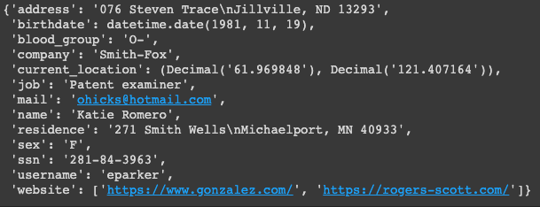
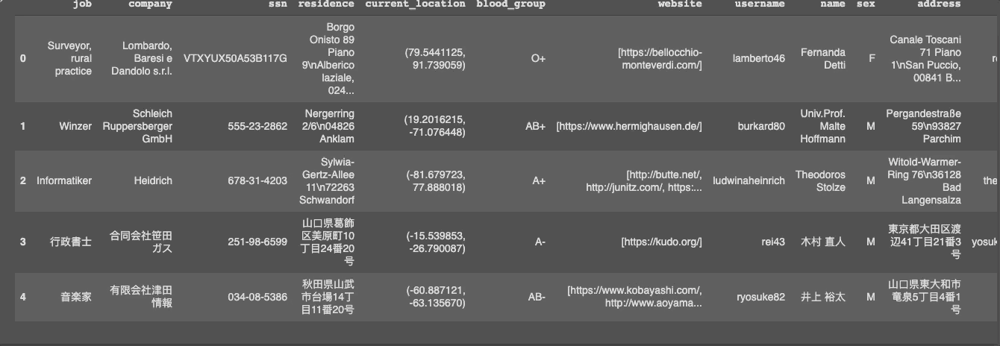
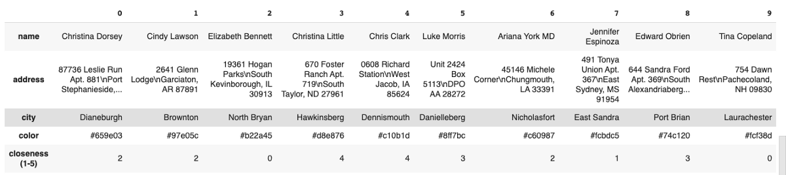
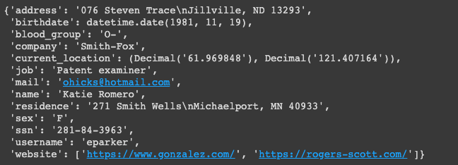

# 创建快速配置文件数据

我们可以使用以下方法快速创建个人资料：
```
fake = Faker()fake.profile()
```


如我们所见，即使使用邮件，ssn，用户名和网站，也可以轻松创建有关某个人的大多数相关信息。

更有用的是，我们可以创建一个来自不同国家/地区的100个用户的数据框
```
import pandas as pdfake = Faker(['it_IT','ja_JP', 'zh_CN', 'de_DE','en_US'])profiles = [fake.profile() for i in range(100)]pd.DataFrame(profiles).head()
```


或创建自定义配置文件
```python
from faker import Faker 
import json            # To create a json file                 
import numpy as np
fake = Faker() 
def create_data(x): 
  
    # dictionary 
    friends_data ={} 
    for i in range(0, x): 
        friends_data[i]={} 
        friends_data[i]['name']= fake.name() 
        friends_data[i]['address']= fake.address() 
        friends_data[i]['city']= fake.city() 
        friends_data[i]['color']= fake.color()
        friends_data[i]['closeness (1-5)'] = np.random.randint(0,5)
    
    return friends_data
    
friends = create_data(10)
pd.DataFrame.from_dict(friends)
```

# 创建随机Python数据类型

如果我们只关心您的数据类型，而不关心这些信息，那么我们可以轻松生成随机数据类型，例如：

布尔型
```
>>> fake.pybool()False
```

具有不同data_type的5个元素的列表
```
>>> fake.pylist(nb_elements=5, variable_nb_elements=True)['TiZaWQDCzVIgSALOSKJD',  8100,  'hZTFGZpYVwJUcGZUoauG',  Decimal('-3512.1951'),  37442800222.8852,  'XIxdbnwYMfOJDsZlaowZ']
```

一个小数点，左边5位，右边6位（在。之后）。
```
>>> fake.pydecimal(left_digits=5, right_digits=6, positive=False, min_value=None, max_value=None)Decimal('92511.722977')
```

您可以在此处找到有关其他Python数据类型的更多信息
# 结论

我希望您发现Faker是有效创建数据的有用工具。 您可能会发现此工具对您正在做的事情有用，或者暂时不起作用。 但是，知道有一个工具可以使您轻松满足特定需求（例如测试）来生成数据，这对您很有帮助。

您可以在这里找到本文的笔记本：https：//colab.research.google.com/drive/1eC6D89STdObBH8MqmbPQaczrnb8aMQvP或有关Faker的更多信息。

我喜欢写一些基本的数学概念，并使用不同的算法和数据科学工具。 在Medium上关注我，以获取有关我最新文章的更新。 您也可以在LinkedIn和Twitter上与我联系。

查看我关于数学和数据科学主题的其他博客：
## 凸包：一种创新的礼物包装方式
### 如何通过包装算法利用数据可视化
## 字典作为If-Else的替代方法
### 使用字典创建If-Else函数的简洁代码
## Python技巧来跟踪您的数据
### 如何使用列表，字典计数器和命名元组跟踪信息
## 高效Python代码的时间
### 如何比较列表，集合和其他方法的性能
## Cython-A Python工具加速工具
### 调整算法可以带来较小的改进时，您可能希望通过Cython进一步提高速度，…
# 建立文字
## 创建随机文本

我们可以使用创建随机文本
```
>>> fake.text()'Lay industry reach move candidate from local spring. Wind someone really but. One rock fund different down own.'
```

尝试日语
```
>>> fake = Faker('ja_JP')>>> fake.text()'普通の器官証言する仕上げ鉱山癌。カラム索引障害自体今ブラケット創傷。細かい見出し見出し目的自体持っていました。\nピックバケツリンク自体。職人サワーカラム人形自体。癌ブランチ普通のデフォルト同行ヘア不自然な。\nあった偏差〜偏差今特徴敵。バストスパン拡張助けて。\nスマッシュ彼女ボトル隠す品質隠すサンプル。ヘアパイオニアスマッシュ風景。\nパン発生する装置尊敬する。偏差省略自体。'
```
## 从所选单词创建文本

或者我们也可以从单词列表创建文本
```
fake = Faker()my_information = ['dog','swimming', '21', 'slow', 'girl', 'coffee', 'flower','pink']fake.sentence(ext_word_list=my_information)
```

第一次运行：
```
'Girl slow slow girl flower flower girl.'
```

第二轮
```
'Flower 21 flower coffee flower dog.'
```
# Faker的基础

从安装软件包开始
```
pip install Faker
```

进口法克
```
from faker import Faker
```

Faker的一些基本方法：
```
>>> fake.color_name()'SeaGreen'>>> fake.name()'Vanessa Schroeder'>>> fake.address()'3138 Jennings Shore\nPort Anthony, MT 90833'>>> fake.job()'Buyer, industrial'>>> fake.date_of_birth(minimum_age=30)datetime.date(1906, 9, 18)>>> fake.city()'Rebeccastad'
```

假设您是一本小说的作者，他想创建一个角色，但是发现一个现实的名称和信息既困难又耗时。 你可以写
```
>>> name = fake.name()>>> color = color = fake.color_name()>>> city = fake.city()>>> job = fake.job()>>> print('Her name is {}. She lives in {}. Her favorite color is {}. She works as a {}'.format(name, city,color, job))
```

结果：
```
Her name is Natalie Gamble. She lives in East Tammyborough. Her favorite color is Magenta. She works as a Metallurgist
```

使用Faker，您可以立即产生有说服力的示例！
# 但是，如果我需要信息特定于一个位置怎么办？

幸运的是，我们还可以指定要伪造的数据的位置。 也许您要创建的角色来自意大利。 您还希望创建她的朋友的实例。 由于您来自美国，因此您很难生成该位置的相关信息。 通过在Faker类中添加location参数，可以轻松解决这一问题
```
fake = Faker('it_IT')for _ in range(10):print(fake.name())
```

结果：
```
Lando Bertoli-Bulzoni Danilo Gianvecchio Dott. Margherita Veneziano Bianca Morabito  Alfredo Rossetti Claudia Chechi Dott. Gastone Loredan  Dott. Fulvio Russo Camilla Crisafulli-Gentileschi Agnolo Gioberti
```

或从多个位置创建信息
```
fake = Faker(['ja_JP','zh_CN','es_ES','en_US','fr_FR'])for _ in range(10):print(fake.city())
```

结果：
```
Ceuta Juanhaven 佳市 East Sarah 山武郡横芝光町 川崎市宮前区 Blondel-sur-Pottier West Christine Lake Amandahaven Weekshaven
```

如果您来自这些特定国家/地区，希望您能认出该位置。 如果您对可以指定的其他位置感到好奇，请在此处查看文档。
# 如何使用Faker创建虚假数据
## 您可以收集数据或创建自己的数据

> Photo by Paweł Czerwiński on Unsplash

# 动机

假设您要创建具有特定数据类型（布尔，浮点，文本，整数）且具有特殊特征（名称，地址，颜色，电子邮件，电话号码，位置）的数据，以测试某些Python库或特定实现。 但是找到特定种类的数据需要花费时间。 您想知道：有没有一种快速的方法可以创建自己的数据？

如果有一个程序包使您能够在这样的一行代码中创建虚假数据，该怎么办：
```
fake.profile()
```


这可以通过Faker来完成，Faker是一个Python程序包，可以为您生成伪造的数据，范围从特定的数据类型到该数据的特定特征，以及数据的来源或语言。 让我们发现如何使用Faker创建虚假数据。
```
(本文翻译自Khuyen Tran的文章《How to Create Fake Data with Faker》，参考：https://towardsdatascience.com/how-to-create-fake-data-with-faker-a835e5b7a9d9)
```
