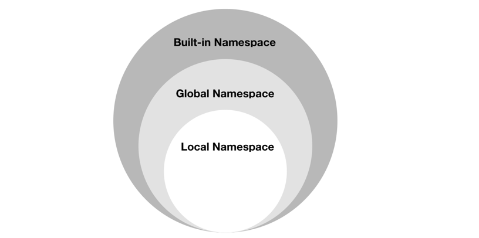
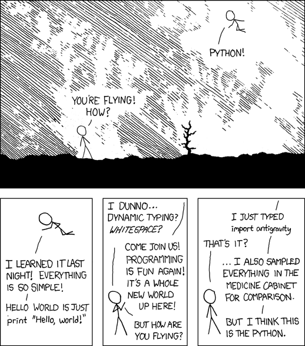
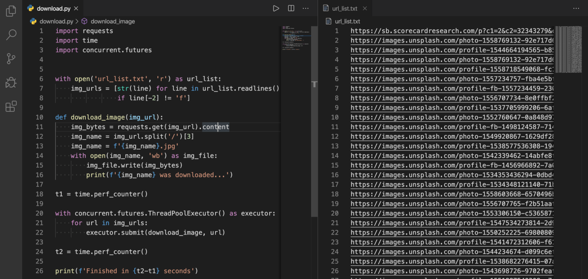

# 结论

谢谢阅读！ 我希望你喜欢它。
# 命名空间是一个很好的主意-让我们做更多的事！

最后但并非最不重要的一点是，名称空间是一组符号，用于组织各种对象，以便可以用唯一的名称来引用这些对象。 在Python中，名称空间是由以下内容组成的系统：
+ 内置名称空间：可以在不创建自定义函数或导入诸如print（）函数之类的模块的情况下调用。
+ 全局名称空间：用户创建类或函数时，将创建全局名称空间。
+ 本地名称空间：本地范围内的名称空间。

> Diagram of namespace relations.


命名空间系统可防止Python在模块名称之间发生冲突。
# 如果易于解释该实现，则可能是一个好主意

借助编程专业知识，可以使设计（甚至人们的生活）变得更容易，而背景知识可能很深，我认为这是编程中最难的部分。

> Photo by Thought Catalog on Unsplash.


利用Python的简单性和可读性来实现疯狂的想法。
# 如果难以解释实施方式，那是个坏主意

回想一下“复杂胜于复杂”的想法。 通常，复杂的代码意味着较弱的设计-尤其是在像Python这样的高级编程语言中。 但是，在某些情况下，其领域知识的复杂性可能会使实现难以解释，而如何优化其透明度也很重要。 这是利用您的成就来组织项目的指南。
## 结构化项目—《搭便车的Python指南》
### “结构”是指您就项目如何最好地实现其目标而做出的决策。 我们需要考虑...
# 虽然从来没有比现在*对*好

“现在总比没有好”，并不意味着规划是没有用的。 写下想法并设定要征服的目标比此时此刻要好。 例如，我通常每个星期日花一个小时来草拟我的每周日程安排，并在上床睡觉之前检查要推迟的所有事情，以更新明天的计划。

> Photo by Djim Loic on Unsplash.

# 现在总比没有好

“您可能会延迟，但时间不会，而且再也找不到丢失的时间。” - 本杰明·富兰克林

对于那些像我这样的拖延症患者并且正在寻求改变的人，请检查一下并与恐慌怪物合作。

另一方面，格言的另一面是阻止您进行过度计划，这比观看Netflix效率更高。

拖延和过度计划的共同属性是“什么也没做。”
# 尽管除非您是荷兰人，否则这种方式乍一看可能并不明显

Python的创建者Guido van Rossum是一位荷兰程序员，他使这种格言不容置疑。 您不会声称自己比他更了解Python……至少我不会。

> Photo courtesy of Guido van Rossum on GitHub.

# 应该有一个-最好只有一个-显而易见的方法

想一想为什么Python被描述为一种易于学习的编程语言。 凭借出色的内置函数/库和高度可扩展性，Python鼓励程序员优雅地编写代码。 尽管有更多解决方案可提供灵活性，但它可能花费太多时间来研究相同的问题。

> Type import antigravity and execute.

# 面对歧义，拒绝诱惑猜测

“重要的是继续学习，享受挑战并容忍歧义。 最后，没有确定的答案。” ―玛蒂娜·霍纳（Matina Horner）

这句话优雅而抒情，但在编程中不是一个很好的隐喻。 歧义可能是指语法不清楚，程序结构复杂或触发错误消息的错误。 例如，首次使用numpy模块时，一个简单的错误：
```python
import numpy as np

a = np.arange(5)
print(a < 3)
if a < 3:
    print('smaller than 3')
```
```
ValueError: The truth value of an array with more than one element is ambiguous. Use a.any() or a.all()
```

如果您执行上述代码，则会在输出中找到一个包含五个布尔值的数组，表示值在3以下。因此，if语句无法确定状态。 消息中显示的内置.all（）和.any（）函数用于连续的And / Or。
```python
import numpy as np

a = np.array([True, True, True])
b = np.array([False, True, True])
c = np.array([False, False, False])

print(a.all())
print(a.any())

print(b.all())
print(b.any())

print(c.all())
print(c.any())

```

输出显示，仅当所有项目均为True时.all（）返回True，而如果任何项目为True则.any（）返回True。
# 除非明确沉默

在某些情况下，小错误不会打扰您。 不过，也许您想捕获特定的错误。 要获取有关特定错误消息的更多详细信息，我建议阅读官方的“内置异常”文档并找出目标。
## 内置异常-Python 3.8.2文档
### 在Python中，所有异常都必须是派生自的类的实例。 在带有子句的陈述中提到…
# 错误绝不能无声地传递

传递错误最终将导致隐式错误，这些错误甚至更难找出。 得益于Python中强大的错误处理功能，与其他语言相比，程序员使用该工具并不困难。
```python

try:
    x = int(input("Please enter an Integer: "))
except ValueError:
    print("Oops! This is not an Integer.")   
except Exception as err:
    print(err)
else:
    print('You did it! Great job!')
finally:
    print('ヽ(✿ﾟ▽ﾟ)ノ')
 
# 1.The code that potentially break down.
# 2.Triggered if the value error occur.
# 3.Handling error other than value error.
# 4.Execute if no error triggered.
# 5.Execute no matter the error triggered or not.
```

根据Python的文档，“即使语句或表达式在语法上是正确的，但尝试执行它也可能导致错误。”

特别是对于大型项目，我们不希望我们的代码在耗时的计算之后崩溃。 这就是异常管理如此迷人的原因。
# 尽管实用性胜过纯度

这种格言与上一个格格不入，使我们想起了两者之间的平衡。

> Photo by Scott Webb on Unsplash.

# 特殊情况不足以打破规则

支持一般案例的一致性是关键，因此请尝试将繁琐的项目重组为简单形式。 例如，即使Python不会强迫您这样做，也可以按类构造代码或根据其功能将其分类到不同的文件中。 由于Python是一种多范式编程语言，因此解决问题的一种有效方法是创建对象，这被称为面向对象编程。

面向对象的编程是一种组织程序结构的编程范例，因此可以将属性和行为视为单个对象。 它的好处是直观且易于操作，许多教程出色地解释了这些概念。 这个是我的最爱：
# 可读性计数

读取代码的次数要多于编写代码的次数。 考虑缩进以及读取代码有多容易，并比较以下代码：
```python
money = 10000000
print("I earn", money, "dollars by writing on medium.")

money = 10_000_000
print(f"I earn {money} dollars by writing on medium.")
```

在这种情况下，这些代码共享相同的结果，但是最后一个通过使用下划线占位符和f字符串提供了更高的可读性。 在发布Python 3.6之后，f字符串开始使格式化变得更容易，并且在处理带有更多变量的较长句子时，f字符串更加强大。

作家的风格不应在思想和读者的思想之间造成障碍。
# 稀疏胜于密

不要在一行中粘贴太多代码，以免给读者带来压力。 建议的最大行长为79个字符。 使用代码查看工具时，编辑器窗口宽度的限制非常有效。

> Download images agiler from Unsplash using Python.

# 扁平比嵌套更好

嵌套模块在Python中并不常见（至少我以前从未见过类似module.class.subclass.function之类的东西），而且不容易阅读。 尽管在另一个子模块中构建一个子模块可能会减少代码行，但是我们不希望用户为不直观的语法所困扰。

> Keep it shallow.

# 复杂胜于复杂

复杂和复杂之间的区别在于，复杂是指组件的系统级别，而复杂是指较高的难度。

有时，尽管我们试图使任务简单而愚蠢，但结果仍然令人讨厌。 在这种情况下，有必要对编程进行优化，而我最喜欢的学习方法是在挑战性网站上进行编码。 您可以查看其他人的解决方案，甚至可以从更好的算法中获得启发。

HackerRank提供了适合新程序员的各种级别，对于入门而言非常出色。 之后，请尝试更专业的网站，例如：
## Coderbyte | ＃1编码评估平台
### 通过我们包含300多个挑战的库，提高您的编码技能，并准备对来自...的内容进行采访采访。
## 顶级编码器
### Topcoder是一个众包市场，它将具有难以找到的专业知识的企业联系在一起。 Topcoder社区…
# 简单胜于复杂

“简单比复杂难得多：您必须努力工作以使思路清晰，使其变得简单。 但最终还是值得的，因为一旦到达那里，您就可以搬山。” ―史蒂夫·乔布斯

很多时候，在处理迭代器时，我们还需要保留迭代次数。 Python通过提供一个称为enumerate（）的内置函数来简化任务。 这是不成熟的方法，后面是推荐的方法：
```python
words = ['Hannibal', 'Hanny', 'Steeve']

# Novice
index = 0
for word in words:
    print(index, word)
    index += 1
    
# Pro
for index, word in enumerate(words):
    print(index, word)
```

另一个示例是使用内置的zip（）函数，该函数创建一个迭代器，该迭代器将对来自两个或多个可迭代对象的元素进行配对。 您可以使用它来快速有效地解决常见的编程问题，例如创建词典。
```python
subjects = ['math', 'chemistry', 'biology', 'pyhsics']
grades = ['100', '83', '90', '92']

grades_dict = dict(zip(subjects, grades))
print(grades_dict)
```

简化的能力是消除不必要的东西，使必要的东西说话。
# 明确胜于隐含

在Python中，良好的命名约定不仅可以防止您在类中获得不好的成绩，还可以使代码明确。 幸运的是，您可以在PEP8中找到一些准则，我想在下面重点介绍一些要点。
+ 通常，避免使用太过通用的名称1，例如my_list.2.。 太冗长，例如list_of_machine_learning_data_set.3。 太含糊，例如“ l”，“ I”，“ o”，“ O”。
+ 程序包/模块名称应全部小写。-首选单词名称。-如果需要多个单词，请添加下划线以将其分开。
+ 类名应遵循UpperCase CamelCase约定。
+ Variables \ Methods \ Functions应该遵循小写约定（如果需要，请在下划线处添加下划线）。
+ 常量名称必须全大写（如果需要，请在下划线处添加下划线）。

一切都必须是清楚易懂的。
# 美丽胜过丑陋

Python具有简单的语法，代码易读性以及类似英语的命令，与其他编程语言相比，它们使编码更容易，更高效。 例如，使用or和vs。 &&从语义角度构造相同的表达式：
```python
# &&, ||
if a == 0 && b == 1 || c == True:
  
# and, or
if a == 0 and b == 1 or c == True:
  
# These are the same logical expression in Python
# The alternative operators can be used to construct the exact same expressions from a semantic perspective.
```

此外，代码的布局和组成至关重要，并且存在大量涉及该主题的资源。 这是最受欢迎和我最喜欢的一个：
## PEP 8 — Python代码样式指南
### Python编程语言的官方主页

看完PEP8之后，请看一下这些文章，这些文章显示了一些要点和应用程序：
+ 如何使用PEP 8编写漂亮的Python代码
+ 带有PEP8的时尚Python
+ PEP-8的陷阱

永远不要弄乱您的代码。 优雅并使其美丽。
# Python的禅宗？

对于那些以前从未看过的人，请在您的Python解释器中键入并执行import this，这将显示Tim Peters提出的19条指导原则：
+ 美丽胜于丑陋。
+ 显式胜于隐式。
+ 简单胜于复杂。
+ 复杂胜于复杂。
+ 扁平比嵌套更好。
+ 稀疏胜于密集。
+ 可读性很重要。
+ 特殊情况不足以违反规则。
+ 尽管实用性胜过纯度。
+ 错误绝不能默默传递。
+ 除非明确地保持沉默。
+ 面对模棱两可的想法，拒绝猜测的诱惑。
+ 应该有一种（最好只有一种）明显的方式来做到这一点。
+ 尽管除非您是荷兰人，否则一开始这种方式可能并不明显。
+ 现在总比没有好。
+ 尽管从来没有比现在“正确”好。
+ 如果实施过程难以解释，那是个坏主意。
+ 如果实现易于解释，则可能是个好主意。
+ 命名空间是一个很棒的主意-让我们做更多吧！

在本文中，我将分享我对这些格言的解释以及一些我学到的有用的Python技巧。

> Photo by June Wong on Unsplash.

# 如何使您的Python代码更加优雅
## 我对Python Zen的解释以及使代码更简洁整洁的更多技巧

> Photo by Scott Webb on Unsplash.


根据Clean Code：《敏捷软件技巧手册》，“阅读与写作所花费的时间比例远超过10：1。”

通常，当我们在学校学习时，审美编程并不是关键问题。 然后，个人在使用Python写作时会遵循自己的风格。 但是，每当我们不得不花费大部分时间来理解一个人的隐式代码时，这项工作就可能是非常不可取的，其他人在阅读我们的代码时也会发生这种情况。 因此，让我们专注于Python的Zen和一些解决问题的改进技巧。
```
(本文翻译自Hannibal Liang的文章《How to Make Your Python Code More Elegant》，参考：https://medium.com/better-programming/how-to-make-python-programming-more-elegant-and-decent-4b5962695aa9)
```
