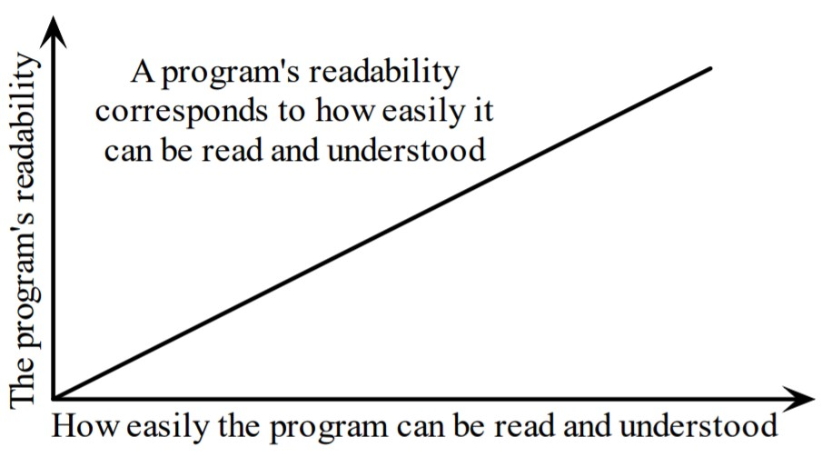
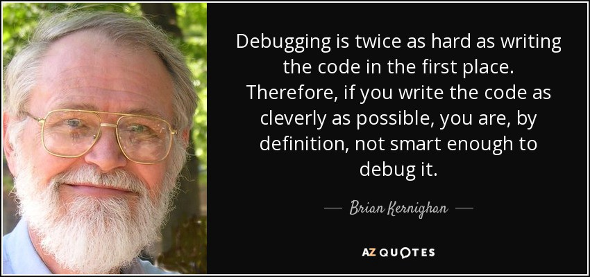

# 我以为我是掌握Python的人，直到发现这些技巧
## Python最佳做法和技巧，可让您快速有效地进行编码

> Photo by Alvaro Reyes on Unsplash


Python是初学者最受欢迎的编程语言之一，使其成为全球学校中使用最广泛的语言。

但是，学习Python并非易事。 首先，您首先需要找到最佳的在线到达途径，这本身很难。 有成千上万种不同的Python课程和教程，都声称是最好的。

没错，仅仅练习不是完美的，但是完美的练习才是完美的。 这意味着您需要确保始终遵循最佳编码实践（对您的代码进行注释，使用正确的语法等），否则您可能最终会养成不良习惯，这可能会损害您将来的代码行。

“通用公约提供了所有的可维护性，清晰度，一致性，也为良好的编程习惯奠定了基础。 它没有做的就是坚持您违背自己的意愿。 那是Python！”

— Tim Peters在comp.lang.python上，2001年6月16日

在本文中，我将介绍我的十大技巧，以帮助您快速有效地使用Python进行编码。
# 1.可读性很重要

必须编写程序供人们阅读，并且只能偶然地使机器执行。

哈尔·阿伯森

首先，请遵循一些编程约定，使程序易于阅读。 编程约定是经验丰富的程序员在编写其代码时遵循的约定。 除了忽略约定外，没有比其他更快的方法来表明您是“新手”。 其中一些约定特定于Python。 其他语言则由计算机程序员以所有语言使用。


从本质上讲，可读性是一种特性，它指定另一个人可以多么容易地理解您代码的某些部分（而不是您！）。

举例来说，我不习惯用垂直对齐方式来写，也不用打开定界符对齐函数的参数。
```
# No, to avoid: func = long_function_name(var_one, var_two,       var_three, var_four)#Yes, func = long_function_name(var_one, var_two,                          var_three, var_four)
```

查看《 Python代码样式指南》中的其他示例，并确定最适合的示例。

undefined
# 2.避免无用的条件

通常，如果＆elif＆…较长。 ＆else条件是需要重构的代码的标志，这些条件使您的代码冗长而又难以解释。 有时它们很容易被替换，例如，我曾经做过以下事情：
```
def f():    if condition:    	return True    else:    	return False
```

这真是愚蠢！ 该函数返回一个布尔值，那么为什么还要使用if块呢？ 正确的做法是：
```
def f():	return condition
```

在Hackerrank挑战中，您将获得年份，并且必须编写一个函数来检查年份是否is年。 在公历中，必须考虑三个标准来确定leap年：
+ 该年可以除以4，即is年，除非：
+ 年份可以平均除以100，不是NOT年，除非：

因此，在此挑战中，请忽略是否存在，只需执行以下操作即可：
```
def is_leap(year):    return year % 4 == 0 and (year % 400 == 0 or year % 100 != 0)
```
# 3.充分利用空白
+ 切勿混用制表符和空格
+ 函数之间的换行符
+ 班级之间有两个换行符
+ 在赋值和比较周围放置空格（列表中的参数除外）
+ 在左括号或参数列表之前没有空格。
```
def function(key, value=0):    """Return a dictionary and a list..."""    d = {key: value}    l = [key, value]    return d, l
```
# 4.文档字符串和注释
+ 注释=为什么（合理）以及代码如何工作

文档字符串说明了如何使用代码：
+ 描述期望的参数，返回的值和引发的异常。
+ 如果该方法与单个调用者紧密耦合，请提及调用函数。

这些注释说明了代码维护人员的需求。 示例包括给自己的注释，例如：

＃!!! BUG：…

＃!!! FIX：这是一个黑客

＃??? 为什么在这里？

编写好的文档字符串和注释是您的责任，因此请始终使它们保持最新！ 进行更改时，请确保注释和文档字符串与代码一致。

您将找到专门用于Doctsring的详细PEP：“ Docstring约定”
# 5.变量和赋值

用其他编程语言：
```
c = aa = bb = c
```

在Python中，最好在一行代码中使用分配：
```
b, a = a, b
```

undefined
+ 逗号是构建元组的语法。
+ 在右侧创建一个元组（元组包装）。
+ 元组是左侧的目标（元组解包）。

其他例子：
```
>>> user =['Jan', 'Gomez', '+1-888-222-1546']>>> name, title, phone = user>>> name'Jan'>>> title'Gomez'>>> phone'+1-888-222-1546'
```

在结构化数据循环中很有用（上面的变量user已保留）：
```
>>> people = [user, ['German', 'GBT', 'unlisted']]>>> for (name, title, phone) in people:...      print (name, phone)...Jan +1-888-222-1546German unlisted
```

undefined
```
>>> jan, (gname, gtitle, gphone) = people>>> gname'German'>>> gtitle'GBT'>>> gphone'unlisted'>>> jan['Jan', 'Gomez', '+1-888-222-1546']
```
# 6.列表串联与联接

让我们从字符串列表开始：
```
colors = ['red', 'blue', 'green', 'yellow']
```

我们希望将这些链条连接在一起以创建一条长链。 特别是当子字符串的数量很大时，请避免这样做：
```
result = ''for s in colors:    result += s
```

非常慢。 它占用大量内存和性能。 总和将累加，存储，然后继续进行每个中间步骤。

相反，请执行以下操作：
```
result = ''.join(colors)
```

join（）方法可一次完成整个副本。 当您仅处理几个字符串时，它没有什么区别。 但是养成以最佳方式构建链的习惯，因为成百上千的字符串确实会有所作为。

这里是一些使用join（）方法的技术。 如果要使用空格作为分隔符：
```
result = ' '.join(colors)
```

或逗号和空格：
```
result = ', '.join(colors)
```

为了使语法正确，我们希望除最后一个值（我们更喜欢使用“或”）之外的每个值之间都使用逗号。 拆分列表的语法将完成其余工作。 [：-1]返回除最后一个值外的所有内容，我们可以将其与逗号连接。
```
colors = ['red', 'blue', 'green', 'yellow']print ('Choose', ', '.join(colors[:-1]), \      'or', colors[-1])>> Choose red, blue, green or yellow
```
# 7.测试真实条件

就布尔值而言，利用Python既优雅又快捷：
```
# Do this :     # And not this :if x:             if x == True:   pass                  pass# Do this :     # And not this :if items:         if len(items) != 0:    pass                pass# and especially not that :        if items != []:               pass
```
# 8.尽可能使用枚举

枚举函数获取一个列表并返回对（索引，项目）：
```
items = ['zero', 'one', 'two', 'three']>>> print list(enumerate(items))[(0, 'zero'), (1, 'one'), (2, 'two'), (3, 'three')]
```

必须使用列表来显示结果，因为枚举是一种惰性函数，仅在需要时才一次生成一个项目（一对）。 for循环需要这种机制。 一次打印不会取得任何结果，但必须拥有要显示的整个消息。 因此，在使用打印之前，我们会自动将生成器转换为列表。

因此，使用下面的循环会更好：
```
for (index, item) in enumerate(items):    print (index, item)# compared to :              # And :index = 0                     for i in range(len(items)):for item in items:                    print (i, items[i])    print (index, item)    index += 1
```

带枚举的版本比其他两个版本更短，更简单。 显示枚举函数返回迭代器的示例（生成器是一种迭代器）
# 9.清单理解

for和if的传统方式：
```
new_list = []for item in a_list:    if condition(item):        new_list.append(fn(item))
```

使用列表理解：
```
new_list = [fn(item) for item in a_list if condition(item)]
```

listcomp清晰直接。 您可以有多个for循环，并且条件可以在同一listcomp中，但不能超过两个或三个，或者条件复杂，建议您使用通常的for循环。

undefined
```
>>> [n ** 2 for n in range(10)][0, 1, 4, 9, 16, 25, 36, 49, 64, 81]
```

上一个列表中的奇数列表：
```
>>> [n ** 2 for n in range(10) if n % 2][1, 9, 25, 49, 81]
```

另一个例子：
```
>>>   [(x, y) for x in (1, 2, 3, 4) if x % 2 == 0        for y in ['a', 'b'] if y == 'b'][(2, 'b'), (4, 'b')]
```
# 10.生成器表达式

让我们对小于100的数字平方求和：
```
# With a loop :total = 0for num in range(1, 101):    total += num * num
```

我们还可以使用sum函数，通过建立正确的序列来为我们更快地完成工作。
```
# With a list comprehension :total = sum([num * num for num in range(1, 101)])# With a generator expression :total = sum(num * num for num in xrange(1, 101))
```

生成器表达式类似于列表推导，除了它们的计算是懒惰的。 Listcomps一次计算整个结果，然后将其存储在列表中。 必要时，生成器表达式一次计算一个值。 当序列很长并且生成的列表只是中间步骤而不是最终结果时，这特别有用。

例如，如果我们必须对数十亿个整数的平方求和，我们将通过列表理解达到内存的饱和，但是生成器表达式不会有任何问题。 好吧，虽然需要一段时间！
```
total = sum(num * num for num in range(1, 1000000000))
```

语法上的差异是listcomp带有方括号，而生成器表达式则没有。 生成器表达式有时需要括号，因此您应始终使用它们。

简而言之 ：
+ 当预期结果是列表时，请使用列表理解。
+ 当列表只是中间结果时，请使用生成器表达式。

> Source : https://www.azquotes.com/quote/669106

# 结论

在本文中，我介绍了一些学习Python编程的最佳技巧。 如果您真的想成为一名程序员或在您的技能中增加编码技能，那么学习Python是一个不错的起点。 寻找高质量的在线Python培训，并开始了解如何使用Python编程。 我建议您在继续学习更困难的概念之前，通过交互式课程学习基础知识。

您不应过多地加快学习过程，否则可能会错过重要信息。 做笔记，并确保定期检查它们，并尝试练习练习尽可能多地编写代码。

undefined

如果您完成所有这些操作，没有什么可以阻止您！ 你还在等什么？ 立即开始使用Python进行编程！
```
(本文翻译自Kamal Chouhbi的文章《I Thought I Was Mastering Python Until I Discovered These Tricks》，参考：https://towardsdatascience.com/i-thought-i-was-mastering-python-until-i-discovered-these-tricks-e40d9c71f4e2)
```
