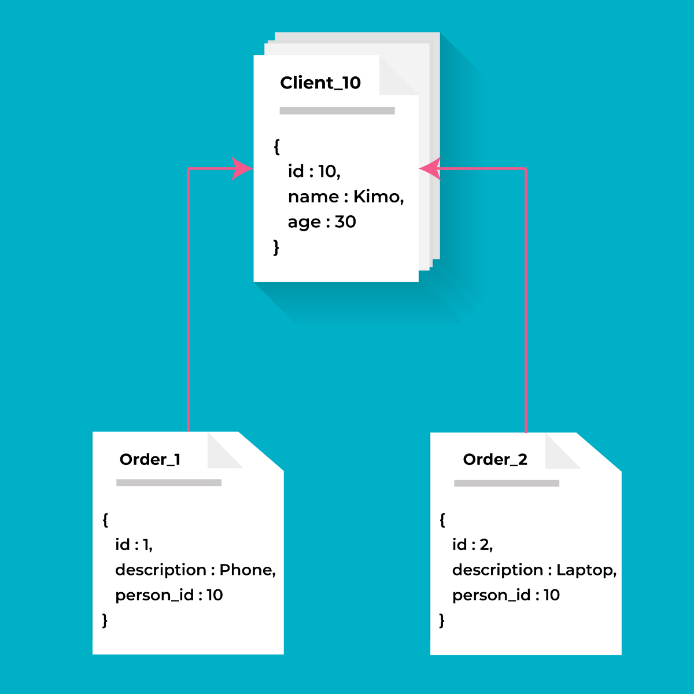
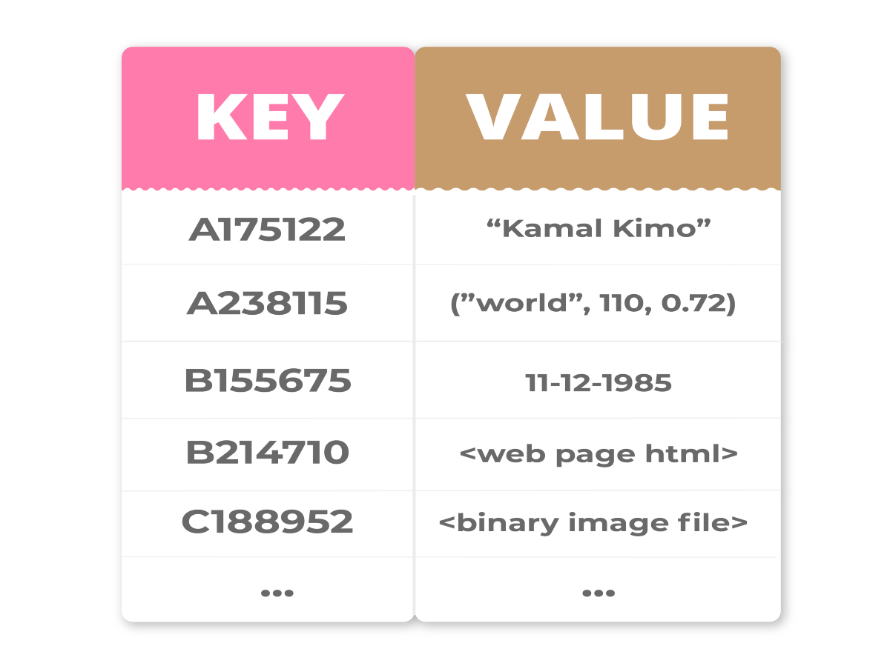
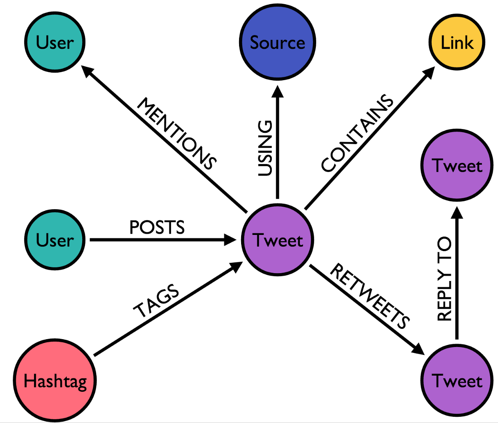
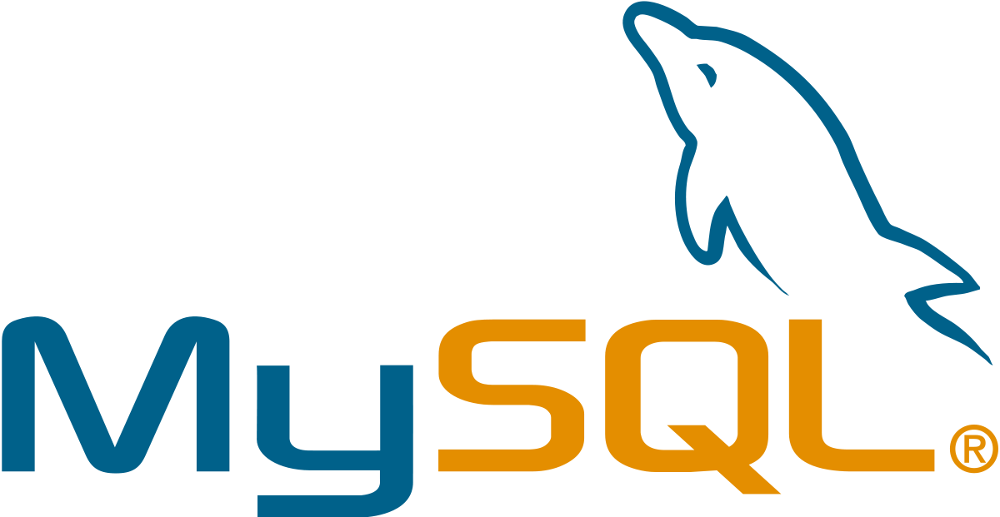
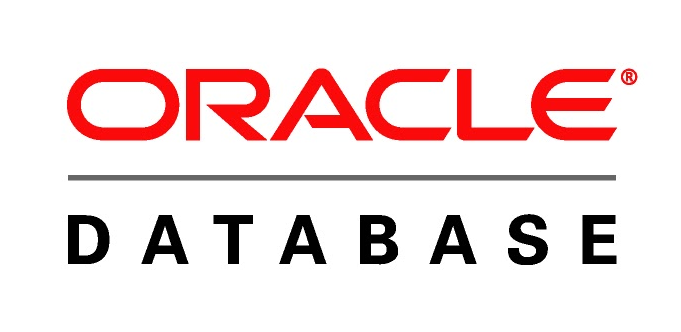
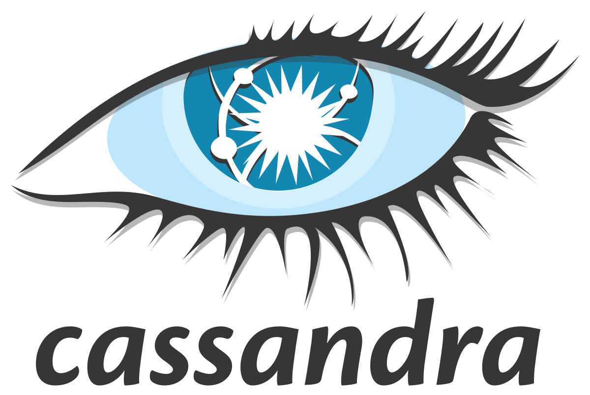
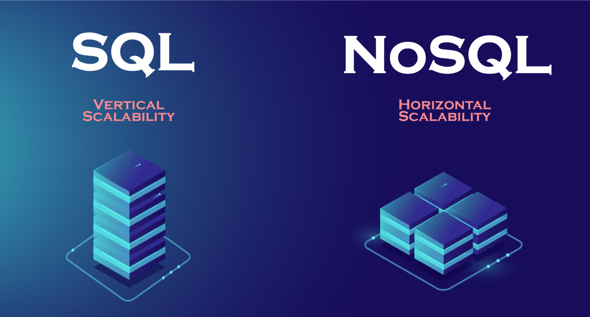

恭喜您成功到达这里。 感谢您的阅读，希望您喜欢它。 如需个人联系或讨论，请随时通过LinkedIn与我联系。
# 参考文献：
+ SQL与NoSQL：它们有何不同？最佳的SQL和NoSQL数据库系统是什么？
+ 从关系云数据库迁移到NoSQL云数据库
+ SQL vs NoSQL或MySQL vs MongoDB
# 六，结论

因此，本文的目的是介绍存在的主要差异，以帮助您做出正确的决定并塑造信息系统（或简单应用程序）的未来。

我们已经看到，SQL和NoSQL数据库最终执行几乎相同的操作（存储数据），但是方式不同。 因此，对于任何数据项目而言，数据库管理系统（DBMS）的选择都是重要且结构化的时刻。 当然，总是可以选择一个选项，然后稍后再切换到另一个。 但是在项目开始时进行一些概念分析和思考将使您节省时间和金钱。

当今市场上到处都是NoSQL数据库-我认为我们每天都面临着其中的两个或三个数据库，因为开发人员改用NoSQL具有很多优势。 更加灵活的数据模型和不受刚性模式的限制是一个很大的优势。 您还可以看到性能显着提高，并且可以水平缩放。

但是，大多数NoSQL产品仍处于产品周期的早期阶段。 对于复杂连接等功能，开发人员可能更喜欢使用传统的RDBMS。 对于某些项目，混合方法可能是最佳选择。

总而言之，每个公司都会根据项目的要求有自己的偏好。 因此，确定您的需求和明智地为项目开发提供集成支持的数据库。
# 5.从RDBMS切换到NoSQL

> Photo by Science in HD on Unsplash


无论您选择哪种NoSQL数据库设计，将数据迁移到其中都会带来一些严峻的挑战。 在NoSQL中设计数据模型具有额外的复杂性，因为它需要了解数据的最终用途。 仅仅知道您的应用程序可以处理账单和客户就足够了。 现在，您必须知道如何将这些数据显示给最终用户。 因此，NoSQL数据库中的数据建模除了需要对最终客户的使用有深入了解之外，还需要真正的技术专长。
## 是时候用NoSQL解决方案替换SQL吗？

我认为，这是一个很难的问题！ 因为在大多数情况下，这不是用NoSQL解决方案代替SQL，而是在应用程序和用例表明需要更改的情况下，从一种过渡到另一种。 通常，在构建现代Web和移动应用程序时，对灵活性和可伸缩性的需求将推动这种转变。

通常，许多公司尝试在其Web应用程序中支持负载，因此他们选择仅在负载均衡器后面添加Web服务器以支持更多用户。 毫无疑问，在日益重要的云计算世界中，扩展能力是一项根本的竞争优势，在云计算世界中，可以轻松添加或删除虚拟机实例以满足不断变化的需求。

关系数据库（RDBMS）不允许简单缩放，也不能提供灵活的数据模型。 管理更多的用户意味着添加更大的服务器和大型服务器非常复杂且昂贵，这与低成本硬件，“商品硬件”和云架构不同。 组织已经开始看到其关系数据库对现有或新应用程序的性能问题。 尤其是随着用户数量的每天增加，他们意识到对更快，更灵活的数据库的需求变得非常重要。 现在该迁移到NoSQL了！
## 从SQL过渡到NoSQL所需的主要步骤是什么？

应用程序/项目可能会因每个组织而有很大差异，因此过渡将取决于您的用例。 以下是有关过渡的一些一般准则：

1-了解您的应用程序的关键要求：

以下是与NoSQL数据库需求相对应的一些要求：
+ 快速的应用开发：不断变化的市场需求和持续的数据修改
+ 可扩展性
+ 性能稳定：响应时间短，可带来更好的用户体验
+ 操作可靠性：高可用性来管理错误，对应用程序的影响最小，并且集成了监视API，以实现更好的维护

2-了解NoSQL提供的不同类型：

如上所述，NoSQL数据库管理系统有多种类型。

例如，面向文档的NoSQL数据库-带有Couchbase和MongoDB，这是两个最著名且使用最广泛的示例。

同样，例如，鉴于Cassandra的柱状模型，它可能是可用于数据分析的解决方案。 图形数据库Neo4j可能是需要存储实体之间关系的应用程序的理想数据库。

3-建立原型：

缩小数据库类型的可能选择范围后，尝试开发一个集成了应用程序主要特征的原型。 该原型将帮助您评估响应时间，吞吐量方面的性能以及轻松扩展的能力。

4-文档建模和开发：

对于面向文档的数据库，请花几天时间从固定的表格图开始对数据建模，以获取灵活的文档模型。

5-部署然后生产：

对于交互式Web应用程序，操作稳定性是非常重要的方面。 与通常使用传统RDBMS系统的应用程序一样，对您的部署进行测试和重新测试。

6-跟上最新趋势：

今天，有大量的质量培训，提供有关NoSQL培训的动手课程。 确保NoSQL成功实施的最佳方法是使用最新版本。

不用担心，您会发现采用某些NoSQL技术很容易，尤其是如果您熟悉JSON的文档格式。 广泛使用SQL的开发人员可能需要适应和学习文档建模方法。 重新思考如何使用文档在逻辑上构造数据，而不是将数据规范化为固定的数据库模式成为重要的方面。

以下是一些有趣课程的链接：
+ NoSQL课程和教程（Udemy）
+ NoSQL系统（Coursera）
# 4. 5为您的应用程序选择适当的数据库类型的条件


我们如何确定最适合项目的数据库类型？ 这是您可以使用的清单：
+ 要存储的数据类型：SQL数据库不适用于分层数据存储。 但是，NoSQL数据库更适合分层数据存储，因为它遵循键值对方法或图方法。 NoSQL数据库是大型数据集的高度首选。
+ 复杂查询：SQL数据库非常适合需要许多查询的环境，而NoSQL数据库不适合复杂查询。 因此，NoSQL中的查询不如SQL查询语言强大。
+ 可伸缩性：在大多数情况下，SQL数据库是垂直可伸缩的。 您可以通过增加单个服务器上的处理器，RAM，SSD等来管理增加的负载。 另一方面，NoSQL数据库可水平扩展。 您可以轻松地向NoSQL数据库基础架构中添加一些其他服务器来处理大量流量。 因此，您可以根据设备选择适合您的数据库类型。
+ 高度事务性的应用程序：SQL数据库更稳定，并具有原子性和数据完整性，因此更适合密集使用的事务性类型的应用程序。 尽管您可以将NoSQL用于事务目的，但是它仍然不可比，但是可以用于复杂的事务应用程序。
+ 属性：SQL数据库强调ACID属性（原子性，一致性，隔离性，耐久性），而NoSQL数据库遵循Brewers CAP定理（一致性，可用性和分区容限）。
# 4. NoSQL数据库设计

NoSQL DBMS的主要特征是允许处理大量数据并允许水平扩展。 但是，大多数公司今天面临的困难是针对最合适的技术，以应对他们的问题和应用。

解决这一难题始于对NoSQL数据库的不同类型的深入了解。 有一个普遍的神话，就是所有NoSQL数据库的创建都是一样的-这是不正确的！ 实际上，这些数据库可以分为四类：面向文档的数据库，键/值数据库，列数据库和面向图形的数据库。 它们都有一个共同点：比传统关系数据库生成的模型更灵活，动态的支持。

实际上，每个类别都有其自身的属性和局限性。 没有解决所有问题的首选数据库。 您必须根据项目的需要选择一个数据库。

您必须想知道将要处理哪种数据，以及应用程序最终将如何使用它们。
## -面向文档的数据库：混合结构

面向文档的NoSQL数据库以键/值对的形式存储和提取数据，但值部分存储为文档。 该文档以JSON或XML格式存储。


MongoDB，Apache CouchDB，MarkLogic是面向文档的数据库。
## -键/值数据库：

面向键值的数据库具有大量的键和值哈希。 它代表NoSQL数据库的最简单形式。 他们将唯一键与数据中的值相关联，目的是基于相对简单的数据集大大提高应用程序的性能。


Redis，Riak，Memcached和Aerospike是键值数据库的示例。
## -列数据库：

列数据库将数据保存在具有大量列的表中。 每个存储块都包含来自单个列的数据，并且将每个列分别处理。 它们在诸如COUNT，SUM，AVG，MAX等汇总查询上提供了高性能，因为数据很容易在列中使用。

HBase，Cassandra和Accumulo是基于列的数据库的示例。
## -面向图的数据库：

基于图的数据库是一种网络数据库，它以“图”结构存储数据元素，并有可能在节点之间创建关联，最终用作推荐引擎或社交网络的基础。

我们可以从图形数据库中获得很多信息。 例如，图形技术可用于通过他们的兴趣来识别不同人之间的关系。

> Twitter Graph | Source : https://neo4j.com/blog/oscon-twitter-graph/


Neo4J，无限图和FlockDB是面向图的数据库的示例。
# 3.流行的数据库

有几种流行的数据库系统可用。 既免费又免费。 为了为您或您的组织选择正确的管理系统，重要的是要了解市场上存在的内容。 查看下面5个流行的SQL和NoSQL数据库列表。
## -SQL数据库产品：

1- MySql：

它是免费提供的，甚至为免费的数据库引擎提供了很多功能。

> Source : https://www.mysql.com/


2-Oracle：

Oracle数据库管理工具具有最新的创新和功能，非常强大。

> Source : https://www.oracle.com/database/


3- Postgres：

该数据库管理引擎具有可扩展性，并可以通过各种预定义功能处理TB级数据。

> Source : https://www.postgresql.org/


4- SQL Server：

它非常快速且稳定。 它与其他Microsoft产品非常兼容。

> Source : https://www.microsoft.com/en-us/sql-server/sql-server-2019


5- SQLite：

SQLite数据库非常轻便，并且设置迅速，还可以用于将数据存储在智能手机应用程序（iPhone或Android）上的真实数据库中。

> Source : https://www.sqlite.org/index.html

## -NoSQL数据库产品：

1- MongoDB：

MongoDB是一个灵活/可靠的数据库，它将带您进入NoSQL世界。 它的管理和维护非常简单快捷。

> Source : https://www.mongodb.com/


2- Redis：

它非常简单易用。 您可以下载Redis并在接下来的五分钟内开始使用它。

> Source : https://redis.io/


3-卡桑德拉：

Cassandra提供的线性可扩展性，允许通过简单地添加/删除服务器来轻松扩展/缩小集群。

> Source : http://cassandra.apache.org/


4- Hbase：

它是面向列的数据库，可帮助提高查询性能和聚合。

> Source: https://hbase.apache.org/


5-CouchDb：

凭借其存储序列化（JSON格式）非结构化数据的能力及其Restful HTTP API，CouchDB非常适合Web和移动应用程序。

> Source : https://couchdb.apache.org/

# 2.历史要素

> Source : Photo by National Cancer Institute on Unsplash

## 关系DBMS的历史统治
+ 1970年代创建的关系DBMS逐渐强加于人，直到它在1990年代初成为广泛使用的数据库范例。
+ 在1990年代，物流公司的许多销售人员开始使用它来存储他们的业务数据。 实际上，它们既没有鼠标也没有用户界面来搜索存储在服务器上的某些信息，这些服务器通常通过专用线路相距很远且相互连接：它们用于通过键盘输入SQL命令，并且能够检索有关特定服务器可用性的相关信息。 产品或原材料在几秒钟内。
+ 出现了其他几种数据库模型，例如面向对象的DBMS，分层的DBMS，对象关系的DBMS，但是它们的使用受到很大限制。
+ 从2000年代开始，随着大型互联网公司（Amazon，eBay，Google…）的发展，出现了大量的非结构化数据，并且其增长速度远远超过结构化数据，因为它不再适合RDBMS的关系模式。 集群计算也得到了发展，因此关系模型的统治地位受到质疑，因为它对这些新实践有一些禁止性的限制。
## NoSQL模型的先驱

大型Web公司必须处理大量数据，这就是为什么它们首先面对传统关系DBMS的固有局限性。 这些系统基于对ACID属性（原子性，一致性，隔离性，耐用性）的严格应用，并且通常设计为在单台计算机上运行，因此很快就带来了可伸缩性问题。

为了满足这些限制，这些公司已经开始开发自己的数据库管理系统，该系统可以在分布式硬件体系结构上运行并且可以处理大量数据：
+ Google（BigTable），
+ 亚马逊（DynamoDB），
+ 领英（Voldemort），
+ Facebook（先是Cassandra，然后是HBase），
+ 百度（Hypertable）

通过简单地增加服务器数量就可以保持良好的性能，这是一个合理的解决方案，可以降低成本，尤其是当收入随着活动的发展而增长时。
# 1.引言

## -SQL：

SQL是结构化查询语言的缩写。 所有必须在大型关系数据库（DBMS）中快速搜索信息的IT工程师早就知道了。 由于SQL是结构化程度最高，最快的数据库组织和查询设备之一，因此如今已被广泛使用。 它有不同的名称，表明存在各种改编，例如Oracle的MySQL和Microsoft的SQL Server。 另外，由于SQL的预定义结构和架构，SQL是许多公司最推荐的选择。
## -NoSQL：

首字母缩写词“ NoSQL”具有两种目前尚不明确的解释：
+ 对某些人来说是“ No SQL”，也就是说，使用了另一种不同于SQL的查询语言。
+ 在其他情况下，它不仅是“ SQL”，也就是将SQL与其他信息检索工具结合使用。

因此，该术语与技术特性以及在2010年代左右出现的具有历史意义的DBMS一样重要。 导致发明NoSQL的主要问题是解决以下事实：网站上的同一数据库可以在全球范围内同时被数百万的用户使用。 像亚马逊这样的公司的典型问题...

因此，我们试图用NoSQL来实现的是降低查询语言的复杂性并简化数据库的体系结构。 这些数据库由面向列，面向文档，面向图和键/值的数据组成。 NoSQL系列由各种产品组成，每个产品都有一套独特的功能。
## -主要区别：
+ SQL数据库具有预定义的架构，而NoSQL数据库具有用于非结构化数据的动态架构。
+ SQL数据库可垂直扩展，而NoSQL数据库可水平扩展。 通过增加CPU，RAM或SSD等硬件的功能来扩展SQL数据库。 通过增加数据服务器的数量以减少负载来扩展NoSQL数据库。 这就像在同一栋建筑物中添加更多楼层，而不是在附近添加更多建筑物。
+ SQL数据库是基于表的数据库，而NoSQL数据库是基于键值对的数据库。 这意味着SQL数据库以表的形式表示数据，该表由表示数据的一定数量的行组成，而NoSQL数据库是键值对，文档，图形数据库等的集合。
+ SQL数据库使用SQL（结构化查询语言）来定义和操作数据，这非常强大。 在NoSQL数据库中，查询集中于文档收集。 有时也称为UnQL（非结构化查询语言）。 在不同的现有NoSQL数据库之间，使用UnQL的语法差异很大。
# 现在是时候让您比以往更熟悉NoSQL数据库了
## SQL vs NoSQL：正确数据库的艰难选择（以及正确的方法）

> Photo by Kaleidico on Unsplash


数据是信息系统的核心。 组织的效率和运营是任何公司的主要关注点。 在大数据时代，业务专业知识和对现有技术解决方案的理解至关重要。 技术领域正在迅速发展，公司必须同时继续评估和选择能够满足其未来需求并支持其增长的数据库。

关系数据库已经用于存储数据数十年了，它们仍然是许多用例的可行解决方案。 为了响应关系数据库技术的局限性，创建了NoSQL数据库。 与关系数据库相比，NoSQL数据库具有更高的可伸缩性和更高的性能，并且它们的数据模型纠正了关系模型的一些弱点。 在本文中，我将尝试阐明从RDBMS迁移到NoSQL的挑战，好处和过程。

通常，NoSQL数据库旨在解决大数据环境中批量，多源和多格式的数据处理问题。 他们提供了一种新方法来满足容量要求和新型数据。

如今，NoSQL数据库的数量变得越来越重要。 必须了解它们之间的差异，以便为正确的应用采用正确的技术。
```
(本文翻译自Kamal Chouhbi的文章《It’s Time to Familiarize Yourself With NoSQL Databases More Than Ever》，参考：https://towardsdatascience.com/its-time-to-familiarize-yourself-with-nosql-databases-more-than-ever-5fb1f65c22b1)
```
