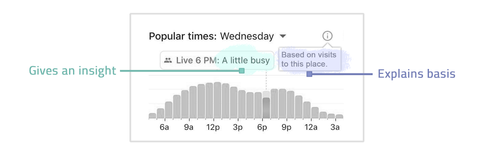
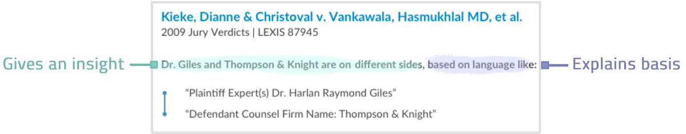
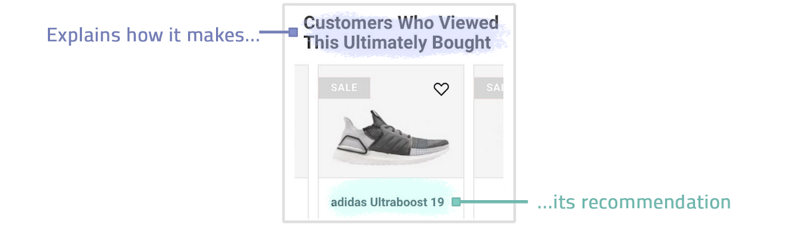
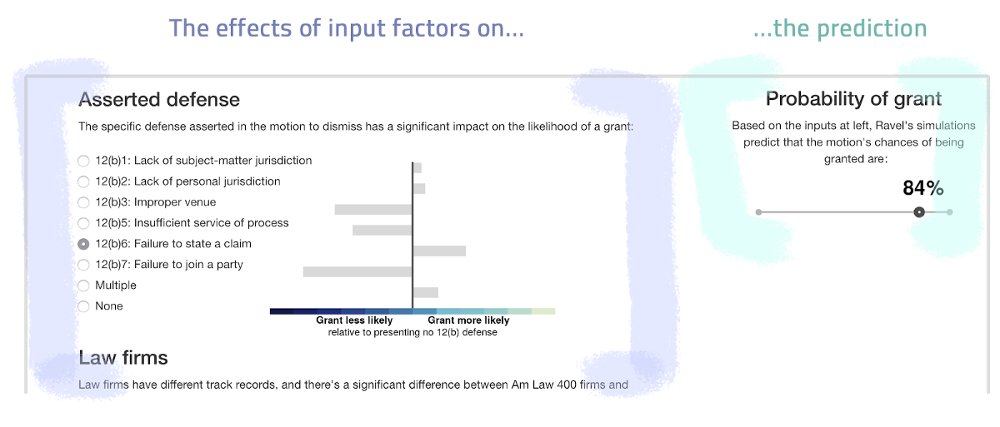
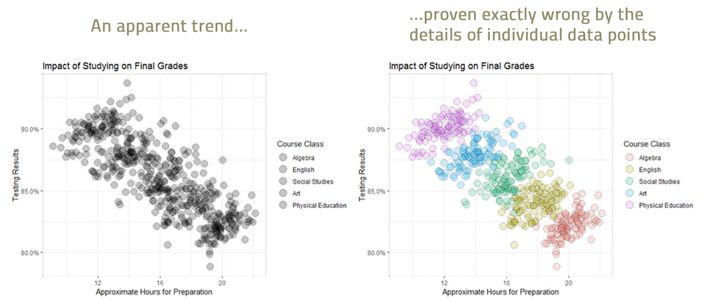
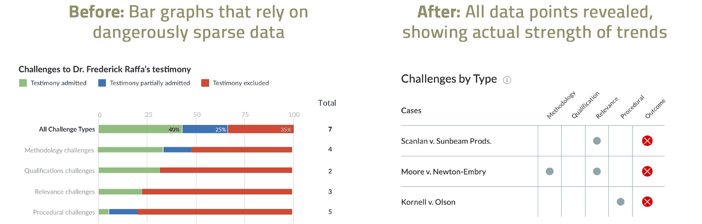
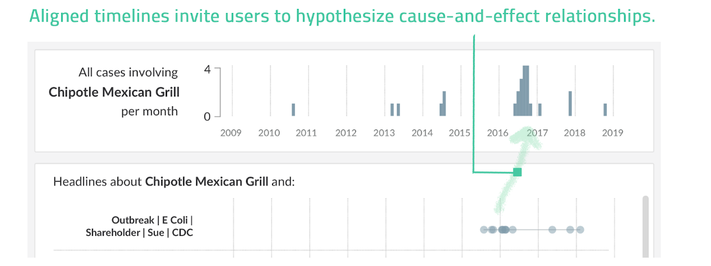

# 机器学习具有不确定性。 为它设计。
## 正确的设计可以使更多的数据科学见解（甚至是不完美的，概率性的见解）产生并提供。

> Credit: whiteMocca. Used with permission.


我们生活在机器学习时代。 这意味着我们所制造的产品越来越少地以事实为依据进行交易：相反，它们越来越依赖于推理，预测和推荐等概率性事物。 根据定义，这些事情具有不确定性。 不可避免地，它们将是错误的。

但这并不意味着它们没有产品价值。 毕竟，您可能宁愿知道下雨的几率是50％，而根本没有天气预报。 我们如何才能从错误的算法中释放用户价值？ 我们可以做预测所要做的事情：设计产品时要先于不确定性。

在机器学习时代，设计能够传达确定性的产品可能会带来巨大的竞争优势：
+ 它可以解锁新的价值。 通过授权用户就如何使用它们做出自己的判断，而不是决定并什么都不做，我们可以产生并发送更多的数据科学见解-甚至是不完美的，概率性的见解。
+ 它可以减少风险。 传达不确定性是免责声明：用户可以权衡证据并得出结论的风险由自己承担，而不必以产品的面值提出索赔，并使产品对不透明，错误的结论负责。
+ 它可以提高可用性。 好的设计可以使用户看到产品在做什么：系统状态的可见性是Nielsen Norman进行用户界面设计的第一种启发式方法。 不确定性的可见性为用户节省了自己弄清楚某事物的可靠性的痛苦。

这一切有问题吗？ 不确定性很难设计。 机器学习表示概率的不确定性，但是概率不是产品：普通人不想钻研p值和置信区间，设计人员也不想创建充满星号和技术知识的复杂怪兽。 此外，非专家不太擅长解释原始概率，有时会将其转变为可怕的战略决策。

我们应该传达产品中的不确定性，但是我们需要有效的，以用户为中心的设计解决方案来做到这一点。 在本文中，我将介绍三种效果很好的设计模式：
+ 展示你的作品
+ 显示单个数据点
+ 让用户完成难题

为了具体起见，我主要从Context（我们的法律数据分析产品）中提取示例，该产品从数百万司法意见的语言中提取有用的见解。 这是将机器学习产品化的绝佳平台，因为我们的律师用户群可以高度怀疑概率，完全不容忍错误。 我们在设计适用于他们的产品方面学到了很多东西！
## 设计模式1：展示您的作品

这里的公式很简单：提供您的概率见解（现在机场有点繁忙...），并让用户知道您的算法是如何到达的（...基于对这个地方的访问）。 Google Maps这样做：


这可以使您的见解更具辩护性和实用性：用户可以根据他们在方法论中看到的任何特定偏见或限制进行调整，并自己决定结论的信心。

在上下文中，我们的见解基于司法文件的书面语言。 下面，我们的语言算法发现了一位专业证人Giles博士和一家律师事务所Thompson＆Knight有一个先前的联系：他们过去似乎互相反对（在决定是否要 聘请Giles博士）。 我们的设计显示了导致算法得出该结论的确切语言。 这可以帮助用户验证结论，并且可以进一步深入了解该专家和律师事务所如何相互了解：


在推荐引擎的世界中展示您的工作也很方便。 下面的设计以完整句子的形式进行：


这种设计从字面上告诉用户该算法的工作原理：从本质上讲，该算法只是吸引过去的客户作为推荐者，这是一种称为协作过滤的聪明技术。 通过完全透明，设计消除了满足不确定的潜在期望的算法，例如推荐相似，相关或诱人的产品。

最后，有时展示您的作品可能会成为主要的吸引力。 在拉威尔法（Ravel Law），我们建立了一个实验性动议结果预测器，该预测器可计算出法院将批准某项动议的机会百分比，并显示出不同的因素（如主张的辩护类型）如何凭经验或多或少地获得授权。 我们通过简单的可视化展示了因子权重：


我们向预报员展示的律师比对结果的精确预测要更感兴趣的是了解这些单独因素的作用-他们在起草议案时可以控制的可操作性。 预测是困难且不确定的，但是显示我们（模型）的工作为我们的律师提供了有用的参考。
## 设计模式2：显示单个数据点

如今，单个数据点很少，这似乎是遗物，许多设计重点在于如何以数据仪表板的形式将大量数据集抽象为人类可理解的概括。 但是泛化会给我们带来麻烦，尤其是在数据稀疏的情况下。 矛盾的是，大数据意味着我们现在比以往拥有更多的小型数据集，将大数据切片和切块的结果缩小到我们感兴趣的范围。我们应该针对小数据固有的不确定性进行设计。

此外，在大小数据集中，当数据实际上遵循与我们假设不同的分布时，匆忙下结论可能会带来麻烦。 潜在的分布可能是偏斜的，双峰的，甚至是相反的，如本例中的辛普森悖论所示：


对于产品而言，揭示单个原始数据点可能更安全（通常更有用），从而传达其结论是否可靠的不确定性。 考虑一下我们的Context设计之一，它显示了专家证人在法庭上成功取证的成功记录：


最初的设计需要大量的“汇总统计数据”，正如我们所说的那样-多个条形图断定了专家在各种情况下的证词接纳率。 问题在于，许多专家只有一个或两个结果，这不足以使这些图表可靠地发挥作用。 我们本来会很笨拙地宣布，每个数据点都支持0％和100％的导纳率，这在技术上不是错误的，但暗示着专家作证的方式过于确定。 取而代之的是，我们的最终设计将专家证言的每一个挑战形象化，让用户发现模式并自行判断他们应该如何对待它们。
## 设计模式3：让用户解决难题

机器学习可以做令人惊奇的事情-但它仍然不能解决所有问题，难题的某些部分最好交给人类。 一种算法可能擅长查找片段，但不确定整体解决方案。 我们的设计应为用户安排这些作品，并自行设置完成拼图。

当涉及人工智能尚未真正解决的高阶问题（例如解释因果关系）时，这种想法最为有趣。 我们的上下文用户看到随着时间的流逝，影响特定公司的诉讼数量激增，并想知道是什么导致了这些激增。 我们的设计在平行的时间轴上安排了法律案件和新闻报道群，邀请用户自己推断因果关系。 在这里，用户可能会假设涉及Chipotle的法律案件激增可以由稍早一些有关Chipotle和E. coli的新闻头条解释：


这样的问题-为什么会发生什么，接下来会发生什么，您应该怎么做-很难解决并且冒险做出明确的回答。 但是我们不必做任何事情，至少不是完全没有做。 通过暗示性地排列算法确实找到的难题部分，产品设计可以激发用户进行思考，充实和评估的想法，从而使人类处于循环中，以从不完善的机器学习中提取价值。
## 最后的想法

通过设计不确定性，我们可以解锁全新的产品，在这些产品中，机器学习对于传统设计可能不够精确。 我提供了产品设计可以传达不确定性的三种方式：展示他们的工作，揭示单个数据点以及让用户完成难题。 但是，随着机器学习的发展，以及用户对不确定性的更深入思考以及道德和法规要求透明性，我们揭示不确定性的设计解决方案范围肯定会增加。 我期待看到我们的想法。
```
(本文翻译自Mark Myslín的文章《Machine learning has uncertainty. Design for it.》，参考：https://towardsdatascience.com/machine-learning-has-uncertainty-design-for-it-f015a249a444)
```
