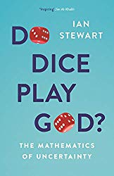

此列表使您可以掌握数学，统计数据和算法如何塑造我们所生活的世界。借助这些知识，您将能够更有效地运作并且更有信心。

祝他们阅读愉快！

*免责声明：以上链接均为会员*
# 您应该在2020年阅读的数学书
## 了解数学如何影响我们生活的各个方面。

在当今世界的每一个过程中，数学都是至关重要的。 即使我们可能不知道数学如何影响我们的行为，我们也会呼吸数学。 数学是我们使用的所有技术产品的背后。 无论您是什么背景的人，都需要了解数学的工作原理才能理解周围的世界。 这些书将帮助您。

> Math books you should read in 2020

# 阅读数学书


统计的艺术：如何从数据中学习是一本书，它通过一些出色的例子解释了统计在我们日常生活中的重要性：
+ 这个星球上有几棵树？
+ 繁忙的医院有更高的生存率吗？
+ 为什么老人耳朵大？

David Spiegelhalter指导读者完成我们从数据中获取知识所需的基本原则。 他利用现实世界中的问题来介绍概念性问题，向我们展示了统计数据如何帮助我们确定泰坦尼克号上最幸运的乘客，连环杀手Harold Shipman是否可能早些被抓到以及筛查卵巢癌是否有益。


数学毁灭性武器：大数据如何增加不平等和威胁民主是一本有关算法及其如何影响我们生活的书：
+ 我们上学的地方
+ 我们是否获得汽车贷款，
+ 我们为健康保险支付多少？

这些决定通常不是由人做出的，而是由数学模型做出的。 从理论上讲，这应该导致更大的公平性：每个人都按照相同的规则进行评判，并且消除了偏见。

但是正如Cathy O’Neil在这本书中所揭示的，事实恰恰相反。 当今使用的模型是不透明的，不受监管的且无可争议的，即使它们是错误的。 最令人不安的是，它们加剧了歧视：如果一个贫穷的学生因为借贷模型认为他风险太大而无法获得贷款（凭借他的邮政编码），那么他就脱离了可能使他摆脱贫困的那种教育。 ，随之而来的是恶性循环。 模特们支撑着幸运，并惩罚了被压迫者，创造了“民主的有毒鸡尾酒”。 欢迎来到大数据的阴暗面。


《黑天鹅：高度不可能的影响》是一本有关黑天鹅事件及其如何塑造我们世界的书。 黑天鹅是极不可能发生的事件，具有三个主要特征：不可预测； 它产生了巨大的影响； 并且，事实上，我们编造了一个解释，使它看起来比以前看起来更随机，更容易预测。 Google的惊人成功是一只黑天鹅。 9/11也是如此。 对于纳西姆·尼古拉斯·塔勒布（Nassim Nicholas Taleb）而言，黑天鹅几乎构成了我们世界上所有事物的基础，从宗教的兴起到我们个人生活中的事件。


无限力量：微积分如何揭示宇宙的秘密是一本有关微积分的书。

没有微积分，我们就不会有手机，电视，GPS或超声波。 我们不会发现DNA，也不会发现海王星，也不会想出如何将5,000首歌曲放入口袋的方法。

史蒂文·斯特罗加兹（Steven Strogatz）出色的创造力，扎实的历史表明，演算与复杂性无关。 这是关于简单性。 它利用一个虚幻的数字（无穷大）来解决现实世界中的问题，将它们分解成更简单的问题，然后将答案重新组合成让人感到神奇的解决方案。

“无穷大国”（Infinite Powers）讲述了微积分如何使发明家们陶醉并为之振奋，从古希腊的第一缕微光开始，一直到引力波的发现（微积分预测的现象）。 斯特罗加兹（Strogatz）揭示了这种数学形式如何应对每个时代的挑战：如何仅用沙子和棍子确定圆的面积； 如何解释为什么火星有时会“后退”； 如何用磁铁发电； 如何确保火箭不会错过月球； 如何在抗击艾滋病方面扭转局面。


谦虚的Pi：《现实世界中的数学错误》是一本关于数学如何在各个层面上影响我们生活的书：从运行网站的代码到启用摩天大楼和桥梁设计的方程式。 在大多数情况下，这种数学方法在幕后悄悄进行，直到不起作用为止。 各种看似无害的数学错误都可能产生重大后果。

数学运算很容易被忽略，直到错误的小数点使股票市场崩溃，单位转换错误导致飞机坠毁，或者有人除以零并使一艘战舰停滞在海洋中间。

在探讨和解释一连串的故障，未命中以及涉及互联网，大数据，选举，路牌，彩票，罗马帝国和奥林匹克队的数学不幸之后，马特·帕克（Matt Parker）发现了数学使我们绊倒的奇特方式，以及什么 这揭示了它在我们世界中的重要地位。 弄错它从未如此有趣。


骰子扮演上帝吗？：不确定性是一本关于不确定性的书。 不确定性无处不在：天气，经济状况，未出生婴儿的性别-甚至我们认为我们知道的诸如人口或行星过境之类的数量都可能出错。 难怪在整个这段历史中，我们一直试图产生严格定义的不确定性区域-我们更喜欢惊喜小行星而不是惊喜小行星。

伊恩·斯图尔特（Ian Stewart）探索不确定性的历史和数学。 在谈到赌博，概率，统计数据，金融和天气预报，人口普查，医学研究，混乱，量子物理学和气候时，他明确了一件事：合理的概率是唯一的确定性。


普林斯顿数学随笔是现代数学的终极指南。 这本书由菲尔兹奖获得者蒂莫西·高尔斯（Timothy Gowers）编辑，介绍了近200篇由世界领先的数学家撰写的作品。 您将被介绍给：
+ 基本的数学工具和词汇；
+ 追踪现代数学的发展；
+ 解释基本术语和概念；
+ 审查数学主要领域的核心思想；
+ 描述著名数学家分数的成就；
+ 探索数学对其他学科（例如生物学，金融和音乐）的影响。

每个人都应该将其放在架子上，以查找工作或生活中出现的任何数学概念。
```
(本文翻译自Przemek Chojecki的文章《Math Books you should read in 2020》，参考：https://medium.com/swlh/math-books-you-should-read-in-2020-f08fa3b9704e)
```
