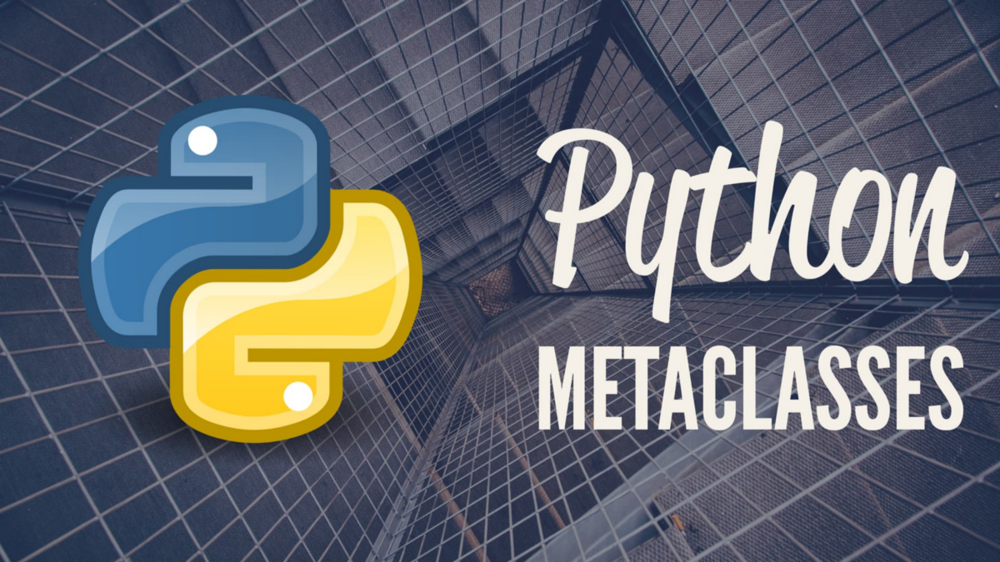

让我们看看如何在元类中使用__call__方法。

假定我们必须创建一个单例类，该类在其生存期内仅创建1个对象，而与实例化该实例的次数无关。
```
class MyMeta(type):    _instances = {}    def __call__(cls, *args, **kwargs):        if cls not in MyMeta._instances:            MyMeta._instances[cls] = super().__call__(*args, **kwargs)        return MyMeta._instances[cls]class Singleton(metaclass=MyMeta): pass x = Singleton()y = Singleton()print(x is y)  # Outputs True
```

那么，它是如何工作的呢？
+ 每次实例化类时，都会调用元类中的__call__方法。
+ 我们在元类MyMeta中维护一个字典_instances，该字典包含每个类与其对象之间的引用。
+ 在第一次调用期间，该类不在_instances词典中。
+ 我们从type调用默认的__call__方法，获取对象并更新字典。
+ 对于进一步的类实例化，将返回_instances词典中的相同对象。
# Python元类简介

> Introduction to metaclasses in python


你们中的许多在pythonmight中可能具有编写面向对象代码的经验的人都遇到了元类的概念。如果您不知道它是什么，那么本文适合您！

什么是元类？

元类是定义类及其实例的行为的类。 元类是其实例为类的类。

那么，元类到底有什么好看的呢？

元类可让您动态（即运行时）自定义类的创建。 元类可以在运行时更改类的行为。

让我们回去一点！

我敢肯定，到那时大多数人都会同意Python中的所有内容都是一流的对象（即），它们具有一些属性和行为/方法。

Python中的所有对象都是称为type的类的子级。 类型就像Python（即其他所有对象的创建者）中的上帝
```
>>> type_of_10 = type(10)>>> type(type_of_10)type >>> class Example:       pass>>> type(Example)type >>> a = [1,2,3]>>> type_of_a = type(a)>>> type(type_of_a)type
```

话虽如此，类型是python中所有对象的基础。 因此，任何内置或用户定义的类都是类类型的对象

如何在python中动态创建类？
```
def mymethod(self):    return self.x > 100class_name = "MyClass"base_classes = tuple()params= {"x": 10, "check_greater": mymethod}MyClass = type("MyClass", base_classes, params)obj = MyClass()print(obj.check_greater())
```

因此，类型是，类型就像接受3个参数的函数一样。
+ 类名（MyClass）
+ 基类列表（base_classes），即我没有任何基类。 所以我通过空元组。
+ 字典中的属性和方法（参数）

到现在为止，您必须进入凹槽，以确认类型实际上负责生成（内置和用户定义）python中的所有对象。

那么，当我们可以使用类型即时创建类时，为什么要使用元类呢？

通过元类，我们可以在实际创建用户定义的类之前自定义它们的创建！

换句话说，它可以向实际类添加或删除属性，方法或基类。

听起来怪怪的 ？ 让我们深潜。
+ 元类不过是从类类型派生的类。
```
class MyMetaclass(type):
```

2.元类可以重写类类型上的方法__new __，__ init__或__call__以提供自定义的行为。

注意：

1.创建类时，python将metaclass .__ new__调用。

2.初始化类时会调用metaclass .__ init__。

3.当将类用作可调用对象（即，当我们使用该类实例化对象）时，将调用metaclass .__ call__。

可以说，我想创建一个自定义类型的字符串，该字符串的方法说明给定的字符串是否等于零。
```
x = "adsads"# Worksx.replace("a", "x")  # replace method is available in str type# Will throw errorx.iszero()  # iszero method is not defined in str type
```

我们可以使用元类来实现这种行为
```
class StringFactory(type):    def iszero(self):        """Check if the given string is equals to one or more zeros"""        try:            return not sum([int(chr) for chr in self])         except:            return False    def __new__(cls, name, bases, dct):        print("My class is not yet created")        bases += (str,)  # add str class as base to the new class        dct["iszero"] = StringFactory.iszero  # add our custom method to the new class        class_ = type.__new__(cls, name, bases, dct)        print("My class is created with custom method at run time")        return class_
```

好的。 现在，我们定义了一个元类。 让我们看看如何使用它。
```
class MyCustomString(metaclass=StringFactory):    pass
```

到此时，将使用2种自定义创建类MyCustomString。
+ 它源自类型str
+ 它提供了一个自定义方法iszero来查看字符串是否由零组成。
```
test_string = MyCustomString("abcd")print(test_string.iszero())  # Outputs Falsetest_string = MyCustomString("0000")print(test_string.iszero())  # Outputs True
```
```
(本文翻译自Bakthavatchalam Gopalswamy的文章《Introduction to metaclasses in Python》，参考：https://medium.com/analytics-vidhya/metaprogramming-in-python-for-beginners-546adbc76f98)
```
