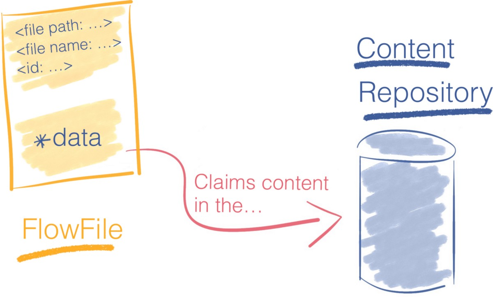
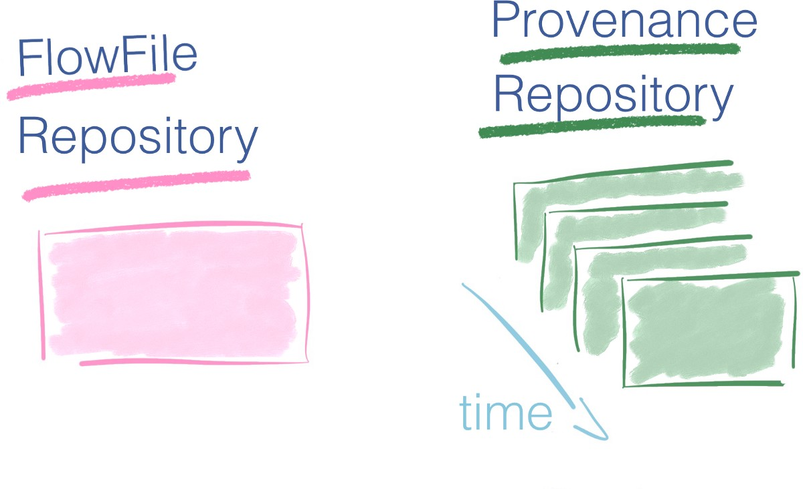

# Apache Nifi的工作原理-浏览数据流，不要淹没其中

> Photo by Michael Denning on Unsplash

# 介绍

那是疯狂的水流。 就像您的应用程序处理疯狂的数据流一样。 如果您独自完成所有工作，那么很难将数据从一个存储路由到另一个存储，应用验证规则并解决数据治理，大数据生态系统中的可靠性问题。

好消息，您不必从头开始构建数据流解决方案-Apache NiFi支持您！

在本文结尾，您将成为NiFi专家-准备建立数据管道。
## 我将在本文中介绍：
+ 什么是Apache NiFi，应在哪种情况下使用它，以及在NiFi中理解的关键概念是什么。
## 我不会介绍的内容：
+ NiFi集群的安装，部署，监视，安全性和管理。

为方便起见，这里是目录，您可以随时随心所欲地带您进入。 如果您是NiFi初学者，建议您按照指示的顺序阅读本文。
## 表中的内容
+ 我-什么是Apache NiFi？-定义NiFi-为什么使用NiFi？
+ II-显微镜下的Apache Nifi-FlowFile-处理器-进程组-连接-流控制器
+ 结论和号召性用语
# 什么是Apache NiFi？

在Apache Nifi项目的网站上，可以找到以下定义：

一个易于使用，功能强大且可靠的系统来处理和分发数据。

让我们在那里分析关键字。
## 定义NiFi

处理和分发数据这就是Nifi的要旨。 它可以在系统中移动数据，并为您提供处理该数据的工具。

Nifi可以处理各种各样的数据源和格式。 您可以从一个源中获取数据，对其进行转换，然后将其推送到另一个数据接收器。

> Ten thousand feet view of Apache Nifi — Nifi pulls data from multiple data sources, enrich it and transform it to populate a key-value store.


易于使用的处理器-由连接器链接的盒子-箭头创建了流程。 NiFi提供基于流的编程体验。

Nifi使一眼就能理解一组数据流操作，这将需要数百行源代码来实现。

考虑下面的管道：

> An overly minimalist data pipeline


要在NiFi中转换以上数据流，请转到NiFi图形用户界面，将三个组件拖放到画布中，就这样。 构建需要两分钟。

> A simple validation data flow as seen through Nifi canvas


现在，如果您编写代码来执行相同的操作，则可能需要数百行才能达到相似的结果。

您不会像使用基于流的方法那样通过代码捕获管道的本质。 Nifi在构建数据管道方面更具表现力； 就是为了做到这一点。

PowerfulNiFi提供了许多开箱即用的处理器（Nifi 1.9.2中为293个）。 您站在巨人的肩膀上。 这些标准处理器可以处理您可能遇到的绝大多数用例。

NiFi是高度并发的，但其内部封装了相关的复杂性。 处理器为您提供了高级抽象，它掩盖了并行编程固有的复杂性。 处理器同时运行，您可以跨越一个处理器的多个线程来应对负载。

并发是您不想打开的Pandora计算框。 NiFi方便地保护了管道构建器免受并发复杂性的影响。

可靠NiFi的理论支持并不新鲜； 它具有扎实的理论基础。 与SEDA之类的模型相似。

对于数据流系统，要解决的主要主题之一是可靠性。 您要确保有效地接收了发送到某处的数据。

NiFi通过多种机制在任何时间点跟踪系统状态，从而实现了高度的可靠性。 这些机制是可配置的，因此您可以在延迟和应用程序所需的吞吐量之间进行适当的权衡。

NiFi利用其沿袭和出处特征来跟踪每条数据的历史记录。 它使得知道每条信息发生什么转变成为可能。

Apache Nifi提出的数据沿袭解决方案被证明是审核数据管道的出色工具。 在像欧盟这样的跨国参与者提出支持准确数据处理的准则的背景下，数据沿袭功能对于增强人们对大数据和AI系统的信心至关重要。
## 为什么要使用Nifi？

首先，我想说明一下，我不是在宣传NiFi。 我的目标是为您提供足够的元素，以便您可以明智地决定构建数据管道的最佳方法。

在确定解决方案尺寸时，请记住大数据的四个优势。

> The four Vs of Big Data

+ 数量-您的经营规模是多少？ 在数量级上，您接近几千兆字节还是几百PB？
+ 种类-您有多少个数据源？ 您的数据是结构化的吗？ 如果是，架构是否经常变化？
+ 速度-您处理事件的频率是多少？ 是信用卡付款吗？ 它是物联网设备发送的每日性能报告吗？
+ 准确性-您可以信任数据吗？ 另外，在操作之前是否需要进行多次清洁操作？

NiFi无缝地从多个数据源中提取数据，并提供了处理数据中不同模式的机制。 因此，当数据种类繁多时，它会发光。

如果数据准确性不高，则Nifi尤其有价值。 由于它提供了多个处理器来清理和格式化数据。

通过其配置选项，Nifi可以解决各种体积/速度情况。
## 数据路由解决方案的应用程序列表越来越多

新法规，物联网的兴起及其生成的数据流都强调了诸如Apache NiFi之类的工具的重要性。
+ 微服务是新潮。 在那些松耦合的服务中，数据就是服务之间的契约。 Nifi是在这些服务之间路由数据的可靠方法。
+ 物联网将大量数据带到云中。 从边缘到云的数据摄取和验证带来了许多新挑战，NiFi可以有效应对这些挑战（主要是通过MiniFi，针对边缘设备的NiFi项目）
+ 制定了新的准则和法规以重新调整大数据经济。 在日益增加的监视范围内，对于企业来说，对其数据管道有清晰的概览至关重要。 例如，NiFi数据沿袭可能会有助于遵守法规。
## 弥合大数据专家与其他专家之间的鸿沟

从用户界面可以看到，用NiFi表示的数据流非常适合与您的数据管道进行通信。 它可以帮助您的组织成员更加了解数据管道中发生的事情。
+ 分析师正在寻求有关为什么这些数据以这种方式到达此处的见解？ 坐在一起，并在流程中穿行。 在五分钟内，您将对提取转换和加载-ETL-管道有深入的了解。
+ 您希望您的同僚对您创建的新错误处理流程提供反馈吗？ NiFi决定将错误路径视为有效结果，这是一项设计决策。 期望流程审查比传统的代码审查要短。
## 你应该使用它吗？ 是的，不是，也许吗？

NiFi品牌本身就易于使用。 尽管如此，它还是一个企业数据流平台。 它提供了一套完整的功能，您可能只需要其中的一部分即可。 将新工具添加到堆栈中不是良性的。

如果您是从头开始并管理来自受信任数据源的一些数据，则最好设置“提取转换和加载-ETL”管道。 您可能只需要从数据库中捕获更改数据和一些数据准备脚本即可。

另一方面，如果您在使用现有大数据解决方案（用于存储，处理或消息传递）的环境中工作，则NiFi可以很好地与它们集成，并且很可能会很快获胜。 您可以利用现成的连接器连接其他大数据解决方案。

很容易被新的解决方案所炒作。 列出您的要求，并选择尽可能简单地满足您需求的解决方案。

既然我们已经看到了Apache NiFi的高水准，我们来看看它的关键概念并剖析其内部结构。
# 显微镜下的Apache Nifi

可以传达“ NiFi是盒子和箭头编程”的信息。 但是，如果您必须使用NiFi，则可能需要更多地了解其工作原理。

在第二部分中，我将说明使用模式的Apache NiFi的关键概念。 此后的黑匣子模型将不再是您的黑匣子。
## 取消装箱Apache NiFi

启动NiFi时，您会进入其Web界面。 Web UI是设计和控制数据管道的蓝图。

> Apache NiFi user interface — build your pipeline by drag and dropping component on the interface


在Nifi中，您组装通过连接链接在一起的处理器。 在前面介绍的示例数据流中，有三个处理器。

> Three processors linked together by two queues


NiFi canvas用户界面是管道构建器在其中发展的框架。
## 理解Nifi术语

要以Nifi表示数据流，您必须首先掌握其语言。 不用担心，只需几个术语就足以掌握其背后的概念。

黑匣子称为处理器，它们通过称为连接的队列交换名为FlowFiles的信息块。 最后，FlowFile Controller负责管理这些组件之间的资源。

> Processor, FlowFile, Connector, and the FlowFile Controller: four essential concepts in NiFi


让我们看看它是如何工作的。
## 流文件

在NiFi中，FlowFile是在管道处理器中移动的信息包。

> Anatomy of a FlowFile — It contains attributes of the data as well as a reference to the associated data


FlowFile分为两个部分：
+ 属性，是键/值对。 例如，文件名，文件路径和唯一标识符是标准属性。
+ 内容（对字节流的引用）构成FlowFile内容。

FlowFile不包含数据本身。 这将严重限制管道的吞吐量。

相反，FlowFile保留一个指针，该指针引用存储在本地存储中某个位置的数据。 这个地方称为内容存储库。

> The Content Repository stores the content of the FlowFile


为了访问内容，FlowFile从内容存储库中声明资源。 稍后会跟踪内容所在位置的确切磁盘偏移，并将其流回FlowFile。

并非所有处理器都需要访问FlowFile的内容来执行其操作-例如，聚合两个FlowFiles的内容不需要将其内容加载到内存中。

当处理器修改FlowFile的内容时，将保留先前的数据。 NiFi写入时复制，它会在将内容复制到新位置时对其进行修改。 原始信息保留在内容存储库中。

示例考虑一个压缩FlowFile内容的处理器。 原始内容保留在内容存储库中，并为压缩内容创建一个新条目。

内容存储库最终将对压缩内容的引用返回。 FlowFile更新为指向压缩数据。

下图总结了带有压缩FlowFiles内容的处理器的示例。

> Copy-on-write in NiFi — The original content is still present in the repository after a FlowFile modification.


可靠性iFi声称是可靠的，实际上如何？ 当前使用的所有Flow File的属性以及对其内容的引用都存储在FlowFile存储库中。

在流水线的每个步骤中，在对流文件进行修改之前，首先将其记录在流文件存储库中的预写日志中。

对于系统中当前存在的每个FlowFile，FlowFile存储库存储：
+ FlowFile属性
+ 指向位于FlowFile存储库中的FlowFile内容的指针
+ FlowFile的状态。 例如：Flowfile在此瞬间属于哪个队列。

> The FlowFile Repository contains metadata about the files currently in the flow.


FlowFile存储库为我们提供了流程的最新状态； 因此，它是从中断中恢复的强大工具。

NiFi提供了另一个工具来跟踪流程中所有FlowFiles的完整历史记录：“资源库”。

来源存储库每次修改FlowFile时，NiFi都会在此时获取FlowFile及其上下文的快照。 NiFi中此快照的名称是“来源事件”。 来源存储库记录来源事件。

出处使我们能够追溯数据沿袭并为在NiFi中处理的每条信息建立完整的监管链。

> The Provenance Repository stores the metadata and context information of each FlowFile


除了提供完整的数据沿袭外，Provenance Repository还提供从任何时间点重播数据的功能。

> Trace back the history of your data thanks to the Provenance Repository


等等，FlowFile资料库和Provenance资料库有什么区别？

FlowFile资料库和Provenance资料库背后的想法非常相似，但它们没有解决相同的问题。
+ FlowFile存储库是一个日志，仅包含系统中正在使用的FlowFiles的最新状态。 这是最新的流量情况，可以快速从中断中恢复。
+ 另一方面，“资源库”更为详尽，因为它跟踪流中每个FlowFile的完整生命周期。

> The Provenance Repository adds a time dimension where the FlowFile Repository is one snapshot


如果您只有使用FlowFile存储库的最新系统图片，则Provenance存储库将为您提供照片集-视频。 您可以倒退到过去的任何时刻，研究数据，并从给定的时间重放操作。 它提供了数据的完整沿袭。
## FlowFile处理器

处理器是执行操作的黑匣子。 处理器可以访问FlowFile的属性和内容以执行所有类型的操作。 它们使您能够在数据输入，标准数据转换/验证任务中执行许多操作，并将这些数据保存到各种数据接收器中。

> Three different kinds of processors


NiFi在安装时会附带许多处理器。 如果找不到适合您的用例的处理器，仍然可以构建自己的处理器。 编写自定义处理器超出了本博客文章的范围。

处理器是完成一项任务的高级抽象。 这种抽象非常方便，因为它使管道构建器免受并发编程和错误处理机制的实现所固有的困难。

处理器公开具有多个配置设置的接口，以微调其行为。

> Zoom on a NiFi Processor for record validation — pipeline builder specifies the high-level configuration options and the black box hides the implementation details.


这些处理器的属性是NiFi与您的应用程序需求之间的最后联系。

细节在于魔鬼，管道建设者会花费大部分时间来微调这些属性以匹配预期的行为。

缩放对于每个处理器，您可以指定要同时运行的并发任务数。 这样，流控制器将更多资源分配给该处理器，从而提高其吞吐量。 处理器共享线程。 如果一个处理器请求更多线程，则其他处理器将具有更少的线程来执行。 有关Flow Controller如何分配线程的详细信息，请参见此处。

水平缩放。 扩展的另一种方法是增加NiFi群集中的节点数。 群集服务器使您可以使用商用硬件来提高处理能力。
## 工艺组

现在，我们已经了解了什么是处理器，这很简单。

一堆处理器及其连接可以组成一个进程组。 您添加了输入端口和输出端口，以便它可以接收和发送数据。

> Building a new processor from three existing processors


处理器组是从现有处理器创建新处理器的简便方法。
## 连接数

连接是处理器之间的队列。 这些队列允许处理器以不同的速率进行交互。 连接可以具有不同的容量，例如存在不同尺寸的水管。

> Various capacities for different connectors. Here we have capacity C1 > capacity C2


由于处理器根据执行的操作以不同的速率消耗和产生数据，因此连接充当FlowFiles的缓冲区。

连接中可以有多少数据是有限制的。 同样，当水管装满后，您将无法再加水，否则水会溢出。

在NiFi中，您可以设置FlowFile的数量及其通过连接的聚合内容大小的限制。

当您发送的数据超出连接的处理能力会发生什么？

如果FlowFiles的数量或数据量超过定义的阈值，则将施加反压。 在队列中没有空间之前，Flow Controller不会安排先前的处理器再次运行。

假设您在两个处理器之间最多只能有10000个FlowFile。 在某个时候，连接中有7 000个元素。 可以，因为限制为10000。P1仍然可以通过连接发送数据到P2。

> Two processors linked by a connector with its limit respected.


现在，假设处理器一向该连接发送了4000个新的FlowFiles。 7 0000 + 4 000 = 11000→我们超过了10 000个FlowFiles的连接阈值。

> Processor P1 not scheduled until the connector goes back below its threshold.


限制是软限制，表示可以超出限制。 但是，一旦连接器恢复到其阈值（10000个FlowFiles）以下，就不会调度以前的处理器P1。

> Number of FlowFiles in the connector comes back below the threshold. The Flow Controller schedules the processor P1 for execution again.


这个简化的示例可以大致了解反压的工作原理。

您要设置适合于要处理的数据的音量和速度的连接阈值。 请记住四个V。

超出限制的想法听起来很奇怪。 当FlowFiles或关联数据的数量超过阈值时，将触发交换机制。

> Active queue and Swap in Nifi connectors


对于反压的另一个示例，此邮件线程可以提供帮助。

优先处理FlowFiles NiFi中的连接器是高度可配置的。 您可以选择如何在队列中确定FlowFiles的优先级，以决定下一步要处理的文件。

在可用的可能性中，例如，先进先出顺序FIFO。 但是，您甚至可以使用FlowFile中选择的属性来优先处理传入数据包。
## 流量控制器

流量控制器是将一切融合在一起的粘合剂。 它为处理器分配和管理线程。 这就是执行数据流的方式。

> The Flow Controller coordinates the allocation of resources for processors.


此外，Flow Controller还可以添加Controller Services。

这些服务有助于管理共享资源，例如数据库连接或云服务提供商凭据。 控制器服务是守护程序。 它们在后台运行，并提供配置，资源和参数供处理器执行。

例如，您可以使用AWS凭证提供程序服务使您的服务与S3存储桶进行交互，而不必担心处理器级别的凭证。

> An AWS credentials service provide context to two processors


就像处理器一样，提供了许多开箱即用的控制器服务。

您可以查看本文以获取有关控制器服务的更多内容。
# 结论和号召性用语

在本文的过程中，我们讨论了企业数据流解决方案NiFi。 您现在对NiFi的功能以及如何为应用程序利用其数据路由功能有了深刻的了解。

如果您正在阅读本文，那么恭喜！ 现在，您对NiFi的了解超过了全球99.99％的人口。

实践使完美。 您掌握了开始构建自己的管道所需的所有概念。 简单点； 使它首先工作。

这是我根据自己的工作经验编写的这篇令人兴奋的资源清单。
## 资源📚
## 更大的图景

因为在复杂的生态系统中设计数据管道需要多个领域的熟练程度，所以我强烈推荐Martin Kleppmann撰写的《设计数据密集型应用程序》。 它涵盖了基础知识。
+ 马丁书中引用了所有参考文献的备忘单可在他的Github存储库中找到。

如果您已经知道您想深入学习什么样的主题并且想找到优质的材料，那么这份备忘单是一个很好的起点。
## Apache Nifi的替代品

存在其他数据流解决方案。

开源：
+ 流集类似于NiFi； 这个博客上有一个很好的比较

大多数现有的云提供商都提供数据流解决方案。 这些解决方案可轻松与您从该云提供商处使用的其他产品集成。 同时，它将您与特定供应商牢固地联系在一起。
+ Azure数据工厂，Microsoft解决方案
+ IBM有其InfoSphere DataStage
+ 亚马逊提出了一个名为数据管道的工具
+ Google提供其数据流
+ 阿里云推出具有类似功能的服务DataWorks
## NiFi相关资源
+ Nifi的官方文档，尤其是“ Nifi深入”部分是金矿。
+ 向Nifi用户邮件列表注册也是一种很好的通知方式-例如，此对话说明了背压。
+ Hortonworks是大数据解决方案提供商，拥有一个社区网站，其中包含许多引人入胜的资源以及Apache Nifi的使用方法。 —本文深入介绍了连接器，堆的使用和背压。 —此人分享了部署NiFi群集时的最佳实践尺寸。
+ NiFi博客摘录了许多有关NiFi使用模式的见解以及有关如何构建管道的技巧。
+ 索赔检查模式说明
+ Apache Nifi背后的理论并不是什么新鲜事物，Nifi Doc中提到的Seda极为相关-Matt Welsh。 伯克利。 SEDA：一种条件良好的可扩展Internet服务的体系结构[在线]。 检索日期：2019年4月21日，从http://www.mdw.la/papers/seda-sosp01.pdf
```
(本文翻译自François Paupier的文章《How Apache Nifi works — surf on your dataflow, don’t drown in it》，参考：https://medium.com/free-code-camp/nifi-surf-on-your-dataflow-4f3343c50aa2)
```
