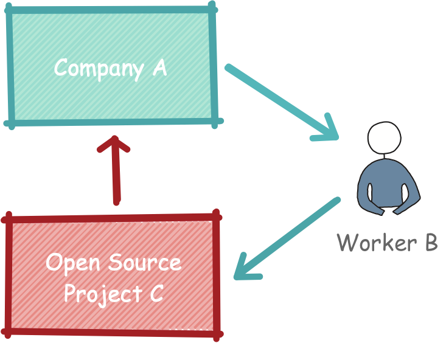
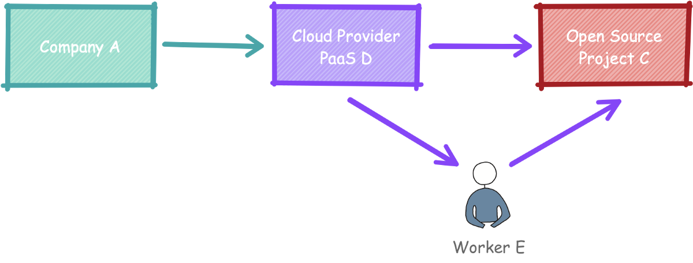
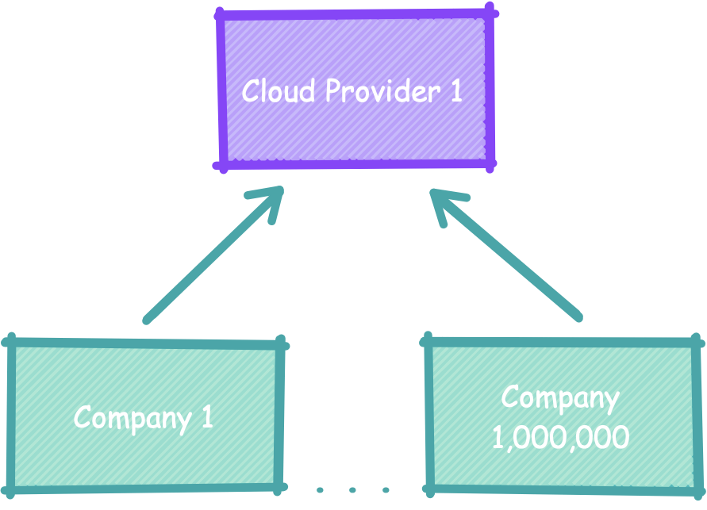

# 开源软件和PaaS：危机与适应

开源生态系统的结构性变化是由于云计算平台即服务（PaaS）的兴起而引起的，该平台正在中断维持生态系统的投资周期。 向云计算的转变使直接在开源上进行直接投资的公司数量减少了几个数量级，并将对公司间接投资的控制集中在一些中介机构的手中，这些中介机构缺乏与确保公司道德参与的单个公司相同的动机。

对于免费和开源软件的按需付款的软经济而言，这构成了全面的危机。 结果，生态系统将发生巨大变化，该生态系统将以多种方式进行适应，我们将在以后的文章中进行探讨。

我看到许多人抱怨这些变化的症状，生态系统中的不良行为者。 我几乎没有人在谈论这些症状的结构性原因以及它们对未来的意义，更不用说概述潜在的情况，它们可能意味着什么以及我们如何影响这些结果了。 这是一系列尝试做这些事情的文章中的第一篇。
# 运行自己的开源

不要自欺欺人：公司（不是志愿者）为大多数开源软件提供资金。 像公司A这样的公司向像工人B这样的工人付钱，以使用开源项目C解决问题。在互惠的循环中，公司A允许工人B将改进归还给开源项目C，其他公司可以在其中使用它们并反过来贡献他们的精力。 自己的改进。 每个人都受益。

> The cycle of reciprocity under the traditional model of run your own open source


这是使开源工作的基本周期。 从1970年代开放源代码开始，这个周期就一直没有中断，从研究机构和BSD * nix开始，到使用Linux和Apache扩展到企业。 直到最近，它推动了开源软件的发展，直到运行全球经济的系统完全依赖它。
# 开源平台即服务

云计算从根本上改变了互惠的开源周期。 在平台即服务（PaaS）模式下，公司A向Cloud PaaS提供商D付费以为其运行开源软件。 这就带来了潜在的问题-如果您不运行自己的软件，就不会对其进行改进，也不会将这些改进归还给项目。 互惠的循环被打破了，开源的经济不再起作用。

在基于云的模型中，Cloud Paas提供者D向工作者E支付了改善开放源代码项目C的费用，并且他们允许工作者E将这些改进贡献回开放源代码项目C，其他云提供者可以在其中使用它们并反过来贡献自己的改进。

> The cycle of reciprocity under the cloud computing platform as a service model of open source


请注意，开源软件的贡献者现在是云提供商，而不是原始公司，而互惠循环现在在云提供商之间而不是全球经济众多行业中的单个公司中进行。 云提供商拥有多达1,000,000个客户，这意味着直接资助开源软件的公司数量的减少规模是巨大的。 我并不是说这是1,000,000：1，但肯定是几个数量级。 至少几个零。

> The reduction in the number of direct investors to open source


请注意，由于数量很少，因此云提供商之间的关系要比在传统模式下为开源项目做出贡献的两家公司之间的关系不同。 开放源代码的直接贡献者之间竞争的加剧可能会减少他们对整个生态系统的投资分配，而是导致他们试图破坏，分散和拥有生态系统本身。 使透明的内容透明-但再次封闭。 像啤酒一样自由，但不像自由一样自由。 我们必须设法避免这种反乌托邦的情况，我将在以后的文章中讨论。

目前，要注意的最重要的一点是，对于PaaS模型中的开源而言，每个云提供商仍然有多达一百万家间接资助开源软件的公司，但是现在，云提供商可以管理这些资金的分配。 无论是否喜欢，云计算提供商都已成为开源投资经理。
# 云监控机构

这就提出了许多重要的问题：云提供商是否已作为开源投资的事实上的财务经理加紧承担起这一新的责任？ 他们对开源项目的投资是否反映了客户对这些项目的持续存在的投资？ 他们在履行受托责任吗？ 我们如何确保云提供商保持开源互惠投资的周期？ 这些是本系列将探讨的问题。

一旦确定要寻找答案，我们将如何解决？ 我们如何评估自由和开源软件生态系统以及云提供商的公民身份？ 我们听谁的话？ 云提供商本身？ 开源爱好者？ 项目创始人？ 企业家？ FOSS先知？ 分析师（分析师）？ 记者？

在过去的六个月中，我已经与上述所有各方进行了交谈或进行了采访。 每个人都有不同的观点，每个人都引用不同的例子来证明自己的观点。 有些人看到了我的危机，其他人则完全看不到它。 我得到的大多数证据都是轶事。 任何人引用的唯一统计数据都来自云提供商，我们将看到有理由怀疑他们的主张。
# 我们相信上帝； 所有其他带来数据

最后，我发现了解不断变化的情况的唯一可靠方法是查看硬数据。 这就是为什么我将Github和Stack Overflow数据用作我即将出版的书《弱监督学习》（O'Reilly，2020年）中使用的数据集的原因。 在本系列文章中，我将结合硬数据和我进行的访谈中的见解，以调查未来的开源可能会是什么样子，以及我们中的任何人都可以做些什么来实现改变，从而创造每个参与者想要的未来 ：一个充满活力的开源生态系统，将在未来发展。

不要害怕，有希望！ 但是我们最好动起来...

Russell Jurney是一位AI产品顾问，专门从事自然语言处理，数据标记，呼吸管和弱监督学习。 他是有关数据科学的四本书的作者。 他的第五本书《弱监督学习》（O’Reilly，2020年）将于今年晚些时候出版。
```
(本文翻译自Russell Jurney的文章《Open Source Software and PaaS: Crisis and Adaptation》，参考：https://towardsdatascience.com/open-source-software-and-paas-crisis-and-adaptation-88aba9ed6b0a)
```
