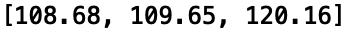
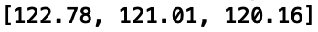
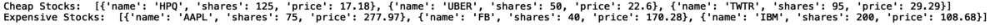
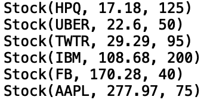

# Python中的优先级队列
## 优先队列的堆实现

> Source


优先级队列是一种与普通队列或堆栈相似的数据结构，但是每个元素都具有关联的优先级。 高优先级的元素先于低优先级的元素提供。 优先级队列通常使用堆数据结构来实现。

在本文中，我们将讨论使用堆数据结构在python中实现优先级队列的方法。

让我们开始吧！

在构建“ PriorityQueue”类之前，值得熟悉python“ heapq”模块。 首先，我们导入“ heapq”模块：
```
import heapq
```

假设我们有一个IBM的历史价格清单：
```
ibm_prices = [108.68, 109.65, 121.01, 122.78, 120.16]
```

如果我们想获得N的最低价格或最高价格，可以分别使用“ .nsmallest（）”和“ .nlargest（）”方法。 要获得三个最低价格，我们可以执行以下操作：
```
print(heapq.nsmallest(3, ibm_prices))
```


对于三个最高价格：
```
print(heapq.nlargest(3, ibm_prices))
```


为了使事情变得更有趣，假设我们有一个科技公司股票组合：
```
portfolio = [       {'name': 'IBM', 'shares': 200, 'price': 108.68},       {'name': 'AAPL', 'shares': 75, 'price': 277.97},       {'name': 'FB', 'shares': 40, 'price': 170.28},       {'name': 'HPQ', 'shares':125, 'price': 17.18},       {'name': 'UBER', 'shares': 50, 'price': 22.60},       {'name': 'TWTR', 'shares': 95, 'price': 29.29}]
```

我们可以使用“ .nsmallest（）”和“ .nlargest（）”分别提取最便宜和最昂贵的股票：
```
cheap_stocks = heapq.nsmallest(3, portfolio, key=lambda s: s['price'])expensive_stocks = heapq.nlargest(3, portfolio, key=lambda s: s['price'])
```

让我们打印结果：
```
print("Cheap Stocks: ", cheap_stocks)print("Expensive Stocks: ", expensive_stocks)
```


这些功能提供了卓越的性能，特别是当N个元素的大小（最大或最小）与整个集合相比较小时。

现在，我们可以构建优先级队列类了。 让我们使用“ heapq”模块创建优先级队列类。 首先，我们创建初始化方法：
```
class PriorityQueue:    def __init__(self):        self._queue = []        self._index = 0
```

我们还定义一个方法，该方法将允许我们检查队列是否为空：
```
class PriorityQueue:    ...    def is_empty(self):        return not self._queue
```

接下来，让我们定义一个方法，该方法将允许我们将对象推送到优先级队列中。 我们采用“ heappush”方法，该方法将具有优先级和项目值：
```
class PriorityQueue:    ...    def push(self, item, priority):        heapq.heappush(self._queue, (priority, self._index, item))        self._index += 1
```

最后，我们将使用'heappop'方法添加一个方法，使我们可以从优先级队列中删除元素：
```
class PriorityQueue:    ...    def pop(self):        return heapq.heappop(self._queue)[-1]
```

接下来，我们定义一个名为Stock的类，该类将用于演示优先级队列类的用法。 该类将具有“ __init__”方法，该方法可让我们初始化股价，股票和股票代码的值：
```
class Stock:    def __init__(self, stock_ticker, stock_price, stock_share):        self.stock_ticker = stock_ticker        self.stock_price = stock_price        self.stock_share = stock_share
```

我们还可以定义一个方法，使我们可以打印类属性的表示形式：
```
class Stock:    ...    def __repr__(self):        return 'Stock({}, {}, {})'.format(self.stock_ticker ,   self.stock_price,  self.stock_share)
```

现在我们准备初始化优先级队列并添加项目：
```
q = PriorityQueue()
```

让我们将初始投资组合中的股票属性添加到优先级队列中。 我们将优先处理廉价股票：
```
q.push(Stock('IBM', 108.68, 200), 4)q.push(Stock('HPQ', 17.18, 125), 1)q.push(Stock('TWTR', 29.29, 95), 3)q.push(Stock('UBER', 22.6, 50), 2)q.push(Stock('AAPL', 277.97, 75), 6)q.push(Stock('FB', 170.28, 40), 5)
```

现在，让我们在优先级队列中打印项目：
```
while not q.is_empty():    print(q.pop())
```


我将在这里停止，但可以随意使用优先级队列的堆实现。 此外，您可以尝试使用普通列表或链接列表构建优先级队列。 您可以在python中找到其他优先级队列实现的一些示例。 我希望您发现这篇文章有用/有趣。 这篇文章中的代码可在GitHub上找到。 感谢您的阅读！
```
(本文翻译自Sadrach Pierre, Ph.D.的文章《Priority Queues in Python》，参考：https://towardsdatascience.com/priority-queues-in-python-3baf0bac2097)
```
