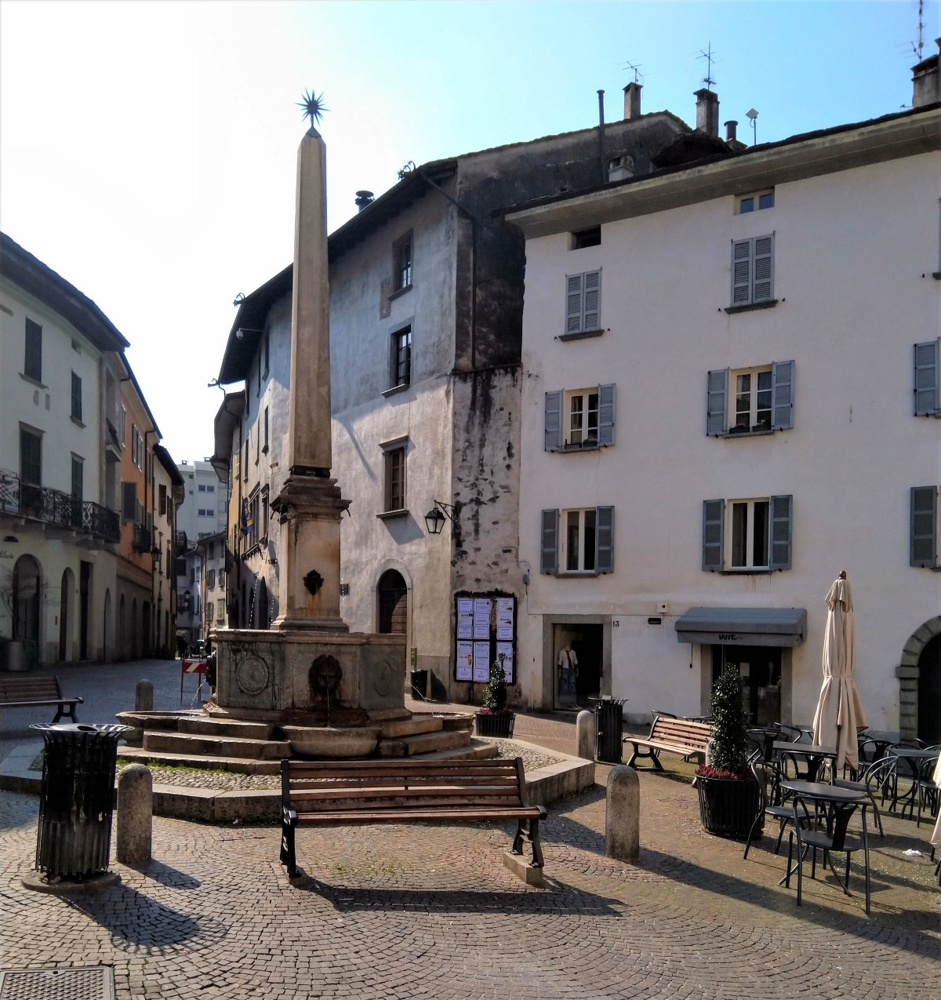

冠状病毒的爆发正在迅速发展。 要保持最新状态，请查看美国疾病控制与预防中心和您当地的卫生部门以获取最新信息。 如果您在情感上不知所措，请与“危机文本行”联系。
# 我在意大利北部被隔离。 这就是它的样子。
## 意大利COVID-19锁定装置内部的第一人称视角

> Eerily calm plaza in the northern Lombardia region. Photo by author.


在此关注Elemental对冠状病毒爆发的持续报道。

今天早上，我在我家附近的一家咖啡馆停下来。 我已经和咖啡师Stefano成为朋友。 斯特凡诺（Stefano）准备我的玛奇朵蛋糕时，他说他有一个不幸的消息。 他父亲病了一段时间，已经去世了。 由于对该地区的限制，葬礼被取消。

斯特凡诺把我的咖啡放在柜台上。 通常，在一家意大利咖啡店中，您站在酒吧里喝一小杯浓缩咖啡。 当我们继续交谈时，我喝了几口。 一个听电话的家伙，显然是一个同事，走过去，猛烈地敲打酒吧。 我违反了规则。 根据法令，所有客户都应坐在餐桌旁。 这是人们必须彼此保持一米距离的任务的一部分。 斯特凡诺说，如果一个警察开车过去，看到我在柜台喝咖啡，他可能会被罚款数千欧元。 他还报告说，市政官员一直在用扩音器开车过去，敦促所有人留在里面。

昨天，在当地的一家超市，一名穿制服的人指示所有人去买一个大购物车。 他解释说，大型手推车有助于增加人与人之间的距离。

当我准备离开时，他说：“问题出在我们的脑海。 这些限制是可怕的。”

喝咖啡后，我在医生办公室停下来开药。 医生出现时戴着蓝色的大口罩。 在农舍，药剂师还戴着口罩。

在城镇周围，许多企业都关门大吉。 肉店（肉店）和所有杂货店都开了。 餐厅已被命令在晚上关闭。 所有活动和聚会，包括婚礼，葬礼和户外运动活动，均被取消。 舞蹈室，电影院，体育馆，美术馆，所有学校，图书馆以及许多其他地方的公众聚集场所都关闭了，而经营这些场所的人则处于闲置状态。

昨天，在当地的一家超市，一名穿制服的男子在商店门口守护着旋转栅门。 他指示所有人购买大型购物车，而不要使用较小的购物车。 他解释说，大型手推车有助于增加人与人之间的距离。 已经建立了一个带塑料手套和洗手液的工作站。 与两周前不同，恐慌的初期阶段已经消退。 这家商店存货充足，购物人数似乎很正常。

几天前，在这里以北的一个小镇基亚韦纳的广场上，人们用祈祷的手和弓而不是亲吻和握手互相问候。 周围有很多人，气氛实际上似乎很喜庆。

但是，隔离所带来的后果正在显现。 许多人失去了收入来源。 我遇到了一个在语言学校工作的女士。 由于这些限制，她的工作暂停了，没有财务安全网。

限制的普遍影响是取消行程。 我和我的妻子在四次旅行中拔掉了插头。 由于紧急情况的性质，火车，飞机和住宿的大部分费用已全额退还。 我们与之交谈的几乎每个人都取消了行程。

这对旅游业来说是个坏消息。 从复活节开始，大量前往意大利的游客可能会破产。 加上现有的麻烦，例如去年冬天的威尼斯洪水和长期的高失业率，意大利很可能正处于严重衰退的边缘，并波及到许多其他国家。

我65岁，是安赞诺人或年长的人。 除了去商店或医生的必要行程外，我应该在房子里闲逛。 我不知道要监视多少。 我有一辆死在水中的汽车以及其他一些需要注意的东西。 如果天气允许，我计划骑自行车出去运动。 我有可能被阻止并送回家。

心理影响令人不安。 因为我不认识任何感染病毒的人，也没有听说过任何直接了解此案的人，所以之间存在断层。 很难确定这是否是真正的紧急情况。 感觉到大多数现行措施都相当荒谬。

也许意大利的严厉措施实际上是英勇的。

然而，前线有令人痛苦的故事。 位于米兰东北部城市贝加莫的重症监护病房医生Daniele Macchini博士写了一篇惊人的描写，描述了在医院里工作的感觉，这家医院竭尽全力为挽救患者而奋斗。

在这样的时候，我们最需要的是镇定，理性和可信赖的公职人员，我们可以依靠它们提供指导。 公职人员和新闻业通过无数的谎言，旋转，浅薄的思想，缺乏透明度和腐败来浪费他们的可信度。 这为可疑的险恶暗流创造了沃土。 也许这是让公众习惯服从命令的一次演习-使用病毒作为掩护的大规模社会控制的试点测试。 也许这是一场真正的紧急事件，其来历不解。 也许意大利的严厉措施实际上是英勇的。

无论如何，我很感谢自己的安全和生活在健康的环境中。 刚才我们能够收到大量的有机产品，因此从某种意义上说，没有什么不足（对我而言）。

我对那些失去生计的人和那些因病毒而病重的人表示敬意。 然而，不舒服的话，完全可以忍受锁定的生活。

更新，2020年3月10日，星期二：整个国家现在处于隔离状态。 离开家时，我们现在应该拥有一张通行证，称为gli spostamenti自动认证。 您要填写此表格，说明您的旅行性质。 警察在交通圈中阻止人们并对其进行讯问。
```
(本文翻译自Greg Hopkins的文章《I Am Quarantined in Northern Italy. Here’s What It’s Like.》，参考：https://elemental.medium.com/quarantined-in-northern-italy-5ce40ad458df)
```
