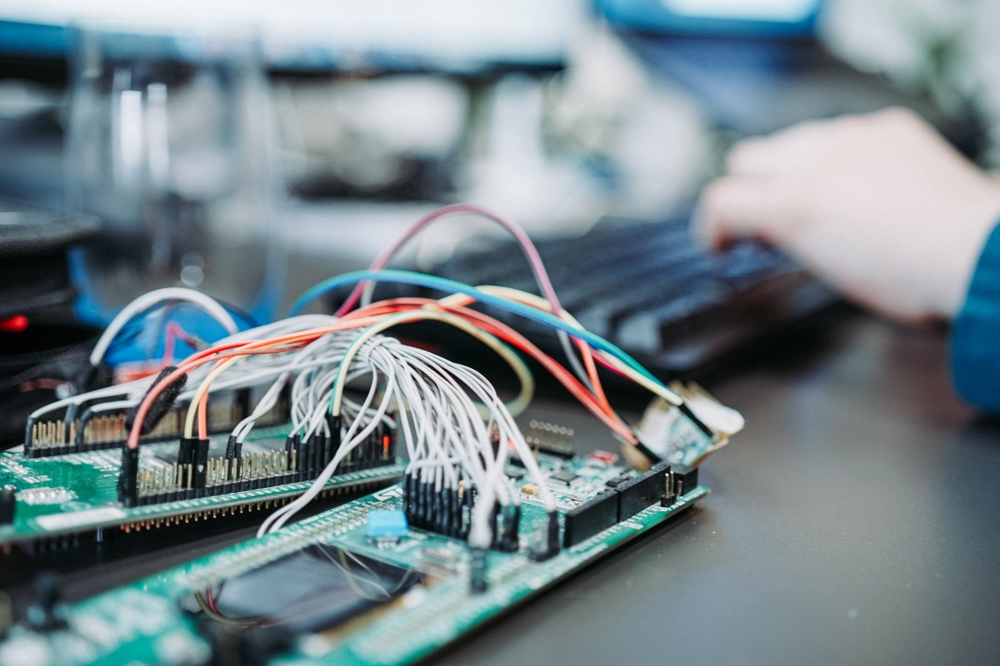
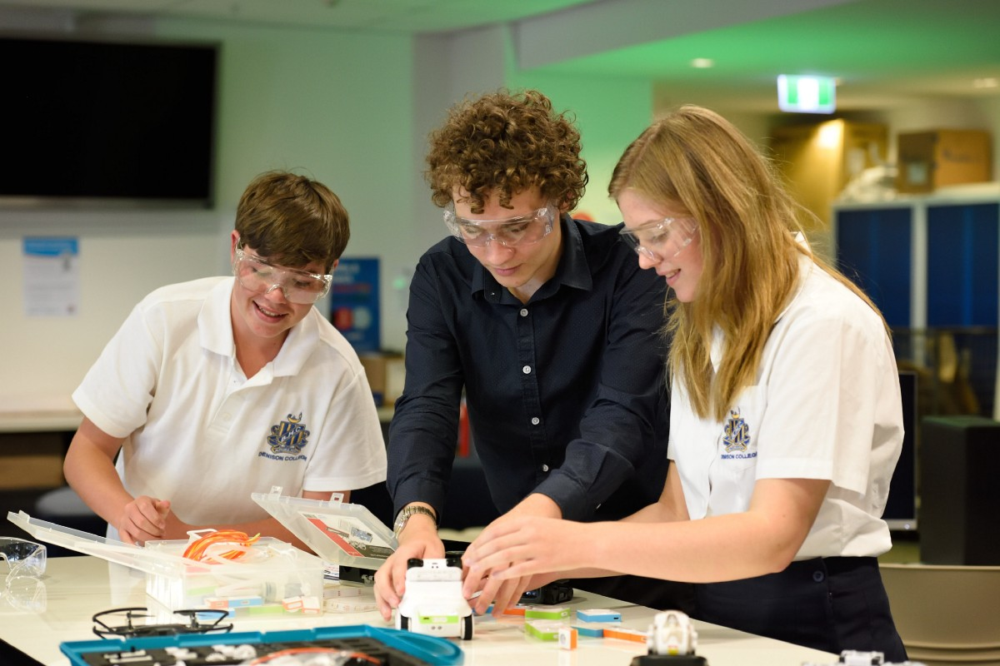
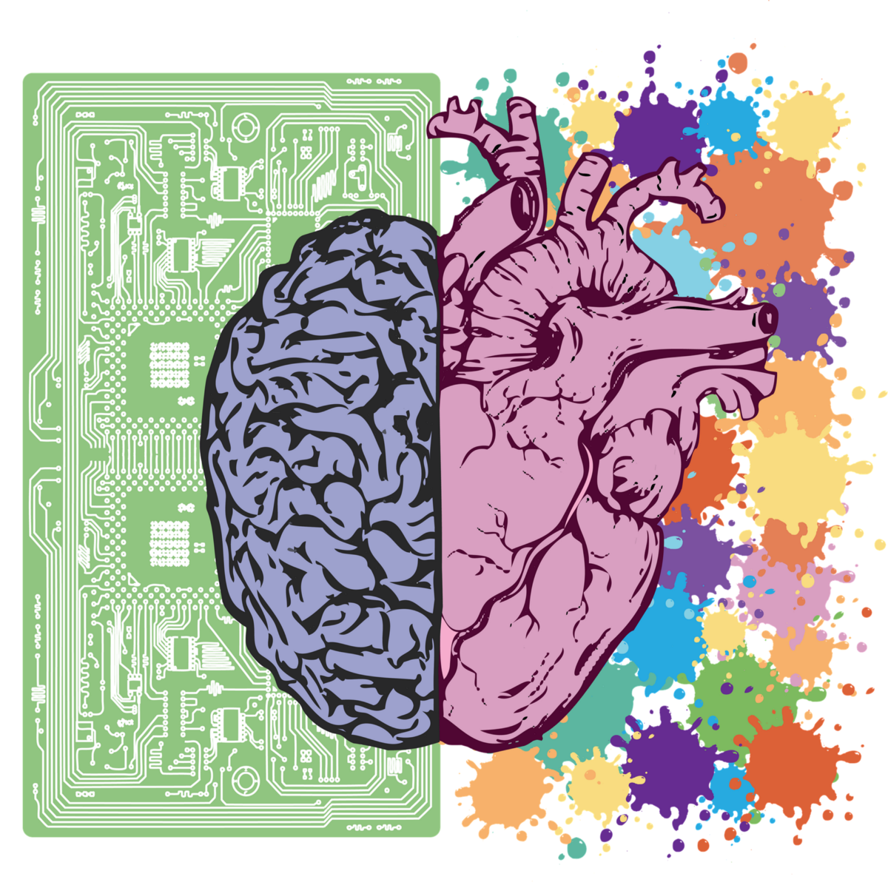

# 软件工程：2030年
## 未来十年的知识和技能投资

> Photo by Tudor Baciu on Unsplash


您在股票市场投资吗？

如果是这样，在决定如何用您的血汗钱进行投资时，您应遵循哪些原则？

你做：
+ 只看过去的表现吗？
+ 跟随您的朋友圈，并投资于相同的事物？
+ 跟随市场？ 您相信群众，其中大多数人是对的...对吗？
+ 没看到需要投资吗？ 您有足够的钱来支付当前的支出，并且您将钱存入低利率帐户中就足够了。 但是随着时间的流逝，该资本的购买力下降了呢？
+ 假设您对领域有一定了解，或者依赖可信赖的专家，那么仔细研究公司的基础知识，研究价格/股权比率，考虑未来的方向等。
+ 看一下广泛的社会，经济和工业趋势，发现有希望的领域，并找到适合这些领域的投资？

如果您有足够的资金进行投资，则可以（希望）考虑一下。

现在让我问你这个：

您是否对金钱和知识投资给予了足够的考虑？

> Photo by Jaredd Craig on Unsplash


如果您是像我这样的软件工程师，那么您就是知识工作者。 您花费时间，精力和金钱来获取知识。 您预计这些知识投资将带来红利，并增加您在市场上的价值（除了对学习带来的持续增长感到满意之外）。

回顾上面的6种主要策略，它们都同样适用于做出知识投资选择。

您的策略是什么？ 在接下来的几年中，您将要投资哪些领域？

这是我预期的一些大趋势。 强调一些内容，因为我不会说出对我来说显而易见的内容（例如，人工智能）或我个人目前不感兴趣的那些内容。
# 具有社会和环境意识的工程师的崛起

未来十年的突出挑战可能会在以下领域
+ 清洁能源技术
+ 经济赋权和社会流动
+ 平等接受优质教育
+ 不断增长的人口的食品技术，
+ 老化技术的健康

同时构建对环境影响小的产品和服务。

> Photo by Jason Blackeye on Unsplash


这将是软件工程师短暂历史上的一个独特时期，因为我们有机会从事深远而有意义的工作，并有责任在所有这些领域成为决定性力量。

影响行动：
+ 截至2019年12月，Angellist展示了250多家清洁能源技术初创公司和1400多家教育技术初创公司。 这些只是初创公司！ 您是否探讨了他们的使命和愿景？ 上面提到的其他领域呢？
+ 作为软件工程师，您是否考虑过在气候危机中可以扮演的角色？ 能源危机？ 还是为那些比您不幸的人提供了一个公平的竞争环境？
+ 您可以利用哪些不同的信息源来教育自己有关全球性问题以及某些人/组织解决该问题的方式？
# 系统程序员的需求紧张

> Photo by Zan on Unsplash


数以亿计的设备处于联机状态，而每秒又有更多的设备联机。 我们将其称为物联网（IoT）。

5G即将来临，这意味着无论现在还是将来，这些设备中的许多设备都不会被WiFi连接所限制。

这将进一步启用
+ 机器人技术（从无人机到仓库机器人的所有事物）
+ 自治系统
+ 增强现实系统
+ 数据收集和传输传感器等

我们所有人都将生活在“边缘”。 （对不起，我无法抗拒！）。

“边缘”设备的复杂性每年都在急剧增加。 我希望这会导致系统工程师和程序员的需求激增。

在供应方面，我们有很多问题：
+ 从中学到大学，至少在美国，正规计算机科学课程的入学人数似乎逐年下降。
+ 我怀疑像Python和Javascript这样的语言已成为编程课程的通用语言，越来越强调应用程序构建，而不再强调深层的计算机科学概念。

> Photo by stem.T4L on Unsplash


一线希望是，越来越多的孩子正在通过学校或编码/机器人营地接触机器人技术和硬件-软件界面。

我还要补充说，很多系统编程，特别是针对复杂应用程序（例如工业自动化，汽车和航空航天等行业）也通过“基于模型的设计”完成。 在软件中创建的高级框图会为嵌入式设备自动生成代码。

即使在这里，也必须具备对底层编程语言和硬件基础的扎实知识。

影响行动：
+ 学习系统/低级编程语言，例如C或C ++，或学习更现代的系统编程语言，例如Rust。
+ 努力建立对低级/深层计算机科学概念的认识。 您不一定需要计算机科学学位。
+ 购买Arduino，或购买Raspberry Pi。 了解软硬件接口，使一些LED点亮，然后做一些更大更凉的事情。
+ 了解基于模型的设计，并探索一些工具，这些工具使您可以对系统进行建模并从模型生成代码。

全面披露：Simulink和Stateflow之类的基于模型的设计工具非常贴心，因为我在Stateflow开发上花费了大量的职业生涯。
# 低共情时代的情商

> Image by DAMIAN NIOLET from Pixabay


我的最后建议不是技术技能，而是一系列软技能。 “软技能”一词并不公平。 我指的是情绪智力及其所代表的一切，例如出色的沟通能力，进行困难但坦率的对话的能力，展示勇气，激励他人，注意心理健康等。

所有这些技能只是“软”的，因为它们不像学习技术那样有形。 实际上，它们没有什么软弱或容易的地方。

除此之外，我们生活在一个注意力分散度低，分散感低，社会联系度低的时代。

可悲的是，情绪智力有在我们最需要的时候变得稀有的风险。

情绪智力一直是必需的，但由于十年来带来的经济正变得越来越以知识为基础，因此现在尤为重要。

奖励创新，创造力并与他人合作的经济。 与“好拥有”相反，展示情商将是一个艰难的前提。

影响行动：
+ 您真正了解自己的程度如何？ 您是否进行过类似Briggs-Meyers的性格评估测试，以大致了解您在大多数情况下的操作方式？ 您的自我意识如何？
+ 世界卫生组织说，抑郁症是全世界致残的主要原因之一。 您总体上对心理健康了解多少？ 您是否知道如何在自己或他人中发现精神健康问题的征兆？ 如果您这样做了，您知道如何进行干预吗？
```
(本文翻译自Sid Shankar的文章《Software Engineering: 2030》，参考：https://medium.com/swlh/software-engineering-2030-d81b98beb69c)
```
