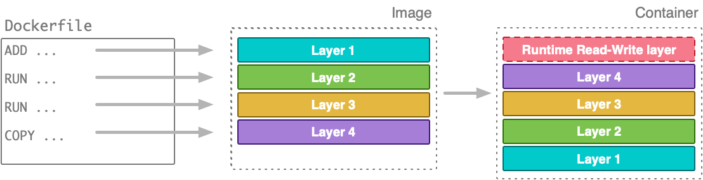
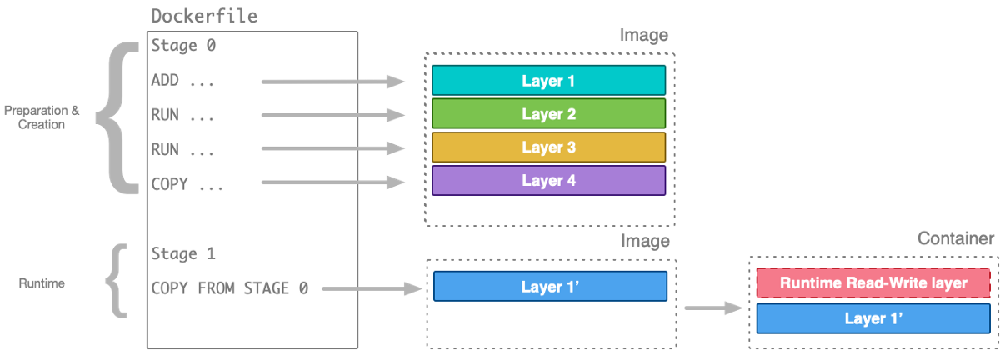
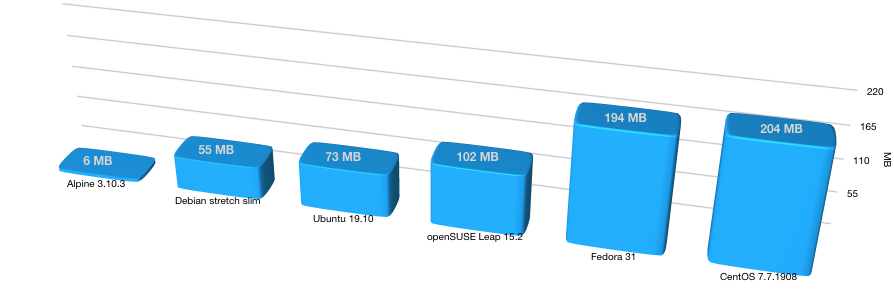
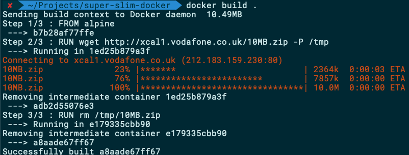
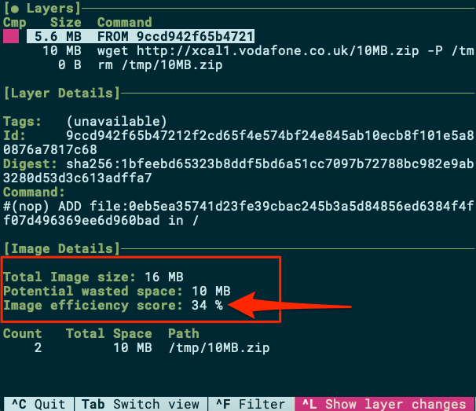
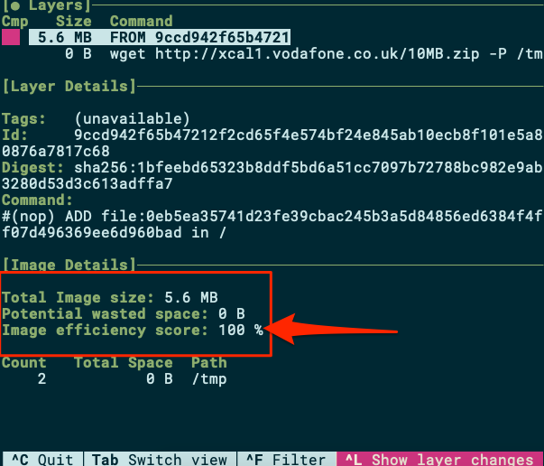
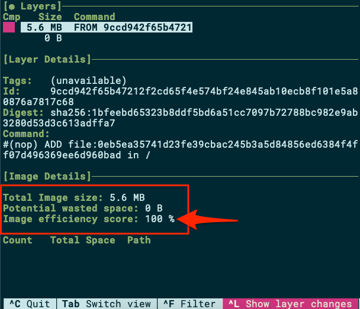
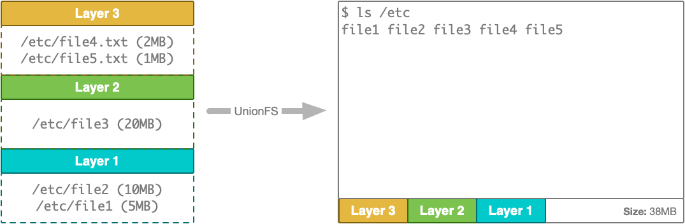
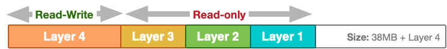
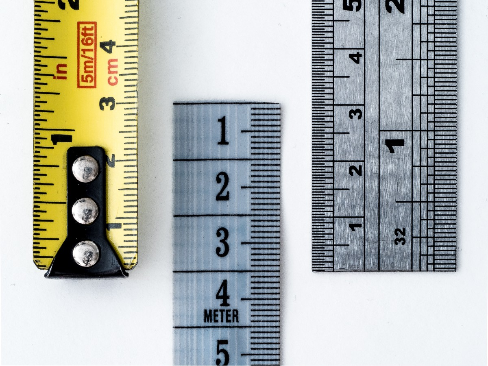

# 结论

为容器创建Docker映像是现代软件工程师必须经常处理的过程。 有大量在线资源和示例向您展示如何创建Dockerfile，但是，您应注意生成的映像的大小。

在本文中，我们回顾了一些方法和技巧，以最大程度地减少Docker映像的最终大小。 通过精心制作仅包含必要工件的Dockerfile，选择合适的基础映像并使用多阶段构建，可以大大减少Docker映像的最终大小。
# 多阶段构建

当Docker 17.05可用时，多阶段构建成为关注的焦点。 期待已久的功能，多阶段构建允许映像构建器将自定义映像构建脚本抛在后面，并将所有内容集成到众所周知的Dockerfile格式中。

用高级术语来说，您可以将多阶段构建视为将多个Dockerfile合并在一起，或者简单地将一个具有多个FROM的Dockerfile合并。

在进行多阶段构建之前，如果要构建项目的工件并使用Dockerfile将其分发到容器中，则可能必须遵循一个构建过程，最终以一个如下图所示的容器结束：

> Building and distributing your application without multi-stage builds (Image by the author)


尽管上述过程在技术上没有任何问题，但最终图像和生成的容器在构建/准备项目人工制品时创建的层上都layers肿了，这些层对于项目的运行时环境不是必需的。

多阶段构建使您可以将创建/准备阶段与运行时环境分开：

> Multi-stage builds, separation creation/preparation from runtime (image by author)


您仍然可以使用单个Dockerfile定义完整的构建工作流程。 但是，您可以将文物从一个阶段复制到另一个阶段，同时将数据丢弃在不需要的层中。

注意：多阶段构建允许您创建跨平台的可重复构建，而无需使用特定于操作系统的自定义构建脚本。 通过有选择地包括在构建的前几个阶段中生成的伪像，可以使图像的最终大小保持最小。
# 完全不选择基础图像

如果您的应用程序可以在没有基础映像提供任何其他环境的情况下运行，则可以选择完全不使用基础映像。 当然，由于FROM在Dockerfile中是强制性的，因此您仍然必须拥有它并将其指向某个内容。 在这种情况下，您应该使用什么？

从头开始，即：

“一个明显为空的图像，特别是对于构建图像“从零开始”。 在构建基础映像（例如debian和busybox）或超小型映像（仅包含一个二进制文件以及它所需要的任何内容，例如hello-world）的上下文中，此映像最有用。 从头开始是Dockerfile中的一项禁止操作，并且不会在映像中创建额外的层。”

注意：如果您的应用程序包含可以以独立方式运行的自包含可执行文件，则选择暂存基础映像可以使您尽可能减少容器的占用空间。
# 选择基本图像

每个Dockerfile都以FROM指令开头。 在此定义我们将在其上创建自己的图像的基础图像。

如Docker文档中所述：

“ FROM指令初始化一个新的构建阶段，并为后续指令设置基础映像。 因此，有效的Dockerfile必须以FROM指令开头。 该图像可以是任何有效的图像-从公共存储库中提取图像特别容易。”

显然，有很多不同的基础图像可供选择，每个基础图像都有自己的优势和功能。 当涉及到您自己的Docker映像的最终大小时，选择一个足以提供应用程序运行所需的工具和环境的映像至关重要。

正如您所期望的那样，不同的流行基本图像的大小差异很大：

> Popular Docker base images size (Image by the author)


实际上，使用Ubuntu 19.10基本映像对应用程序进行容器化将至少增加73 MB，而使用Alpine 3.10.3基本映像的完全相同的应用程序只会使大小增加6 MB。 随着Docker缓存图像层，下载/带宽损失仅在您第一次使用该图像启动容器时适用（或者简单地，在拉取图像时）。 但是，增加的大小仍然存在。

此时，您可能已经得出以下（非常合逻辑的）结论：“那么，我将永远使用Alpine！”。 如果在软件中只有那么清楚的话。

您会发现，Alpine Linux背后的家伙还没有发现Ubuntu或Debian家伙仍在寻找的特殊秘密调味料。 为了能够创建比Debian小（例如）小的数量级的Docker映像，他们必须对Alpine映像中要包含的内容和不包含的内容做出一些决定。 在选择Alpine作为默认基本映像之前，应检查它是否提供了所需的所有环境。 此外，即使Alpine随附了软件包管理器，您也可能会发现Alpine中不提供您在（例如）基于Ubuntu的开发环境中使用的特定软件包或软件包版本。 在为项目选择最合适的基础映像之前，您应该了解这些权衡并进行测试。

最后，如果您确实需要使用一个较胖的基础映像，则可以使用映像最小化工具（例如免费和开源DockerSlim）来减小最终映像的大小。

注意：在尝试减小尺寸时，为自己的图像选择适当的基础图像很重要。 评估您的选择并选择一张图像，该图像可提供您所需的工具，以确保您可以承受的尺寸。
# 删除缓存

通常，当我们将应用程序容器化时，我们需要使用软件包管理器（例如apk，yum或apt）在生成的映像上提供额外的工具，库或实用程序。

当我们通过缓存先前获取的软件包来安装软件包时，软件包管理器试图为我们节省时间和带宽。 为了使生成的Docker映像的尺寸尽可能小，我们不需要保留程序包管理器缓存。 毕竟，如果我们的容器需要其他映像，我们总是可以使用更新的Dockerfile重建映像。

要删除上述三个流行的软件包管理器的软件包管理器缓存，我们可以在聚合（即命令合并）命令的末尾添加以下命令，例如：
```
APK: ... && rm -rf /etc/apk/cacheYUM: ... && rm -rf /var/cache/yumAPT: ... && rm -rf /var/cache/apt
```

注意：在最终确定Docker映像之前，请不要忘记删除构建期间使用的所有缓存以及容器正常运行所不需要的任何其他临时文件。
# 标准化图像层

如果基础存储驱动程序支持，则图像可以具有的最大层数为127。 如果确实需要，可以增加此限制，但是随后您可以缩小构建该映像的位置的选择（即，您需要在类似修改的基础内核上运行的Docker引擎）。

正如上面有关Docker映像层的部分中所讨论的，由于UnionFS，进入层的任何文件资源都保留在该层中，即使您在后一层中管理该文件也是如此。 我们来看一个示例Dockerfile：
```
FROM alpineRUN wget http://xcal1.vodafone.co.uk/10MB.zip -P /tmpRUN rm /tmp/10MB.zip
```

构建以上图像：

> Building a sample image with wasted space (Image by the author)


并进行潜水检查：

> Image is only 34% efficient (Image by the author)


效率为34％表示图像中浪费了很多空间。 这将导致更长的图像获取时间，额外的带宽消耗和更慢的启动时间。

我们如何摆脱这个浪费的空间？
## 命令合并

您是否见过带有RUN指令非常长的Dockerfile，其中多个Shell命令与&&聚合在一起？ 命令合并。

通过合并命令，我们实际上是根据此单个long命令的结果创建了一个单独的层。 由于不存在用于添加文件并随后在另一层中删除文件的中间层，因此最后一层将不会为此类幻影文件使用任何空间。 让我们通过修改上述Dockerfile来了解这一点：
```
FROM alpineRUN wget http://xcal1.vodafone.co.uk/10MB.zip -P /tmp && rm /tmp/10MB.zip
```

现在我们有了一个优化的图像：

> A 100% optimised image with commands merge (Image by the author)


当您完成构建Dockerfile时，请检查它以查看是否可以合并命令以减少可能的浪费空间。
## 挤压图像

命令合并的另一种方法是使用Docker的squash命令构建映像，尤其是在使用您不希望或无法修改的其他Dockerfile时。

除非您使用的是非常老的Docker版本（<1.13），否则Docker允许我们将所有层压缩为一个层，从而有效地删除所有虚幻资源。 我们仍然可以将原始的，未更改的Dockerfile与许多单独的命令一起使用，但是这次我们通过--sqash选项执行构建：
```
docker build --squash .
```

再次对生成的图像进行100％优化：

> A 100% optimised image with image squash (Image by the author)


这里需要注意的有趣一点是，由于我们的Dockerfile创建了一个添加文件的层，然后创建了另一个删除该文件的层，所以squash足够聪明，以至于无需创建任何层（我们只有9ccd9…层 我们正在使用的基本图片）。 然后，额外的荣誉就可以南瓜了。 但是，请注意，挤压图层可能会阻止您或您的图像用户利用先前缓存的图层。

注意：使用您不想更改的第三方Dockerfile时，一种最小化任何可能浪费空间的快速简便方法是使用--squash构建它。 您可以使用潜水工具检查图像的最终效率。
# 提防构建路径

我们构建Docker映像的最常见方式是什么？
```
docker build .
```

的。 上面的命令告诉Docker我们将当前的工作文件夹视为构建过程的根文件系统路径。

为了更好地理解发出上述命令时实际发生的情况，我们应该记住，Docker构建是一个客户端-服务器进程。 我们从中执行docker build命令的Docker CLI（客户端）使用基础Docker引擎（服务器）来构建容器映像。 为了限制对客户端基础文件系统的访问，构建过程需要知道虚拟文件系统的根目录是什么。 正是在此确切路径下，Dockerifle中的任何命令都试图查找可能最终在正在生成的映像中结束的文件资源。

让我们考虑一下我们通常放置Dockerfile的位置。 在项目的根源中，也许吧？ 好吧，将项目根目录中的Dockerfile与Docker构建相结合，我们已经有效地添加了完整的项目文件夹作为构建的潜在文件资源。 这可能会导致在构建上下文中不必要地添加多个MB和数千个文件。 如果我们不小心在Dockerfile中定义了ADD / COPY命令，则所有这些文件都可以成为最终映像的一部分。 在大多数情况下，这不是我们所需要的，因为最终容器映像中仅应包含一些选定的项目人工制品。

始终检查是否为Docker构建提供了适当的构建路径，并且Dockerfile没有向镜像添加不必要的文件。 如果出于任何原因确实需要将项目的根目录定义为构建上下文，则可以通过.dockerignore有选择地包括/排除文件。
# Docker映像层

Docker容器映像本质上是堆积的文件，稍后将被实例化为正在运行的容器。 Docker利用联合文件系统（UnionFS）设计，其中文件按层分组在一起。 每一层可能包含一个或多个文件，并且每一层都位于上一层的顶部。 作为最终用户，我们体验了作为统一文件系统的所有层的所有内容的虚拟运行时合并：

> A simplified view of UnionFS (Image by the author)


UnionFS的底层实现向我们提供的最终文件系统视图（Docker通过可插拔存储驱动程序支持许多不同的视图）具有其所构成的所有层的总大小。 Docker为图像创建容器时，它将以只读格式使用图像的所有层，并在它们之上添加一个薄的读写层。 这个薄的读写层使我们能够实际修改正在运行的Docker容器中的文件：

> A running container adds a read-write layer on top of an image’s read-only layers. (Image by the author)


如果在上述第4层中删除了文件，会发生什么情况？ 尽管已删除的文件不会再出现在观察到的文件系统中，但是由于该文件包含在较低的只读层中，因此它最初占用的大小仍将是容器占用空间的一部分。

从一个小的应用程序二进制文件开始到以一个胖容器图像结束是相对容易的。 在以下各节中，我们将探索不同的方法来使图像的尺寸尽可能地薄。
# 超薄Docker容器
## 减少Docker映像大小的指南

> Photo by William Warby on Unsplash


您是否曾经想过为什么您的单应用程序Docker容器会增长到400 MB？ 或者，也许为什么一个只有几十MB的应用程序二进制文件会生成一个MB的Docker映像？

在本文中，我们将回顾一些导致容器变胖的主要因素，以及为您的项目提供超薄Docker容器的最佳实践和技巧。
```
(本文翻译自Nassos Michas的文章《Super-Slim Docker Containers》，参考：https://medium.com/better-programming/super-slim-docker-containers-fdaddc47e560)
```
