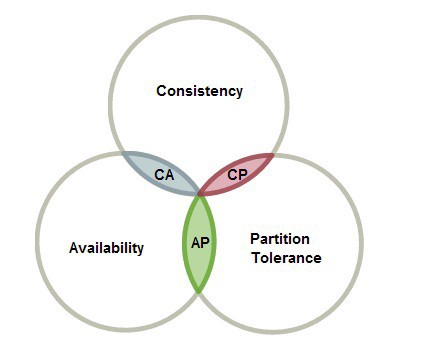
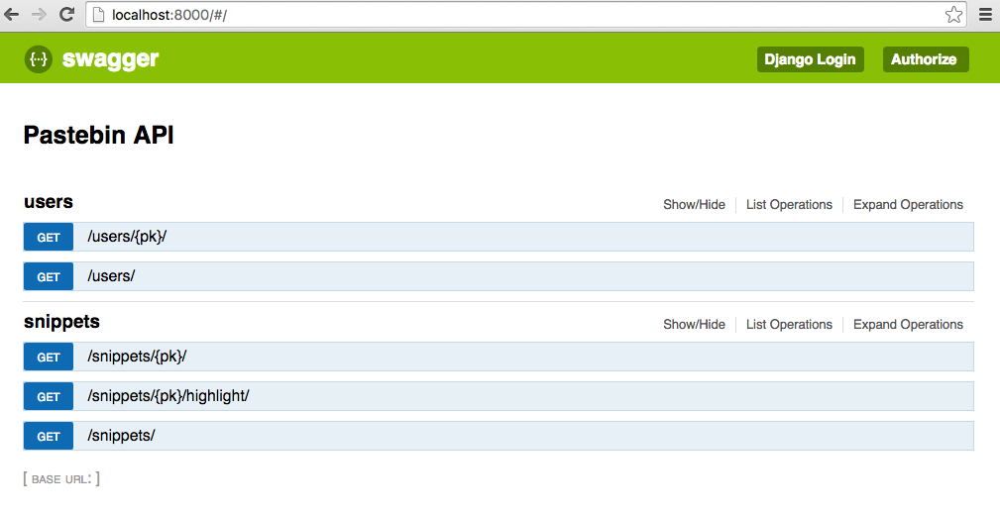
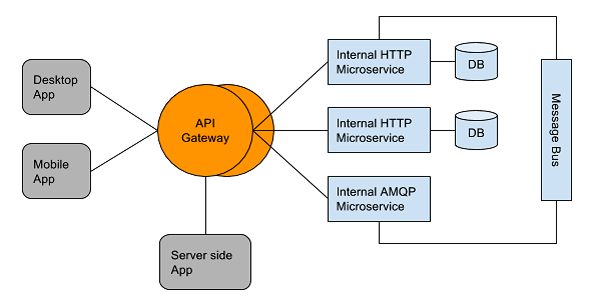
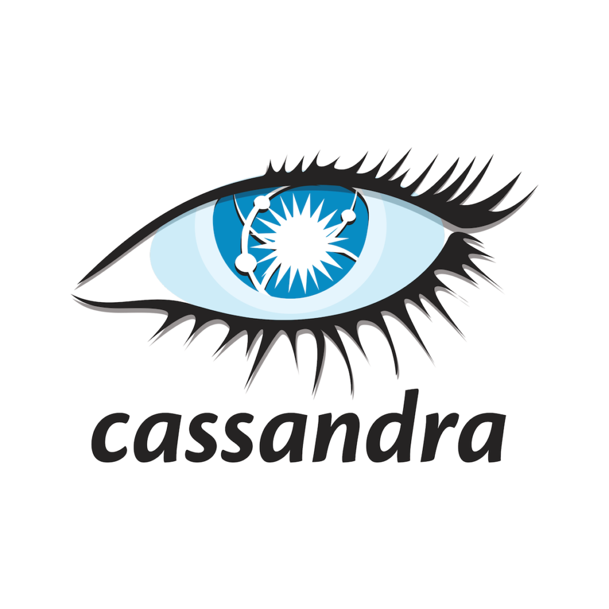
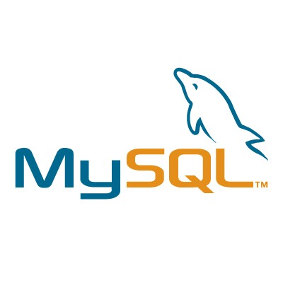

建立系统设计方面的专业知识需要大量时间，经验和精力。 您可以参考有趣的Tech Blog，其中公司很好地阐明了他们解决难题的方式。

此外，您可以尝试解决尽可能多的设计问题。 LeetCode和Carrer cup等论坛将帮助您与志趣相投的工程师建立联系，甚至可能遇到不同的思考过程。

综上所述，通过结构化的方法和对分布式系统基础知识的清晰了解以及足够的实践，人们可以轻松地在任何技术公司进行系统设计面试。
# 参考文献
+ 系统设计入门
+ Educative.io —进行系统设计面试
+ 面试位-系统设计课程
+ 昂首阔步的形象
+ API网关和负载平衡器
# 系统设计访谈101
## 在Tech Company进行系统设计面试的技巧。

> What whiteboard interviews look like?


大多数科技公司在其面试过程中都会进行系统设计。 通常要求候选人设计一个可扩展的系统，例如Facebook NewsFeed，Instagram故事，WhatsApp聊天，CI / CD系统等。

Internet上有很多资源可供系统设计采访准备。 任何开发人员都无法消化过多的资源。 但是，在技术公司提出的问题中观察到了常见的模式。 对系统设计概念和基本原理具有清晰的想法，可以帮助任何候选人创造出鲜艳的色彩。

在本文中，我将详细阐述一种系统和有组织的策略，以帮助任何人清除采访。 在此过程中，我还将说明所提出的各种问题以及解决这些问题的方法。
# 为什么进行系统设计面试？

如今，大多数科技公司都投资建设可扩展的高性能系统。 因此，工程师必须具备出色的设计技能。

系统设计面试刻意是开放性的并且模棱两可。 它使面试官有机会评估不同维度的候选人。 除了设计技巧，它还有助于面试官判断候选人的整体思维过程，思维，算法知识和沟通技巧。
# 高层次策略

我在系统设计面试中遵循以下五步方法：-
+ 要求和澄清问题
+ 容量估算
+ 设计目标
+ API设计与算法
+ 数据库，缓存设计和分片

我们将详细介绍上述每个步骤。
# 要求和澄清问题

当出现诸如为Uber设计后端系统之类的问题时，我们想到了成千上万的功能。 实际上，诸如Uber，Facebook等系统是经过多年的工程努力和严格发展而成的。 在45至60分钟内设计大型系统并不是一件容易的事。

由于时间有限，我们无法设计大型系统的所有功能，因此缩小问题范围至关重要。 需求可以分为功能需求和非功能需求。 您可以想到在采访期间可以在白板或一张纸上设计的所有简单功能。

> Uber


例如：对于Uber的设计后端，您可以在范围内列出以下要求：
+ 车手必须能够预订和取消乘车
+ 系统必须将Rider与驾驶员匹配
+ 驾驶员可以取消指定的乘车
+ 乘车后驾驶员和乘员都可以互相评价
+ 车手可以使用多种付款方式向驾驶员付款

此外，必须提出明确的问题。 您需要了解谁是系统的用户，他们将如何与系统交互，使用模式将是什么样。 这些问题将帮助您确定瓶颈，消除冗余并扩展整个系统。
# 容量估算

在阐明系统要求时，必须问的下一个问题是多少用户将使用我们的系统？ 这是一个重要的问题，因为它将在以后帮助解决许多设计瓶颈。

活跃用户的粗略想法可以帮助您估计系统将收到多少个请求，还可以计算所需的数据存储量。 此外，您可以了解系统是重读系统还是写重系统。 这将影响您对数据存储的选择（SQL Vs NoSQL）以及应用程序中对缓存层的需求。

> Twitter


假设您正在设计类似Twitter的系统。 在这种情况下，您可以进行以下估算：
+ 2亿活跃用户每天600百万条推文
+ 每个用户平均拥有100位关注者
+ 一条推文平均转发了至少10次
+ 每10条推文分享1个媒体文件的人

在计算估算值时，您将清楚了解水平扩展的程度或系统所需的服务器数量。 此外，对需要存储的数据量进行粗略估计将有助于您相应地计划数据库服务器。
# 设计目标

任何系统的主要要求之一是延迟和吞吐量。 延迟是处理客户端给定请求所花费的时间。 吞吐量是指在给定时间间隔内可以处理的请求数。

对于高性能系统，至关重要的是最小延迟和最大吞吐量。 如果您要设计一个购物网站，而该网站的加载时间很长，则会导致糟糕的用户体验。 此外，在黑色星期五的销售日，系统性能不会因负载增加而降低。

第二个设计目标是在可用性和一致性之间进行选择。 根据CAP定理，您可以使用CP或AP系统来容忍网络故障。 可用性和一致性之间的选择受设计的系统类型影响。

> CAP theorem


如果您拥有直接处理用户资金的银行系统，则一致性至关重要。 而如果您正在设计Facebook Feed，则可以错过页面或朋友的状态更新。
# API设计与算法

对于问题范围内的每一项要求，有必要草拟后端系统将要公开的基本API。 候选人可以提及请求，响应，状态代码，要使用的HTTP方法等。根据问题，可以讨论是否使用REST，GraphQL或GRPC进行API设计。

> API Design


您可以进一步移动以绘制将在系统中使用的高级组件。 最好从面向客户端的组件开始，例如API网关，负载均衡器。 您可以讨论在负载均衡器中可以使用哪种策略在应用程序服务器之间平均分配负载。

> API Gateway & Load Balancer


如果要求您设计诸如Youtube，Netflix或Instagram之类的系统，那么您也可以谈论CDN（内容交付网络），它有助于提供静态图像或视频文件。

对于每个API，您都需要查看是否需要在服务器端实施一种算法，或者它是否是普通的CRUD API。 例如：-设计Twitter时，要获取新闻提要，您需要提出一个新闻提要算法。 如果一个用户关注另一个用户，它将是普通的CRUD API。
# 数据库，缓存设计和分片

容量估算将使您了解系统需要处理多少数据。 此外，您应该对参与数据建模的实体及其之间的关系有一个清晰的了解。 您需要确定数据是结构化的还是非结构化的，以及是否需要架构灵活性。 上述问题的答案将影响您选择使用SQL还是NoSQL数据库。


> Cassandra / MySQL


大多数系统是重载系统。 因此，您可以根据访问模式在一个列或一组列上创建索引，从而加快所有数据库读取查询的速度。 您可以具有主从结构，在主从结构上执行写操作，而从从属结构执行读操作。 这样可以将读操作与写操作隔离开，从而提高系统性能。

从数据库中读取会导致IO操作，这在执行时会消耗大量计算资源。 您可以在应用程序和数据库之间添加缓存层，以最小化磁盘IO。 这将进一步提高系统的性能。

添加高速缓存时，您将需要在高速缓存逐出策略之间以及高速缓存模式（如直写，回写，预留高速缓存等）之间进行选择。

> Redis


如果要为数百万个用户设计系统，则数据将无法容纳在单个数据库服务器上。 因此，在多个数据库服务器之间分配数据非常重要。 这称为数据分区。 采访者可能会问您有关可用于分发数据的不同数据分区策略的问题，并讨论了使用每种策略的取舍。
```
(本文翻译自Animesh Gaitonde的文章《System Design Interviews 101》，参考：https://medium.com/@animeshgaitonde/system-design-interviews-101-979eb8d6f23b)
```
