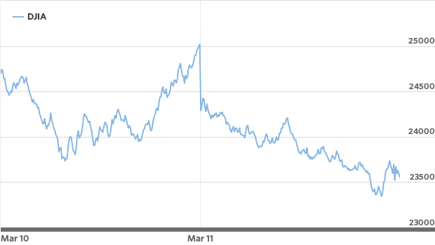

# 日冕地图：可视化大流行

> thecoronamap.com


世纪大流行的新型冠状病毒已在世界范围内引起歇斯底里。 股市见证了自2008年危机以来最糟糕的一天，而油价则创下了29年来的最大跌幅。

> Dow chart


> Oil Prices


首先，让我们了解什么是新的冠状病毒或COVID-19。 Corona不是单个病毒，而是导致流感等疾病的病毒家族。这是该家族的最新发现，被称为新型Corona病毒或COVID-19。

那么，这种新的冠状病毒与似乎没有受到太大伤害的旧冠状病毒有何不同？ 好吧，主要的问题是它是新的，我们还没有足够的研究和/或药物来治疗这种情况。 该病毒的另一个问题是它具有高度传染性。

大约有97％的受害者幸存下来，但免疫系统较弱的人无法抵抗它，我们还没有杀死这种病毒的药物。

科学家和研究人员正在研究它，很快我们将为此提供疫苗和治疗。 全世界的政府和私人机构都在努力减轻灾难并控制病毒。
# GIS如何提供帮助？

“ GIS提供了出色的手段来可视化和分析流行病学数据，揭示趋势，依存关系和相互关系。”

为了应对灾难，我们需要有关灾难的数据，在当今的数据分析时代以及我们现在可以使用的工具中，可以做很多事情。 在这方面，约翰霍普金斯大学CSSE做得很好。 他们一直在收集数据并将其每天发布到其存储库中。 他们还创建了一个显示当前信息的门户。


上面的门户网站在提供最新信息方面做得很好，但是缺少地图上提供的数据集中存在的历史信息。 他们确实在图表中提供了历史数据，但在地图上却没有。

我们在做什么？

我相信，可视化与此太空大流行有关的历史数据将为研究人员以及任何想研究更多有关COVID-19的人增加价值。 因此，我和我的朋友决定建立一个小工具：Corona Map。

这是我们为那些对研究疾病如何传播及其在全球的状况感兴趣的人们所开发的免费而简约的工具。 对于旅行者，医生，研究人员，非政府组织，政府以及任何想要研究和/或了解这种疾病影响的现状的人来说，这可能是有益的。

到目前为止，我们仅对其进行了一周的工作，并且我们计划在将来向其中添加更多数据层，并将继续每天更新当前数据。 现在，它在地图上显示每天的全局统计信息，以及自报告第一个病例以来每个国家/地区每天的统计信息。

> Calendar at the bottom right allows you to check the status of Corona on any date


> Stats of Coronavirus in China until March 09, 2020


我们正在寻找更多的数据来源，并将添加它们以使其对研究人员更加有用。 如果您想尽自己的一份努力，并且希望分享可以真正帮助研究人员和组织抗击该疾病的数据或想法，请与我们联系，以便我们使《电晕地图》对他们更有帮助。

我是拉米兹·萨米（Ramiz Sami）。 我爬山，举起重物，并建立WebGIS解决方案。 随时在Linkedin上与我联系。
```
(本文翻译自Ramiz Sami的文章《The Corona Map: Visualizing the Pandemic》，参考：https://towardsdatascience.com/the-corona-map-visualizing-the-pandemic-fc436f175dff)
```
