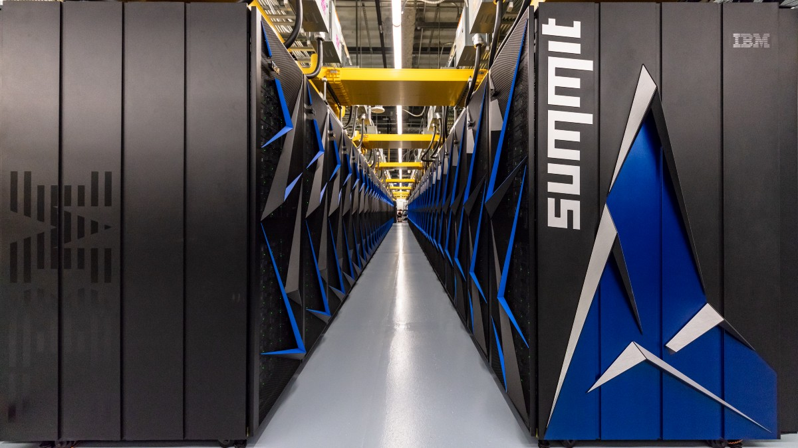
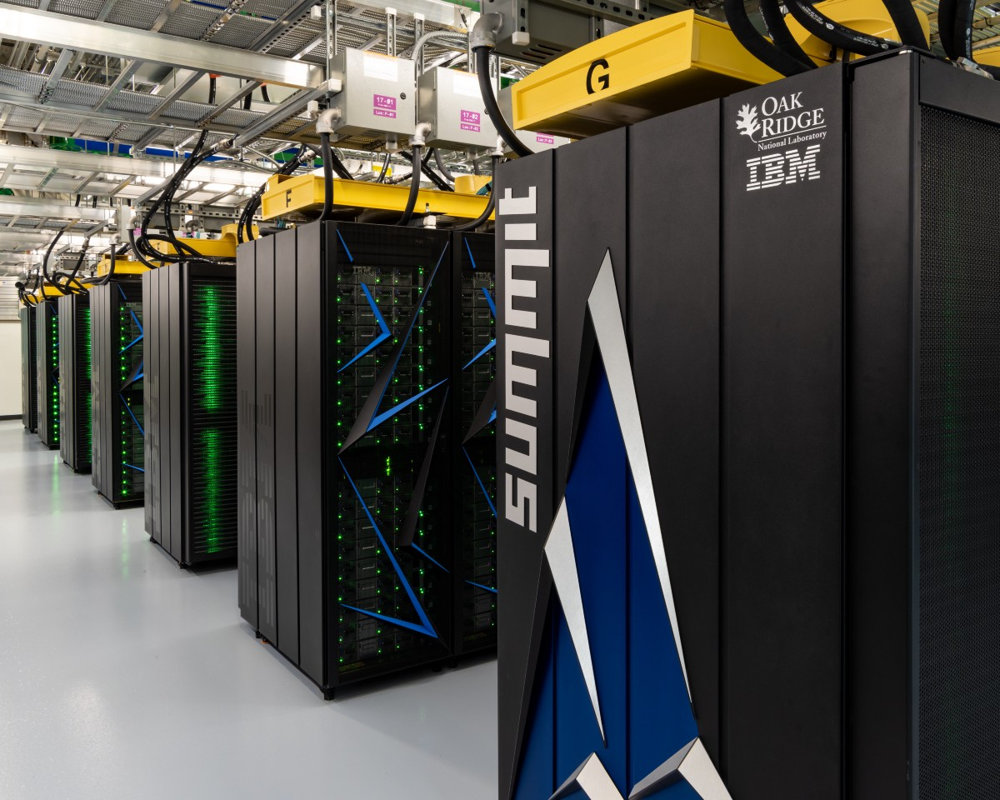

# 世界上功能最强大的超级计算机已开始抗击冠状病毒
## IBM建造的Summit找出了Covid-19的有希望的药物清单

> Photos: Oak Ridge National Lab


随着Covid-19使世界各地的人患病，科学家们急于寻找可以帮助患者早日康复的药物。 从未见过的病原体会导致严重的呼吸道症状，包括呼吸困难和胸痛。

为了帮助进行搜索，科学家们邀请了世界上功能最强大的超级计算机，即IBM制造的Summit。 此次峰会占用了田纳西州美国能源部橡树岭国家实验室两个网球场的占地面积，每秒可进行200次四千万次计算，这比普通笔记本电脑的计算能力高出一百万倍。

上个月，研究人员使用它筛选了8,000种已知药物化合物的库，以发现最有可能有效对抗冠状病毒的化合物。 这些化合物包括化学物质，草药和天然产物，这些物质或者已经在人体中进行了研究，或者已经被批准为药物，而且重要的是，已经被认为对人体安全。 Summit在短短两天内将数据集缩小到77个简短列表。 使用常规计算机，该过程将花费数月。

田纳西大学的分子生物物理学家杰里米·史密斯（Jeremy Smith）对OneZero表示：“逻辑上，如果这些化合物中的任何一种起作用，它应该比典型的药物开发过程要快得多，才能获得批准和广泛使用。” 他和他的同事在2月份将他们的发现发布到了预印本服务器ChemRxiv，并且随着他们进行更多的计算而对论文进行了更新。


如果这些化合物中的任何一种对动物有效，那么科学家可以跳过对人的最初安全性试验，而直接对患者的病情进行药物测试。

开发药物是一个众所周知的漫长的过程-从发现新药到上市，可能需要10年的时间，而且许多药物由于不安全或无效而失败。 这就是为什么像Summit之类的超级计算机在全球范围内没有已知治疗方法的传染病爆发时特别有用的原因。

为了进行模拟，史密斯使用了该病毒的基因组，该基因组是中国研究人员在一月份发布到网络上的。 数据显示，该病毒现称为SARS-CoV-2，与冠状病毒相似，后者可导致严重的急性呼吸道综合症或SARS，并以类似的方式感染人体。 利用这些知识，他们对Summit进行了编程，以搜索非常特定类型的化合物。

冠状病毒的名字源于其表面上的冠状蛋白，它使病毒结合并感染人细胞。 研究人员利用Summit查明了能够与这些蛋白质峰结合的药物，以阻止病毒进入人体细胞的能力。

“我不知道它们中的任何一个是否会起作用。 也许数据库中没有任何化合物会起作用，或者可能会有几种化合物。”

这些尖峰不断地产生许多微小的变化，这使过程变得复杂。 研究人员必须弄清楚如何为这些运动建模，以帮助找到可以对抗它们的药物。 IBM Exascale系统副总裁David Turek告诉OneZero：“这是一个复杂的数学问题。” （百亿计算是指每秒进行十亿亿次计算的能力。）

超级计算机可以使用机器学习算法非常快速地完成此任务。 使用4,608个节点（相当于相同数量的笔记本电脑的等效计算能力）会遇到问题，将其切成碎片，将它们分配给所有单独的节点或计算机，然后将所有这些碎片重新组合在一起，以构成解决方案。 问题。 它类似于蜂箱，其中约有一百种不同的无人机为了一个共同的目标而协同工作，但每个人都有自己的任务。 此功能使研究人员能够执行难以置信的复杂任务，例如药物发现。

undefined

史密斯说：“我不知道它们是否会起作用。” “也许数据库中没有化合物会起作用，或者可能会有几种化合物。”

史密斯认为，在未来爆发新的和无法治愈的疾病时，史密斯认为可以使用世界各地的500台左右的超级计算机来协调这些类型的药物发现模拟，以便科学家可以迅速开始药物测试。 他说：“我们可以准备使用科学工具，以便我们可以尽快以正确的科学做出回应。”

有关新型冠状病毒和Covid-19的更多信息，请访问cdc.gov。
```
(本文翻译自Emily Mullin的文章《The World’s Most Powerful Supercomputer Has Entered the Fight Against Coronavirus》，参考：https://onezero.medium.com/the-worlds-most-powerful-supercomputer-has-entered-the-fight-against-coronavirus-3e98c4d67459)
```
