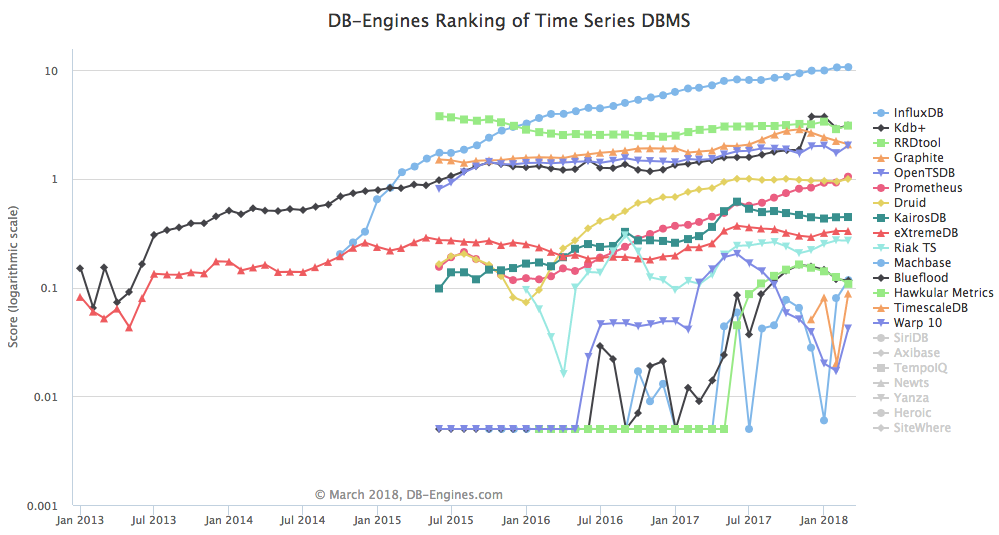

# 时间序列数据库正在发展！

庆祝新的一年时，通常习惯照镜子。 专门的DB-Engines网站在今年早些时候进行了培训，并选举PostgreSQL为2017年RDBMS。当之无愧的Postgre！

DB-Engines会尝试对每个数据库（无论其用例或模型）进行排名，因此关系数据库在排名中居于首位也就不足为奇了。 有许多数据库可以解决不同的用例：
+ 关系数据库（PostgreSQL，MariaDB）
+ 文档存储（MongoDB，CouchDB）
+ 键/值存储（Redis，RocksDB）
+ 列存储（HBase，Cassandra）
+ 搜索引擎（Solr，Elasticsearch）
+ 图DBMS（Neo4J，JanusGraph）
+ 时间序列DBMS（Prometheus，Influxdb）
+ 和别的…

在上一篇DB-Engines帖子中，还有趣的是，时间序列DBMS连续第二年获得了最强劲的增长，排名第二。
# 时间序列数据库的分数提高了约70％

在所有类型的数据库中，时间序列是增长最快的类别。 自2015年中以来，这一类别已被确定为一种趋势，并且自2016年初以来就开始炫耀。


时间序列虽然是最流行的趋势，但对时间序列的兴趣还很年轻，但采用率却没有与关系数据库或其他数据库相同，但这只是每个开发人员堆栈都包含指标解决方案的时间。 无论如何，“时间序列数据库”领域目前正在蓬勃发展，其中包括新的解决方案，项目，贡献和工具。 在OVH，我们通过参与Noderig，Beamium，Warp10，Grafana插件等项目来参与这项工作。

但是，为什么要关心时间序列？
# 衡量就是做出更好的决定

时间序列用于跟踪随时间的变化。 它还提供了一种通过测量事物来表达感觉的事实方法。

“如果有数据，我们来看一下数据。 如果我们只有意见，那就和我一起去吧。”

Netscape前首席执行官Jim Barksdale

我认为这句话清楚地表达了采用时间序列的思想：衡量。

要合成Coda Hale演示文稿，请进行以下测量：
+ 无需在开发人员代码中添加任何内容
+ 帮助您了解代码在生产中的运行方式，以及您的业务
+ 改善您关于业务的思维模式
+ 优化您的思维方式
+ 帮助做出更好的决定

修复代码是业务驱动的决策。 服务器运行良好是业务驱动的决定。 开发功能是业务驱动的决策。 测量应用程序代码和基础架构，可以帮助您了解您的业务，并基于可衡量的KPI来打开数据驱动的业务，最后，KPI可以为您的业务做出更好的决策。

自2010年代初以来发生了什么变化，因此形势发生了重大变化？
# 越来越受欢迎！

如DB-Engines列出的，许多数据实际上是时间序列数据。 快速概述，例如：
+ 传感器测量（水冷却，存在等）
+ 监视数据（CPU，内存，磁盘等）
+ 股票交易所（欧元，美元，比特币）
+ 资源消耗（燃料，…）
+ 事件，统计信息，信号（花费的时间，...）
+ 物联网数据（停车人数，能源网格等）
+ 健康（心率，...）
+ 和许多其他数据，基本上任何可以可视化为图表的数据

在所有这些领域中，收集数据在资源优化，跟踪，预测，商业智能等方面都带来许多好处。

自2010年代初以来，发生了很多事情。 First Graphite自2008年成立以来就已经成熟。到那时，许多时间序列用例都在传统数据库（如MySQL或PostgresSQL）中实现，但随着数据量的快速增长，这些数据库无法处理此类工作量。 OpenTSDB已于2010年发布，对Graphite及其平面数据模型进行了重大改进。 OpenTSDB是基于HBase的，它推了许多限制。 从那里开始，开始实施新的用例，主要用于监视目的，但其他项目也已推入适当的时间序列模型。 然后，其他项目进入了游戏，例如KairosDB，InfluxDB，Prometheus和Riak TS等。 如今，现代时间序列平台结合了更多功能，而不仅仅是绘制图表，其中一些功能已成为真正的分析平台，例如Warp10。
# 时间序列DBMS流行趋势

市场上有许多解决方案可以满足不同的标准，选择正确的解决方案可能会具有挑战性：
+ 发行：开源，开放核心，专有
+ 源语言：Java，Golang，Python，Erlang等
+ 多功能性：分布式，独立，嵌入式
+ 数据模型：现代，平面，公制/标签，文本
+ 数据存储：全分辨率与固定数据库
+ 支持的数据类型：整数，浮点数，布尔值，字符串
+ 查询模型：交互式，作业，MapReduce
+ 分析：服务器端功能，SDK，自定义


趋势很重要，但不是唯一标准，衡量生态系统也很有趣。 生态系统包括诸如图书馆合规性，贡献，被其他项目采用，协议兼容性和可用性，项目路线图等方面。

在OVH Metrics中，我们已经对许多时间序列数据库进行了广泛的测试并与之合作，在这些帖子中，我们希望对您对其中的一些感觉提供快速反馈：
## InfluxDB

根据DB-Engines的报告，InfluxDB是“时间序列数据库”领域的当前领导者。 这个领先地位很容易解释：自2014年底以来，InfluxDB就在这里，其Open Core模型，单一二进制分发版本和周到的社区方法极大地帮助了他们，尤其是在小型项目中。

多年来，InfluxDB一直在不断改进，不断地重建其存储层以解决许多早期问题。 两个主要问题仍然限制了它对大型项目的实用性：Kapacitor的性能不佳，用于运行连续查询的组件（我们将其称为OVH Metrics的Loops）以及使用身份验证时的缓慢性。

最初，InfluxDB提出了一种类似SQL的查询语法，在处理时间序列模型时，我们认为这不是最好的语法。 最近，Influx发布了一种有趣的语言，它可以将简单的查询和数据流结合在一起：IFQL。 对于在大型项目中使用IFQL及其相关挑战，我们还没有任何反馈。
## 石墨

作为“时间序列”数据库领域中的老大，由于较年轻的工具以更新颖的方式提出了更多功能，因此Graphite失去了一定的知名度。 Graphite提供了相当完整的功能集来操作数据集，即使其原始数据模型相当局限，也使用扁平的点分隔度量标准命名。 这种命名策略使构建复杂的查询变得更加困难，因为要使用正则表达式来匹配所需的选择，但当时还不错，并且为小批量提供了许多功能。

几年来，该项目缓慢下降，没有任何重大进展。 但是在过去的几个月中，Graphite受到了新的关注，其新功能包括使用标签存储数据以及加入其他现代数据模型。
## OpenTSDB

受Borgmon（Google内部监控工具）的启发，OpenTSDB是第一个提出现代数据模型的开源时间序列数据库：每个时间序列均由度量标准名称和标签列表定义。

可伸缩性是OpenTSDB的主要租户之一，它使用HBase作为存储引擎。 这意味着要使用它，您需要使用HBase安装和管理Hadoop集群，因此部署起来并不容易。 在切换到OVH指标之前，OpenTSDB在OVH中得到了广泛使用。
## 普罗米修斯

Prometheus是Borgmon的模仿者，也是InfluxDB的主要挑战者之一。 如果他们的当前趋势继续下去，普罗米修斯格式可以在可预见的将来发展成为事实上的监控标准。 从纯粹的内存时间序列数据库演变而来，Prometheus添加了一个存储层，可以用作持久性存储。 它仍然无法作为分布式解决方案使用，因此既无法扩展以适应高工作负载，也无法提供高可用性。

与以前的解决方案相比，Prometheus更加面向分析，它使用一种查询语言PromQL。 尽管PromQL比OpenTSDB更完整，但它仍然缺少用作分析时间序列平台的许多功能。 在Google内部，由于Borgmon的语言语法以及它不是服务的事实，许多人不喜欢Borgmon，每个团队都需要部署和管理自己的Borgmon。 不幸的是，作为Borgmon克隆的Prometheus也存在相同的缺陷。 值得一提的是，自那时以来，Google已切换到Monarch，这是@OvhMetrics之类的指标服务。

在OVH，我们通过提供自定义导出器与Prometheus生态系统集成，并开发了Beamium刮板，该刮板提出了指标推送（而不是拉取）和细粒度身份验证的功能，并在出现网络问题时提供了DFO（磁盘故障转移）。
## 经线10

Warp 10像OpenTSDB一样起源于Borgmon，但除了其API外，它还提供了一个称为WarpScript的丰富数据处理框架，其中包含数百个功能。 从这个角度来看，它是Graphite及其大型图书馆的唯一挑战者。

Warp 10支持多个存储引擎，其中一个独立版本存储在LevelDB上，而一个分布式版本则依赖于OpenBase等HBase。 它的数据模型比OpenTSDB更为灵活，Warp 10解决了我们在OpenTSDB中观察到的非常大的数据集的可伸缩性问题。

Warp10拥有一个新兴的社区，即使在用户体验方面仍然落后一些，我们今天仍将其视为用于大规模操作时间序列的最成熟的开源技术。 作为我们选择的技术之一，我们正在为项目提供工具（游览，锻造）以增强用户体验。
# OVH指标

在Metrics，我们认为每种解决方案都具有不同的价值，因此决定最适合您的不是我们的职责。 对于给定的需求，您可能对OpenTSDB或PromQL查询的简单性感兴趣，而对于另一个需求，对于高级分析用例，可能需要WarpScript。 这就是为什么我们认为我们的平台在Query层上是不可知的，并且我们已经实施了其中的一些以满足客户的需求。 目前，我们支持：
+ InfluxDB
+ 石墨
+ OpenTSDB
+ PromQL /普罗米修斯
+ WarpScript / Warp10

不可知论，您可以使用协议推送指标，并通过另一协议查询相同指标。 或使用两种不同的协议两次查询相同的指标。 这样，就没有供应商锁定。


在时间序列数据库上工作非常艰巨，充满挑战：
+ 写与读模式
+ 处理大量基数问题
+ 处理短暂时间序列
+ 存储数据模型设计与通用查询模式
+ 结合实时和分析工作负载

我们还将发布其他帖子，介绍我们如何应对这些挑战。
# 如何从时间序列开始？

如果您确信需要使用时间序列解决方案，那么以下是快速入门的第一步：
+ 识别您的时间序列数据或业务KPI
+ 检测您的应用程序以暴露这些KPI
+ 选择诸如OVH Metrics之类的托管服务，或者从自营的开源解决方案开始
+ （可选）使用Noderig或收集器（node-exporter，telegraf，scollector等）获取基础结构指标
+ （可选）设置Beamium，以抓取您的应用和/或基础架构指标
+ 设置仪表板以根据收集的指标可视化您的KPI
+ 您现在可以关联应用程序和基础架构

现在，您应该对业务问题有了更好的了解。

在Twitter上关注我们：@OvhMetrics。 您想与我们一起应对此类挑战吗？ 在推特上给我们发信:)
```
(本文翻译自Steven Le Roux的文章《Time Series DB are getting momentum!》，参考：https://medium.com/ovh-metrics/time-series-db-are-getting-momentum-d0fdda9a47c4)
```
