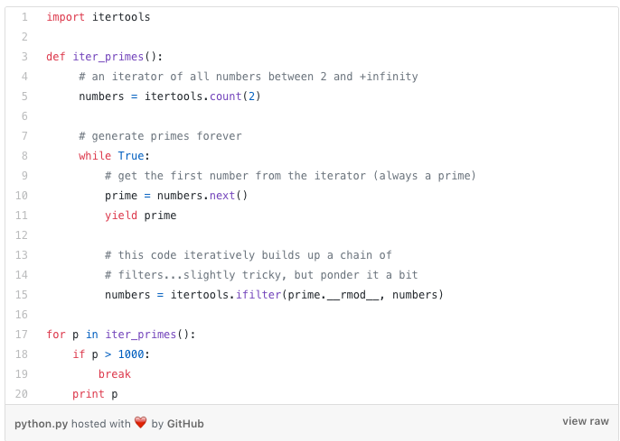
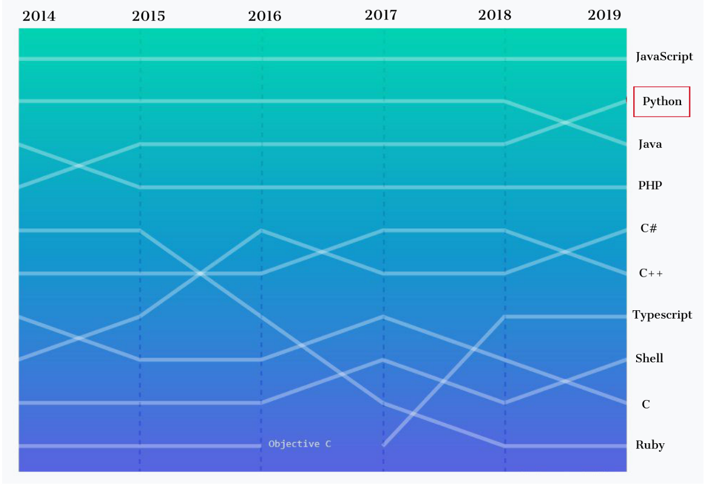
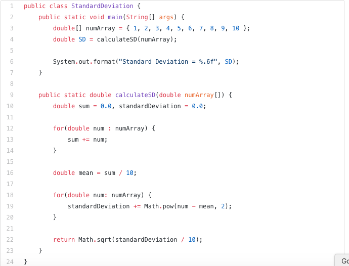
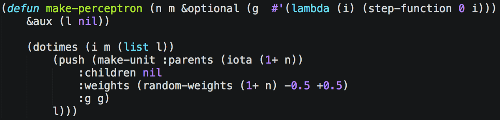
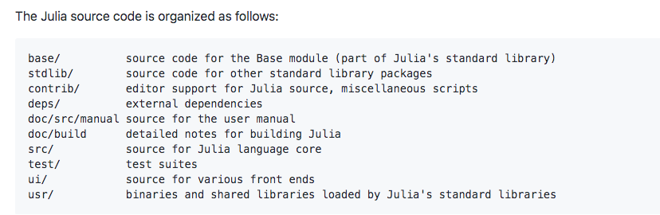
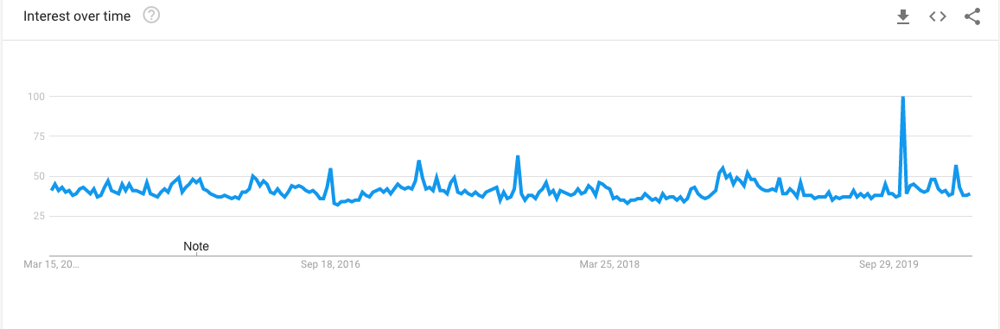

关于作者

Claire D.是Digitalogy的内容策划和营销人员，Digitalogy是一个技术采购和定制配对市场，可根据人们在全球的特定需求，将人们与预先筛选和顶尖的开发商和设计师联系起来。 在Linkedin，Twitter，Instagram上与Digitalogy联系。
# 类似文章—

希望本文对您有所帮助！ 如果您想了解更多信息，请参见以下其他资源：—
## 2020年需要学习的十大按需编程语言
### 对求职者和新开发人员的顶级编程语言的深入分析和排名
## 2020年面向企业的10种顶级编程语言
### 硬件和软件的结合是推动技术进步的主要因素。 顶级编程…
## 2020年AI工程师最喜欢的5种编程语言
### 全球约有14％的劳动力或3.75亿人可能会因为AI和自动化而失业。 迈出一步...
## 2020年要学习的7种编程语言和框架
### 为热情的编码员提供精选建议
# 2020年AI工程师的顶级编程语言
## AI工程师和科学家可以从几种编程语言中选择适合其项目需求的正确语言

> Image by Pixabay


人工智能凭借其为数百种独特用例和情况提供的所有好处，已成为我们日常生活中不可或缺的一部分，更不用说它为我们带来了多么简单。

随着近年来的增长，人工智能在帮助企业发展和实现其全部潜力方面已经走了很长的路要走。 没有底层编程语言的核心改进，人工智能的这些进步是不可能的。

随着AI的蓬勃发展，对高效，熟练的程序员和工程师的需求随着编程语言的改进而激增。 尽管有很多编程语言可以帮助您开始进行AI开发，但是没有一种编程语言是AI编程的一站式解决方案，因为各种目标都需要针对每个项目的特定方法。

我们将讨论下面列出的一些最受欢迎的方法，然后由您自己决定？
# ●Python

Python是您仍然可以阅读的最强大的语言。-Pau Dubois

> Python Programming by Unsplash


Python于1991年开发，是一项民意测验，表明超过57％的开发人员更有可能选择Python而不是C ++作为开发AI解决方案的首选编程语言。 Python易于学习，为程序员和数据科学家提供了更轻松的进入AI开发领域的机会。

Python是程序员需要多少自由度的实验。 太多的自由，没有人可以阅读别人的密码； 太少，表现力受到威胁。

-Guido van Rossum

使用Python，您不仅可以获得出色的社区支持和广泛的库集，还可以享受编程语言提供的灵活性。 您可能会从Python中受益最多的一些功能是平台独立性以及用于深度学习和机器学习的广泛框架。

使用Python进行编码的乐趣应该在于看到简短，简洁，易读的类，这些类以少量清晰的代码表达很多动作，而不是使大量琐碎的代码烦死读者。

-Guido van Rossum

Python代码段示例：

> Python Code Snippet Example(source)

## 它最受欢迎的一些图书馆是-

●TensorFlow，用于机器学习工作负载和数据集

●scikit-learn，用于训练机器学习模型

●PyTorch，用于计算机视觉和自然语言处理

●Keras，作为高度复杂的数学计算和运算的代码接口

●Spark MLlib（类似于Apache Spark机器学习库），通过算法和实用程序等工具使所有人轻松进行机器学习

●MXNet，这是Apache的另一个库，用于简化深度学习工作流程

●Theano，作为定义，优化和评估数学表达式的库

●Pybrain，用于强大的机器学习算法

而且，根据GitHub存储库的贡献，Python已超越Java，成为第二大最受欢迎的语言。 实际上，Stack Overflow称之为“增长最快”的主要编程语言。”

> Source: Octoverse


初学者的Python课程-
## 3道面向初学者的免费Python课程：2020版
### 如果您正在寻找可用于扩展Python知识的最佳Free Python课程，那么您来……
## Python训练营：学习Python编程和代码培训
### 这是Udemy上关于Python编程语言的最全面，最直接的课程！ 无论你…
# ●Java

编写一次，可在任何地方运行

Java被认为是世界上最好的编程语言之一，其使用的最近20年就是证明。

凭借其高度的用户友好性，灵活的特性和平台独立性，Java已经以各种方式用于AI的开发，请继续阅读以了解其中的一些信息：

●TensorFlowTensorFlow的受支持编程语言列表还包括带有API的Java。 该支持不像其他完全支持的语言那样功能丰富，但是已经存在并且正在迅速得到改善。

●亚马逊建立的深度Java库，用于使用Java创建和部署深度学习功能。

●KubeflowKubeflow有助于在Kubernetes上轻松部署和管理机器学习堆栈，从而提供即用型ML解决方案。

●OpenNLP Apache的OpenNLP是用于自然语言处理的机器学习工具。

●Java机器学习库Java-ML为开发人员提供了几种机器学习算法。

●Neuroph Neuroph借助Neuroph GUI，可以使用Java的开源框架设计神经网络。

如果Java拥有真正的垃圾回收器，大多数程序将在执行时将其删除。-Robert Sewell

Java代码段示例：

> Java Code Snippet Example(source)


初学者Java课程-
## 面向在线初学者的5大Java编程课程-最佳地段
### 如果您是计算机科学专业的毕业生，或者想学习Java并寻找一些很棒的资源的人，例如……
# ●R

R由Ross Ihaka和Robert Gentleman创建，第一个版本于1995年发布。R由R Development Core团队维护，R是S编程语言的实现，有助于开发统计软件和数据分析。

使R非常适合开发人员中的AI编程的素质是：

●R善于处理大量数据的基本特征使其相对Python而言具有相对完善的NumPy软件包，因此比Python处于更好的位置。

●使用R，可以处理各种编程范例，例如功能编程，矢量计算和面向对象的编程。

可用于R的一些AI编程软件包是：

●Gmodels提供了多种工具进行模型拟合

●Tm，作为文本挖掘应用程序的框架●RODBC作为R的ODBC接口

●OneR，用于实现“单规则机器学习”分类算法，对机器学习模型很有用

R提供的功能在数据挖掘者和统计学家中广泛使用，它们是：

●各种各样的库和软件包以扩展其功能

●积极支持社区

●能够与C，C ++和Fortran协同工作

●多个软件包有助于扩展功能

●支持生成高质量图形

有趣的东西-使用R制作的Covid-19交互式地图
# ●序言

逻辑编程的缩写，Prolog于1972年首次出现。它为开发人工智能（特别是自然语言处理）提供了令人兴奋的工具。 Prolog最适合创建聊天机器人，ELIZA是有史以来第一个使用Prolog创建的聊天机器人。

> The First Successful Chatterbot (source)


要了解Prolog，您必须熟悉Prolog指导其工作的一些基本术语，以下简要说明：

●事实确定了真实的陈述

●规则定义了语句，但有附加条件

●目标根据知识库定义提交的语句的位置

●查询定义如何使您的陈述正确，以及对事实和规则的最终分析

Prolog提供了两种实施AI的方法，这种方法已经存在了很长时间，并且在数据科学家和研究人员中广为人知：

●符号方法包括基于规则的专家系统，定理证明，基于约束的方法。

●统计方法包括神经网络，数据挖掘，机器学习等。
# ●Lisp

> Lisp code to create an n-inputs m-units one layer perceptron(source)


列表处理的简称，它是仅次于Fortran的第二古老编程语言。 Lisp被称为AI的奠基人之一，由John McCarthy于1958年创建。

Lisp是一种用来告诉您不可能完成的事情的语言。

肯特·皮特曼

Lisp是作为程序的实用数学符号构建的，很快就成为开发人员AI编程语言的快速选择。 以下是一些Lisp功能，使其成为机器学习AI项目的最佳选择之一：

●快速原型制作

●动态对象创建

●垃圾回收

●灵活性

随着其他竞争性编程语言的重大改进，Lisp特有的一些功能已进入其他语言。 在某些时候涉及Lisp的一些著名项目是Reddit和HackerNews。

以Lisp为例，您知道它是世界上最美丽的语言-至少直到Haskell出现为止。-Larry Wall
# ●哈斯克尔

Haskell于1990年定义，以著名的数学家Haskell Brooks Curry命名，是一种纯粹的功能性和静态类型化的编程语言，与惰性评估和较短的代码配对。

它被认为是一种非常安全的编程语言，因为它在处理错误方面趋于提供更大的灵活性，因为与其他编程语言相比，在Haskell中很少发生错误。 即使确实发生了，大多数非语法错误也会在编译时而不是运行时捕获。 Haskell提供的一些功能包括：

●强大的抽象能力

●内置内存管理

●代码可重用性

●易于理解

SQL，Lisp和Haskell是我所见过的惟一一种编程语言，人们在这些语言上花费的时间比输入更多。-Philip Greenspun

它的功能有助于提高程序员的生产率。 Haskell与其他编程语言非常相似，只是由一小部分开发人员使用。 撇开挑战，随着开发人员社区的广泛采用，Haskell可以证明与其他竞争性AI语言一样出色。
# ●朱莉娅

Julia是一种高性能通用通用动态编程语言，旨在创建几乎所有应用程序，但高度适合于数值分析和计算科学。 与Julia一起使用的各种工具包括：

●流行的编辑器，例如Vim和Emacs

●IDE，例如Juno和Visual Studio

> Julia source code organization(source)


Julia提供的一些功能使其成为AI编程，机器学习，统计和数据建模的重要选择，其中包括：

●动态类型系统

●内置包管理器

●能够进行并行和分布式计算

●宏和元编程能力

●支持多种调度

●直接支持C函数

通过消除其他编程语言的弱点，Julia还可以用于机器学习应用程序，并与TensorFlow.jl，MLBase.jl，MXNet.jl等工具集成在一起，并且可以利用Julia提供的可伸缩性进行更多开发。

Google趋势-朱莉娅（Julia）

> Google trends(source)


JuliaCon 2019亮点—
# 结论

通过选择多种AI编程语言，AI工程师和科学家可以选择适合其项目需求的正确语言。 每种AI编程语言都有其各自的优缺点。 通过定期对这些语言进行改进，很快就可以为AI的开发带来比今天更加舒适的体验，从而使更多的人可以加入这一创新浪潮。 出色的社区支持使新人们的处境变得更加美好，社区对多个软件包和扩展的贡献使每个人的生活变得更加轻松。
```
(本文翻译自Claire D.的文章《Top Programming Languages for AI Engineers in 2020》，参考：https://towardsdatascience.com/top-programming-languages-for-ai-engineers-in-2020-33a9f16a80b0)
```
