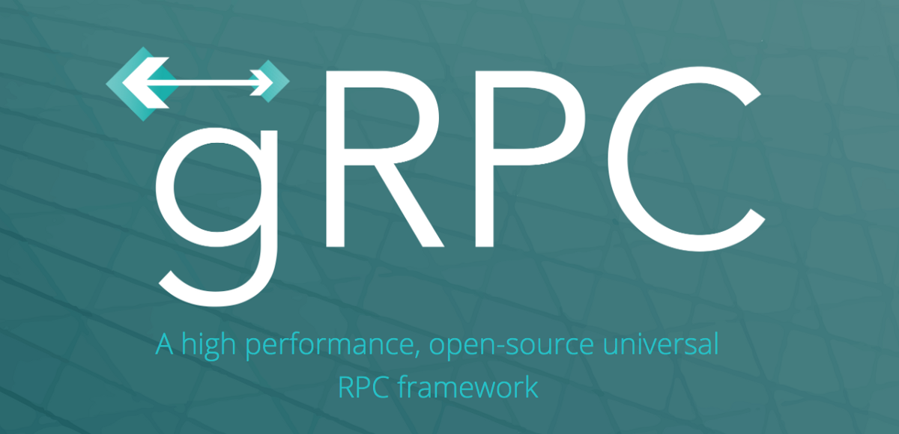

# 参考文献
## 微服务与Monolith：哪种架构是您业务的最佳选择？
### 作者：Romana Gnatyk * 2018年10月3日，就在几年前，微服务正在加速发展……
## REST架构约束
### REST是一种架构样式，用于通过HTTP设计松耦合应用程序。 RESTful原则不强制执行…
## 采用GRPC的好处和最佳实践-XenonStack
### gRPC是一个高性能，开放源代码的通用RPC框架。简单来说，它使服务器和客户端都可以使用…
# REST与gRPC

与使用JSON（主要是JSON）的REST不同，gRPC使用协议缓冲区，这是编码数据的更好方法。 由于JSON是基于文本的格式，因此它比protobuf格式的压缩数据要重得多。

与REST相比，gRPC的另一个显着改进是它使用HTTP 2作为其传输协议。 REST使用的HTTP 1.1基本上是一个请求-响应模型。 gRPC利用HTTP 2的双向通信功能以及传统的响应请求结构。 在HTTP 1.1中，当多个请求来自多个客户端时，它们将被一一处理。 这会降低系统速度。 HTTP 2允许多路复用，因此可以同时处理多个请求和响应。

从这些观点出发，我们可以得出结论，当用例涉及使用惯用API的多语言通信或大规模微服务通信时，gRPC是一个不错的选择。
# 什么是gRPC？

根据目前为止所读的内容，我们可以重新定义gRPC。 它是对传统RPC框架的改编。 那么，它与现有的RPC框架有何不同？

最重要的区别是gRPC使用协议缓冲区作为接口定义语言进行序列化和通信，而不是JSON / XML。 协议缓冲区可以描述数据的结构，并且可以从该描述中生成代码，以生成或解析表示结构化数据的字节流。 这就是为什么gRPC首选多语言（使用不同技术实现）的Web应用程序的原因。 二进制数据格式使通信更轻松。 gRPC也可以与其他数据格式一起使用，但是首选的是协议缓冲区。

同样，gRPC建立在HTTP / 2之上，它支持双向通信以及传统的请求/响应。 gRPC允许服务器和客户端之间的松散耦合。 在实践中，客户端打开与gRPC服务器的长期连接，并且将为每个RPC调用打开一个新的HTTP / 2流。
# RPC架构

RPC代表远程过程调用。 顾名思义，其思想是我们可以在远程服务器上调用函数/方法。 RPC协议允许以相同的格式获取问题的结果，而不管它在何处执行。 它可以是本地的，也可以使用更好的资源在远程服务器中。

RPC是比REST更旧的协议。 从1970年代的ARPANET时代起，它就已经用于执行网络操作。 RPC一词最早由布鲁斯·杰伊·尼尔森（Bruce Jay Nelson）于1981年提出。但是，正如我们将要看到的，RPC仍然很重要，并以不同的方式在基于API的现代应用程序中实现。

想法是一样的。 通过定义公共方法来构建API。 然后用参数调用方法。 RPC只是一堆函数，但是在HTTP API的上下文中，它需要将方法放在URL中，并将参数放在查询字符串或主体中。

RPC API将使用带有{{id“：1}主体的POST / deleteResource之类的东西，而不是REST方法，即DELETE / resource / 1。

RPC在IoT设备和其他需要针对低功率设备进行自定义合约通信的解决方案中非常受欢迎，因为许多计算操作可以转移到另一设备。 传统上，RPC可以实现为RPC-XML和RPC-JSON。

gRPC是要在RPC协议上创建的最新框架。 它利用其优势，并试图纠正传统RPC的问题。
# REST架构

REST是使用HTTP协议的Web架构。 它被广泛用于Web应用程序的开发。 简而言之，REST是一种客户端-服务器关系，其中后端数据通过诸如JSON / XML的简单表示形式提供给客户端。 如Roy Fielding所述，REST代表代表状态转移。 REST是一种协议，它不强制执行任何有关如何在较低级别实施的规则。 它为高级体系结构实施提供了指导。

为了使任何应用程序真正实现RESTful，必须遵循六个体系结构约束：
+ 统一接口：意味着必须向Web应用程序中的API使用者提供API接口。
+ 客户端服务器：客户端和服务器必须彼此独立，并且客户端应仅知道资源的URI。
+ 无状态：服务器不得存储与客户端请求相关的任何内容。 客户端负责维护应用程序的状态。
+ 可缓存的：资源必须可缓存。
+ 分层系统：体系结构必须是分层的，这意味着体系结构的组件可以位于多个服务器中。
+ 按需代码：客户端必须能够获取可执行代码作为响应。 这是一个可选约束。

基于REST的Web服务被称为RESTful Web服务。 在这些应用程序中，每个组件都是一种资源，可以使用HTTP标准方法通过公共接口访问这些资源。 以下四种HTTP方法通常用于基于REST的体系结构中：
+ GET-对资源的只读访问。
+ POST —创建一个新资源。
+ 删除—删除资源。
+ PUT-更新现有资源/创建新资源。
# 微服务与Monoliths

整体架构是设计应用程序的传统方式。 它包含一个不可分割的代码库，用于服务于客户端用户界面，服务器端应用程序和数据库。 在项目中工作的所有开发人员都将代码贡献到同一存储库中。 我最喜欢的与整体建筑相关的类比之一是将其视为一室公寓。 单个房间将根据需要分为各种空间。

整体架构的优势在于，由于只有一个单元，因此可以轻松完成日志记录，性能监控和缓存等操作。 而且，它很容易开发，测试，调试和部署。

但是随着应用程序的增长，它变得难以维护，扩展甚至理解。 而且，它可能变得如此复杂，以至于代码的少量更改会影响整个应用程序。

整体结构的另一个重要缺点是，它是对单一技术的严格承诺。 采用新的框架或语言可能需要对整个系统进行重写。

进入微服务架构！

如果单片式架构是一室公寓，则微服务架构可以视为具有许多房间的房屋。 这意味着整个应用程序将细分为多个较小的应用程序或服务。

这使开发团队可以灵活地选择最适合其需求的技术，并使他们能够独立扩展服务。 微服务应用程序中的任何故障仅影响特定服务，而不影响整个应用程序。

这些服务可以独立开发，维护和部署，它们通过称为API（应用程序编程接口）的已定义方法相互通信。

通过HTTP的微服务之间的通信可以通过多种方式完成。 使用最广泛的方法是遵循REST协议。 gRPC是执行此通信的另一种方法。 它旨在克服REST在微服务通信中的局限性。
# 什么是gRPC？

gRPC是一个开源的远程过程调用框架，用于在服务之间进行高性能的通信。 这是将以不同语言编写的服务与可插拔支持（用于负载平衡，跟踪，运行状况检查和身份验证）相连接的有效方法。 默认情况下，gRPC使用协议缓冲区来序列化结构化数据。 通常，对于微服务体系结构，gRPC被认为是REST协议的更好替代方案。 gRPC中的“ g”可以归因于最初开发该技术的Google。

在详细介绍gRPC之前，让我们看一下微服务架构。
# 了解gRPC
## REST和RPC架构之间的差异


本文的目的是对gRPC有一个高级的了解。 它还将解释gRPC与Web应用程序通信遵循的现有协议和体系结构之间的异同。
```
(本文翻译自Arun Mathew Kurian的文章《Understanding gRPC》，参考：https://medium.com/better-programming/understanding-grpc-60737b23e79e)
```
